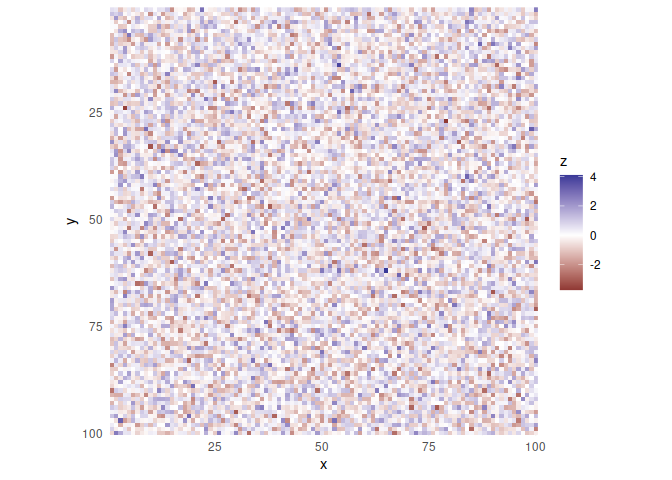
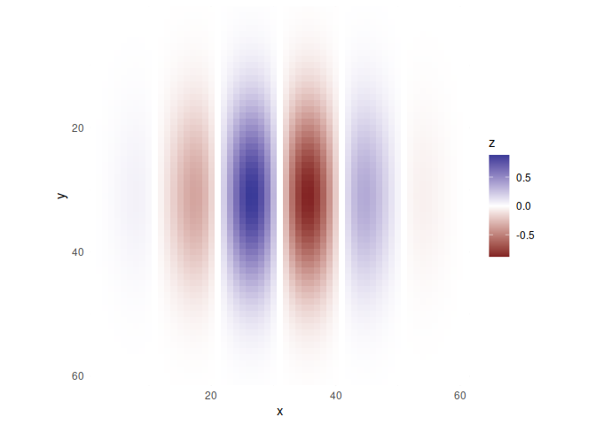
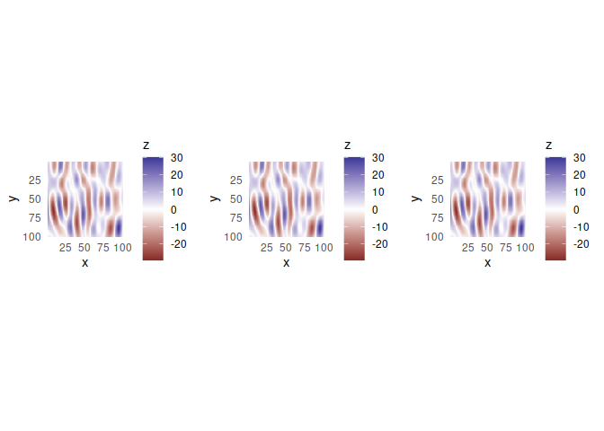
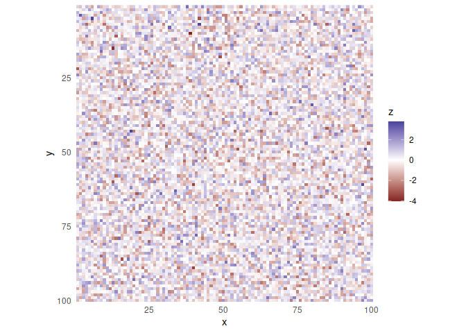
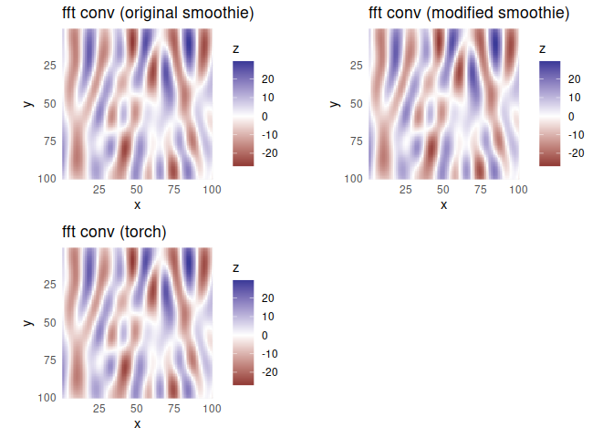
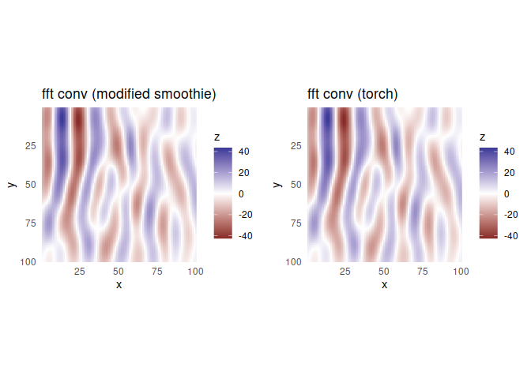
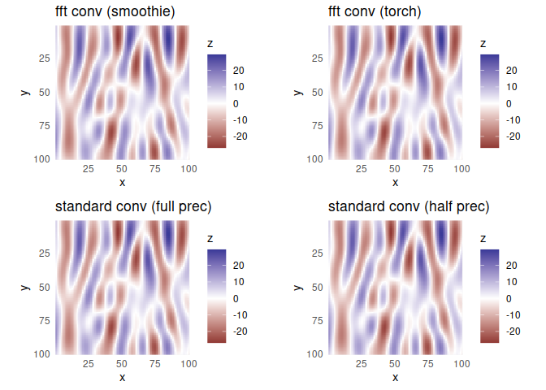
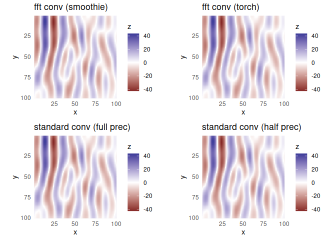
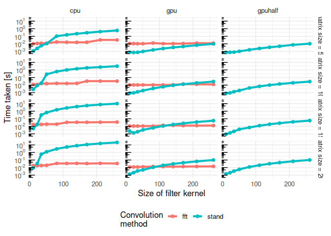
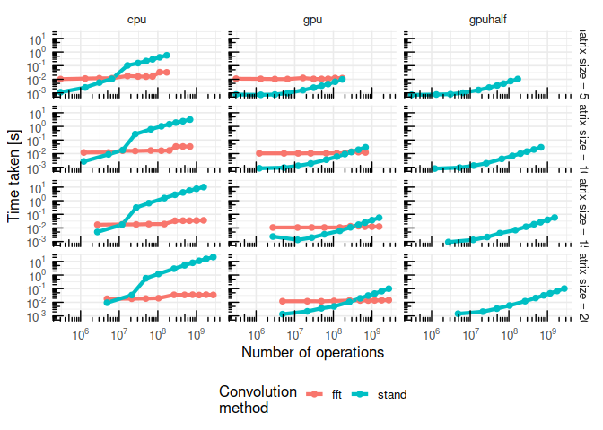

Convolution theorem
================
Richard Schweitzer
2023-08-13

``` r
library(data.table)
library(ggplot2)
library(scales)
library(cowplot)
library(torch)
library(smoothie)
library(assertthat)
library(rbenchmark)
source("plot_heatmap.R")
source("get_gabor_field.R")
```

``` r
fft_conv_with_torch_2d <- function (x, K, 
                                    use_torch=FALSE, no_CUDA=FALSE, use_half_on_GPU=FALSE, 
                                    verbose=FALSE) {
  # based on kernel2dsmooth from package 'smoothie'
  if (use_torch) {
    require(torch)
    if (cuda_is_available()) {
      if (verbose) {
        print(paste("CUDA is available - Version:", cuda_runtime_version()))
      }
      if (no_CUDA) {
        use_device <- torch_device('cpu')
      } else {
        use_device <- torch_device('cuda') # 'cuda'
      }
      # ... and what should be the preferred data type? (there are torch_half, torch_float, torch_double)
      if (use_half_on_GPU) {
        preferred_dtype <- torch_float16() # or half as mixed/half computing is optimized?
      } else {
        preferred_dtype <- torch_float32()
      }
    } else {
      use_device <- torch_device('cpu')
      preferred_dtype <- torch_float32()
    }
  }
  # get dimensions for padding right
  xdim <- dim(x)
  Nxy <- prod(xdim)
  kdim <- dim(K)
  bigdim <- xdim + kdim - 1
  if (bigdim[1] <= 1024) {
    bigdim[1] <- 2^ceiling(log2(bigdim[1]))
  } else {
    bigdim[1] <- ceiling(bigdim[1]/512) * 512
  }
  if (bigdim[2] <= 1024) {
    bigdim[2] <- 2^ceiling(log2(bigdim[2]))
  } else {
    bigdim[2] <- ceiling(bigdim[2]/512) * 512
  }
  Kbig <- matrix(0, bigdim[1], bigdim[2])
  kcen <- floor((kdim + 1)/2)
  Kbig[1:(kdim[1] - kcen[1] + 1), 
       1:(kdim[2] - kcen[2] + 1)] <- K[kcen[1]:kdim[1], 
                                       kcen[2]:kdim[2]]
  if (kdim[1] > 1) {
    Kbig[(bigdim[1] - kcen[1] + 2):bigdim[1], 
         1:(kdim[2] - kcen[2] + 1)] <- K[1:(kcen[1] - 1), 
                                         kcen[2]:kdim[2]]
  }
  if (kdim[2] > 1) {
    Kbig[1:(kdim[1] - kcen[1] + 1), 
         (bigdim[2] - kcen[2] + 2):bigdim[2]] <- K[kcen[1]:kdim[1], 
                                                   1:(kcen[2] - 1)]
  }
  if (all(kdim > 1)) {
    Kbig[(bigdim[1] - kcen[1] + 2):bigdim[1], 
         (bigdim[2] - kcen[2] + 2):bigdim[2]] <- K[1:(kcen[1] - 1), 
                                                   1:(kcen[2] - 1)]
  }
  if (verbose) { cat("Finding the FFT of the kernel matrix.\n") }
  if (use_torch) {
    Kbig_torch <- torch_tensor(data = Kbig, device = use_device, dtype = preferred_dtype)
    W <- torch_fft_fft(torch_fft_fft(self = Kbig_torch, 
                                     dim = 1), 
                       dim = 2) #/ prod(bigdim) # this division is not needed
  } else {
    W <- fft(Kbig)/prod(bigdim)
  }
  if (verbose) { cat("FFT of kernel matrix found.\n") }
  # prepare the target matrix
  out <- matrix(0, bigdim[1], bigdim[2])
  out[1:xdim[1], 1:xdim[2]] <- x
  out[is.na(out)] <- 0
  if (verbose) { cat("Performing the convolution.\n") }
  if (use_torch) {
    out_torch <- torch_tensor(data = out, device = use_device, dtype = preferred_dtype)
    out_fft <- torch_fft_fft(torch_fft_fft(self = out_torch, 
                                           dim = 1), 
                             dim = 2)
    out_fft <- torch_multiply(out_fft, W)
    out <- torch_fft_ifft(torch_fft_ifft(self = out_fft, 
                                         dim = 1), 
                          dim = 2)[1:xdim[1], 1:xdim[2]]
    out <- out$real
  } else {
    out <- Re(fft(fft(out) * W, inverse = TRUE))[1:xdim[1], 1:xdim[2]]
  }
  if (verbose) { cat("The convolution has been carried out.\n")  }
  return((out))
}
```

Test the function:

``` r
test_image <- matrix(rnorm(100*100), nrow = 100)
plot_heatmap(test_image)
```

    ## Loading required package: reshape2

    ## 
    ## Attaching package: 'reshape2'

    ## The following objects are masked from 'package:data.table':
    ## 
    ##     dcast, melt

    ## Loading required package: viridis

    ## Loading required package: viridisLite

    ## 
    ## Attaching package: 'viridis'

    ## The following object is masked from 'package:scales':
    ## 
    ##     viridis_pal

<!-- -->

``` r
test_kernel <- get_gabor_field(rf_freq_dva = 1, rf_width_dva = 1, rf_ori = 0, rf_amp = 1, 
                               scr.ppd = 20)[[2]]
```

    ## Loading required package: pracma

``` r
plot_heatmap(test_kernel)
```

<!-- -->

``` r
# 1st test with original smoothie
res_smoothie <- kernel2dsmooth(x = test_image, K = test_kernel)
p1_2d <- plot_heatmap(res_smoothie, do_print = FALSE)
# 2nd test with modified smoothie function
res_smoothie_mod <- fft_conv_with_torch_2d(x = test_image, K = test_kernel, use_torch = FALSE)
p2_2d <- plot_heatmap(res_smoothie_mod, do_print = FALSE)
# 3rd critical test with torch version of the smoothie algorithm - should look the same
res_smoothie_torch <- fft_conv_with_torch_2d(x = test_image, K = test_kernel, use_torch = TRUE)
p3_2d <- plot_heatmap(as_array(res_smoothie_torch$cpu()), do_print = FALSE)
# compare
plot_grid(p1_2d, p2_2d, p3_2d, nrow = 1, align = "hv")
```

<!-- -->

Now the 3D function:

``` r
source("fft_conv_with_torch_3d.R")
fft_conv_with_torch_3d
```

    ## function (x, K, use_torch = FALSE, no_CUDA = FALSE, use_half_on_GPU = FALSE) 
    ## {
    ##     require(torch)
    ##     require(assertthat)
    ##     if (use_torch) {
    ##         if (cuda_is_available()) {
    ##             if (no_CUDA) {
    ##                 use_device <- torch_device("cpu")
    ##             }
    ##             else {
    ##                 use_device <- torch_device("cuda")
    ##             }
    ##             if (use_half_on_GPU) {
    ##                 preferred_dtype <- torch_float16()
    ##             }
    ##             else {
    ##                 preferred_dtype <- torch_float32()
    ##             }
    ##         }
    ##         else {
    ##             use_device <- torch_device("cpu")
    ##             preferred_dtype <- torch_float32()
    ##         }
    ##     }
    ##     xdim <- dim(x)[3:4]
    ##     assert_that(dim(x)[1] == 1, msg = "Batch number must be one!")
    ##     Nxy <- prod(xdim)
    ##     kdim <- dim(K)
    ##     bigdim <- xdim + kdim - 1
    ##     if (bigdim[1] <= 1024) {
    ##         bigdim[1] <- 2^ceiling(log2(bigdim[1]))
    ##     }
    ##     else {
    ##         bigdim[1] <- ceiling(bigdim[1]/512) * 512
    ##     }
    ##     if (bigdim[2] <= 1024) {
    ##         bigdim[2] <- 2^ceiling(log2(bigdim[2]))
    ##     }
    ##     else {
    ##         bigdim[2] <- ceiling(bigdim[2]/512) * 512
    ##     }
    ##     if (use_torch) {
    ##         Kbig <- torch_tensor(data = matrix(0, bigdim[1], bigdim[2]), 
    ##             device = use_device, dtype = preferred_dtype)
    ##     }
    ##     else {
    ##         Kbig <- matrix(0, bigdim[1], bigdim[2])
    ##     }
    ##     kcen <- floor((kdim + 1)/2)
    ##     Kbig[1:(kdim[1] - kcen[1] + 1), 1:(kdim[2] - kcen[2] + 1)] <- K[kcen[1]:kdim[1], 
    ##         kcen[2]:kdim[2]]
    ##     if (kdim[1] > 1) {
    ##         Kbig[(bigdim[1] - kcen[1] + 2):bigdim[1], 1:(kdim[2] - 
    ##             kcen[2] + 1)] <- K[1:(kcen[1] - 1), kcen[2]:kdim[2]]
    ##     }
    ##     if (kdim[2] > 1) {
    ##         Kbig[1:(kdim[1] - kcen[1] + 1), (bigdim[2] - kcen[2] + 
    ##             2):bigdim[2]] <- K[kcen[1]:kdim[1], 1:(kcen[2] - 
    ##             1)]
    ##     }
    ##     if (all(kdim > 1)) {
    ##         Kbig[(bigdim[1] - kcen[1] + 2):bigdim[1], (bigdim[2] - 
    ##             kcen[2] + 2):bigdim[2]] <- K[1:(kcen[1] - 1), 1:(kcen[2] - 
    ##             1)]
    ##     }
    ##     if (use_torch) {
    ##         W <- torch_fft_fft(torch_fft_fft(self = Kbig, dim = 1), 
    ##             dim = 2)
    ##     }
    ##     else {
    ##         W <- fft(Kbig)/prod(bigdim)
    ##     }
    ##     if (use_torch) {
    ##         out <- torch_zeros(c(dim(x)[1], dim(x)[2], bigdim[1], 
    ##             bigdim[2]), device = use_device, dtype = preferred_dtype)
    ##     }
    ##     else {
    ##         out <- array(data = 0, dim = c(dim(x)[1], dim(x)[2], 
    ##             bigdim[1], bigdim[2]))
    ##     }
    ##     out[1, 1:(dim(x)[2]), 1:(xdim[1]), 1:(xdim[2])] <- x
    ##     rm(x)
    ##     if (use_torch) {
    ##         out[torch_isnan(out) == 1] <- 0
    ##     }
    ##     else {
    ##         out[is.na(out)] <- 0
    ##     }
    ##     for (t_i in 1:(dim(out)[2])) {
    ##         if (use_torch) {
    ##             out_fft <- torch_fft_fft(torch_fft_fft(self = out[1, 
    ##                 t_i, , ], dim = 1), dim = 2)
    ##             out_fft <- torch_multiply(out_fft, W)
    ##             out_ifft <- torch_fft_ifft(torch_fft_ifft(self = out_fft, 
    ##                 dim = 1), dim = 2)
    ##             out[1, t_i, , ] <- out_ifft$real
    ##         }
    ##         else {
    ##             out[1, t_i, , ] <- Re(fft(fft(out[1, t_i, , ]) * 
    ##                 W, inverse = TRUE))
    ##         }
    ##     }
    ##     out <- out[1:(dim(out)[1]), 1:(dim(out)[2]), 1:xdim[1], 1:xdim[2]]
    ##     return(out)
    ## }

Now test this 3D version…

``` r
test_mat <- (array(data = rnorm(50*100*100), dim = c(1, 50, 100, 100)))
dim(test_mat)
```

    ## [1]   1  50 100 100

``` r
plot_heatmap(test_mat[1, 1, , ])
```

<!-- -->

``` r
# 1st test with original smoothie
res_smoothie_3d <- kernel2dsmooth(x = test_mat[1, 1, , ], K = test_kernel)
p1_3d <- plot_heatmap(res_smoothie_3d, do_print = FALSE)
# 2nd test with modified smoothie function
res_smoothie_mod_3d <- fft_conv_with_torch_3d(x = test_mat, K = test_kernel, use_torch = FALSE)
dim(res_smoothie_mod_3d)
```

    ## [1]  50 100 100

``` r
p2_3d <- plot_heatmap(res_smoothie_mod_3d[1, , ], do_print = FALSE)
p2_3d_2 <- plot_heatmap(res_smoothie_mod_3d[25, , ], do_print = FALSE)
# 3rd critical test with torch version of the smoothie algorithm - should look the same
res_smoothie_torch_3d <- fft_conv_with_torch_3d(x = test_mat, K = test_kernel, use_torch = TRUE)
p3_3d <- plot_heatmap(as_array(res_smoothie_torch_3d[1, 1, , ]$cpu()), do_print = FALSE)
p3_3d_2 <- plot_heatmap(as_array(res_smoothie_torch_3d[1, 25, , ]$cpu()), do_print = FALSE)
# 4th test - with half precision: COMPLEX HALF DOES NOT WORK YET
res_smoothie_torch_3d_half <- fft_conv_with_torch_3d(x = test_mat, K = test_kernel, use_torch = TRUE, 
                                                     use_half_on_GPU = TRUE)
# compare
plot_grid(p1_3d + ggtitle("fft conv (original smoothie)"), 
          p2_3d + ggtitle("fft conv (modified smoothie)"), 
          p3_3d + ggtitle("fft conv (torch)"), 
          nrow = 2, align = "hv")
```

<!-- -->

``` r
plot_grid(p2_3d_2 + ggtitle("fft conv (modified smoothie)"), 
          p3_3d_2 + ggtitle("fft conv (torch)"), 
          nrow = 1, align = "hv")
```

<!-- -->

Compare to straightforward convolution…

``` r
source("standard_conv_with_torch_3d.R")
standard_conv_with_torch_3d
```

    ## function (x, K, no_CUDA = FALSE, use_half_on_GPU = FALSE) 
    ## {
    ##     require(torch)
    ##     require(assertthat)
    ##     if (cuda_is_available()) {
    ##         if (no_CUDA) {
    ##             use_device <- torch_device("cpu")
    ##         }
    ##         else {
    ##             use_device <- torch_device("cuda")
    ##         }
    ##         if (use_half_on_GPU) {
    ##             preferred_dtype <- torch_float16()
    ##         }
    ##         else {
    ##             preferred_dtype <- torch_float32()
    ##         }
    ##     }
    ##     else {
    ##         use_device <- torch_device("cpu")
    ##         preferred_dtype <- torch_float32()
    ##     }
    ##     spat_kernel_1_gpu <- torch_tensor(K, device = use_device, 
    ##         dtype = preferred_dtype)
    ##     spat_kernel_1_gpu <- torch_flip(spat_kernel_1_gpu, dims = c(1, 
    ##         2))
    ##     spat_kernel_1_gpu <- spat_kernel_1_gpu$reshape(c(1, 1, spat_kernel_1_gpu$size(1), 
    ##         spat_kernel_1_gpu$size(2)))
    ##     spat_kernel_1_gpu <- spat_kernel_1_gpu$expand(c(dim(x)[2], 
    ##         1, spat_kernel_1_gpu$size(3), spat_kernel_1_gpu$size(4)))
    ##     if (!check_if_torch_cuda(x)) {
    ##         x_gpu <- torch_tensor(x, device = use_device, dtype = preferred_dtype)
    ##     }
    ##     else {
    ##         x_gpu <- x
    ##     }
    ##     spatial_response_1 <- torch_conv2d(input = x_gpu, weight = spat_kernel_1_gpu, 
    ##         padding = c(spat_kernel_1_gpu$size(3)%/%2, spat_kernel_1_gpu$size(4)%/%2), 
    ##         groups = x_gpu$size(2))
    ##     rm(spat_kernel_1_gpu, x_gpu)
    ##     return(spatial_response_1)
    ## }

Test this function, too.

``` r
# standard
res_conv2d_1 <- standard_conv_with_torch_3d(x = test_mat, K = test_kernel, no_CUDA = FALSE)
p4_3d <- plot_heatmap(as_array(res_conv2d_1[1, 1, , ]$cpu()), do_print = FALSE)
p4_3d_2 <- plot_heatmap(as_array(res_conv2d_1[1, 25, , ]$cpu()), do_print = FALSE)
# half precision
res_conv2d_2 <- standard_conv_with_torch_3d(x = test_mat, K = test_kernel, no_CUDA = FALSE, 
                                            use_half_on_GPU = TRUE)
p5_3d <- plot_heatmap(as_array(res_conv2d_2[1, 1, , ]$to(torch_float32())$cpu()), do_print = FALSE)
p5_3d_2 <- plot_heatmap(as_array(res_conv2d_2[1, 25, , ]$to(torch_float32())$cpu()), do_print = FALSE)
# assert fft-based and standard convolution give same results
plot_grid(p2_3d + ggtitle("fft conv (smoothie)"), 
          p3_3d + ggtitle("fft conv (torch)"), 
          p4_3d + ggtitle("standard conv (full prec)"), 
          p5_3d + ggtitle("standard conv (half prec)"), 
          nrow = 2, align = "hv")
```

<!-- -->

``` r
plot_grid(p2_3d_2 + ggtitle("fft conv (smoothie)"), 
          p3_3d_2 + ggtitle("fft conv (torch)"), 
          p4_3d_2 + ggtitle("standard conv (full prec)"), 
          p5_3d_2 + ggtitle("standard conv (half prec)"), 
          nrow = 2, align = "hv")
```

<!-- -->

Test timing…

``` r
kernel_sizes <- c(11, 23, 35, 51, 81, 111, 141, 171, 211, 261) # sizes of kernels
mat_sizes <- c(50, 100, 150, 200) # X*X size of spatial domain
t_dim <- 15 # n slices on the temporal domain
n_rep <- 50 # number of replications
# go run:
benchmark_res <- NULL
for (mat_size in mat_sizes) {
  for (kernel_size in kernel_sizes) {
    # create matrix and kernel
    K_now <- kernel2dmeitsjer(kernel.type="gauss", 
                              nx=kernel_size, ny=kernel_size, sigma=kernel_size/3)
    mat_now <- array(rnorm(n = mat_size*mat_size*t_dim), dim = c(1, t_dim, mat_size, mat_size))
    # run benchmark
    b_now <- benchmark(
      # GPU
      stand_conv_gpu = {
        res_conv2d_1 <- standard_conv_with_torch_3d(x = mat_now, K = K_now, 
                                                    no_CUDA = FALSE)
      }, 
      fft_conv_gpu = {
        res_convfft_1 <- fft_conv_with_torch_3d(x = mat_now, K = K_now, 
                                                use_torch = TRUE, no_CUDA = FALSE)

      },
      # CPU
      stand_conv_cpu = {
        res_conv2d_2 <- standard_conv_with_torch_3d(x = mat_now, K = K_now, 
                                                    no_CUDA = TRUE)
      }, 
      fft_conv_cpu = {
        res_convfft_2 <- fft_conv_with_torch_3d(x = mat_now, K = K_now, 
                                                use_torch = TRUE, no_CUDA = TRUE)

      },
      # GPU with half precision
      stand_conv_gpuhalf = {
        res_conv2d_3 <- standard_conv_with_torch_3d(x = mat_now, K = K_now, 
                                                    no_CUDA = FALSE, 
                                                    use_half_on_GPU = TRUE)
      }, 
      # fft_conv_gpuhalf = {
      #   res_convfft_3 <- fft_conv_with_torch_3d(x = mat_now, K = K_now, 
      #                                           use_torch = TRUE, no_CUDA = FALSE, 
      #                                           use_half_on_GPU = TRUE)
      # },
      replications = n_rep)
    # feedback
    print(paste(mat_size, kernel_size))
    print(b_now)
    # save
    benchmark_res <- rbind(benchmark_res, 
                           data.table(mat_size = mat_size, kernel_size = kernel_size, 
                                      fft_conv_gpu = b_now$elapsed[b_now$test=="fft_conv_gpu"] / n_rep, 
                                      stand_conv_gpu = b_now$elapsed[b_now$test=="stand_conv_gpu"] / n_rep,
                                      fft_conv_cpu = b_now$elapsed[b_now$test=="fft_conv_cpu"] / n_rep, 
                                      stand_conv_cpu = b_now$elapsed[b_now$test=="stand_conv_cpu"] / n_rep,
                                      #fft_conv_gpuhalf = b_now$elapsed[b_now$test=="fft_conv_gpuhalf"] / n_rep, 
                                      stand_conv_gpuhalf = b_now$elapsed[b_now$test=="stand_conv_gpuhalf"] / n_rep
                                      )
    )
  }
}
```

    ## [1] "50 11"
    ##                 test replications elapsed relative user.self sys.self
    ## 4       fft_conv_cpu           50   0.517   14.361     5.117    0.021
    ## 2       fft_conv_gpu           50   0.551   15.306     4.749    0.070
    ## 3     stand_conv_cpu           50   0.056    1.556     0.546    0.000
    ## 1     stand_conv_gpu           50   0.038    1.056     0.357    0.000
    ## 5 stand_conv_gpuhalf           50   0.036    1.000     0.336    0.000
    ##   user.child sys.child
    ## 4          0         0
    ## 2          0         0
    ## 3          0         0
    ## 1          0         0
    ## 5          0         0
    ## [1] "50 23"
    ##                 test replications elapsed relative user.self sys.self
    ## 4       fft_conv_cpu           50   0.568   15.778     5.553    0.088
    ## 2       fft_conv_gpu           50   0.537   14.917     4.820    0.006
    ## 3     stand_conv_cpu           50   0.125    3.472     1.237    0.000
    ## 1     stand_conv_gpu           50   0.036    1.000     0.349    0.000
    ## 5 stand_conv_gpuhalf           50   0.038    1.056     0.354    0.000
    ##   user.child sys.child
    ## 4          0         0
    ## 2          0         0
    ## 3          0         0
    ## 1          0         0
    ## 5          0         0
    ## [1] "50 35"
    ##                 test replications elapsed relative user.self sys.self
    ## 4       fft_conv_cpu           50   0.596   15.684     5.913    0.003
    ## 2       fft_conv_gpu           50   0.521   13.711     4.783    0.000
    ## 3     stand_conv_cpu           50   0.286    7.526     2.706    0.108
    ## 1     stand_conv_gpu           50   0.038    1.000     0.350    0.000
    ## 5 stand_conv_gpuhalf           50   0.040    1.053     0.374    0.000
    ##   user.child sys.child
    ## 4          0         0
    ## 2          0         0
    ## 3          0         0
    ## 1          0         0
    ## 5          0         0
    ## [1] "50 51"
    ##                 test replications elapsed relative user.self sys.self
    ## 4       fft_conv_cpu           50   0.599   12.224     5.950    0.007
    ## 2       fft_conv_gpu           50   0.520   10.612     4.767    0.000
    ## 3     stand_conv_cpu           50   0.538   10.980     5.198    0.151
    ## 1     stand_conv_gpu           50   0.049    1.000     0.467    0.000
    ## 5 stand_conv_gpuhalf           50   0.051    1.041     0.493    0.000
    ##   user.child sys.child
    ## 4          0         0
    ## 2          0         0
    ## 3          0         0
    ## 1          0         0
    ## 5          0         0
    ## [1] "50 81"
    ##                 test replications elapsed relative user.self sys.self
    ## 4       fft_conv_cpu           50   0.878   11.114     8.384    0.359
    ## 2       fft_conv_gpu           50   0.630    7.975     5.411    0.092
    ## 3     stand_conv_cpu           50   5.204   65.873    35.820    0.016
    ## 1     stand_conv_gpu           50   0.079    1.000     0.762    0.000
    ## 5 stand_conv_gpuhalf           50   0.081    1.025     0.789    0.000
    ##   user.child sys.child
    ## 4          0         0
    ## 2          0         0
    ## 3          0         0
    ## 1          0         0
    ## 5          0         0
    ## [1] "50 111"
    ##                 test replications elapsed relative user.self sys.self
    ## 4       fft_conv_cpu           50   0.803    6.692     7.956    0.060
    ## 2       fft_conv_gpu           50   0.530    4.417     5.194    0.000
    ## 3     stand_conv_cpu           50   7.742   64.517    51.008    0.008
    ## 1     stand_conv_gpu           50   0.120    1.000     1.164    0.000
    ## 5 stand_conv_gpuhalf           50   0.123    1.025     1.142    0.064
    ##   user.child sys.child
    ## 4          0         0
    ## 2          0         0
    ## 3          0         0
    ## 1          0         0
    ## 5          0         0
    ## [1] "50 141"
    ##                 test replications elapsed relative user.self sys.self
    ## 4       fft_conv_cpu           50   0.784    4.667     7.752    0.052
    ## 2       fft_conv_gpu           50   0.530    3.155     5.153    0.047
    ## 3     stand_conv_cpu           50  10.928   65.048    68.099    0.772
    ## 1     stand_conv_gpu           50   0.168    1.000     1.565    0.080
    ## 5 stand_conv_gpuhalf           50   0.175    1.042     1.714    0.000
    ##   user.child sys.child
    ## 4          0         0
    ## 2          0         0
    ## 3          0         0
    ## 1          0         0
    ## 5          0         0
    ## [1] "50 171"
    ##                 test replications elapsed relative user.self sys.self
    ## 4       fft_conv_cpu           50   0.805    3.610     7.993    0.024
    ## 2       fft_conv_gpu           50   0.539    2.417     5.241    0.051
    ## 3     stand_conv_cpu           50  14.573   65.350    90.394    0.908
    ## 1     stand_conv_gpu           50   0.223    1.000     2.212    0.000
    ## 5 stand_conv_gpuhalf           50   0.240    1.076     2.327    0.008
    ##   user.child sys.child
    ## 4          0         0
    ## 2          0         0
    ## 3          0         0
    ## 1          0         0
    ## 5          0         0
    ## [1] "50 211"
    ##                 test replications elapsed relative user.self sys.self
    ## 4       fft_conv_cpu           50   1.665    5.061    15.674    0.942
    ## 2       fft_conv_gpu           50   0.617    1.875     5.671    0.011
    ## 3     stand_conv_cpu           50  20.653   62.775   123.592    2.159
    ## 1     stand_conv_gpu           50   0.329    1.000     3.275    0.000
    ## 5 stand_conv_gpuhalf           50   0.370    1.125     3.585    0.016
    ##   user.child sys.child
    ## 4          0         0
    ## 2          0         0
    ## 3          0         0
    ## 1          0         0
    ## 5          0         0
    ## [1] "50 261"
    ##                 test replications elapsed relative user.self sys.self
    ## 4       fft_conv_cpu           50   1.620    3.306    15.420    0.743
    ## 2       fft_conv_gpu           50   0.606    1.237     5.654    0.001
    ## 3     stand_conv_cpu           50  29.086   59.359   177.947    0.454
    ## 1     stand_conv_gpu           50   0.490    1.000     4.812    0.001
    ## 5 stand_conv_gpuhalf           50   0.523    1.067     4.957    0.015
    ##   user.child sys.child
    ## 4          0         0
    ## 2          0         0
    ## 3          0         0
    ## 1          0         0
    ## 5          0         0
    ## [1] "100 11"
    ##                 test replications elapsed relative user.self sys.self
    ## 4       fft_conv_cpu           50   0.604   15.100     5.993        0
    ## 2       fft_conv_gpu           50   0.525   13.125     4.812        0
    ## 3     stand_conv_cpu           50   0.134    3.350     1.320        0
    ## 1     stand_conv_gpu           50   0.042    1.050     0.388        0
    ## 5 stand_conv_gpuhalf           50   0.040    1.000     0.390        0
    ##   user.child sys.child
    ## 4          0         0
    ## 2          0         0
    ## 3          0         0
    ## 1          0         0
    ## 5          0         0
    ## [1] "100 23"
    ##                 test replications elapsed relative user.self sys.self
    ## 4       fft_conv_cpu           50   0.606   12.894     6.010    0.003
    ## 2       fft_conv_gpu           50   0.521   11.085     4.801    0.000
    ## 3     stand_conv_cpu           50   0.440    9.362     4.351    0.000
    ## 1     stand_conv_gpu           50   0.047    1.000     0.420    0.000
    ## 5 stand_conv_gpuhalf           50   0.047    1.000     0.456    0.000
    ##   user.child sys.child
    ## 4          0         0
    ## 2          0         0
    ## 3          0         0
    ## 1          0         0
    ## 5          0         0
    ## [1] "100 35"
    ##                 test replications elapsed relative user.self sys.self
    ## 4       fft_conv_cpu           50   0.817   12.766     8.095    0.028
    ## 2       fft_conv_gpu           50   0.524    8.188     5.145    0.000
    ## 3     stand_conv_cpu           50   0.901   14.078     8.967    0.003
    ## 1     stand_conv_gpu           50   0.064    1.000     0.623    0.000
    ## 5 stand_conv_gpuhalf           50   0.066    1.031     0.653    0.000
    ##   user.child sys.child
    ## 4          0         0
    ## 2          0         0
    ## 3          0         0
    ## 1          0         0
    ## 5          0         0
    ## [1] "100 51"
    ##                 test replications elapsed relative user.self sys.self
    ## 4       fft_conv_cpu           50   0.778    8.277     7.761    0.004
    ## 2       fft_conv_gpu           50   0.526    5.596     5.049    0.091
    ## 3     stand_conv_cpu           50  13.542  144.064    86.322    0.812
    ## 1     stand_conv_gpu           50   0.094    1.000     0.856    0.048
    ## 5 stand_conv_gpuhalf           50   0.097    1.032     0.924    0.000
    ##   user.child sys.child
    ## 4          0         0
    ## 2          0         0
    ## 3          0         0
    ## 1          0         0
    ## 5          0         0
    ## [1] "100 81"
    ##                 test replications elapsed relative user.self sys.self
    ## 4       fft_conv_cpu           50   0.839    4.687     8.373    0.000
    ## 2       fft_conv_gpu           50   0.528    2.950     5.180    0.000
    ## 3     stand_conv_cpu           50  30.650  171.229   184.268    0.648
    ## 1     stand_conv_gpu           50   0.179    1.000     1.758    0.000
    ## 5 stand_conv_gpuhalf           50   0.206    1.151     1.936    0.012
    ##   user.child sys.child
    ## 4          0         0
    ## 2          0         0
    ## 3          0         0
    ## 1          0         0
    ## 5          0         0
    ## [1] "100 111"
    ##                 test replications elapsed relative user.self sys.self
    ## 4       fft_conv_cpu           50   0.816    2.711     8.142    0.004
    ## 2       fft_conv_gpu           50   0.529    1.757     5.180    0.000
    ## 3     stand_conv_cpu           50  50.817  168.827   301.712    1.296
    ## 1     stand_conv_gpu           50   0.301    1.000     2.977    0.000
    ## 5 stand_conv_gpuhalf           50   0.341    1.133     3.142    0.024
    ##   user.child sys.child
    ## 4          0         0
    ## 2          0         0
    ## 3          0         0
    ## 1          0         0
    ## 5          0         0
    ## [1] "100 141"
    ##                 test replications elapsed relative user.self sys.self
    ## 4       fft_conv_cpu           50   0.843    1.825     8.282    0.112
    ## 2       fft_conv_gpu           50   0.535    1.158     5.238    0.007
    ## 3     stand_conv_cpu           50  72.238  156.359   429.533    2.910
    ## 1     stand_conv_gpu           50   0.462    1.000     4.306    0.236
    ## 5 stand_conv_gpuhalf           50   0.499    1.080     4.669    0.012
    ##   user.child sys.child
    ## 4          0         0
    ## 2          0         0
    ## 3          0         0
    ## 1          0         0
    ## 5          0         0
    ## [1] "100 171"
    ##                 test replications elapsed relative user.self sys.self
    ## 4       fft_conv_cpu           50   1.661    2.513    15.480    1.088
    ## 2       fft_conv_gpu           50   0.682    1.032     5.726    0.075
    ## 3     stand_conv_cpu           50  95.227  144.065   555.238    5.340
    ## 1     stand_conv_gpu           50   0.661    1.000     5.032    0.000
    ## 5 stand_conv_gpuhalf           50   0.700    1.059     5.088    0.020
    ##   user.child sys.child
    ## 4          0         0
    ## 2          0         0
    ## 3          0         0
    ## 1          0         0
    ## 5          0         0
    ## [1] "100 211"
    ##                 test replications elapsed relative user.self sys.self
    ## 4       fft_conv_cpu           50   1.663    2.578    15.369    1.224
    ## 2       fft_conv_gpu           50   0.645    1.000     5.721    0.051
    ## 3     stand_conv_cpu           50 119.967  185.995   718.520    4.658
    ## 1     stand_conv_gpu           50   0.957    1.484     5.645    0.005
    ## 5 stand_conv_gpuhalf           50   1.002    1.553     5.745    0.063
    ##   user.child sys.child
    ## 4          0         0
    ## 2          0         0
    ## 3          0         0
    ## 1          0         0
    ## 5          0         0
    ## [1] "100 261"
    ##                 test replications elapsed relative user.self sys.self
    ## 4       fft_conv_cpu           50   1.654    2.707    15.925    0.596
    ## 2       fft_conv_gpu           50   0.611    1.000     5.618    0.001
    ## 3     stand_conv_cpu           50 159.170  260.507   936.160    8.659
    ## 1     stand_conv_gpu           50   1.457    2.385     6.215    0.004
    ## 5 stand_conv_gpuhalf           50   1.452    2.376     6.268    0.032
    ##   user.child sys.child
    ## 4          0         0
    ## 2          0         0
    ## 3          0         0
    ## 1          0         0
    ## 5          0         0
    ## [1] "150 11"
    ##                 test replications elapsed relative user.self sys.self
    ## 4       fft_conv_cpu           50   0.866   18.826     8.375    0.260
    ## 2       fft_conv_gpu           50   0.541   11.761     5.255    0.055
    ## 3     stand_conv_cpu           50   0.254    5.522     2.504    0.000
    ## 1     stand_conv_gpu           50   0.117    2.543     0.554    0.068
    ## 5 stand_conv_gpuhalf           50   0.046    1.000     0.433    0.000
    ##   user.child sys.child
    ## 4          0         0
    ## 2          0         0
    ## 3          0         0
    ## 1          0         0
    ## 5          0         0
    ## [1] "150 23"
    ##                 test replications elapsed relative user.self sys.self
    ## 4       fft_conv_cpu           50   0.915   13.657     8.594    0.543
    ## 2       fft_conv_gpu           50   0.540    8.060     5.249    0.035
    ## 3     stand_conv_cpu           50   0.882   13.164     8.737    0.027
    ## 1     stand_conv_gpu           50   0.067    1.000     0.654    0.000
    ## 5 stand_conv_gpuhalf           50   0.067    1.000     0.649    0.000
    ##   user.child sys.child
    ## 4          0         0
    ## 2          0         0
    ## 3          0         0
    ## 1          0         0
    ## 5          0         0
    ## [1] "150 35"
    ##                 test replications elapsed relative user.self sys.self
    ## 4       fft_conv_cpu           50   0.902    9.299     8.632    0.368
    ## 2       fft_conv_gpu           50   0.540    5.567     5.278    0.000
    ## 3     stand_conv_cpu           50  15.683  161.680    97.878    1.123
    ## 1     stand_conv_gpu           50   0.097    1.000     0.944    0.000
    ## 5 stand_conv_gpuhalf           50   0.108    1.113     0.977    0.008
    ##   user.child sys.child
    ## 4          0         0
    ## 2          0         0
    ## 3          0         0
    ## 1          0         0
    ## 5          0         0
    ## [1] "150 51"
    ##                 test replications elapsed relative user.self sys.self
    ## 4       fft_conv_cpu           50   0.958    5.602     8.924    0.639
    ## 2       fft_conv_gpu           50   0.541    3.164     5.191    0.111
    ## 3     stand_conv_cpu           50  33.269  194.556   191.094    5.053
    ## 1     stand_conv_gpu           50   0.171    1.000     1.629    0.011
    ## 5 stand_conv_gpuhalf           50   0.206    1.205     1.716    0.035
    ##   user.child sys.child
    ## 4          0         0
    ## 2          0         0
    ## 3          0         0
    ## 1          0         0
    ## 5          0         0
    ## [1] "150 81"
    ##                 test replications elapsed relative user.self sys.self
    ## 4       fft_conv_cpu           50   0.966    3.106     9.134    0.487
    ## 2       fft_conv_gpu           50   0.542    1.743     5.300    0.000
    ## 3     stand_conv_cpu           50  77.915  250.531   457.651    3.460
    ## 1     stand_conv_gpu           50   0.311    1.000     3.085    0.000
    ## 5 stand_conv_gpuhalf           50   0.350    1.125     3.412    0.007
    ##   user.child sys.child
    ## 4          0         0
    ## 2          0         0
    ## 3          0         0
    ## 1          0         0
    ## 5          0         0
    ## [1] "150 111"
    ##                 test replications elapsed relative user.self sys.self
    ## 4       fft_conv_cpu           50   1.681    3.018    15.617    1.159
    ## 2       fft_conv_gpu           50   0.672    1.206     5.690    0.006
    ## 3     stand_conv_cpu           50 136.683  245.391   780.015   11.786
    ## 1     stand_conv_gpu           50   0.557    1.000     4.856    0.000
    ## 5 stand_conv_gpuhalf           50   0.613    1.101     4.934    0.016
    ##   user.child sys.child
    ## 4          0         0
    ## 2          0         0
    ## 3          0         0
    ## 1          0         0
    ## 5          0         0
    ## [1] "150 141"
    ##                 test replications elapsed relative user.self sys.self
    ## 4       fft_conv_cpu           50   1.714    2.536    15.855    1.239
    ## 2       fft_conv_gpu           50   0.676    1.000     5.738    0.084
    ## 3     stand_conv_cpu           50 202.236  299.166  1151.626   19.055
    ## 1     stand_conv_gpu           50   0.870    1.287     5.375    0.000
    ## 5 stand_conv_gpuhalf           50   0.935    1.383     5.133    0.466
    ##   user.child sys.child
    ## 4          0         0
    ## 2          0         0
    ## 3          0         0
    ## 1          0         0
    ## 5          0         0
    ## [1] "150 171"
    ##                 test replications elapsed relative user.self sys.self
    ## 4       fft_conv_cpu           50   1.709    2.748    15.872    1.179
    ## 2       fft_conv_gpu           50   0.622    1.000     5.640    0.091
    ## 3     stand_conv_cpu           50 277.428  446.026  1536.762   43.035
    ## 1     stand_conv_gpu           50   1.243    1.998     5.455    0.506
    ## 5 stand_conv_gpuhalf           50   1.310    2.106     5.510    0.241
    ##   user.child sys.child
    ## 4          0         0
    ## 2          0         0
    ## 3          0         0
    ## 1          0         0
    ## 5          0         0
    ## [1] "150 211"
    ##                 test replications elapsed relative user.self sys.self
    ## 4       fft_conv_cpu           50   1.754    2.815    15.861    1.643
    ## 2       fft_conv_gpu           50   0.623    1.000     5.456    0.328
    ## 3     stand_conv_cpu           50 378.034  606.796  2110.819   56.182
    ## 1     stand_conv_gpu           50   1.865    2.994     6.466    0.335
    ## 5 stand_conv_gpuhalf           50   1.951    3.132     6.484    0.528
    ##   user.child sys.child
    ## 4          0         0
    ## 2          0         0
    ## 3          0         0
    ## 1          0         0
    ## 5          0         0
    ## [1] "150 261"
    ##                 test replications elapsed relative user.self sys.self
    ## 4       fft_conv_cpu           50   1.815    2.867    16.457    1.655
    ## 2       fft_conv_gpu           50   0.633    1.000     5.482    0.328
    ## 3     stand_conv_cpu           50 503.244  795.014  2834.195   65.405
    ## 1     stand_conv_gpu           50   2.819    4.453     7.410    0.427
    ## 5 stand_conv_gpuhalf           50   2.899    4.580     7.789    0.012
    ##   user.child sys.child
    ## 4          0         0
    ## 2          0         0
    ## 3          0         0
    ## 1          0         0
    ## 5          0         0
    ## [1] "200 11"
    ##                 test replications elapsed relative user.self sys.self
    ## 4       fft_conv_cpu           50   0.905   13.309     8.641    0.400
    ## 2       fft_conv_gpu           50   0.600    8.824     5.661    0.072
    ## 3     stand_conv_cpu           50   0.466    6.853     4.364    0.268
    ## 1     stand_conv_gpu           50   0.068    1.000     0.660    0.000
    ## 5 stand_conv_gpuhalf           50   0.073    1.074     0.716    0.004
    ##   user.child sys.child
    ## 4          0         0
    ## 2          0         0
    ## 3          0         0
    ## 1          0         0
    ## 5          0         0
    ## [1] "200 23"
    ##                 test replications elapsed relative user.self sys.self
    ## 4       fft_conv_cpu           50   0.913    8.864     8.373    0.703
    ## 2       fft_conv_gpu           50   0.600    5.825     5.709    0.011
    ## 3     stand_conv_cpu           50   1.702   16.524    13.847    0.217
    ## 1     stand_conv_gpu           50   0.108    1.049     1.038    0.000
    ## 5 stand_conv_gpuhalf           50   0.103    1.000     0.995    0.000
    ##   user.child sys.child
    ## 4          0         0
    ## 2          0         0
    ## 3          0         0
    ## 1          0         0
    ## 5          0         0
    ## [1] "200 35"
    ##                 test replications elapsed relative user.self sys.self
    ## 4       fft_conv_cpu           50   0.945    5.462     8.771    0.652
    ## 2       fft_conv_gpu           50   0.593    3.428     5.486    0.181
    ## 3     stand_conv_cpu           50  29.120  168.324   172.858    2.090
    ## 1     stand_conv_gpu           50   0.181    1.046     1.588    0.111
    ## 5 stand_conv_gpuhalf           50   0.173    1.000     1.588    0.012
    ##   user.child sys.child
    ## 4          0         0
    ## 2          0         0
    ## 3          0         0
    ## 1          0         0
    ## 5          0         0
    ## [1] "200 51"
    ##                 test replications elapsed relative user.self sys.self
    ## 4       fft_conv_cpu           50   1.001    4.036     9.249    0.719
    ## 2       fft_conv_gpu           50   0.626    2.524     5.761    0.034
    ## 3     stand_conv_cpu           50  60.864  245.419   345.936    5.933
    ## 1     stand_conv_gpu           50   0.248    1.000     2.454    0.000
    ## 5 stand_conv_gpuhalf           50   0.292    1.177     2.658    0.164
    ##   user.child sys.child
    ## 4          0         0
    ## 2          0         0
    ## 3          0         0
    ## 1          0         0
    ## 5          0         0
    ## [1] "200 81"
    ##                 test replications elapsed relative user.self sys.self
    ## 4       fft_conv_cpu           50   1.774    3.273    16.386    1.328
    ## 2       fft_conv_gpu           50   0.684    1.262     5.862    0.117
    ## 3     stand_conv_cpu           50 147.302  271.775   844.957   10.756
    ## 1     stand_conv_gpu           50   0.542    1.000     4.893    0.000
    ## 5 stand_conv_gpuhalf           50   0.606    1.118     4.708    0.325
    ##   user.child sys.child
    ## 4          0         0
    ## 2          0         0
    ## 3          0         0
    ## 1          0         0
    ## 5          0         0
    ## [1] "200 111"
    ##                 test replications elapsed relative user.self sys.self
    ## 4       fft_conv_cpu           50   1.762    2.595    16.073    1.491
    ## 2       fft_conv_gpu           50   0.679    1.000     5.971    0.000
    ## 3     stand_conv_cpu           50 261.136  384.589  1493.098   23.327
    ## 1     stand_conv_gpu           50   0.985    1.451     5.650    0.023
    ## 5 stand_conv_gpuhalf           50   1.034    1.523     5.661    0.016
    ##   user.child sys.child
    ## 4          0         0
    ## 2          0         0
    ## 3          0         0
    ## 1          0         0
    ## 5          0         0
    ## [1] "200 141"
    ##                 test replications elapsed relative user.self sys.self
    ## 4       fft_conv_cpu           50   1.804    2.673    16.225    1.759
    ## 2       fft_conv_gpu           50   0.675    1.000     6.010    0.016
    ## 3     stand_conv_cpu           50 397.037  588.203  2242.602   43.196
    ## 1     stand_conv_gpu           50   1.564    2.317     6.259    0.040
    ## 5 stand_conv_gpuhalf           50   1.616    2.394     5.953    0.507
    ##   user.child sys.child
    ## 4          0         0
    ## 2          0         0
    ## 3          0         0
    ## 1          0         0
    ## 5          0         0
    ## [1] "200 171"
    ##                 test replications elapsed relative user.self sys.self
    ## 4       fft_conv_cpu           50   1.709    2.480    15.840    1.224
    ## 2       fft_conv_gpu           50   0.689    1.000     5.938    0.038
    ## 3     stand_conv_cpu           50 555.896  806.816  3095.161   81.199
    ## 1     stand_conv_gpu           50   2.180    3.164     6.595    0.000
    ## 5 stand_conv_gpuhalf           50   2.287    3.319     6.715    0.351
    ##   user.child sys.child
    ## 4          0         0
    ## 2          0         0
    ## 3          0         0
    ## 1          0         0
    ## 5          0         0
    ## [1] "200 211"
    ##                 test replications elapsed relative user.self sys.self
    ## 4       fft_conv_cpu           50   1.811    2.551    15.962    2.100
    ## 2       fft_conv_gpu           50   0.710    1.000     5.862    0.099
    ## 3     stand_conv_cpu           50 770.978 1085.885  4356.532  121.744
    ## 1     stand_conv_gpu           50   3.303    4.652     8.463    0.026
    ## 5 stand_conv_gpuhalf           50   3.409    4.801     8.110    0.580
    ##   user.child sys.child
    ## 4          0         0
    ## 2          0         0
    ## 3          0         0
    ## 1          0         0
    ## 5          0         0
    ## [1] "200 261"
    ##                 test replications  elapsed relative user.self sys.self
    ## 4       fft_conv_cpu           50    1.743    2.404    16.452    0.948
    ## 2       fft_conv_gpu           50    0.725    1.000     5.810    0.395
    ## 3     stand_conv_cpu           50 1054.465 1454.434  6064.844  132.684
    ## 1     stand_conv_gpu           50    5.012    6.913    10.094    0.192
    ## 5 stand_conv_gpuhalf           50    5.112    7.051    10.235    0.010
    ##   user.child sys.child
    ## 4          0         0
    ## 2          0         0
    ## 3          0         0
    ## 1          0         0
    ## 5          0         0

``` r
# make pretty for plot
benchmark_res_long <- melt.data.table(data = benchmark_res, 
                                      id.vars = c("mat_size", "kernel_size"), 
                                      measure.vars = c("fft_conv_gpu", "fft_conv_cpu", #"fft_conv_gpuhalf",
                                                       "stand_conv_gpu", "stand_conv_cpu", "stand_conv_gpuhalf"), 
                                      variable.name = "condition", value.name = "time_taken")
benchmark_res_long[ , gpu_cpu := sapply(X = condition, 
                                        FUN = function(x) { strsplit(as.character(x), split = "_")[[1]][[3]] }  )]
benchmark_res_long[ , conv_method := sapply(X = condition, 
                                        FUN = function(x) { strsplit(as.character(x), split = "_")[[1]][[1]] }  )]
benchmark_res_long[ , n_operations := mat_size^2 * kernel_size^2]
benchmark_res_long[ , mat_size_f := ordered(mat_size)]
levels(benchmark_res_long$mat_size_f) <- paste0("matrix size = ", levels(benchmark_res_long$mat_size_f))

# plot 1: conditions
p_benchmark_res <- ggplot(data = benchmark_res_long, 
                          aes(x = kernel_size, y = time_taken, color = conv_method)) + 
  geom_line( size = 1.5) + geom_point(size = 2) + 
  facet_grid(mat_size_f~gpu_cpu) + 
  theme_minimal(base_size = 12.5) + 
  scale_y_log10(breaks = trans_breaks("log10", function(x) 10^x), 
                labels = trans_format("log10", math_format(10^.x))) + 
  annotation_logticks(sides = "l") + 
  labs(x = "Size of filter kernel", y = "Time taken [s]", color = "Convolution\nmethod") + 
  theme(legend.position = "bottom")
```

    ## Warning: Using `size` aesthetic for lines was deprecated in ggplot2 3.4.0.
    ## ℹ Please use `linewidth` instead.
    ## This warning is displayed once every 8 hours.
    ## Call `lifecycle::last_lifecycle_warnings()` to see where this warning was
    ## generated.

``` r
p_benchmark_res
```

<!-- -->

``` r
# plot 2: n operations
p_benchmark_res_2 <- ggplot(data = benchmark_res_long, 
                          aes(x = n_operations, y = time_taken, color = conv_method)) + 
  geom_line( size = 1.5) + geom_point(size = 2) + 
  facet_grid(mat_size_f~gpu_cpu) + 
  theme_minimal(base_size = 12.5) + 
  scale_x_log10(breaks = trans_breaks("log10", function(x) 10^x), 
                labels = trans_format("log10", math_format(10^.x))) + 
  scale_y_log10(breaks = trans_breaks("log10", function(x) 10^x), 
                labels = trans_format("log10", math_format(10^.x))) + 
  annotation_logticks(sides = "bl") + 
  labs(x = "Number of operations", y = "Time taken [s]", color = "Convolution\nmethod") + 
  theme(legend.position = "bottom")
p_benchmark_res_2
```

<!-- -->
