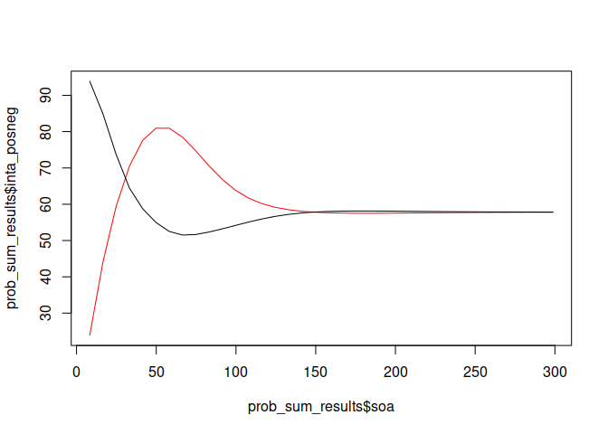
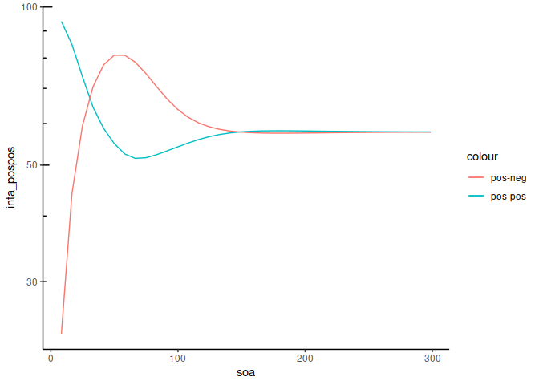
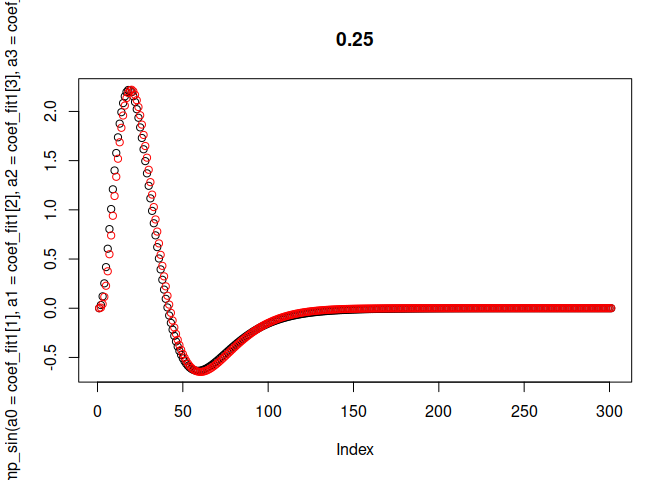
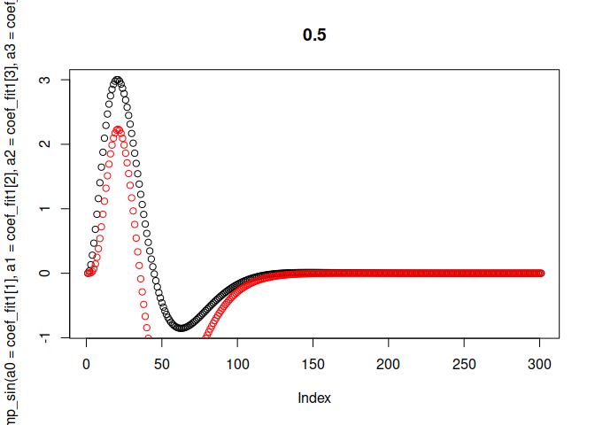
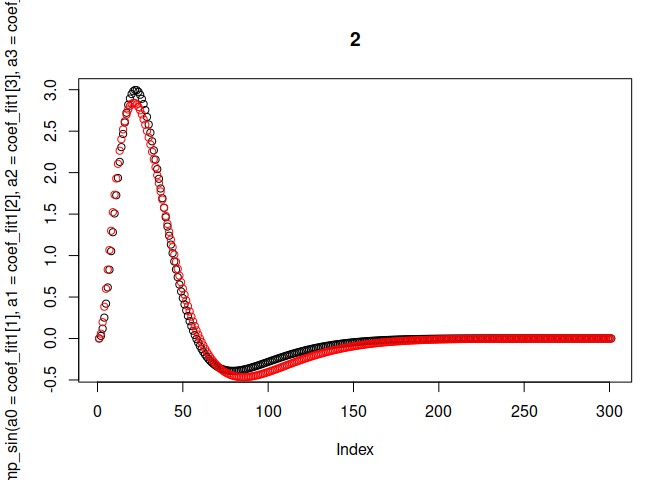
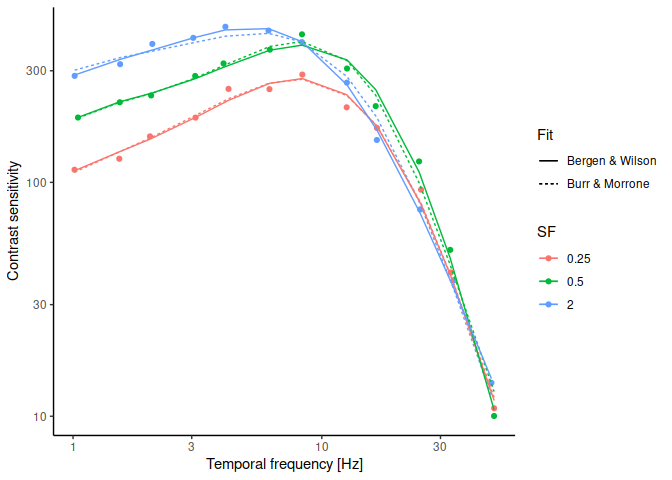

estimate_TRFs_for_SFs
================
Richard Schweitzer
2023-05-26

Libraries…

``` r
library(data.table)
library(ggplot2)
library(scales)
library(viridis)
```

    ## Loading required package: viridisLite

    ## 
    ## Attaching package: 'viridis'

    ## The following object is masked from 'package:scales':
    ## 
    ##     viridis_pal

``` r
library(cowplot)
library(minpack.lm)
library(pracma)
library(mgcv)
```

    ## Loading required package: nlme

    ## This is mgcv 1.8-39. For overview type 'help("mgcv-package")'.

    ## 
    ## Attaching package: 'mgcv'

    ## The following object is masked from 'package:pracma':
    ## 
    ##     magic

# 1. Replicate the findings by Burr & Morrone (1993)

The model and convolution operation in Fig. 2.

``` r
source("exp_damp_sin.R")

# create temporal response function
framedur <- 1000/120
t_res <- framedur/12
trf <- exp_damp_sin(x_step = t_res)
trf_time <- trf[[2]]
trf <- trf[[1]]
plot(trf_time, trf)
```

<!-- -->

``` r
# create a sequence of SOA=60 ms and two positive pulses, and pos/neg pulses
t_stim_on <- 10
soa <- 60
stim_time <- seq(1, 500, by = t_res)
# ... two positive pulses
stim_1 <- rep(0, times = length(stim_time))
stim_1[stim_time >= t_stim_on & stim_time <= t_stim_on+framedur] <- 1
stim_1[stim_time >= t_stim_on+soa & stim_time <= t_stim_on+soa+framedur] <- 1
# ... one positive, one negative
stim_2 <- rep(0, times = length(stim_time))
stim_2[stim_time >= t_stim_on & stim_time <= t_stim_on+framedur] <- 1
stim_2[stim_time >= t_stim_on+soa & stim_time <= t_stim_on+soa+framedur] <- (-1)
plot(stim_time, stim_2, col = "red", type = "l")
lines(stim_time, stim_1, col = "black")
```

<!-- -->

``` r
# now convolute -- we should get Fig. 2 of the paper
resp_1 <- zapsmall(convolve(stim_1, rev(trf), type = "open"))[1:length(stim_1)]
resp_2 <- zapsmall(convolve(stim_2, rev(trf), type = "open"))[1:length(stim_2)]
plot(stim_time, resp_2, type = "l", col = "red")
lines(stim_time, resp_1, col = "black")
```

<!-- -->

This above solution uses convolution, but let’s try the solution
proposed in the paper… Turns out that to reproduce the absolute values
in Fig. 1, we *a0* parameter must be *1.8e3*, not *1.8e5* as stated in
the paper.

``` r
two_pulse_response <- function(t_ms, soa_1 = 0, soa_2, polarity, K = 1,
                               a0 = 1.8e3, a1 = 13, a2 = 5, a3 = 27.3 ) {
  res <- K * ( exp_damp_sin_fun(t_ms = t_ms - soa_1, a0 = a0, a1 = a1, a2 = a2, a3 = a3) + 
                polarity * exp_damp_sin_fun(t_ms = t_ms - soa_2, a0 = a0, a1 = a1, a2 = a2, a3 = a3) )
  return(res)
}

# again, replication of Fig. 2
soa_60ms_pospos <- two_pulse_response(t_ms = stim_time, soa_1 = 10, soa_2 = 70, polarity = 1)
soa_60ms_posneg <- two_pulse_response(t_ms = stim_time, soa_1 = 10, soa_2 = 70, polarity = -1)
plot(stim_time, soa_60ms_posneg, type = "l", col = "red")
lines(stim_time, soa_60ms_pospos, col = "black")
```

<!-- -->

``` r
# probability summation with integrate
beta_now <- 4
integrate(f = function(x) { 
  abs(two_pulse_response(t_ms = x, soa_1 = 0, soa_2 = 60, polarity = 1))^beta_now }, lower = 0, upper = Inf)$value^(1/beta_now)
```

    ## [1] 52.15366

And now the model results from Figure 1B - should be the result of the
probability summation. We can use the code above and iterate over SOAs

``` r
# beta parameter for probability summation:
beta <- 4
# not preallocate
prob_sum_results <- NULL
# loop over SOAs
for (soa in seq(8.3, 300, by = 8.3)) {
  ## the convolution solution
  trf_now <- exp_damp_sin(x_step = t_res, a0 = 1.8e3)
  trf_now <- trf_now[[1]]
  # the stimuli (see above)
  stim_time <- seq(1, 1000, by = t_res)
  stim_1 <- rep(0, times = length(stim_time))
  stim_1[stim_time >= t_stim_on & stim_time <= t_stim_on+framedur] <- 1 / 12
  stim_1[stim_time >= t_stim_on+soa & stim_time <= t_stim_on+soa+framedur] <- 1 / 12
  stim_2 <- rep(0, times = length(stim_time))
  stim_2[stim_time >= t_stim_on & stim_time <= t_stim_on+framedur] <- 1 / 12
  stim_2[stim_time >= t_stim_on+soa & stim_time <= t_stim_on+soa+framedur] <- (-1) / 12
  # response
  resp_1 <- zapsmall(convolve(stim_1, rev(trf_now), type = "open"))[1:length(stim_1)]
  resp_2 <- zapsmall(convolve(stim_2, rev(trf_now), type = "open"))[1:length(stim_2)]
  # plot(stim_time, resp_2, type = "l", col = "red")
  # lines(stim_time, resp_1, col = "black")
  # probability summation
  sum_1 <- trapz(x = stim_time, y = abs(resp_1)^beta)^(1/beta)
  sum_2 <- trapz(x = stim_time, y = abs(resp_2)^beta)^(1/beta)
  ## the integration-based solution:
  inta_1 <- integrate(f = function(x) { 
    abs(two_pulse_response(t_ms = x, soa_1 = 0, soa_2 = soa, polarity = 1))^beta }, lower = 0, upper = Inf)$value^(1/beta)
  inta_2 <- integrate(f = function(x) { 
    abs(two_pulse_response(t_ms = x, soa_1 = 0, soa_2 = soa, polarity = -1))^beta }, lower = 0, upper = Inf)$value^(1/beta)
  # save results
  prob_sum_results <- rbind(prob_sum_results, 
                            data.table(soa = soa, sum_pospos = sum_1, sum_posneg = sum_2, 
                                       inta_pospos = inta_1, inta_posneg = inta_2))
}
# now this should match Fig. 1B - DB's luminance data
# ... sum
plot(prob_sum_results$soa, prob_sum_results$sum_posneg, col = "red", type = "l", 
     ylim = c(min(prob_sum_results[ ,c(2,3)]), max(prob_sum_results[ ,c(2,3)]) ))
lines(prob_sum_results$soa, prob_sum_results$sum_pospos, col = "black", type = "l")
```

<!-- -->

``` r
# ... integrate
plot(prob_sum_results$soa, prob_sum_results$inta_posneg, col = "red", type = "l", 
     ylim = c(min(prob_sum_results[ ,c(4,5)]), max(prob_sum_results[ ,c(4,5)]) ))
lines(prob_sum_results$soa, prob_sum_results$inta_pospos, col = "black", type = "l")
```

<!-- -->

``` r
# ... integrate in loglog coordinates
ggplot(data = prob_sum_results, aes(x = soa, y = inta_pospos, color = "pos-pos")) + 
  geom_line() + 
  geom_line(data = prob_sum_results, aes(x = soa, y = inta_posneg, color = "pos-neg")) + 
  scale_y_log10() + annotation_logticks(sides = "l") + 
  theme_classic()
```

<!-- -->

Now, finally, let’s try to predict the flicker sensitivity data. Burr &
Morrone used flicker from 0.5 to 50 Hz with a Gaussian temporal envelope
of SD=230 ms. We’ll create that data, too.

``` r
source('create_flicker_stim.R')

# parameters
(temporal_gaussian_sd <- 28 * framedur)
```

    ## [1] 233.3333

``` r
pres_dur <- 10*temporal_gaussian_sd
# not preallocate
flicker_sens_results <- NULL
# loop over SOAs
for (tfreq in exp(seq(log(1), log(40), length.out = 40)) ) {
  ## solution 1
  trf_now <- exp_damp_sin(x_step = t_res, a0 = 1.8e3)
  trf_now <- trf_now[[1]] #/ sum(trf_now[[1]])
  # gaussian envelope
  stim_time <- seq(0, pres_dur, by = t_res)
  gaussian <- dnorm(x = stim_time, mean = pres_dur/2, sd = temporal_gaussian_sd)
  gaussian <- gaussian / max(gaussian)
  x <- create_flicker_stim(pres_dur, t_res, tfreq) # flicker stimulus
  stim_tfreq <- x #* gaussian
  #plot(stim_time, stim_tfreq, type = "l")
  # response
  resp_tfreq <- zapsmall(convolve(stim_tfreq, rev(trf_now), type = "open"))[1:length(stim_tfreq)]
  #plot(stim_time, resp_tfreq, type = "l", col = "red")
  # probability summation
  sum_tfreq <- trapz(x = stim_time, y = abs(resp_tfreq)^beta)^(1/beta)
  # save results
  flicker_sens_results <- rbind(flicker_sens_results, 
                                data.table(tfreq = tfreq, sum_tfreq = sum_tfreq, inta_tfreq = NaN))
}
# sum approach
ggplot(data = flicker_sens_results, aes(x = tfreq, y = sum_tfreq)) + 
  geom_line() + 
  annotation_logticks() + 
  scale_x_log10() + 
  scale_y_log10(#breaks = trans_breaks("log10", function(x) 10^x), 
                #labels = trans_format("log10", math_format(10^.x))
    ) + 
  theme_classic()
```

<!-- -->

That worked so so, but sufficiently well.

# 2. The IRF used by Bergen & Wilson (1984)

This function here may be better suited, actually:

``` r
source('bergen_wilson.R')

# looks as predicted with standard parameters:
plot(bergen_wilson(x_step = t_res)[[2]], bergen_wilson(x_step = t_res)[[1]])
```

<!-- -->

# 3. Fit flicker sensitivity data to estimate TRFs

Let’s combine the the two functions for the IRF and the stimulus
generation.

``` r
source("flicker_to_sens.R")

# test this (Burr & Morrone):
flicker_to_sens(tfreqs = c(1, 40), 
                a0 = 1.8e3, a1 = 13, a2 = 5, a3 = 27.3, 
                t_res = 1000/1440, pres_dur = 5000, ramp_sd = 28 * (1000/120))
```

    ## [1] 1597.5961  101.2486

``` r
# ... and Bergen & Wilson:
flicker_to_sens(tfreqs = c(1, 40), 
                a0 = 1.8e3, a1 = 0.92, a2 = 9.5, a3 = 4.0, a4 = 1.5, 
                t_res = 1000/1440, pres_dur = 5000, ramp_sd = 28 * (1000/120))
```

    ## [1] 9076.0688  731.7458

Load digitized flicker sensitivity data from Kelly (1969) and try to fit
the data with the above function

``` r
Kelly69 <- read.csv(file = "Kelly_1969_data_Fig8.csv")
str(Kelly69)
```

    ## 'data.frame':    36 obs. of  3 variables:
    ##  $ tfreq     : num  1.05 1.54 3.1 4.03 6.18 ...
    ##  $ modulation: num  0.00528 0.00455 0.00351 0.0031 0.00271 ...
    ##  $ SF        : num  0.5 0.5 0.5 0.5 0.5 0.5 0.5 0.5 0.5 0.5 ...

``` r
Kelly69$sens <- 1 / Kelly69$modulation
setDT(Kelly69)

# have a look:
ggplot(data = Kelly69, aes(x = tfreq, y = sens, color = as.factor(SF) )) + 
  geom_point() + geom_line() + 
  scale_x_log10() + scale_y_log10() + theme_classic()
```

<!-- -->

``` r
# let's try to fit
Kelly69[ , fit_nls_burr := NaN]
Kelly69[ , fit_nls_bergen := NaN]
for (sf_now in sort(unique(Kelly69$SF))) {
  # Burr & Morrone
  print(paste(sf_now, "Burr & Morrone"))
  fit1 <- nlsLM(data = Kelly69, subset = SF==sf_now, 
                formula = log(sens) ~ log(flicker_to_sens(tfreq, 
                                                          a0 = a0, a1 = a1, a2 = a2, a3 = a3, 
                                                          t_res = 1000/1440, 
                                                          pres_dur = 8 * 28 * (1000/120), 
                                                          ramp_sd = 28 * (1000/120)
                                                          ) ), 
                start = c(a0 = 1.8e3, a1 = 13, a2 = 5, a3 = 27.3), trace = TRUE, 
                lower = c(a0 = 0, a1 = 0, a2 = 0, a3 = 0) )
  coef_fit1 <- coefficients(fit1)
  # Bergen & Wilson
  print(paste(sf_now, "Bergen & Wilson"))
  fit2 <- nlsLM(data = Kelly69, subset = SF==sf_now, 
                formula = log(sens) ~ log(flicker_to_sens(tfreq, 
                                                          a0 = a0, a1 = a1, a2 = a2, a3 = a3, a4 = a4,
                                                          t_res = 1000/1440, 
                                                          pres_dur = 8 * 28 * (1000/120), 
                                                          ramp_sd = 28 * (1000/120)
                                                          ) ), 
                start = c(a0 = 400, a1 = 1, a2 = 10, a3 = 4.0, a4 = 1.5), trace = TRUE, 
                lower = c(a0 = 0, a1 = 0, a2 = 0, a3 = 0, a4 = 0) )
  coef_fit2 <- coefficients(fit2)
  # plot both functions
  plot(exp_damp_sin(a0 = coef_fit1[1], a1 = coef_fit1[2], a2 = coef_fit1[3], a3 = coef_fit1[4])[[1]], main = sf_now)
  points(bergen_wilson(A = coef_fit2[1], B = coef_fit2[2], tau = coef_fit2[3], n = coef_fit2[4], k = coef_fit2[5])[[1]], col = "red")
  # model comparison
  print(anova(fit1, fit2))
  # predict based on fits fits
  Kelly69[SF==sf_now, fit_nls_burr := exp(predict(fit1))]
  Kelly69[SF==sf_now, fit_nls_bergen := exp(predict(fit2))]
}
```

    ## [1] "0.25 Burr & Morrone"
    ## It.    0, RSS =    76.5608, Par. =       1800         13          5       27.3
    ## It.    1, RSS =    14.8863, Par. =    674.219    13.6347    4.33258    34.4454
    ## It.    2, RSS =    10.1939, Par. =    122.137    15.9179    6.08229    48.1541
    ## It.    3, RSS =    1.60497, Par. =    242.939    16.6184    6.72034    56.8018
    ## It.    4, RSS =  0.0817568, Par. =    315.017    16.0202    6.50137    52.0973
    ## It.    5, RSS =   0.068165, Par. =     320.69    16.9866    7.98198    53.5619
    ## It.    6, RSS =  0.0655953, Par. =    322.135    16.9368    7.78534    53.1485
    ## It.    7, RSS =  0.0655953, Par. =    322.135    16.9368    7.78534    53.1485
    ## [1] "0.25 Bergen & Wilson"
    ## It.    0, RSS =    97.1779, Par. =        400          1         10          4        1.5
    ## It.    1, RSS =    96.7042, Par. =    393.146   0.923224    9.98563     4.0171    1.46931
    ## It.    2, RSS =    95.3624, Par. =    389.836   0.925764     9.9808    4.02544      1.454
    ## It.    3, RSS =    92.7226, Par. =    383.319   0.930753    9.96747    4.04163    1.42435
    ## It.    4, RSS =    87.5671, Par. =    370.909    0.94039    9.94116    4.07528    1.36671
    ## It.    5, RSS =    77.3916, Par. =    347.522   0.959124     9.8978    4.13437    1.24742
    ## It.    6, RSS =    59.5347, Par. =    305.015   0.987279    9.78198    4.24845    1.04924
    ## It.    7, RSS =    29.4076, Par. =      225.1    1.01376    9.52135    4.47034   0.728234
    ## It.    8, RSS =    2.13898, Par. =     110.99   0.958685    8.62811    4.72783   0.302935
    ## It.    9, RSS =    1.83475, Par. =    129.388   0.992629    9.76979    3.14171   0.114149
    ## It.   10, RSS =  0.0834931, Par. =     142.18   0.984816    9.92705    3.09483   0.127079
    ## It.   11, RSS =  0.0679615, Par. =     134.38   0.983042    10.0295    3.03879   0.134638
    ## It.   12, RSS =  0.0679396, Par. =    134.275   0.982913    10.0303    3.04098   0.134431
    ## It.   13, RSS =  0.0675854, Par. =     134.39   0.982902    10.0319    3.04272   0.134609
    ## It.   14, RSS =    0.06735, Par. =    134.523    0.98289    10.0328     3.0456   0.134656
    ## It.   15, RSS =  0.0669433, Par. =    134.784   0.982919     10.032    3.05051   0.134873
    ## It.   16, RSS =  0.0663935, Par. =    135.189   0.983025    10.0456    3.05855   0.135394
    ## It.   17, RSS =  0.0663914, Par. =    135.039   0.983044    10.0413    3.05899   0.135385
    ## It.   18, RSS =   0.066372, Par. =    135.025    0.98306    10.0424     3.0578   0.135431
    ## It.   19, RSS =   0.066372, Par. =    135.025    0.98306    10.0424     3.0578   0.135431

<!-- -->

    ## Analysis of Variance Table
    ## 
    ## Model 1: log(sens) ~ log(flicker_to_sens(tfreq, a0 = a0, a1 = a1, a2 = a2, a3 = a3, t_res = 1000/1440, pres_dur = 8 * 28 * (1000/120), ramp_sd = 28 * (1000/120)))
    ## Model 2: log(sens) ~ log(flicker_to_sens(tfreq, a0 = a0, a1 = a1, a2 = a2, a3 = a3, a4 = a4, t_res = 1000/1440, pres_dur = 8 * 28 * (1000/120), ramp_sd = 28 * (1000/120)))
    ##   Res.Df Res.Sum Sq Df      Sum Sq F value Pr(>F)
    ## 1      8   0.065595                              
    ## 2      7   0.066372  1 -0.00077667 -0.0819      1
    ## [1] "0.5 Burr & Morrone"
    ## It.    0, RSS =    57.4267, Par. =       1800         13          5       27.3
    ## It.    1, RSS =    12.4882, Par. =    809.477    13.4102    4.51317    34.0531
    ## It.    2, RSS =   0.560017, Par. =    347.034    13.5129    4.41685    39.9052
    ## It.    3, RSS =   0.190335, Par. =     399.81    13.7175    5.01311    48.1894
    ## It.    4, RSS =   0.154081, Par. =    410.167    13.8118    4.72873    50.5703
    ## It.    5, RSS =   0.148728, Par. =    421.888    14.0054    4.83655    51.7637
    ## It.    6, RSS =   0.148669, Par. =    423.373    14.0285    4.84537    51.8239
    ## It.    7, RSS =   0.148608, Par. =     422.97    14.0301    4.85233      51.78
    ## It.    8, RSS =   0.148606, Par. =    423.378    14.0352    4.85663    51.7818
    ## It.    9, RSS =   0.148596, Par. =    423.067    14.0328    4.85641      51.78
    ## It.   10, RSS =   0.148596, Par. =    422.907    14.0318    4.85637    51.7798
    ## It.   11, RSS =   0.148595, Par. =    422.989    14.0323    4.85638    51.7793
    ## It.   12, RSS =   0.148595, Par. =    422.992    14.0328    4.85628    51.7786
    ## It.   13, RSS =   0.148595, Par. =     422.97    14.0328    4.85631    51.7784
    ## It.   14, RSS =   0.148594, Par. =    422.959    14.0327    4.85631    51.7783
    ## It.   15, RSS =   0.148594, Par. =    422.957    14.0327    4.85633    51.7783
    ## It.   16, RSS =   0.148594, Par. =    422.959    14.0327    4.85634    51.7784
    ## It.   17, RSS =   0.148594, Par. =     422.96    14.0327    4.85634    51.7783
    ## It.   18, RSS =   0.148594, Par. =    422.959    14.0327    4.85634    51.7783
    ## It.   19, RSS =   0.148594, Par. =    422.959    14.0327    4.85634    51.7783
    ## It.   20, RSS =   0.148594, Par. =    422.959    14.0327    4.85634    51.7783
    ## It.   21, RSS =   0.148594, Par. =    422.959    14.0327    4.85634    51.7783
    ## [1] "0.5 Bergen & Wilson"
    ## It.    0, RSS =    75.7318, Par. =        400          1         10          4        1.5
    ## It.    1, RSS =    74.9839, Par. =    387.902   0.896849    9.97976    4.03186    1.44649
    ## It.    2, RSS =    72.8759, Par. =    381.784   0.901982    9.97132    4.04747    1.42273
    ## It.    3, RSS =    68.6879, Par. =    369.884   0.911585    9.95334     4.0792    1.37387
    ## It.    4, RSS =    60.6605, Par. =    347.732   0.928157    9.91788    4.13747    1.27427
    ## It.    5, RSS =    45.9112, Par. =    310.673   0.960036    9.83238    4.24557    1.08188
    ## It.    6, RSS =    21.2996, Par. =    239.719    1.01637    9.61948    4.43645   0.754885
    ## It.    7, RSS =    1.73247, Par. =    121.798    1.02902      8.305    4.74851   0.268708
    ## It.    8, RSS =   0.579641, Par. =     77.437    1.05075    8.27906    4.11537    0.40709
    ## It.    9, RSS =  0.0799342, Par. =    73.2634    1.06545    8.37464    3.97881   0.490901
    ## It.   10, RSS =  0.0706245, Par. =     68.429    1.07367    8.15797    4.07811   0.558166
    ## It.   11, RSS =  0.0700086, Par. =    60.7023    1.08777    8.08077    4.07123   0.619567
    ## It.   12, RSS =  0.0697997, Par. =    59.5129    1.08899    8.04402    4.10449    0.65107
    ## It.   13, RSS =   0.068404, Par. =    56.7023    1.08922    8.34046    3.90723   0.643743
    ## It.   14, RSS =   0.068404, Par. =    56.7023    1.08922    8.34046    3.90723   0.643743

<!-- -->

    ## Analysis of Variance Table
    ## 
    ## Model 1: log(sens) ~ log(flicker_to_sens(tfreq, a0 = a0, a1 = a1, a2 = a2, a3 = a3, t_res = 1000/1440, pres_dur = 8 * 28 * (1000/120), ramp_sd = 28 * (1000/120)))
    ## Model 2: log(sens) ~ log(flicker_to_sens(tfreq, a0 = a0, a1 = a1, a2 = a2, a3 = a3, a4 = a4, t_res = 1000/1440, pres_dur = 8 * 28 * (1000/120), ramp_sd = 28 * (1000/120)))
    ##   Res.Df Res.Sum Sq Df  Sum Sq F value  Pr(>F)  
    ## 1      8   0.148594                             
    ## 2      7   0.068404  1 0.08019  8.2061 0.02418 *
    ## ---
    ## Signif. codes:  0 '***' 0.001 '**' 0.01 '*' 0.05 '.' 0.1 ' ' 1
    ## [1] "2 Burr & Morrone"
    ## It.    0, RSS =    50.9869, Par. =       1800         13          5       27.3
    ## It.    1, RSS =    10.5201, Par. =    759.527     12.801    4.63794    33.4657
    ## It.    2, RSS =    5.58118, Par. =    190.906    14.4051    7.53384    42.5507
    ## It.    3, RSS =    0.25443, Par. =    295.811    16.4975    11.8386    40.0278
    ## It.    4, RSS =   0.236568, Par. =    438.096    12.1349    6.99021    57.9091
    ## It.    5, RSS =   0.135555, Par. =    367.786    14.3893     8.6202    46.6606
    ## It.    6, RSS =   0.103897, Par. =    360.042    14.7142    9.31493     43.883
    ## It.    7, RSS =   0.103844, Par. =    358.425    14.6769    9.30244    43.8845
    ## It.    8, RSS =   0.103712, Par. =     358.12    14.7079    9.30888    43.8759
    ## It.    9, RSS =   0.103704, Par. =    358.544    14.7169    9.31121     43.879
    ## It.   10, RSS =   0.103688, Par. =     358.66    14.7194    9.31439    43.8725
    ## It.   11, RSS =   0.103688, Par. =    358.709    14.7184    9.31448    43.8694
    ## It.   12, RSS =   0.103685, Par. =    358.692    14.7178    9.31462    43.8681
    ## It.   13, RSS =   0.103681, Par. =    358.681     14.717    9.31486    43.8681
    ## It.   14, RSS =   0.103681, Par. =    358.681     14.717    9.31486    43.8681
    ## [1] "2 Bergen & Wilson"
    ## It.    0, RSS =    69.6271, Par. =        400          1         10          4        1.5
    ## It.    1, RSS =    68.1507, Par. =    373.704    0.83294    9.99231    4.07597    1.38217
    ## It.    2, RSS =    63.8932, Par. =    361.104   0.844256    9.99193    4.11349    1.33344
    ## It.    3, RSS =     56.003, Par. =    338.336   0.863682    9.97792    4.17813    1.23521
    ## It.    4, RSS =    41.9843, Par. =    301.566   0.896111    9.96561    4.29078    1.04032
    ## It.    5, RSS =    17.7413, Par. =    238.319   0.945058     9.8843    4.49792   0.679563
    ## It.    6, RSS =    3.54977, Par. =    139.071   0.953075    9.27517     4.5545   0.146994
    ## It.    7, RSS =   0.294307, Par. =    143.544   0.940734    8.96005    3.63797    0.14232
    ## It.    8, RSS =   0.235669, Par. =    141.151   0.942472    9.62012    3.32595   0.137184
    ## It.    9, RSS =   0.163047, Par. =    128.717   0.947315    11.2049     2.8114   0.129399
    ## It.   10, RSS =  0.0962123, Par. =    126.323   0.955712    12.9507    2.53576   0.126074
    ## It.   11, RSS =  0.0541821, Par. =     108.55   0.957826    14.6827    2.29758   0.139082
    ## It.   12, RSS =  0.0462121, Par. =    109.675   0.959924    15.0843    2.29511     0.1414
    ## It.   13, RSS =  0.0460585, Par. =    110.342   0.962662    15.4498    2.28467   0.144906
    ## It.   14, RSS =  0.0403744, Par. =    109.193   0.961861    15.5267    2.24321   0.140421
    ## It.   15, RSS =  0.0353763, Par. =    110.669   0.963412    15.8912    2.20058   0.134343
    ## It.   16, RSS =  0.0342937, Par. =     116.72   0.966231    16.0843     2.1923   0.128244
    ## It.   17, RSS =  0.0312748, Par. =    114.205   0.965239     16.346    2.12238   0.123056
    ## It.   18, RSS =  0.0286178, Par. =    118.098    0.96781     16.675    2.11046   0.120256
    ## It.   19, RSS =   0.028395, Par. =    129.198   0.972726    17.1119    2.08405   0.108578
    ## It.   20, RSS =  0.0265103, Par. =    135.693   0.973242    17.2218    2.06361   0.101162
    ## It.   21, RSS =   0.026413, Par. =    135.429   0.973173    17.2144    2.05454   0.100723
    ## It.   22, RSS =   0.026312, Par. =    135.459   0.973237    17.2125    2.05759    0.10117
    ## It.   23, RSS =  0.0262765, Par. =    135.676   0.973303     17.215    2.05982   0.101576
    ## It.   24, RSS =  0.0262438, Par. =    135.614   0.973357    17.2194    2.06151   0.101684
    ## It.   25, RSS =   0.026243, Par. =    135.577   0.973359    17.2195    2.06124   0.101638
    ## It.   26, RSS =   0.026243, Par. =    135.577   0.973359    17.2195    2.06124   0.101638

<!-- -->

    ## Analysis of Variance Table
    ## 
    ## Model 1: log(sens) ~ log(flicker_to_sens(tfreq, a0 = a0, a1 = a1, a2 = a2, a3 = a3, t_res = 1000/1440, pres_dur = 8 * 28 * (1000/120), ramp_sd = 28 * (1000/120)))
    ## Model 2: log(sens) ~ log(flicker_to_sens(tfreq, a0 = a0, a1 = a1, a2 = a2, a3 = a3, a4 = a4, t_res = 1000/1440, pres_dur = 8 * 28 * (1000/120), ramp_sd = 28 * (1000/120)))
    ##   Res.Df Res.Sum Sq Df   Sum Sq F value   Pr(>F)   
    ## 1      8   0.103681                                
    ## 2      7   0.026243  1 0.077438  20.656 0.002652 **
    ## ---
    ## Signif. codes:  0 '***' 0.001 '**' 0.01 '*' 0.05 '.' 0.1 ' ' 1

``` r
# look at fits
ggplot(data = Kelly69, aes(x = tfreq, y = sens, color = as.factor(SF) )) + 
  geom_point() + 
  geom_line(data = Kelly69, aes(x = tfreq, y = fit_nls_burr, color = as.factor(SF), linetype = "Burr & Morrone")) + 
  geom_line(data = Kelly69, aes(x = tfreq, y = fit_nls_bergen, color = as.factor(SF), linetype = "Bergen & Wilson")) + 
  scale_x_log10() + scale_y_log10() + theme_classic() + 
  labs(x = "Temporal frequency [Hz]", y = "Contrast sensitivity", color = "SF", linetype = "Fit")
```

<!-- -->

Both of the two formulations of the TRF seem to fit the data well.

Now we can try to fit Kelly’s (1979) stabilized data that can be
approximated by a function.

``` r
source('kelly_vel.R') # this is Kelly's function
source('get_best_NLS.R') # for rigorous fitting

Kelly_stabilized <- expand.grid(list(TF = 10^(linspace(log10(0.5), log10(50), 33)), 
                                     SF = 10^(linspace(log10(0.05), log10(10), 31)) 
                                     ))
setDT(Kelly_stabilized)
# apply the factor of 2 for flicker thresholds (see Kelly, 1979)
Kelly_stabilized[ , sens := kelly_vel(sf = SF, v = TF / SF) / 2] 

# this is Kelly's surface:
p_kelly_surface <- ggplot(data = Kelly_stabilized, aes(x = SF, y = TF, z = log10(sens) )) + 
  #geom_raster(interpolate = TRUE) + 
  geom_contour() + geom_contour_filled(bins = 30) + 
  coord_cartesian(expand = FALSE) + 
  scale_x_log10() + scale_y_log10() + 
  annotation_logticks() + 
  #scale_fill_viridis_c(trans = "log10") +
  theme_classic(base_size = 12.5) + theme() + 
  labs(x = "Spatial frequency [cpd]", y = "Temporal frequency [Hz]", fill = "Contrast\nsensitivity")
p_kelly_surface
```

<!-- -->

``` r
# parameters for fitting
do_plot <- FALSE
pres_dur_stabilized <- 4 * 8 * 28 * (1000/120)
ramp_sd_stabilized <- 4 * 28 * (1000/120)
beta_stabilized <- 1.5
update_start <- FALSE # use starting parameters of previous fit? 
start_burr <- c(a0 = 1/4, a1 = 10, a2 = 3, a3 = 5)  # , G = 1.4
start_bergen <- c(a0 = 1/4, a1 = 0.92, a2 = 6, a3 = 10, a4 = 1.5)
start_params_n <- 3 # for rigorous fitting set >1, how many steps between lowest and highest starting value?
# preallocate
Kelly_stabilized[ , fit_nls_burr := NaN]
Kelly_stabilized[ , fit_nls_bergen := NaN]
Kelly_stabilized[ , fit_nls_burr_rigorous := NaN]
Kelly_stabilized[ , fit_nls_bergen_rigorous := NaN]
Kelly_IRFs <- NULL
Kelly_IRF_coefs <- NULL
# start cluster if necessary
if (start_params_n > 1) {
  library(parallel)
  (n_cores <- detectCores()-2) # how many cores?
  library(doParallel)
  par_cluster <- makeCluster(n_cores) # , outfile="" # for verbose parallel output
  registerDoParallel(par_cluster)
  # for some reason, we must manually export our functions...
  clusterExport(cl = par_cluster, 
                varlist = c("exp_damp_sin", "exp_damp_sin_fun", "bergen_wilson", "bergen_wilson_fun", 
                            "create_flicker_stim", "flicker_to_sens") 
  )
} else {
  par_cluster <- NULL
}
```

    ## Loading required package: foreach

    ## Loading required package: iterators

``` r
# fit a IRF to each SF
for (sf_now in sort(unique(Kelly_stabilized$SF))) {
  # Burr & Morrone
  print(paste(sf_now, "Burr & Morrone"))
  if (start_params_n > 1) {
    fit1_stab <- get_best_NLS_foreach(cl = par_cluster, 
                                      df = Kelly_stabilized[SF==sf_now], 
                                      model_form = paste0("log(sens) ~ log(flicker_to_sens(tfreqs = TF, 
                                                           a0 = a0, a1 = a1, a2 = a2, a3 = a3, 
                                                           t_res = 1000/1440, 
                                                           pres_dur = ", pres_dur_stabilized, ", ",
                                                           "ramp_sd = ", ramp_sd_stabilized, ", ",
                                                           "beta = ", beta_stabilized, ", ",
                                                           "G = 1))"), 
                                      use_robust = FALSE, 
                                      model_control = nls.lm.control(maxiter = 200), 
                                      absolute_lowest = c(a0 = 0, a1 = 0, a2 = 0, a3 = 0),
                                      start_params_low = start_burr - start_burr*0.5,
                                      start_params_high = start_burr + start_burr*0.5,
                                      start_params_n = start_params_n, 
                                      debug_mode = FALSE
                                      )
  } 
  fit1_stab_s <- nlsLM(data = Kelly_stabilized, subset = SF==sf_now, 
                       formula = log(sens) ~ log(flicker_to_sens(tfreqs = TF, 
                                                                 a0 = a0, a1 = a1, a2 = a2, a3 = a3, 
                                                                 t_res = 1000/1440, 
                                                                 pres_dur = pres_dur_stabilized, 
                                                                 ramp_sd = ramp_sd_stabilized, 
                                                                 beta = beta_stabilized, 
                                                                 G = 1) ), 
                       weights = 1/sens, # use weights to account for lowest sensitivities?
                       start = start_burr, 
                       lower = c(a0 = 0, a1 = 0, a2 = 0, a3 = 0),  # , G = 1
                       trace = FALSE, control = nls.lm.control(maxiter = 200)
  )
  coef_fit1_stab <- coefficients(fit1_stab)
  coef_fit1_stab_s <- coefficients(fit1_stab_s)
  if (update_start) {
    start_burr <- coef_fit1_stab_s
  }
  # Bergen & Wilson
  print(paste(sf_now, "Bergen & Wilson"))
  if (start_params_n > 1) {
    fit2_stab <- get_best_NLS_foreach(cl = par_cluster, 
                                      df = Kelly_stabilized[SF==sf_now], 
                                      model_form = paste0("log(sens) ~ log(flicker_to_sens(tfreqs = TF, 
                                                           a0 = a0, a1 = a1, a2 = a2, a3 = a3, a4 = a4,
                                                           t_res = 1000/1440, 
                                                           pres_dur = ", pres_dur_stabilized, ", ",
                                                           "ramp_sd = ", ramp_sd_stabilized, ", ",
                                                           "beta = ", beta_stabilized, ", ",
                                                           "G = 1))"), 
                                      use_robust = FALSE, 
                                      model_control = nls.lm.control(maxiter = 200), 
                                      absolute_lowest = c(a0 = 0, a1 = 0, a2 = 0, a3 = 0, a4 = 0),
                                      start_params_low = start_bergen - start_bergen*0.5,
                                      start_params_high = start_bergen + start_bergen*0.5,
                                      start_params_n = start_params_n, 
                                      debug_mode = FALSE
                                      )
  } 
  fit2_stab_s <- nlsLM(data = Kelly_stabilized, subset = SF==sf_now, 
                       formula = log(sens) ~ log(flicker_to_sens(tfreqs = TF, 
                                                                 a0 = a0, a1 = a1, a2 = a2, a3 = a3, a4 = a4,
                                                                 t_res = 1000/1440, 
                                                                 pres_dur = pres_dur_stabilized, 
                                                                 ramp_sd = ramp_sd_stabilized,
                                                                 beta = beta_stabilized, 
                                                                 G = 1
                       ) ), 
                       #weights = 1/sens, # use weights to account for lowest sensitivities?
                       start = start_bergen, 
                       lower = c(a0 = 0, a1 = 0, a2 = 0, a3 = 0, a4 = 0), 
                       trace = FALSE, control = nls.lm.control(maxiter = 200) )
#  plot(exp(predict(fit2_stab)), type = "l")
#  points(Kelly_stabilized[SF==sf_now, sens], col = "red")
  coef_fit2_stab <- coefficients(fit2_stab)
  coef_fit2_stab_s <- coefficients(fit2_stab_s)
  if (update_start) {
    start_bergen <- coef_fit2_stab_s
  }
  # model comparison
  if (start_params_n > 1) {
    print(anova(fit1_stab, fit2_stab))
  }
  print(anova(fit1_stab_s, fit2_stab_s))
  # save parameters
  if (start_params_n > 1) {
    Kelly_IRF_coefs <- rbind(Kelly_IRF_coefs, 
                             data.table(SF = sf_now, model = "Burr & Morrone", fit_type = "rigorous",
                                        a0 = coef_fit1_stab[1], a1 = coef_fit1_stab[2], a2 = coef_fit1_stab[3], a3 = coef_fit1_stab[4], 
                                        a4 = NaN, G = coef_fit1_stab[5], rss = summary(fit1_stab)$sigma))
    Kelly_IRF_coefs <- rbind(Kelly_IRF_coefs, 
                             data.table(SF = sf_now, model = "Bergen & Wilson", fit_type = "rigorous",
                                        a0 = coef_fit2_stab[1], a1 = coef_fit2_stab[2], a2 = coef_fit2_stab[3], a3 = coef_fit2_stab[4], 
                                        a4 = coef_fit2_stab[5], G = coef_fit2_stab[6], rss = summary(fit2_stab)$sigma))
  }
  Kelly_IRF_coefs <- rbind(Kelly_IRF_coefs, 
                           data.table(SF = sf_now, model = "Burr & Morrone", fit_type = "simple",
                                      a0 = coef_fit1_stab_s[1], a1 = coef_fit1_stab_s[2], a2 = coef_fit1_stab_s[3], a3 = coef_fit1_stab_s[4], 
                                      a4 = NaN, G = coef_fit1_stab_s[5], rss = summary(fit1_stab_s)$sigma))
  Kelly_IRF_coefs <- rbind(Kelly_IRF_coefs, 
                           data.table(SF = sf_now, model = "Bergen & Wilson", fit_type = "simple",
                                      a0 = coef_fit2_stab_s[1], a1 = coef_fit2_stab_s[2], a2 = coef_fit2_stab_s[3], a3 = coef_fit2_stab_s[4], 
                                      a4 = coef_fit2_stab_s[5], G = coef_fit2_stab_s[6], rss = summary(fit2_stab_s)$sigma))
  # extract IRF waveforms
  if (start_params_n > 1) {
    irf_stab_fit1 <- exp_damp_sin(x_dur = 300, x_step = t_res, 
                                  a0 = coef_fit1_stab[1], a1 = coef_fit1_stab[2], a2 = coef_fit1_stab[3], a3 = coef_fit1_stab[4])
    irf_stab_fit2 <- bergen_wilson(x_dur = 300, x_step = t_res, 
                                   A = coef_fit2_stab[1], B = coef_fit2_stab[2], tau = coef_fit2_stab[3], 
                                   n = coef_fit2_stab[4], k = coef_fit2_stab[5])
  }
  irf_stab_fit1_s <- exp_damp_sin(x_dur = 300, x_step = t_res, 
                                  a0 = coef_fit1_stab_s[1], a1 = coef_fit1_stab_s[2], a2 = coef_fit1_stab_s[3], a3 = coef_fit1_stab_s[4])
  irf_stab_fit2_s <- bergen_wilson(x_dur = 300, x_step = t_res, 
                                   A = coef_fit2_stab_s[1], B = coef_fit2_stab_s[2], tau = coef_fit2_stab_s[3], 
                                   n = coef_fit2_stab_s[4], k = coef_fit2_stab_s[5])
  if (do_plot) {
    plot(irf_stab_fit1[[2]], irf_stab_fit1[[1]], main = sf_now)
    points(irf_stab_fit2[[2]], irf_stab_fit2[[1]], col = "red")
  }
  # add
  Kelly_IRFs <- rbind(Kelly_IRFs, data.table(irf_time = irf_stab_fit1_s[[2]], 
                                             irf_burr = irf_stab_fit1_s[[1]], 
                                             irf_bergen = irf_stab_fit2_s[[1]],
                                             SF = sf_now, 
                                             fit_type = "simple"))
  if (start_params_n > 1) {
    Kelly_IRFs <- rbind(Kelly_IRFs, data.table(irf_time = irf_stab_fit1[[2]], 
                                               irf_burr = irf_stab_fit1[[1]], 
                                               irf_bergen = irf_stab_fit2[[1]],
                                               SF = sf_now, 
                                               fit_type = "rigorous"))
  }
  # compare fit
  Kelly_stabilized[SF==sf_now, fit_nls_burr := exp(predict(fit1_stab_s))]
  Kelly_stabilized[SF==sf_now, fit_nls_bergen := exp(predict(fit2_stab_s))]
  if (start_params_n > 1) {
    Kelly_stabilized[SF==sf_now, fit_nls_burr_rigorous := exp(predict(fit1_stab))]
    Kelly_stabilized[SF==sf_now, fit_nls_bergen_rigorous := exp(predict(fit2_stab))]
  } else {
    Kelly_stabilized[SF==sf_now, fit_nls_burr_rigorous := NaN]
    Kelly_stabilized[SF==sf_now, fit_nls_bergen_rigorous := NaN]
  }
}
```

    ## [1] "0.05 Burr & Morrone"

    ## Loading required package: assertthat

    ## [1] "0.05 Bergen & Wilson"
    ## Analysis of Variance Table
    ## 
    ## Model 1: log(sens) ~ log(flicker_to_sens(tfreqs = TF, a0 = a0, a1 = a1, a2 = a2, a3 = a3, t_res = 1000/1440, pres_dur = 7466.66666666667, ramp_sd = 933.333333333333, beta = 1.5, G = 1))
    ## Model 2: log(sens) ~ log(flicker_to_sens(tfreqs = TF, a0 = a0, a1 = a1, a2 = a2, a3 = a3, a4 = a4, t_res = 1000/1440, pres_dur = 7466.66666666667, ramp_sd = 933.333333333333, beta = 1.5, G = 1))
    ##   Res.Df Res.Sum Sq Df Sum Sq F value    Pr(>F)    
    ## 1     29    10.1598                                
    ## 2     28     0.8092  1 9.3506  323.54 < 2.2e-16 ***
    ## ---
    ## Signif. codes:  0 '***' 0.001 '**' 0.01 '*' 0.05 '.' 0.1 ' ' 1
    ## Analysis of Variance Table
    ## 
    ## Model 1: log(sens) ~ log(flicker_to_sens(tfreqs = TF, a0 = a0, a1 = a1, a2 = a2, a3 = a3, t_res = 1000/1440, pres_dur = pres_dur_stabilized, ramp_sd = ramp_sd_stabilized, beta = beta_stabilized, G = 1))
    ## Model 2: log(sens) ~ log(flicker_to_sens(tfreqs = TF, a0 = a0, a1 = a1, a2 = a2, a3 = a3, a4 = a4, t_res = 1000/1440, pres_dur = pres_dur_stabilized, ramp_sd = ramp_sd_stabilized, beta = beta_stabilized, G = 1))
    ##   Res.Df Res.Sum Sq Df Sum Sq F value    Pr(>F)    
    ## 1     29     32.106                                
    ## 2     28      0.820  1 31.287  1068.3 < 2.2e-16 ***
    ## ---
    ## Signif. codes:  0 '***' 0.001 '**' 0.01 '*' 0.05 '.' 0.1 ' ' 1
    ## [1] "0.0596583179235247 Burr & Morrone"
    ## [1] "0.0596583179235247 Bergen & Wilson"
    ## Analysis of Variance Table
    ## 
    ## Model 1: log(sens) ~ log(flicker_to_sens(tfreqs = TF, a0 = a0, a1 = a1, a2 = a2, a3 = a3, t_res = 1000/1440, pres_dur = 7466.66666666667, ramp_sd = 933.333333333333, beta = 1.5, G = 1))
    ## Model 2: log(sens) ~ log(flicker_to_sens(tfreqs = TF, a0 = a0, a1 = a1, a2 = a2, a3 = a3, a4 = a4, t_res = 1000/1440, pres_dur = 7466.66666666667, ramp_sd = 933.333333333333, beta = 1.5, G = 1))
    ##   Res.Df Res.Sum Sq Df Sum Sq F value    Pr(>F)    
    ## 1     29     9.6387                                
    ## 2     28     0.6679  1 8.9708  376.06 < 2.2e-16 ***
    ## ---
    ## Signif. codes:  0 '***' 0.001 '**' 0.01 '*' 0.05 '.' 0.1 ' ' 1
    ## Analysis of Variance Table
    ## 
    ## Model 1: log(sens) ~ log(flicker_to_sens(tfreqs = TF, a0 = a0, a1 = a1, a2 = a2, a3 = a3, t_res = 1000/1440, pres_dur = pres_dur_stabilized, ramp_sd = ramp_sd_stabilized, beta = beta_stabilized, G = 1))
    ## Model 2: log(sens) ~ log(flicker_to_sens(tfreqs = TF, a0 = a0, a1 = a1, a2 = a2, a3 = a3, a4 = a4, t_res = 1000/1440, pres_dur = pres_dur_stabilized, ramp_sd = ramp_sd_stabilized, beta = beta_stabilized, G = 1))
    ##   Res.Df Res.Sum Sq Df Sum Sq F value    Pr(>F)    
    ## 1     29    29.1977                                
    ## 2     28     0.6726  1 28.525  1187.6 < 2.2e-16 ***
    ## ---
    ## Signif. codes:  0 '***' 0.001 '**' 0.01 '*' 0.05 '.' 0.1 ' ' 1
    ## [1] "0.0711822979492869 Burr & Morrone"
    ## [1] "0.0711822979492869 Bergen & Wilson"
    ## Analysis of Variance Table
    ## 
    ## Model 1: log(sens) ~ log(flicker_to_sens(tfreqs = TF, a0 = a0, a1 = a1, a2 = a2, a3 = a3, t_res = 1000/1440, pres_dur = 7466.66666666667, ramp_sd = 933.333333333333, beta = 1.5, G = 1))
    ## Model 2: log(sens) ~ log(flicker_to_sens(tfreqs = TF, a0 = a0, a1 = a1, a2 = a2, a3 = a3, a4 = a4, t_res = 1000/1440, pres_dur = 7466.66666666667, ramp_sd = 933.333333333333, beta = 1.5, G = 1))
    ##   Res.Df Res.Sum Sq Df Sum Sq F value    Pr(>F)    
    ## 1     29     9.0252                                
    ## 2     28     0.5150  1 8.5103  462.74 < 2.2e-16 ***
    ## ---
    ## Signif. codes:  0 '***' 0.001 '**' 0.01 '*' 0.05 '.' 0.1 ' ' 1
    ## Analysis of Variance Table
    ## 
    ## Model 1: log(sens) ~ log(flicker_to_sens(tfreqs = TF, a0 = a0, a1 = a1, a2 = a2, a3 = a3, t_res = 1000/1440, pres_dur = pres_dur_stabilized, ramp_sd = ramp_sd_stabilized, beta = beta_stabilized, G = 1))
    ## Model 2: log(sens) ~ log(flicker_to_sens(tfreqs = TF, a0 = a0, a1 = a1, a2 = a2, a3 = a3, a4 = a4, t_res = 1000/1440, pres_dur = pres_dur_stabilized, ramp_sd = ramp_sd_stabilized, beta = beta_stabilized, G = 1))
    ##   Res.Df Res.Sum Sq Df Sum Sq F value    Pr(>F)    
    ## 1     29    26.8095                                
    ## 2     28     0.5205  1 26.289  1414.2 < 2.2e-16 ***
    ## ---
    ## Signif. codes:  0 '***' 0.001 '**' 0.01 '*' 0.05 '.' 0.1 ' ' 1
    ## [1] "0.0849323232317123 Burr & Morrone"
    ## [1] "0.0849323232317123 Bergen & Wilson"
    ## Analysis of Variance Table
    ## 
    ## Model 1: log(sens) ~ log(flicker_to_sens(tfreqs = TF, a0 = a0, a1 = a1, a2 = a2, a3 = a3, t_res = 1000/1440, pres_dur = 7466.66666666667, ramp_sd = 933.333333333333, beta = 1.5, G = 1))
    ## Model 2: log(sens) ~ log(flicker_to_sens(tfreqs = TF, a0 = a0, a1 = a1, a2 = a2, a3 = a3, a4 = a4, t_res = 1000/1440, pres_dur = 7466.66666666667, ramp_sd = 933.333333333333, beta = 1.5, G = 1))
    ##   Res.Df Res.Sum Sq Df Sum Sq F value    Pr(>F)    
    ## 1     29     8.4771                                
    ## 2     28     0.3685  1 8.1086  616.08 < 2.2e-16 ***
    ## ---
    ## Signif. codes:  0 '***' 0.001 '**' 0.01 '*' 0.05 '.' 0.1 ' ' 1
    ## Analysis of Variance Table
    ## 
    ## Model 1: log(sens) ~ log(flicker_to_sens(tfreqs = TF, a0 = a0, a1 = a1, a2 = a2, a3 = a3, t_res = 1000/1440, pres_dur = pres_dur_stabilized, ramp_sd = ramp_sd_stabilized, beta = beta_stabilized, G = 1))
    ## Model 2: log(sens) ~ log(flicker_to_sens(tfreqs = TF, a0 = a0, a1 = a1, a2 = a2, a3 = a3, a4 = a4, t_res = 1000/1440, pres_dur = pres_dur_stabilized, ramp_sd = ramp_sd_stabilized, beta = beta_stabilized, G = 1))
    ##   Res.Df Res.Sum Sq Df Sum Sq F value    Pr(>F)    
    ## 1     29    24.0990                                
    ## 2     28     0.3743  1 23.725    1775 < 2.2e-16 ***
    ## ---
    ## Signif. codes:  0 '***' 0.001 '**' 0.01 '*' 0.05 '.' 0.1 ' ' 1
    ## [1] "0.101338390826821 Burr & Morrone"
    ## [1] "0.101338390826821 Bergen & Wilson"
    ## Analysis of Variance Table
    ## 
    ## Model 1: log(sens) ~ log(flicker_to_sens(tfreqs = TF, a0 = a0, a1 = a1, a2 = a2, a3 = a3, t_res = 1000/1440, pres_dur = 7466.66666666667, ramp_sd = 933.333333333333, beta = 1.5, G = 1))
    ## Model 2: log(sens) ~ log(flicker_to_sens(tfreqs = TF, a0 = a0, a1 = a1, a2 = a2, a3 = a3, a4 = a4, t_res = 1000/1440, pres_dur = 7466.66666666667, ramp_sd = 933.333333333333, beta = 1.5, G = 1))
    ##   Res.Df Res.Sum Sq Df Sum Sq F value    Pr(>F)    
    ## 1     29     7.8852                                
    ## 2     28     0.2544  1 7.6308  839.92 < 2.2e-16 ***
    ## ---
    ## Signif. codes:  0 '***' 0.001 '**' 0.01 '*' 0.05 '.' 0.1 ' ' 1
    ## Analysis of Variance Table
    ## 
    ## Model 1: log(sens) ~ log(flicker_to_sens(tfreqs = TF, a0 = a0, a1 = a1, a2 = a2, a3 = a3, t_res = 1000/1440, pres_dur = pres_dur_stabilized, ramp_sd = ramp_sd_stabilized, beta = beta_stabilized, G = 1))
    ## Model 2: log(sens) ~ log(flicker_to_sens(tfreqs = TF, a0 = a0, a1 = a1, a2 = a2, a3 = a3, a4 = a4, t_res = 1000/1440, pres_dur = pres_dur_stabilized, ramp_sd = ramp_sd_stabilized, beta = beta_stabilized, G = 1))
    ##   Res.Df Res.Sum Sq Df Sum Sq F value    Pr(>F)    
    ## 1     29    27.5974                                
    ## 2     28     0.2626  1 27.335    2914 < 2.2e-16 ***
    ## ---
    ## Signif. codes:  0 '***' 0.001 '**' 0.01 '*' 0.05 '.' 0.1 ' ' 1
    ## [1] "0.120913558756098 Burr & Morrone"
    ## [1] "0.120913558756098 Bergen & Wilson"
    ## Analysis of Variance Table
    ## 
    ## Model 1: log(sens) ~ log(flicker_to_sens(tfreqs = TF, a0 = a0, a1 = a1, a2 = a2, a3 = a3, t_res = 1000/1440, pres_dur = 7466.66666666667, ramp_sd = 933.333333333333, beta = 1.5, G = 1))
    ## Model 2: log(sens) ~ log(flicker_to_sens(tfreqs = TF, a0 = a0, a1 = a1, a2 = a2, a3 = a3, a4 = a4, t_res = 1000/1440, pres_dur = 7466.66666666667, ramp_sd = 933.333333333333, beta = 1.5, G = 1))
    ##   Res.Df Res.Sum Sq Df Sum Sq F value    Pr(>F)    
    ## 1     29     7.4021                                
    ## 2     28     0.1967  1 7.2054  1025.7 < 2.2e-16 ***
    ## ---
    ## Signif. codes:  0 '***' 0.001 '**' 0.01 '*' 0.05 '.' 0.1 ' ' 1
    ## Analysis of Variance Table
    ## 
    ## Model 1: log(sens) ~ log(flicker_to_sens(tfreqs = TF, a0 = a0, a1 = a1, a2 = a2, a3 = a3, t_res = 1000/1440, pres_dur = pres_dur_stabilized, ramp_sd = ramp_sd_stabilized, beta = beta_stabilized, G = 1))
    ## Model 2: log(sens) ~ log(flicker_to_sens(tfreqs = TF, a0 = a0, a1 = a1, a2 = a2, a3 = a3, a4 = a4, t_res = 1000/1440, pres_dur = pres_dur_stabilized, ramp_sd = ramp_sd_stabilized, beta = beta_stabilized, G = 1))
    ##   Res.Df Res.Sum Sq Df Sum Sq F value    Pr(>F)    
    ## 1     29    25.9168                                
    ## 2     28     0.2059  1 25.711  3496.5 < 2.2e-16 ***
    ## ---
    ## Signif. codes:  0 '***' 0.001 '**' 0.01 '*' 0.05 '.' 0.1 ' ' 1
    ## [1] "0.144269990590721 Burr & Morrone"
    ## [1] "0.144269990590721 Bergen & Wilson"
    ## Analysis of Variance Table
    ## 
    ## Model 1: log(sens) ~ log(flicker_to_sens(tfreqs = TF, a0 = a0, a1 = a1, a2 = a2, a3 = a3, t_res = 1000/1440, pres_dur = 7466.66666666667, ramp_sd = 933.333333333333, beta = 1.5, G = 1))
    ## Model 2: log(sens) ~ log(flicker_to_sens(tfreqs = TF, a0 = a0, a1 = a1, a2 = a2, a3 = a3, a4 = a4, t_res = 1000/1440, pres_dur = 7466.66666666667, ramp_sd = 933.333333333333, beta = 1.5, G = 1))
    ##   Res.Df Res.Sum Sq Df Sum Sq F value    Pr(>F)    
    ## 1     29     6.6873                                
    ## 2     28     0.1998  1 6.4875  908.98 < 2.2e-16 ***
    ## ---
    ## Signif. codes:  0 '***' 0.001 '**' 0.01 '*' 0.05 '.' 0.1 ' ' 1
    ## Analysis of Variance Table
    ## 
    ## Model 1: log(sens) ~ log(flicker_to_sens(tfreqs = TF, a0 = a0, a1 = a1, a2 = a2, a3 = a3, t_res = 1000/1440, pres_dur = pres_dur_stabilized, ramp_sd = ramp_sd_stabilized, beta = beta_stabilized, G = 1))
    ## Model 2: log(sens) ~ log(flicker_to_sens(tfreqs = TF, a0 = a0, a1 = a1, a2 = a2, a3 = a3, a4 = a4, t_res = 1000/1440, pres_dur = pres_dur_stabilized, ramp_sd = ramp_sd_stabilized, beta = beta_stabilized, G = 1))
    ##   Res.Df Res.Sum Sq Df Sum Sq F value    Pr(>F)    
    ## 1     29      23.70                                
    ## 2     28       0.21  1  23.49  3132.1 < 2.2e-16 ***
    ## ---
    ## Signif. codes:  0 '***' 0.001 '**' 0.01 '*' 0.05 '.' 0.1 ' ' 1
    ## [1] "0.172138099309703 Burr & Morrone"
    ## [1] "0.172138099309703 Bergen & Wilson"
    ## Analysis of Variance Table
    ## 
    ## Model 1: log(sens) ~ log(flicker_to_sens(tfreqs = TF, a0 = a0, a1 = a1, a2 = a2, a3 = a3, t_res = 1000/1440, pres_dur = 7466.66666666667, ramp_sd = 933.333333333333, beta = 1.5, G = 1))
    ## Model 2: log(sens) ~ log(flicker_to_sens(tfreqs = TF, a0 = a0, a1 = a1, a2 = a2, a3 = a3, a4 = a4, t_res = 1000/1440, pres_dur = 7466.66666666667, ramp_sd = 933.333333333333, beta = 1.5, G = 1))
    ##   Res.Df Res.Sum Sq Df Sum Sq F value    Pr(>F)    
    ## 1     29     6.2287                                
    ## 2     28     0.2299  1 5.9988  730.55 < 2.2e-16 ***
    ## ---
    ## Signif. codes:  0 '***' 0.001 '**' 0.01 '*' 0.05 '.' 0.1 ' ' 1
    ## Analysis of Variance Table
    ## 
    ## Model 1: log(sens) ~ log(flicker_to_sens(tfreqs = TF, a0 = a0, a1 = a1, a2 = a2, a3 = a3, t_res = 1000/1440, pres_dur = pres_dur_stabilized, ramp_sd = ramp_sd_stabilized, beta = beta_stabilized, G = 1))
    ## Model 2: log(sens) ~ log(flicker_to_sens(tfreqs = TF, a0 = a0, a1 = a1, a2 = a2, a3 = a3, a4 = a4, t_res = 1000/1440, pres_dur = pres_dur_stabilized, ramp_sd = ramp_sd_stabilized, beta = beta_stabilized, G = 1))
    ##   Res.Df Res.Sum Sq Df Sum Sq F value    Pr(>F)    
    ## 1     29    24.2148                                
    ## 2     28     0.2363  1 23.978  2840.7 < 2.2e-16 ***
    ## ---
    ## Signif. codes:  0 '***' 0.001 '**' 0.01 '*' 0.05 '.' 0.1 ' ' 1
    ## [1] "0.205389389107391 Burr & Morrone"
    ## [1] "0.205389389107391 Bergen & Wilson"
    ## Analysis of Variance Table
    ## 
    ## Model 1: log(sens) ~ log(flicker_to_sens(tfreqs = TF, a0 = a0, a1 = a1, a2 = a2, a3 = a3, t_res = 1000/1440, pres_dur = 7466.66666666667, ramp_sd = 933.333333333333, beta = 1.5, G = 1))
    ## Model 2: log(sens) ~ log(flicker_to_sens(tfreqs = TF, a0 = a0, a1 = a1, a2 = a2, a3 = a3, a4 = a4, t_res = 1000/1440, pres_dur = 7466.66666666667, ramp_sd = 933.333333333333, beta = 1.5, G = 1))
    ##   Res.Df Res.Sum Sq Df Sum Sq F value    Pr(>F)    
    ## 1     29     5.8739                                
    ## 2     28     0.2861  1 5.5878   546.8 < 2.2e-16 ***
    ## ---
    ## Signif. codes:  0 '***' 0.001 '**' 0.01 '*' 0.05 '.' 0.1 ' ' 1
    ## Analysis of Variance Table
    ## 
    ## Model 1: log(sens) ~ log(flicker_to_sens(tfreqs = TF, a0 = a0, a1 = a1, a2 = a2, a3 = a3, t_res = 1000/1440, pres_dur = pres_dur_stabilized, ramp_sd = ramp_sd_stabilized, beta = beta_stabilized, G = 1))
    ## Model 2: log(sens) ~ log(flicker_to_sens(tfreqs = TF, a0 = a0, a1 = a1, a2 = a2, a3 = a3, a4 = a4, t_res = 1000/1440, pres_dur = pres_dur_stabilized, ramp_sd = ramp_sd_stabilized, beta = beta_stabilized, G = 1))
    ##   Res.Df Res.Sum Sq Df Sum Sq F value    Pr(>F)    
    ## 1     29    21.1714                                
    ## 2     28     0.2925  1 20.879  1998.7 < 2.2e-16 ***
    ## ---
    ## Signif. codes:  0 '***' 0.001 '**' 0.01 '*' 0.05 '.' 0.1 ' ' 1
    ## [1] "0.245063709469745 Burr & Morrone"
    ## [1] "0.245063709469745 Bergen & Wilson"
    ## Analysis of Variance Table
    ## 
    ## Model 1: log(sens) ~ log(flicker_to_sens(tfreqs = TF, a0 = a0, a1 = a1, a2 = a2, a3 = a3, t_res = 1000/1440, pres_dur = 7466.66666666667, ramp_sd = 933.333333333333, beta = 1.5, G = 1))
    ## Model 2: log(sens) ~ log(flicker_to_sens(tfreqs = TF, a0 = a0, a1 = a1, a2 = a2, a3 = a3, a4 = a4, t_res = 1000/1440, pres_dur = 7466.66666666667, ramp_sd = 933.333333333333, beta = 1.5, G = 1))
    ##   Res.Df Res.Sum Sq Df Sum Sq F value    Pr(>F)    
    ## 1     29     5.6178                                
    ## 2     28     0.3694  1 5.2484  397.85 < 2.2e-16 ***
    ## ---
    ## Signif. codes:  0 '***' 0.001 '**' 0.01 '*' 0.05 '.' 0.1 ' ' 1
    ## Analysis of Variance Table
    ## 
    ## Model 1: log(sens) ~ log(flicker_to_sens(tfreqs = TF, a0 = a0, a1 = a1, a2 = a2, a3 = a3, t_res = 1000/1440, pres_dur = pres_dur_stabilized, ramp_sd = ramp_sd_stabilized, beta = beta_stabilized, G = 1))
    ## Model 2: log(sens) ~ log(flicker_to_sens(tfreqs = TF, a0 = a0, a1 = a1, a2 = a2, a3 = a3, a4 = a4, t_res = 1000/1440, pres_dur = pres_dur_stabilized, ramp_sd = ramp_sd_stabilized, beta = beta_stabilized, G = 1))
    ##   Res.Df Res.Sum Sq Df Sum Sq F value    Pr(>F)    
    ## 1     29     20.649                                
    ## 2     28      0.395  1 20.254  1435.9 < 2.2e-16 ***
    ## ---
    ## Signif. codes:  0 '***' 0.001 '**' 0.01 '*' 0.05 '.' 0.1 ' ' 1
    ## [1] "0.292401773821287 Burr & Morrone"
    ## [1] "0.292401773821287 Bergen & Wilson"
    ## Analysis of Variance Table
    ## 
    ## Model 1: log(sens) ~ log(flicker_to_sens(tfreqs = TF, a0 = a0, a1 = a1, a2 = a2, a3 = a3, t_res = 1000/1440, pres_dur = 7466.66666666667, ramp_sd = 933.333333333333, beta = 1.5, G = 1))
    ## Model 2: log(sens) ~ log(flicker_to_sens(tfreqs = TF, a0 = a0, a1 = a1, a2 = a2, a3 = a3, a4 = a4, t_res = 1000/1440, pres_dur = 7466.66666666667, ramp_sd = 933.333333333333, beta = 1.5, G = 1))
    ##   Res.Df Res.Sum Sq Df Sum Sq F value    Pr(>F)    
    ## 1     29     5.2773                                
    ## 2     28     0.4385  1 4.8388  308.99 < 2.2e-16 ***
    ## ---
    ## Signif. codes:  0 '***' 0.001 '**' 0.01 '*' 0.05 '.' 0.1 ' ' 1
    ## Analysis of Variance Table
    ## 
    ## Model 1: log(sens) ~ log(flicker_to_sens(tfreqs = TF, a0 = a0, a1 = a1, a2 = a2, a3 = a3, t_res = 1000/1440, pres_dur = pres_dur_stabilized, ramp_sd = ramp_sd_stabilized, beta = beta_stabilized, G = 1))
    ## Model 2: log(sens) ~ log(flicker_to_sens(tfreqs = TF, a0 = a0, a1 = a1, a2 = a2, a3 = a3, a4 = a4, t_res = 1000/1440, pres_dur = pres_dur_stabilized, ramp_sd = ramp_sd_stabilized, beta = beta_stabilized, G = 1))
    ##   Res.Df Res.Sum Sq Df Sum Sq F value    Pr(>F)    
    ## 1     29    19.0101                                
    ## 2     28     0.4942  1 18.516    1049 < 2.2e-16 ***
    ## ---
    ## Signif. codes:  0 '***' 0.001 '**' 0.01 '*' 0.05 '.' 0.1 ' ' 1
    ## [1] "0.348883959680657 Burr & Morrone"
    ## [1] "0.348883959680657 Bergen & Wilson"
    ## Analysis of Variance Table
    ## 
    ## Model 1: log(sens) ~ log(flicker_to_sens(tfreqs = TF, a0 = a0, a1 = a1, a2 = a2, a3 = a3, t_res = 1000/1440, pres_dur = 7466.66666666667, ramp_sd = 933.333333333333, beta = 1.5, G = 1))
    ## Model 2: log(sens) ~ log(flicker_to_sens(tfreqs = TF, a0 = a0, a1 = a1, a2 = a2, a3 = a3, a4 = a4, t_res = 1000/1440, pres_dur = 7466.66666666667, ramp_sd = 933.333333333333, beta = 1.5, G = 1))
    ##   Res.Df Res.Sum Sq Df Sum Sq F value    Pr(>F)    
    ## 1     29     5.3232                                
    ## 2     28     0.4922  1 4.8311  274.84 5.216e-16 ***
    ## ---
    ## Signif. codes:  0 '***' 0.001 '**' 0.01 '*' 0.05 '.' 0.1 ' ' 1
    ## Analysis of Variance Table
    ## 
    ## Model 1: log(sens) ~ log(flicker_to_sens(tfreqs = TF, a0 = a0, a1 = a1, a2 = a2, a3 = a3, t_res = 1000/1440, pres_dur = pres_dur_stabilized, ramp_sd = ramp_sd_stabilized, beta = beta_stabilized, G = 1))
    ## Model 2: log(sens) ~ log(flicker_to_sens(tfreqs = TF, a0 = a0, a1 = a1, a2 = a2, a3 = a3, a4 = a4, t_res = 1000/1440, pres_dur = pres_dur_stabilized, ramp_sd = ramp_sd_stabilized, beta = beta_stabilized, G = 1))
    ##   Res.Df Res.Sum Sq Df Sum Sq F value    Pr(>F)    
    ## 1     29    19.3153                                
    ## 2     28     0.5977  1 18.718  876.88 < 2.2e-16 ***
    ## ---
    ## Signif. codes:  0 '***' 0.001 '**' 0.01 '*' 0.05 '.' 0.1 ' ' 1
    ## [1] "0.416276603700937 Burr & Morrone"
    ## [1] "0.416276603700937 Bergen & Wilson"
    ## Analysis of Variance Table
    ## 
    ## Model 1: log(sens) ~ log(flicker_to_sens(tfreqs = TF, a0 = a0, a1 = a1, a2 = a2, a3 = a3, t_res = 1000/1440, pres_dur = 7466.66666666667, ramp_sd = 933.333333333333, beta = 1.5, G = 1))
    ## Model 2: log(sens) ~ log(flicker_to_sens(tfreqs = TF, a0 = a0, a1 = a1, a2 = a2, a3 = a3, a4 = a4, t_res = 1000/1440, pres_dur = 7466.66666666667, ramp_sd = 933.333333333333, beta = 1.5, G = 1))
    ##   Res.Df Res.Sum Sq Df Sum Sq F value    Pr(>F)    
    ## 1     29     5.3956                                
    ## 2     28     0.5244  1 4.8712  260.11 1.051e-15 ***
    ## ---
    ## Signif. codes:  0 '***' 0.001 '**' 0.01 '*' 0.05 '.' 0.1 ' ' 1
    ## Analysis of Variance Table
    ## 
    ## Model 1: log(sens) ~ log(flicker_to_sens(tfreqs = TF, a0 = a0, a1 = a1, a2 = a2, a3 = a3, t_res = 1000/1440, pres_dur = pres_dur_stabilized, ramp_sd = ramp_sd_stabilized, beta = beta_stabilized, G = 1))
    ## Model 2: log(sens) ~ log(flicker_to_sens(tfreqs = TF, a0 = a0, a1 = a1, a2 = a2, a3 = a3, a4 = a4, t_res = 1000/1440, pres_dur = pres_dur_stabilized, ramp_sd = ramp_sd_stabilized, beta = beta_stabilized, G = 1))
    ##   Res.Df Res.Sum Sq Df Sum Sq F value    Pr(>F)    
    ## 1     29     18.663                                
    ## 2     28      0.711  1 17.952  706.92 < 2.2e-16 ***
    ## ---
    ## Signif. codes:  0 '***' 0.001 '**' 0.01 '*' 0.05 '.' 0.1 ' ' 1
    ## [1] "0.496687239354311 Burr & Morrone"
    ## [1] "0.496687239354311 Bergen & Wilson"
    ## Analysis of Variance Table
    ## 
    ## Model 1: log(sens) ~ log(flicker_to_sens(tfreqs = TF, a0 = a0, a1 = a1, a2 = a2, a3 = a3, t_res = 1000/1440, pres_dur = 7466.66666666667, ramp_sd = 933.333333333333, beta = 1.5, G = 1))
    ## Model 2: log(sens) ~ log(flicker_to_sens(tfreqs = TF, a0 = a0, a1 = a1, a2 = a2, a3 = a3, a4 = a4, t_res = 1000/1440, pres_dur = 7466.66666666667, ramp_sd = 933.333333333333, beta = 1.5, G = 1))
    ##   Res.Df Res.Sum Sq Df Sum Sq F value    Pr(>F)    
    ## 1     29     5.9051                                
    ## 2     28     0.5203  1 5.3848  289.81 2.649e-16 ***
    ## ---
    ## Signif. codes:  0 '***' 0.001 '**' 0.01 '*' 0.05 '.' 0.1 ' ' 1
    ## Analysis of Variance Table
    ## 
    ## Model 1: log(sens) ~ log(flicker_to_sens(tfreqs = TF, a0 = a0, a1 = a1, a2 = a2, a3 = a3, t_res = 1000/1440, pres_dur = pres_dur_stabilized, ramp_sd = ramp_sd_stabilized, beta = beta_stabilized, G = 1))
    ## Model 2: log(sens) ~ log(flicker_to_sens(tfreqs = TF, a0 = a0, a1 = a1, a2 = a2, a3 = a3, a4 = a4, t_res = 1000/1440, pres_dur = pres_dur_stabilized, ramp_sd = ramp_sd_stabilized, beta = beta_stabilized, G = 1))
    ##   Res.Df Res.Sum Sq Df Sum Sq F value    Pr(>F)    
    ## 1     29    18.2402                                
    ## 2     28     0.8137  1 17.427  599.63 < 2.2e-16 ***
    ## ---
    ## Signif. codes:  0 '***' 0.001 '**' 0.01 '*' 0.05 '.' 0.1 ' ' 1
    ## [1] "0.592630504679146 Burr & Morrone"
    ## [1] "0.592630504679146 Bergen & Wilson"
    ## Analysis of Variance Table
    ## 
    ## Model 1: log(sens) ~ log(flicker_to_sens(tfreqs = TF, a0 = a0, a1 = a1, a2 = a2, a3 = a3, t_res = 1000/1440, pres_dur = 7466.66666666667, ramp_sd = 933.333333333333, beta = 1.5, G = 1))
    ## Model 2: log(sens) ~ log(flicker_to_sens(tfreqs = TF, a0 = a0, a1 = a1, a2 = a2, a3 = a3, a4 = a4, t_res = 1000/1440, pres_dur = 7466.66666666667, ramp_sd = 933.333333333333, beta = 1.5, G = 1))
    ##   Res.Df Res.Sum Sq Df Sum Sq F value    Pr(>F)    
    ## 1     29     5.8146                                
    ## 2     28     0.4728  1 5.3418  316.38 < 2.2e-16 ***
    ## ---
    ## Signif. codes:  0 '***' 0.001 '**' 0.01 '*' 0.05 '.' 0.1 ' ' 1
    ## Analysis of Variance Table
    ## 
    ## Model 1: log(sens) ~ log(flicker_to_sens(tfreqs = TF, a0 = a0, a1 = a1, a2 = a2, a3 = a3, t_res = 1000/1440, pres_dur = pres_dur_stabilized, ramp_sd = ramp_sd_stabilized, beta = beta_stabilized, G = 1))
    ## Model 2: log(sens) ~ log(flicker_to_sens(tfreqs = TF, a0 = a0, a1 = a1, a2 = a2, a3 = a3, a4 = a4, t_res = 1000/1440, pres_dur = pres_dur_stabilized, ramp_sd = ramp_sd_stabilized, beta = beta_stabilized, G = 1))
    ##   Res.Df Res.Sum Sq Df Sum Sq F value    Pr(>F)    
    ## 1     29    18.0219                                
    ## 2     28     0.8999  1 17.122  532.72 < 2.2e-16 ***
    ## ---
    ## Signif. codes:  0 '***' 0.001 '**' 0.01 '*' 0.05 '.' 0.1 ' ' 1
    ## [1] "0.707106781186547 Burr & Morrone"
    ## [1] "0.707106781186547 Bergen & Wilson"
    ## Analysis of Variance Table
    ## 
    ## Model 1: log(sens) ~ log(flicker_to_sens(tfreqs = TF, a0 = a0, a1 = a1, a2 = a2, a3 = a3, t_res = 1000/1440, pres_dur = 7466.66666666667, ramp_sd = 933.333333333333, beta = 1.5, G = 1))
    ## Model 2: log(sens) ~ log(flicker_to_sens(tfreqs = TF, a0 = a0, a1 = a1, a2 = a2, a3 = a3, a4 = a4, t_res = 1000/1440, pres_dur = 7466.66666666667, ramp_sd = 933.333333333333, beta = 1.5, G = 1))
    ##   Res.Df Res.Sum Sq Df Sum Sq F value    Pr(>F)    
    ## 1     29      5.097                                
    ## 2     28      0.389  1  4.708  338.89 < 2.2e-16 ***
    ## ---
    ## Signif. codes:  0 '***' 0.001 '**' 0.01 '*' 0.05 '.' 0.1 ' ' 1
    ## Analysis of Variance Table
    ## 
    ## Model 1: log(sens) ~ log(flicker_to_sens(tfreqs = TF, a0 = a0, a1 = a1, a2 = a2, a3 = a3, t_res = 1000/1440, pres_dur = pres_dur_stabilized, ramp_sd = ramp_sd_stabilized, beta = beta_stabilized, G = 1))
    ## Model 2: log(sens) ~ log(flicker_to_sens(tfreqs = TF, a0 = a0, a1 = a1, a2 = a2, a3 = a3, a4 = a4, t_res = 1000/1440, pres_dur = pres_dur_stabilized, ramp_sd = ramp_sd_stabilized, beta = beta_stabilized, G = 1))
    ##   Res.Df Res.Sum Sq Df Sum Sq F value    Pr(>F)    
    ## 1     29    18.0757                                
    ## 2     28     0.9128  1 17.163  526.46 < 2.2e-16 ***
    ## ---
    ## Signif. codes:  0 '***' 0.001 '**' 0.01 '*' 0.05 '.' 0.1 ' ' 1
    ## [1] "0.843696023158145 Burr & Morrone"
    ## [1] "0.843696023158145 Bergen & Wilson"
    ## Analysis of Variance Table
    ## 
    ## Model 1: log(sens) ~ log(flicker_to_sens(tfreqs = TF, a0 = a0, a1 = a1, a2 = a2, a3 = a3, t_res = 1000/1440, pres_dur = 7466.66666666667, ramp_sd = 933.333333333333, beta = 1.5, G = 1))
    ## Model 2: log(sens) ~ log(flicker_to_sens(tfreqs = TF, a0 = a0, a1 = a1, a2 = a2, a3 = a3, a4 = a4, t_res = 1000/1440, pres_dur = 7466.66666666667, ramp_sd = 933.333333333333, beta = 1.5, G = 1))
    ##   Res.Df Res.Sum Sq Df Sum Sq F value    Pr(>F)    
    ## 1     29     4.8285                                
    ## 2     28     0.2908  1 4.5377  436.89 < 2.2e-16 ***
    ## ---
    ## Signif. codes:  0 '***' 0.001 '**' 0.01 '*' 0.05 '.' 0.1 ' ' 1
    ## Analysis of Variance Table
    ## 
    ## Model 1: log(sens) ~ log(flicker_to_sens(tfreqs = TF, a0 = a0, a1 = a1, a2 = a2, a3 = a3, t_res = 1000/1440, pres_dur = pres_dur_stabilized, ramp_sd = ramp_sd_stabilized, beta = beta_stabilized, G = 1))
    ## Model 2: log(sens) ~ log(flicker_to_sens(tfreqs = TF, a0 = a0, a1 = a1, a2 = a2, a3 = a3, a4 = a4, t_res = 1000/1440, pres_dur = pres_dur_stabilized, ramp_sd = ramp_sd_stabilized, beta = beta_stabilized, G = 1))
    ##   Res.Df Res.Sum Sq Df Sum Sq F value    Pr(>F)    
    ## 1     29     51.915                                
    ## 2     28      0.900  1 51.015  1586.9 < 2.2e-16 ***
    ## ---
    ## Signif. codes:  0 '***' 0.001 '**' 0.01 '*' 0.05 '.' 0.1 ' ' 1
    ## [1] "1.00666971160764 Burr & Morrone"
    ## [1] "1.00666971160764 Bergen & Wilson"
    ## Analysis of Variance Table
    ## 
    ## Model 1: log(sens) ~ log(flicker_to_sens(tfreqs = TF, a0 = a0, a1 = a1, a2 = a2, a3 = a3, t_res = 1000/1440, pres_dur = 7466.66666666667, ramp_sd = 933.333333333333, beta = 1.5, G = 1))
    ## Model 2: log(sens) ~ log(flicker_to_sens(tfreqs = TF, a0 = a0, a1 = a1, a2 = a2, a3 = a3, a4 = a4, t_res = 1000/1440, pres_dur = 7466.66666666667, ramp_sd = 933.333333333333, beta = 1.5, G = 1))
    ##   Res.Df Res.Sum Sq Df Sum Sq F value    Pr(>F)    
    ## 1     29     4.9530                                
    ## 2     28     0.2022  1 4.7508  657.78 < 2.2e-16 ***
    ## ---
    ## Signif. codes:  0 '***' 0.001 '**' 0.01 '*' 0.05 '.' 0.1 ' ' 1
    ## Analysis of Variance Table
    ## 
    ## Model 1: log(sens) ~ log(flicker_to_sens(tfreqs = TF, a0 = a0, a1 = a1, a2 = a2, a3 = a3, t_res = 1000/1440, pres_dur = pres_dur_stabilized, ramp_sd = ramp_sd_stabilized, beta = beta_stabilized, G = 1))
    ## Model 2: log(sens) ~ log(flicker_to_sens(tfreqs = TF, a0 = a0, a1 = a1, a2 = a2, a3 = a3, a4 = a4, t_res = 1000/1440, pres_dur = pres_dur_stabilized, ramp_sd = ramp_sd_stabilized, beta = beta_stabilized, G = 1))
    ##   Res.Df Res.Sum Sq Df Sum Sq F value    Pr(>F)    
    ## 1     29     53.954                                
    ## 2     28      0.835  1  53.12  1782.2 < 2.2e-16 ***
    ## ---
    ## Signif. codes:  0 '***' 0.001 '**' 0.01 '*' 0.05 '.' 0.1 ' ' 1
    ## [1] "1.20112443398143 Burr & Morrone"
    ## [1] "1.20112443398143 Bergen & Wilson"
    ## Analysis of Variance Table
    ## 
    ## Model 1: log(sens) ~ log(flicker_to_sens(tfreqs = TF, a0 = a0, a1 = a1, a2 = a2, a3 = a3, t_res = 1000/1440, pres_dur = 7466.66666666667, ramp_sd = 933.333333333333, beta = 1.5, G = 1))
    ## Model 2: log(sens) ~ log(flicker_to_sens(tfreqs = TF, a0 = a0, a1 = a1, a2 = a2, a3 = a3, a4 = a4, t_res = 1000/1440, pres_dur = 7466.66666666667, ramp_sd = 933.333333333333, beta = 1.5, G = 1))
    ##   Res.Df Res.Sum Sq Df Sum Sq F value    Pr(>F)    
    ## 1     29     6.6725                                
    ## 2     28     0.1375  1 6.5351  1330.9 < 2.2e-16 ***
    ## ---
    ## Signif. codes:  0 '***' 0.001 '**' 0.01 '*' 0.05 '.' 0.1 ' ' 1
    ## Analysis of Variance Table
    ## 
    ## Model 1: log(sens) ~ log(flicker_to_sens(tfreqs = TF, a0 = a0, a1 = a1, a2 = a2, a3 = a3, t_res = 1000/1440, pres_dur = pres_dur_stabilized, ramp_sd = ramp_sd_stabilized, beta = beta_stabilized, G = 1))
    ## Model 2: log(sens) ~ log(flicker_to_sens(tfreqs = TF, a0 = a0, a1 = a1, a2 = a2, a3 = a3, a4 = a4, t_res = 1000/1440, pres_dur = pres_dur_stabilized, ramp_sd = ramp_sd_stabilized, beta = beta_stabilized, G = 1))
    ##   Res.Df Res.Sum Sq Df Sum Sq F value    Pr(>F)    
    ## 1     29    20.2065                                
    ## 2     28     0.7374  1 19.469  739.25 < 2.2e-16 ***
    ## ---
    ## Signif. codes:  0 '***' 0.001 '**' 0.01 '*' 0.05 '.' 0.1 ' ' 1
    ## [1] "1.43314126696356 Burr & Morrone"
    ## [1] "1.43314126696356 Bergen & Wilson"
    ## Analysis of Variance Table
    ## 
    ## Model 1: log(sens) ~ log(flicker_to_sens(tfreqs = TF, a0 = a0, a1 = a1, a2 = a2, a3 = a3, t_res = 1000/1440, pres_dur = 7466.66666666667, ramp_sd = 933.333333333333, beta = 1.5, G = 1))
    ## Model 2: log(sens) ~ log(flicker_to_sens(tfreqs = TF, a0 = a0, a1 = a1, a2 = a2, a3 = a3, a4 = a4, t_res = 1000/1440, pres_dur = 7466.66666666667, ramp_sd = 933.333333333333, beta = 1.5, G = 1))
    ##   Res.Df Res.Sum Sq Df Sum Sq F value    Pr(>F)    
    ## 1     29     6.1097                                
    ## 2     28     0.0987  1 6.0111  1705.8 < 2.2e-16 ***
    ## ---
    ## Signif. codes:  0 '***' 0.001 '**' 0.01 '*' 0.05 '.' 0.1 ' ' 1
    ## Analysis of Variance Table
    ## 
    ## Model 1: log(sens) ~ log(flicker_to_sens(tfreqs = TF, a0 = a0, a1 = a1, a2 = a2, a3 = a3, t_res = 1000/1440, pres_dur = pres_dur_stabilized, ramp_sd = ramp_sd_stabilized, beta = beta_stabilized, G = 1))
    ## Model 2: log(sens) ~ log(flicker_to_sens(tfreqs = TF, a0 = a0, a1 = a1, a2 = a2, a3 = a3, a4 = a4, t_res = 1000/1440, pres_dur = pres_dur_stabilized, ramp_sd = ramp_sd_stabilized, beta = beta_stabilized, G = 1))
    ##   Res.Df Res.Sum Sq Df Sum Sq F value    Pr(>F)    
    ## 1     29     61.777                                
    ## 2     28      0.606  1 61.171  2826.7 < 2.2e-16 ***
    ## ---
    ## Signif. codes:  0 '***' 0.001 '**' 0.01 '*' 0.05 '.' 0.1 ' ' 1
    ## [1] "1.7099759466767 Burr & Morrone"
    ## [1] "1.7099759466767 Bergen & Wilson"
    ## Analysis of Variance Table
    ## 
    ## Model 1: log(sens) ~ log(flicker_to_sens(tfreqs = TF, a0 = a0, a1 = a1, a2 = a2, a3 = a3, t_res = 1000/1440, pres_dur = 7466.66666666667, ramp_sd = 933.333333333333, beta = 1.5, G = 1))
    ## Model 2: log(sens) ~ log(flicker_to_sens(tfreqs = TF, a0 = a0, a1 = a1, a2 = a2, a3 = a3, a4 = a4, t_res = 1000/1440, pres_dur = 7466.66666666667, ramp_sd = 933.333333333333, beta = 1.5, G = 1))
    ##   Res.Df Res.Sum Sq Df Sum Sq F value    Pr(>F)    
    ## 1     29     6.0876                                
    ## 2     28     0.0812  1 6.0065  2072.4 < 2.2e-16 ***
    ## ---
    ## Signif. codes:  0 '***' 0.001 '**' 0.01 '*' 0.05 '.' 0.1 ' ' 1
    ## Analysis of Variance Table
    ## 
    ## Model 1: log(sens) ~ log(flicker_to_sens(tfreqs = TF, a0 = a0, a1 = a1, a2 = a2, a3 = a3, t_res = 1000/1440, pres_dur = pres_dur_stabilized, ramp_sd = ramp_sd_stabilized, beta = beta_stabilized, G = 1))
    ## Model 2: log(sens) ~ log(flicker_to_sens(tfreqs = TF, a0 = a0, a1 = a1, a2 = a2, a3 = a3, a4 = a4, t_res = 1000/1440, pres_dur = pres_dur_stabilized, ramp_sd = ramp_sd_stabilized, beta = beta_stabilized, G = 1))
    ##   Res.Df Res.Sum Sq Df Sum Sq F value    Pr(>F)    
    ## 1     29    23.9266                                
    ## 2     28     0.4647  1 23.462  1413.5 < 2.2e-16 ***
    ## ---
    ## Signif. codes:  0 '***' 0.001 '**' 0.01 '*' 0.05 '.' 0.1 ' ' 1
    ## [1] "2.04028577336837 Burr & Morrone"
    ## [1] "2.04028577336837 Bergen & Wilson"
    ## Analysis of Variance Table
    ## 
    ## Model 1: log(sens) ~ log(flicker_to_sens(tfreqs = TF, a0 = a0, a1 = a1, a2 = a2, a3 = a3, t_res = 1000/1440, pres_dur = 7466.66666666667, ramp_sd = 933.333333333333, beta = 1.5, G = 1))
    ## Model 2: log(sens) ~ log(flicker_to_sens(tfreqs = TF, a0 = a0, a1 = a1, a2 = a2, a3 = a3, a4 = a4, t_res = 1000/1440, pres_dur = 7466.66666666667, ramp_sd = 933.333333333333, beta = 1.5, G = 1))
    ##   Res.Df Res.Sum Sq Df Sum Sq F value    Pr(>F)    
    ## 1     29     6.6687                                
    ## 2     28     0.0789  1 6.5899  2339.8 < 2.2e-16 ***
    ## ---
    ## Signif. codes:  0 '***' 0.001 '**' 0.01 '*' 0.05 '.' 0.1 ' ' 1
    ## Analysis of Variance Table
    ## 
    ## Model 1: log(sens) ~ log(flicker_to_sens(tfreqs = TF, a0 = a0, a1 = a1, a2 = a2, a3 = a3, t_res = 1000/1440, pres_dur = pres_dur_stabilized, ramp_sd = ramp_sd_stabilized, beta = beta_stabilized, G = 1))
    ## Model 2: log(sens) ~ log(flicker_to_sens(tfreqs = TF, a0 = a0, a1 = a1, a2 = a2, a3 = a3, a4 = a4, t_res = 1000/1440, pres_dur = pres_dur_stabilized, ramp_sd = ramp_sd_stabilized, beta = beta_stabilized, G = 1))
    ##   Res.Df Res.Sum Sq Df Sum Sq F value    Pr(>F)    
    ## 1     29    27.1845                                
    ## 2     28     0.3046  1  26.88  2470.6 < 2.2e-16 ***
    ## ---
    ## Signif. codes:  0 '***' 0.001 '**' 0.01 '*' 0.05 '.' 0.1 ' ' 1
    ## [1] "2.43440034644909 Burr & Morrone"
    ## [1] "2.43440034644909 Bergen & Wilson"
    ## Analysis of Variance Table
    ## 
    ## Model 1: log(sens) ~ log(flicker_to_sens(tfreqs = TF, a0 = a0, a1 = a1, a2 = a2, a3 = a3, t_res = 1000/1440, pres_dur = 7466.66666666667, ramp_sd = 933.333333333333, beta = 1.5, G = 1))
    ## Model 2: log(sens) ~ log(flicker_to_sens(tfreqs = TF, a0 = a0, a1 = a1, a2 = a2, a3 = a3, a4 = a4, t_res = 1000/1440, pres_dur = 7466.66666666667, ramp_sd = 933.333333333333, beta = 1.5, G = 1))
    ##   Res.Df Res.Sum Sq Df Sum Sq F value    Pr(>F)    
    ## 1     29     6.6651                                
    ## 2     28     0.1648  1 6.5003  1104.4 < 2.2e-16 ***
    ## ---
    ## Signif. codes:  0 '***' 0.001 '**' 0.01 '*' 0.05 '.' 0.1 ' ' 1
    ## Analysis of Variance Table
    ## 
    ## Model 1: log(sens) ~ log(flicker_to_sens(tfreqs = TF, a0 = a0, a1 = a1, a2 = a2, a3 = a3, t_res = 1000/1440, pres_dur = pres_dur_stabilized, ramp_sd = ramp_sd_stabilized, beta = beta_stabilized, G = 1))
    ## Model 2: log(sens) ~ log(flicker_to_sens(tfreqs = TF, a0 = a0, a1 = a1, a2 = a2, a3 = a3, a4 = a4, t_res = 1000/1440, pres_dur = pres_dur_stabilized, ramp_sd = ramp_sd_stabilized, beta = beta_stabilized, G = 1))
    ##   Res.Df Res.Sum Sq Df Sum Sq F value    Pr(>F)    
    ## 1     29     89.816                                
    ## 2     28      0.167  1 89.649   15068 < 2.2e-16 ***
    ## ---
    ## Signif. codes:  0 '***' 0.001 '**' 0.01 '*' 0.05 '.' 0.1 ' ' 1
    ## [1] "2.90464459643197 Burr & Morrone"
    ## [1] "2.90464459643197 Bergen & Wilson"
    ## Analysis of Variance Table
    ## 
    ## Model 1: log(sens) ~ log(flicker_to_sens(tfreqs = TF, a0 = a0, a1 = a1, a2 = a2, a3 = a3, t_res = 1000/1440, pres_dur = 7466.66666666667, ramp_sd = 933.333333333333, beta = 1.5, G = 1))
    ## Model 2: log(sens) ~ log(flicker_to_sens(tfreqs = TF, a0 = a0, a1 = a1, a2 = a2, a3 = a3, a4 = a4, t_res = 1000/1440, pres_dur = 7466.66666666667, ramp_sd = 933.333333333333, beta = 1.5, G = 1))
    ##   Res.Df Res.Sum Sq Df Sum Sq F value    Pr(>F)    
    ## 1     29     7.6667                                
    ## 2     28     0.1159  1 7.5508  1824.6 < 2.2e-16 ***
    ## ---
    ## Signif. codes:  0 '***' 0.001 '**' 0.01 '*' 0.05 '.' 0.1 ' ' 1
    ## Analysis of Variance Table
    ## 
    ## Model 1: log(sens) ~ log(flicker_to_sens(tfreqs = TF, a0 = a0, a1 = a1, a2 = a2, a3 = a3, t_res = 1000/1440, pres_dur = pres_dur_stabilized, ramp_sd = ramp_sd_stabilized, beta = beta_stabilized, G = 1))
    ## Model 2: log(sens) ~ log(flicker_to_sens(tfreqs = TF, a0 = a0, a1 = a1, a2 = a2, a3 = a3, a4 = a4, t_res = 1000/1440, pres_dur = pres_dur_stabilized, ramp_sd = ramp_sd_stabilized, beta = beta_stabilized, G = 1))
    ##   Res.Df Res.Sum Sq Df Sum Sq F value    Pr(>F)    
    ## 1     29    108.224                                
    ## 2     28      0.117  1 108.11   25878 < 2.2e-16 ***
    ## ---
    ## Signif. codes:  0 '***' 0.001 '**' 0.01 '*' 0.05 '.' 0.1 ' ' 1
    ## [1] "3.46572421577573 Burr & Morrone"
    ## [1] "3.46572421577573 Bergen & Wilson"
    ## Analysis of Variance Table
    ## 
    ## Model 1: log(sens) ~ log(flicker_to_sens(tfreqs = TF, a0 = a0, a1 = a1, a2 = a2, a3 = a3, t_res = 1000/1440, pres_dur = 7466.66666666667, ramp_sd = 933.333333333333, beta = 1.5, G = 1))
    ## Model 2: log(sens) ~ log(flicker_to_sens(tfreqs = TF, a0 = a0, a1 = a1, a2 = a2, a3 = a3, a4 = a4, t_res = 1000/1440, pres_dur = 7466.66666666667, ramp_sd = 933.333333333333, beta = 1.5, G = 1))
    ##   Res.Df Res.Sum Sq Df Sum Sq F value    Pr(>F)    
    ## 1     29     8.7465                                
    ## 2     28     0.1497  1 8.5968  1607.5 < 2.2e-16 ***
    ## ---
    ## Signif. codes:  0 '***' 0.001 '**' 0.01 '*' 0.05 '.' 0.1 ' ' 1
    ## Analysis of Variance Table
    ## 
    ## Model 1: log(sens) ~ log(flicker_to_sens(tfreqs = TF, a0 = a0, a1 = a1, a2 = a2, a3 = a3, t_res = 1000/1440, pres_dur = pres_dur_stabilized, ramp_sd = ramp_sd_stabilized, beta = beta_stabilized, G = 1))
    ## Model 2: log(sens) ~ log(flicker_to_sens(tfreqs = TF, a0 = a0, a1 = a1, a2 = a2, a3 = a3, a4 = a4, t_res = 1000/1440, pres_dur = pres_dur_stabilized, ramp_sd = ramp_sd_stabilized, beta = beta_stabilized, G = 1))
    ##   Res.Df Res.Sum Sq Df Sum Sq F value    Pr(>F)    
    ## 1     29     47.683                                
    ## 2     28      0.150  1 47.532  8857.6 < 2.2e-16 ***
    ## ---
    ## Signif. codes:  0 '***' 0.001 '**' 0.01 '*' 0.05 '.' 0.1 ' ' 1
    ## [1] "4.13518554200014 Burr & Morrone"
    ## [1] "4.13518554200014 Bergen & Wilson"
    ## Analysis of Variance Table
    ## 
    ## Model 1: log(sens) ~ log(flicker_to_sens(tfreqs = TF, a0 = a0, a1 = a1, a2 = a2, a3 = a3, t_res = 1000/1440, pres_dur = 7466.66666666667, ramp_sd = 933.333333333333, beta = 1.5, G = 1))
    ## Model 2: log(sens) ~ log(flicker_to_sens(tfreqs = TF, a0 = a0, a1 = a1, a2 = a2, a3 = a3, a4 = a4, t_res = 1000/1440, pres_dur = 7466.66666666667, ramp_sd = 933.333333333333, beta = 1.5, G = 1))
    ##   Res.Df Res.Sum Sq Df Sum Sq F value    Pr(>F)    
    ## 1     29     9.4411                                
    ## 2     28     0.2570  1 9.1841  1000.5 < 2.2e-16 ***
    ## ---
    ## Signif. codes:  0 '***' 0.001 '**' 0.01 '*' 0.05 '.' 0.1 ' ' 1
    ## Analysis of Variance Table
    ## 
    ## Model 1: log(sens) ~ log(flicker_to_sens(tfreqs = TF, a0 = a0, a1 = a1, a2 = a2, a3 = a3, t_res = 1000/1440, pres_dur = pres_dur_stabilized, ramp_sd = ramp_sd_stabilized, beta = beta_stabilized, G = 1))
    ## Model 2: log(sens) ~ log(flicker_to_sens(tfreqs = TF, a0 = a0, a1 = a1, a2 = a2, a3 = a3, a4 = a4, t_res = 1000/1440, pres_dur = pres_dur_stabilized, ramp_sd = ramp_sd_stabilized, beta = beta_stabilized, G = 1))
    ##   Res.Df Res.Sum Sq Df Sum Sq F value    Pr(>F)    
    ## 1     29     53.282                                
    ## 2     28      0.261  1 53.021  5695.4 < 2.2e-16 ***
    ## ---
    ## Signif. codes:  0 '***' 0.001 '**' 0.01 '*' 0.05 '.' 0.1 ' ' 1
    ## [1] "4.93396427474814 Burr & Morrone"
    ## [1] "4.93396427474814 Bergen & Wilson"
    ## Analysis of Variance Table
    ## 
    ## Model 1: log(sens) ~ log(flicker_to_sens(tfreqs = TF, a0 = a0, a1 = a1, a2 = a2, a3 = a3, t_res = 1000/1440, pres_dur = 7466.66666666667, ramp_sd = 933.333333333333, beta = 1.5, G = 1))
    ## Model 2: log(sens) ~ log(flicker_to_sens(tfreqs = TF, a0 = a0, a1 = a1, a2 = a2, a3 = a3, a4 = a4, t_res = 1000/1440, pres_dur = 7466.66666666667, ramp_sd = 933.333333333333, beta = 1.5, G = 1))
    ##   Res.Df Res.Sum Sq Df Sum Sq F value    Pr(>F)    
    ## 1     29    10.0525                                
    ## 2     28     0.4221  1 9.6304  638.81 < 2.2e-16 ***
    ## ---
    ## Signif. codes:  0 '***' 0.001 '**' 0.01 '*' 0.05 '.' 0.1 ' ' 1
    ## Analysis of Variance Table
    ## 
    ## Model 1: log(sens) ~ log(flicker_to_sens(tfreqs = TF, a0 = a0, a1 = a1, a2 = a2, a3 = a3, t_res = 1000/1440, pres_dur = pres_dur_stabilized, ramp_sd = ramp_sd_stabilized, beta = beta_stabilized, G = 1))
    ## Model 2: log(sens) ~ log(flicker_to_sens(tfreqs = TF, a0 = a0, a1 = a1, a2 = a2, a3 = a3, a4 = a4, t_res = 1000/1440, pres_dur = pres_dur_stabilized, ramp_sd = ramp_sd_stabilized, beta = beta_stabilized, G = 1))
    ##   Res.Df Res.Sum Sq Df Sum Sq F value    Pr(>F)    
    ## 1     29     73.919                                
    ## 2     28      0.423  1 73.495  4860.6 < 2.2e-16 ***
    ## ---
    ## Signif. codes:  0 '***' 0.001 '**' 0.01 '*' 0.05 '.' 0.1 ' ' 1
    ## [1] "5.88704018652475 Burr & Morrone"
    ## [1] "5.88704018652475 Bergen & Wilson"
    ## Analysis of Variance Table
    ## 
    ## Model 1: log(sens) ~ log(flicker_to_sens(tfreqs = TF, a0 = a0, a1 = a1, a2 = a2, a3 = a3, t_res = 1000/1440, pres_dur = 7466.66666666667, ramp_sd = 933.333333333333, beta = 1.5, G = 1))
    ## Model 2: log(sens) ~ log(flicker_to_sens(tfreqs = TF, a0 = a0, a1 = a1, a2 = a2, a3 = a3, a4 = a4, t_res = 1000/1440, pres_dur = 7466.66666666667, ramp_sd = 933.333333333333, beta = 1.5, G = 1))
    ##   Res.Df Res.Sum Sq Df Sum Sq F value    Pr(>F)    
    ## 1     29    10.4434                                
    ## 2     28     0.6196  1 9.8238  443.94 < 2.2e-16 ***
    ## ---
    ## Signif. codes:  0 '***' 0.001 '**' 0.01 '*' 0.05 '.' 0.1 ' ' 1
    ## Analysis of Variance Table
    ## 
    ## Model 1: log(sens) ~ log(flicker_to_sens(tfreqs = TF, a0 = a0, a1 = a1, a2 = a2, a3 = a3, t_res = 1000/1440, pres_dur = pres_dur_stabilized, ramp_sd = ramp_sd_stabilized, beta = beta_stabilized, G = 1))
    ## Model 2: log(sens) ~ log(flicker_to_sens(tfreqs = TF, a0 = a0, a1 = a1, a2 = a2, a3 = a3, a4 = a4, t_res = 1000/1440, pres_dur = pres_dur_stabilized, ramp_sd = ramp_sd_stabilized, beta = beta_stabilized, G = 1))
    ##   Res.Df Res.Sum Sq Df Sum Sq F value    Pr(>F)    
    ## 1     29    110.806                                
    ## 2     28      0.626  1 110.18  4928.9 < 2.2e-16 ***
    ## ---
    ## Signif. codes:  0 '***' 0.001 '**' 0.01 '*' 0.05 '.' 0.1 ' ' 1
    ## [1] "7.02421830152518 Burr & Morrone"
    ## [1] "7.02421830152518 Bergen & Wilson"
    ## Analysis of Variance Table
    ## 
    ## Model 1: log(sens) ~ log(flicker_to_sens(tfreqs = TF, a0 = a0, a1 = a1, a2 = a2, a3 = a3, t_res = 1000/1440, pres_dur = 7466.66666666667, ramp_sd = 933.333333333333, beta = 1.5, G = 1))
    ## Model 2: log(sens) ~ log(flicker_to_sens(tfreqs = TF, a0 = a0, a1 = a1, a2 = a2, a3 = a3, a4 = a4, t_res = 1000/1440, pres_dur = 7466.66666666667, ramp_sd = 933.333333333333, beta = 1.5, G = 1))
    ##   Res.Df Res.Sum Sq Df Sum Sq F value    Pr(>F)    
    ## 1     29    12.2724                                
    ## 2     28     0.8199  1 11.453  391.13 < 2.2e-16 ***
    ## ---
    ## Signif. codes:  0 '***' 0.001 '**' 0.01 '*' 0.05 '.' 0.1 ' ' 1
    ## Analysis of Variance Table
    ## 
    ## Model 1: log(sens) ~ log(flicker_to_sens(tfreqs = TF, a0 = a0, a1 = a1, a2 = a2, a3 = a3, t_res = 1000/1440, pres_dur = pres_dur_stabilized, ramp_sd = ramp_sd_stabilized, beta = beta_stabilized, G = 1))
    ## Model 2: log(sens) ~ log(flicker_to_sens(tfreqs = TF, a0 = a0, a1 = a1, a2 = a2, a3 = a3, a4 = a4, t_res = 1000/1440, pres_dur = pres_dur_stabilized, ramp_sd = ramp_sd_stabilized, beta = beta_stabilized, G = 1))
    ##   Res.Df Res.Sum Sq Df Sum Sq F value    Pr(>F)    
    ## 1     29    180.950                                
    ## 2     28      0.824  1 180.13  6122.8 < 2.2e-16 ***
    ## ---
    ## Signif. codes:  0 '***' 0.001 '**' 0.01 '*' 0.05 '.' 0.1 ' ' 1
    ## [1] "8.3810609719326 Burr & Morrone"
    ## [1] "8.3810609719326 Bergen & Wilson"
    ## Analysis of Variance Table
    ## 
    ## Model 1: log(sens) ~ log(flicker_to_sens(tfreqs = TF, a0 = a0, a1 = a1, a2 = a2, a3 = a3, t_res = 1000/1440, pres_dur = 7466.66666666667, ramp_sd = 933.333333333333, beta = 1.5, G = 1))
    ## Model 2: log(sens) ~ log(flicker_to_sens(tfreqs = TF, a0 = a0, a1 = a1, a2 = a2, a3 = a3, a4 = a4, t_res = 1000/1440, pres_dur = 7466.66666666667, ramp_sd = 933.333333333333, beta = 1.5, G = 1))
    ##   Res.Df Res.Sum Sq Df Sum Sq F value    Pr(>F)    
    ## 1     29    12.5924                                
    ## 2     28     0.9923  1   11.6  327.34 < 2.2e-16 ***
    ## ---
    ## Signif. codes:  0 '***' 0.001 '**' 0.01 '*' 0.05 '.' 0.1 ' ' 1
    ## Analysis of Variance Table
    ## 
    ## Model 1: log(sens) ~ log(flicker_to_sens(tfreqs = TF, a0 = a0, a1 = a1, a2 = a2, a3 = a3, t_res = 1000/1440, pres_dur = pres_dur_stabilized, ramp_sd = ramp_sd_stabilized, beta = beta_stabilized, G = 1))
    ## Model 2: log(sens) ~ log(flicker_to_sens(tfreqs = TF, a0 = a0, a1 = a1, a2 = a2, a3 = a3, a4 = a4, t_res = 1000/1440, pres_dur = pres_dur_stabilized, ramp_sd = ramp_sd_stabilized, beta = beta_stabilized, G = 1))
    ##   Res.Df Res.Sum Sq Df Sum Sq F value    Pr(>F)    
    ## 1     29     330.69                                
    ## 2     28       1.00  1  329.7  9250.6 < 2.2e-16 ***
    ## ---
    ## Signif. codes:  0 '***' 0.001 '**' 0.01 '*' 0.05 '.' 0.1 ' ' 1
    ## [1] "10 Burr & Morrone"
    ## [1] "10 Bergen & Wilson"
    ## Analysis of Variance Table
    ## 
    ## Model 1: log(sens) ~ log(flicker_to_sens(tfreqs = TF, a0 = a0, a1 = a1, a2 = a2, a3 = a3, t_res = 1000/1440, pres_dur = 7466.66666666667, ramp_sd = 933.333333333333, beta = 1.5, G = 1))
    ## Model 2: log(sens) ~ log(flicker_to_sens(tfreqs = TF, a0 = a0, a1 = a1, a2 = a2, a3 = a3, a4 = a4, t_res = 1000/1440, pres_dur = 7466.66666666667, ramp_sd = 933.333333333333, beta = 1.5, G = 1))
    ##   Res.Df Res.Sum Sq Df Sum Sq F value    Pr(>F)    
    ## 1     29    14.9115                                
    ## 2     28     1.1136  1 13.798  346.93 < 2.2e-16 ***
    ## ---
    ## Signif. codes:  0 '***' 0.001 '**' 0.01 '*' 0.05 '.' 0.1 ' ' 1
    ## Analysis of Variance Table
    ## 
    ## Model 1: log(sens) ~ log(flicker_to_sens(tfreqs = TF, a0 = a0, a1 = a1, a2 = a2, a3 = a3, t_res = 1000/1440, pres_dur = pres_dur_stabilized, ramp_sd = ramp_sd_stabilized, beta = beta_stabilized, G = 1))
    ## Model 2: log(sens) ~ log(flicker_to_sens(tfreqs = TF, a0 = a0, a1 = a1, a2 = a2, a3 = a3, a4 = a4, t_res = 1000/1440, pres_dur = pres_dur_stabilized, ramp_sd = ramp_sd_stabilized, beta = beta_stabilized, G = 1))
    ##   Res.Df Res.Sum Sq Df Sum Sq F value    Pr(>F)    
    ## 1     29     685.50                                
    ## 2     28       1.12  1 684.38   17109 < 2.2e-16 ***
    ## ---
    ## Signif. codes:  0 '***' 0.001 '**' 0.01 '*' 0.05 '.' 0.1 ' ' 1

``` r
# shutdown cluster
if (!is.null(par_cluster)) {
  stopCluster(par_cluster)
}
# goodness of fit: Burr & Morrone
p_burrmorrone <- ggplot(data = Kelly_stabilized, aes(x = TF, y = sens, color = SF, group = SF )) + 
  #geom_point(size = 2.0) + 
  geom_line(data = Kelly_stabilized, aes(x = TF, y = fit_nls_burr_rigorous, color = SF, group = SF ), 
            size = 1.5, alpha = 1) + 
  scale_x_log10() + 
  scale_y_log10(breaks = c(0.01, 0.1, 1, 10, 100), labels = c(0.01, 0.1, 1, 10, 100)) + 
  annotation_logticks() + 
  theme_classic(base_size = 12.5) + theme(legend.position = "bottom") + 
  coord_cartesian(ylim = c(0.01, 200), expand = FALSE) + 
  scale_color_viridis_c(trans = "log10") + 
  labs(x = "Temporal frequency [Hz]", y = "Contrast sensitivity", color = "Spatial frequency [cpd]", 
       title = "IRF model (Burr & Morrone)")
```

    ## Warning: Using `size` aesthetic for lines was deprecated in ggplot2 3.4.0.
    ## ℹ Please use `linewidth` instead.
    ## This warning is displayed once every 8 hours.
    ## Call `lifecycle::last_lifecycle_warnings()` to see where this warning was
    ## generated.

``` r
p_burrmorrone
```

<!-- -->

``` r
# goodness of fit: Bergen & Wilson
p_bergenwilson <- ggplot(data = Kelly_stabilized, aes(x = TF, y = sens, color = SF, group = SF )) + 
  #geom_point(size = 2.0) + 
  geom_line(data = Kelly_stabilized, aes(x = TF, y = fit_nls_bergen_rigorous, color = SF, group = SF ), 
            size = 1.5, alpha = 1) + 
  scale_x_log10() + 
  scale_y_log10(breaks = c(0.01, 0.1, 1, 10, 100), labels = c(0.01, 0.1, 1, 10, 100)) + 
  annotation_logticks() + 
  theme_classic(base_size = 12.5) + theme(legend.position = "bottom") + 
  coord_cartesian(ylim = c(0.01, 200), expand = FALSE) + 
  scale_color_viridis_c(trans = "log10") + 
  labs(x = "Temporal frequency [Hz]", y = "Contrast sensitivity", color = "Spatial frequency [cpd]", 
       title = "IRF model (Bergen & Wilson)")
p_bergenwilson
```

<!-- -->

``` r
# ground truth
p_groundtruth <- ggplot(data = Kelly_stabilized, aes(x = TF, y = sens, color = SF, group = SF )) + 
  #geom_point(size = 2.0) + 
  geom_line(size = 1.5, alpha = 1) + 
  scale_x_log10() + 
  scale_y_log10(breaks = c(0.01, 0.1, 1, 10, 100), labels = c(0.01, 0.1, 1, 10, 100)) + 
  annotation_logticks() + 
  theme_classic(base_size = 12.5) + theme(legend.position = "bottom") + 
  coord_cartesian(ylim = c(0.01, 200), expand = FALSE) + 
  scale_color_viridis_c(trans = "log10") + 
  labs(x = "Temporal frequency [Hz]", y = "Contrast sensitivity", color = "Spatial frequency [cpd]", 
       title = "Kelly's (1979) function")
p_groundtruth
```

<!-- -->

``` r
# combine
p_groundtruth_bergenwilson <- plot_grid(p_groundtruth, 
                                        p_bergenwilson, 
                                        p_burrmorrone, 
                                        nrow = 1)
p_groundtruth_bergenwilson
```

<!-- -->

``` r
## look at parameters
Kelly_IRF_coefs[model=="Bergen & Wilson"]
```

    ##              SF           model fit_type         a0         a1       a2
    ##  1:  0.05000000 Bergen & Wilson rigorous 0.20709367 1.00011652 5.982352
    ##  2:  0.05000000 Bergen & Wilson   simple 0.13508705 0.99989312 6.040073
    ##  3:  0.05965832 Bergen & Wilson rigorous 0.35739903 0.99998726 6.007165
    ##  4:  0.05965832 Bergen & Wilson   simple 0.14302766 1.00001469 5.953618
    ##  5:  0.07118230 Bergen & Wilson rigorous 0.37105469 0.99995611 6.027849
    ##  6:  0.07118230 Bergen & Wilson   simple 0.15126742 0.99998319 5.984813
    ##  7:  0.08493232 Bergen & Wilson rigorous 0.40666240 0.99997306 6.045209
    ##  8:  0.08493232 Bergen & Wilson   simple 0.15721568 0.99988514 6.004329
    ##  9:  0.10133839 Bergen & Wilson rigorous 0.62147014 0.99998973 6.151677
    ## 10:  0.10133839 Bergen & Wilson   simple 0.14866469 0.99990382 6.044721
    ## 11:  0.12091356 Bergen & Wilson rigorous 0.54140242 0.99990555 6.259600
    ## 12:  0.12091356 Bergen & Wilson   simple 0.15640343 0.99995594 6.098339
    ## 13:  0.14426999 Bergen & Wilson rigorous 1.08567839 0.99690787 6.325701
    ## 14:  0.14426999 Bergen & Wilson   simple 0.16686405 0.97908466 6.196879
    ## 15:  0.17213810 Bergen & Wilson rigorous 0.64203931 1.00920824 6.379588
    ## 16:  0.17213810 Bergen & Wilson   simple 0.20567470 0.97104917 6.313061
    ## 17:  0.20538939 Bergen & Wilson rigorous 1.10542247 0.99237593 6.468618
    ## 18:  0.20538939 Bergen & Wilson   simple 0.22856165 0.96281945 6.426675
    ## 19:  0.24506371 Bergen & Wilson rigorous 1.38289423 1.00802945 6.587063
    ## 20:  0.24506371 Bergen & Wilson   simple 0.15141201 0.92242329 6.313881
    ## 21:  0.29240177 Bergen & Wilson rigorous 0.11584877 0.75744530 3.422642
    ## 22:  0.29240177 Bergen & Wilson   simple 0.17641151 0.91542105 6.426889
    ## 23:  0.34888396 Bergen & Wilson rigorous 0.11989675 0.71095376 3.462611
    ## 24:  0.34888396 Bergen & Wilson   simple 0.26942039 0.93343307 6.752963
    ## 25:  0.41627660 Bergen & Wilson rigorous 0.12389588 0.66073532 3.501481
    ## 26:  0.41627660 Bergen & Wilson   simple 0.32191657 0.93171146 6.884831
    ## 27:  0.49668724 Bergen & Wilson rigorous 0.12704186 0.60936987 3.587207
    ## 28:  0.49668724 Bergen & Wilson   simple 0.26658526 0.89952616 6.989498
    ## 29:  0.59263050 Bergen & Wilson rigorous 0.13081780 0.55887437 3.679927
    ## 30:  0.59263050 Bergen & Wilson   simple 0.18801780 0.82136665 6.924133
    ## 31:  0.70710678 Bergen & Wilson rigorous 0.13324880 0.51052826 3.842140
    ## 32:  0.70710678 Bergen & Wilson   simple 0.26332354 0.85330055 7.235467
    ## 33:  0.84369602 Bergen & Wilson rigorous 0.13531239 0.45951324 4.057397
    ## 34:  0.84369602 Bergen & Wilson   simple 0.23662260 0.80139258 7.180035
    ## 35:  1.00666971 Bergen & Wilson rigorous 0.13840800 0.40724108 4.268582
    ## 36:  1.00666971 Bergen & Wilson   simple 0.27497498 0.79845911 7.286431
    ## 37:  1.20112443 Bergen & Wilson rigorous 0.14005601 0.35321295 4.548702
    ## 38:  1.20112443 Bergen & Wilson   simple 0.25512694 0.74004248 7.184132
    ## 39:  1.43314127 Bergen & Wilson rigorous 0.14167594 0.29631678 4.816802
    ## 40:  1.43314127 Bergen & Wilson   simple 0.34799382 0.77466841 7.058415
    ## 41:  1.70997595 Bergen & Wilson rigorous 0.14176732 0.23421487 5.081253
    ## 42:  1.70997595 Bergen & Wilson   simple 0.26621510 0.65249611 6.791312
    ## 43:  2.04028577 Bergen & Wilson rigorous 0.14000939 0.16886991 5.321005
    ## 44:  2.04028577 Bergen & Wilson   simple 0.33844591 0.65794063 6.036047
    ## 45:  2.43440035 Bergen & Wilson rigorous 0.30426552 1.44009614 5.445649
    ## 46:  2.43440035 Bergen & Wilson   simple 0.29856539 0.54686458 5.369544
    ## 47:  2.90464460 Bergen & Wilson rigorous 0.12688978 0.01201489 5.750513
    ## 48:  2.90464460 Bergen & Wilson   simple 0.32057549 0.60490842 5.731701
    ## 49:  3.46572422 Bergen & Wilson rigorous 0.30157188 1.38024148 6.054293
    ## 50:  3.46572422 Bergen & Wilson   simple 0.33073305 0.65456764 6.075009
    ## 51:  4.13518554 Bergen & Wilson rigorous 0.31884049 1.30990546 6.375111
    ## 52:  4.13518554 Bergen & Wilson   simple 0.23496856 0.58047287 6.370419
    ## 53:  4.93396427 Bergen & Wilson rigorous 0.23470194 1.34357561 6.640822
    ## 54:  4.93396427 Bergen & Wilson   simple 0.19613701 0.59102901 6.662313
    ## 55:  5.88704019 Bergen & Wilson rigorous 0.43538215 1.13823740 7.018521
    ## 56:  5.88704019 Bergen & Wilson   simple 0.19247966 0.69326621 7.159946
    ## 57:  7.02421830 Bergen & Wilson rigorous 0.45933847 1.08944481 7.364960
    ## 58:  7.02421830 Bergen & Wilson   simple 0.05881029 0.29646248 7.304417
    ## 59:  8.38106097 Bergen & Wilson rigorous 0.90127737 1.02794287 7.674413
    ## 60:  8.38106097 Bergen & Wilson   simple 0.04189712 0.40669532 7.782962
    ## 61: 10.00000000 Bergen & Wilson rigorous 0.10112090 1.13229860 8.037786
    ## 62: 10.00000000 Bergen & Wilson   simple 0.03195986 0.58008373 7.960511
    ##              SF           model fit_type         a0         a1       a2
    ##            a3          a4  G        rss
    ##  1: 12.287884  1.19627943 NA 0.17000159
    ##  2: 11.742455  1.80828566 NA 0.17112973
    ##  3: 12.450811  0.72899888 NA 0.15445016
    ##  4: 11.921482  1.85858642 NA 0.15498397
    ##  5: 12.365467  0.74259231 NA 0.13561395
    ##  6: 11.813052  1.85186574 NA 0.13634080
    ##  7: 12.323389  0.71965588 NA 0.11472397
    ##  8: 11.729843  1.88967319 NA 0.11561253
    ##  9: 12.177007  0.48980442 NA 0.09531632
    ## 10: 11.481746  2.12008356 NA 0.09685219
    ## 11: 11.876661  0.58713958 NA 0.08381530
    ## 12: 11.357567  2.13372362 NA 0.08575186
    ## 13: 11.869164  0.30300579 NA 0.08448126
    ## 14: 11.150577  2.07047916 NA 0.08660119
    ## 15: 11.617210  0.53455708 NA 0.09061620
    ## 16: 11.093009  1.70815146 NA 0.09187496
    ## 17: 11.531921  0.31413557 NA 0.10108956
    ## 18: 10.918539  1.56261216 NA 0.10220754
    ## 19: 11.320024  0.26083593 NA 0.11485597
    ## 20: 10.554631  2.60423953 NA 0.11876650
    ## 21: 20.892272 13.74628147 NA 0.12514061
    ## 22: 10.539627  2.26757203 NA 0.13285571
    ## 23: 20.585224 14.36210054 NA 0.13258102
    ## 24: 10.394139  1.40266438 NA 0.14610187
    ## 25: 20.325222 15.29112356 NA 0.13684856
    ## 26: 10.308401  1.18064332 NA 0.15935598
    ## 27: 19.715624 16.23059943 NA 0.13631106
    ## 28: 10.005871  1.46356634 NA 0.17047534
    ## 29: 19.154007 17.36387531 NA 0.12994011
    ## 30:  9.726143  2.24036870 NA 0.17927809
    ## 31: 18.172361 18.41747046 NA 0.11786647
    ## 32:  9.669290  1.50075096 NA 0.18055698
    ## 33: 17.031521 18.91465883 NA 0.10191413
    ## 34:  9.690074  1.73584689 NA 0.17929763
    ## 35: 16.122299 19.17224272 NA 0.08498549
    ## 36:  9.725259  1.42501693 NA 0.17264542
    ## 37: 15.042245 18.63088115 NA 0.07007233
    ## 38:  9.873408  1.55015540 NA 0.16228418
    ## 39: 14.210561 17.97057927 NA 0.05936271
    ## 40: 10.358147  1.02151919 NA 0.14710807
    ## 41: 13.521056 17.29912590 NA 0.05383649
    ## 42: 10.657123  1.28811764 NA 0.12883392
    ## 43: 13.011117 17.00206767 NA 0.05306961
    ## 44: 12.195765  0.70588573 NA 0.10430746
    ## 45: 13.181508  0.53248973 NA 0.07671784
    ## 46: 13.271732  0.12961781 NA 0.07713443
    ## 47: 12.291709 11.18785402 NA 0.06432940
    ## 48: 12.471458  0.08145575 NA 0.06463389
    ## 49: 12.128562  0.46308383 NA 0.07312897
    ## 50: 11.996922  0.12414076 NA 0.07325473
    ## 51: 11.721680  0.39513539 NA 0.09580870
    ## 52: 11.742120  0.26992266 NA 0.09648590
    ## 53: 11.350768  0.42105271 NA 0.12278222
    ## 54: 11.210719  0.16456669 NA 0.12296635
    ## 55: 11.000106  0.18565734 NA 0.14875787
    ## 56: 10.740132  0.19710923 NA 0.14951191
    ## 57: 10.685280  0.12551867 NA 0.17111543
    ## 58: 10.336351  0.22905138 NA 0.17151946
    ## 59: 10.414939  0.03951472 NA 0.18824851
    ## 60:  9.980739  0.39370833 NA 0.18878750
    ## 61:  9.991803  0.17550894 NA 0.19942674
    ## 62:  9.867344  0.16584816 NA 0.20000469
    ##            a3          a4  G        rss

``` r
Kelly_IRF_coefs[model=="Burr & Morrone"]
```

    ##              SF          model fit_type          a0        a1        a2
    ##  1:  0.05000000 Burr & Morrone rigorous 0.083084711 15.307892 2.3844641
    ##  2:  0.05000000 Burr & Morrone   simple 0.025354548 10.111920 2.9737090
    ##  3:  0.05965832 Burr & Morrone rigorous 0.045646397 19.431653 2.2062248
    ##  4:  0.05965832 Burr & Morrone   simple 0.027586003 10.121933 2.9721908
    ##  5:  0.07118230 Burr & Morrone rigorous 0.049300048 19.279234 2.1865924
    ##  6:  0.07118230 Burr & Morrone   simple 0.029837998 10.122142 2.9718072
    ##  7:  0.08493232 Burr & Morrone rigorous 0.058185552 18.937479 2.1435842
    ##  8:  0.08493232 Burr & Morrone   simple 0.065421099  5.733652 0.9753795
    ##  9:  0.10133839 Burr & Morrone rigorous 0.054365000 19.599037 2.2270593
    ## 10:  0.10133839 Burr & Morrone   simple 0.114050825  3.419695 1.5155889
    ## 11:  0.12091356 Burr & Morrone rigorous 0.053715287 20.056533 2.2833886
    ## 12:  0.12091356 Burr & Morrone   simple 0.134864886  3.094961 1.2676316
    ## 13:  0.14426999 Burr & Morrone rigorous 0.059112431 19.452248 2.2065747
    ## 14:  0.14426999 Burr & Morrone   simple 0.153345875  2.996524 1.1008757
    ## 15:  0.17213810 Burr & Morrone rigorous 0.059196897 19.858120 2.2569271
    ## 16:  0.17213810 Burr & Morrone   simple 0.205082493  2.229484 1.1037963
    ## 17:  0.20538939 Burr & Morrone rigorous 0.063054036 19.602697 2.2239832
    ## 18:  0.20538939 Burr & Morrone   simple 0.178780833  2.775224 1.0743794
    ## 19:  0.24506371 Burr & Morrone rigorous 0.058110614 20.874941 2.3789307
    ## 20:  0.24506371 Burr & Morrone   simple 0.207730603  2.441593 1.0792921
    ## 21:  0.29240177 Burr & Morrone rigorous 0.057445614 20.909499 2.3811370
    ## 22:  0.29240177 Burr & Morrone   simple 0.200938192  2.676526 1.0444906
    ## 23:  0.34888396 Burr & Morrone rigorous 0.063978290 19.979251 2.2675891
    ## 24:  0.34888396 Burr & Morrone   simple 0.267688244  2.021143 1.0651952
    ## 25:  0.41627660 Burr & Morrone rigorous 0.068000801 20.149240 2.2883561
    ## 26:  0.41627660 Burr & Morrone   simple 0.278770301  1.981264 1.0514405
    ## 27:  0.49668724 Burr & Morrone rigorous 0.074647554 20.014561 2.2714207
    ## 28:  0.49668724 Burr & Morrone   simple 0.286089819  1.954992 1.0550121
    ## 29:  0.59263050 Burr & Morrone rigorous 0.048366604 24.170104 2.7349555
    ## 30:  0.59263050 Burr & Morrone   simple 0.285626355  1.960478 1.0608200
    ## 31:  0.70710678 Burr & Morrone rigorous 0.054922908 22.767741 2.5866054
    ## 32:  0.70710678 Burr & Morrone   simple 0.283670657  1.949866 1.0471569
    ## 33:  0.84369602 Burr & Morrone rigorous 0.044991945 23.264993 2.6378155
    ## 34:  0.84369602 Burr & Morrone   simple 0.307034600  1.003934 1.0887107
    ## 35:  1.00666971 Burr & Morrone rigorous 0.041476233 23.811988 2.6942361
    ## 36:  1.00666971 Burr & Morrone   simple 0.259488539  1.136463 1.1034311
    ## 37:  1.20112443 Burr & Morrone rigorous 0.092775685 17.917675 3.1369919
    ## 38:  1.20112443 Burr & Morrone   simple 0.251731666  1.937143 1.0922242
    ## 39:  1.43314127 Burr & Morrone rigorous 0.043673426 23.212673 2.6308687
    ## 40:  1.43314127 Burr & Morrone   simple 0.235282727  1.094024 1.1488868
    ## 41:  1.70997595 Burr & Morrone rigorous 0.042090065 23.896986 3.0256600
    ## 42:  1.70997595 Burr & Morrone   simple 0.190882238  2.134190 1.2121834
    ## 43:  2.04028577 Burr & Morrone rigorous 0.043541797 22.812734 2.9113643
    ## 44:  2.04028577 Burr & Morrone   simple 0.180456059  1.989159 1.1744985
    ## 45:  2.43440035 Burr & Morrone rigorous 0.036609450 22.156993 2.8402696
    ## 46:  2.43440035 Burr & Morrone   simple 0.135550408  1.289921 1.2246939
    ## 47:  2.90464460 Burr & Morrone rigorous 0.031621228 21.344595 2.7488213
    ## 48:  2.90464460 Burr & Morrone   simple 0.113817444  1.252294 1.2617906
    ## 49:  3.46572422 Burr & Morrone rigorous 0.027947852 21.081345 2.7185273
    ## 50:  3.46572422 Burr & Morrone   simple 0.096541485  2.089939 1.2619515
    ## 51:  4.13518554 Burr & Morrone rigorous 0.044950853 16.690423 2.9703216
    ## 52:  4.13518554 Burr & Morrone   simple 0.014230947 10.089529 2.9781792
    ## 53:  4.93396427 Burr & Morrone rigorous 0.034584808 16.742232 2.9779917
    ## 54:  4.93396427 Burr & Morrone   simple 0.010218929 10.076143 2.9785148
    ## 55:  5.88704019 Burr & Morrone rigorous 0.022367809 16.312097 2.9149379
    ## 56:  5.88704019 Burr & Morrone   simple 0.006828965 10.100272 2.9810034
    ## 57:  7.02421830 Burr & Morrone rigorous 0.017611606 15.716755 2.8229692
    ## 58:  7.02421830 Burr & Morrone   simple 0.004173026 10.128320 2.9845781
    ## 59:  8.38106097 Burr & Morrone rigorous 0.009425348 15.670867 2.8162834
    ## 60:  8.38106097 Burr & Morrone   simple 0.002291224 10.104426 2.9744193
    ## 61: 10.00000000 Burr & Morrone rigorous 0.006690821 14.408183 3.1623530
    ## 62: 10.00000000 Burr & Morrone   simple 0.001109919 10.111437 2.9739096
    ##              SF          model fit_type          a0        a1        a2
    ##            a3  a4  G       rss
    ##  1:  9.725416 NaN NA 0.5918945
    ##  2:  7.171174 NaN NA 1.0521980
    ##  3:  6.789983 NaN NA 0.5765158
    ##  4:  7.492601 NaN NA 1.0034037
    ##  5:  6.788581 NaN NA 0.5578666
    ##  6:  7.509540 NaN NA 0.9614910
    ##  7:  6.956530 NaN NA 0.5406605
    ##  8: 11.547240 NaN NA 0.9115920
    ##  9:  6.740092 NaN NA 0.5214443
    ## 10: 12.786511 NaN NA 0.9755169
    ## 11:  6.605944 NaN NA 0.5052189
    ## 12: 12.913276 NaN NA 0.9453485
    ## 13:  6.506880 NaN NA 0.4802044
    ## 14: 11.871799 NaN NA 0.9040213
    ## 15:  6.372049 NaN NA 0.4634465
    ## 16: 15.138219 NaN NA 0.9137791
    ## 17:  6.255231 NaN NA 0.4500552
    ## 18: 13.721978 NaN NA 0.8544283
    ## 19:  6.033481 NaN NA 0.4401330
    ## 20: 14.936642 NaN NA 0.8438216
    ## 21:  5.729690 NaN NA 0.4265873
    ## 22: 14.111088 NaN NA 0.8096419
    ## 23:  5.602059 NaN NA 0.4284388
    ## 24: 15.004774 NaN NA 0.8161154
    ## 25:  5.560992 NaN NA 0.4313405
    ## 26: 14.967840 NaN NA 0.8022120
    ## 27:  5.543954 NaN NA 0.4512461
    ## 28: 14.900233 NaN NA 0.7930784
    ## 29:  4.522129 NaN NA 0.4477757
    ## 30: 14.899365 NaN NA 0.7883168
    ## 31:  4.442191 NaN NA 0.4192351
    ## 32: 14.909391 NaN NA 0.7894938
    ## 33:  3.599176 NaN NA 0.4080456
    ## 34: 28.681466 NaN NA 1.3379733
    ## 35:  3.111958 NaN NA 0.4132730
    ## 36: 26.398000 NaN NA 1.3639973
    ## 37:  5.376894 NaN NA 0.4796745
    ## 38: 14.731969 NaN NA 0.8347314
    ## 39:  2.891601 NaN NA 0.4589990
    ## 40: 27.366201 NaN NA 1.4595339
    ## 41:  2.212191 NaN NA 0.4581680
    ## 42: 14.862895 NaN NA 0.9083264
    ## 43:  2.395020 NaN NA 0.4795370
    ## 44: 14.625641 NaN NA 0.9681923
    ## 45:  1.786335 NaN NA 0.4794058
    ## 46: 27.648905 NaN NA 1.7598585
    ## 47:  1.440453 NaN NA 0.5141681
    ## 48: 26.942024 NaN NA 1.9318049
    ## 49:  1.315550 NaN NA 0.5491851
    ## 50: 14.622851 NaN NA 1.2822748
    ## 51:  2.814833 NaN NA 0.5705736
    ## 52:  6.034422 NaN NA 1.3554746
    ## 53:  2.515210 NaN NA 0.5887596
    ## 54:  5.393558 NaN NA 1.5965351
    ## 55:  1.846599 NaN NA 0.6000988
    ## 56:  5.993225 NaN NA 1.9547104
    ## 57:  2.492885 NaN NA 0.6505283
    ## 58:  6.427108 NaN NA 2.4979317
    ## 59:  1.898843 NaN NA 0.6589544
    ## 60:  6.900295 NaN NA 3.3768720
    ## 61:  2.396094 NaN NA 0.7170691
    ## 62:  7.106648 NaN NA 4.8618732
    ##            a3  a4  G       rss

``` r
# model comparison?
t.test(y = Kelly_IRF_coefs[model=="Bergen & Wilson" & fit_type=="rigorous", rss], 
       x = Kelly_IRF_coefs[model=="Burr & Morrone" & fit_type=="rigorous", rss], paired = TRUE)
```

    ## 
    ##  Paired t-test
    ## 
    ## data:  Kelly_IRF_coefs[model == "Burr & Morrone" & fit_type == "rigorous", rss] and Kelly_IRF_coefs[model == "Bergen & Wilson" & fit_type == "rigorous", rss]
    ## t = 33.761, df = 30, p-value < 2.2e-16
    ## alternative hypothesis: true difference in means is not equal to 0
    ## 95 percent confidence interval:
    ##  0.3719022 0.4197942
    ## sample estimates:
    ## mean of the differences 
    ##               0.3958482

# 4. Create a continuous TRF space and save it for later

Have a look at the individual IRFs for each SF, then fit a Time x SF GAM
so that we can interpolate an IRF for every possible SF. Then we’ll save
the model for later…

``` r
## IRFs
p_irf_burrmorrone <- ggplot(data = Kelly_IRFs, aes(x = irf_time, y = irf_burr, color = SF, group = SF )) + 
  geom_line(size = 1.5) + theme_classic() + 
  scale_color_viridis_c(trans = "log10") + 
  labs(color = "SF [cpd]", x = "Time [ms]", y = "H(t)") + 
  facet_wrap(~fit_type)
p_irf_burrmorrone
```

<!-- -->

``` r
# Bergen & Wilson
p_irf_bergenwilson <- ggplot(data = Kelly_IRFs, aes(x = irf_time, y = irf_bergen, color = SF, group = SF )) + 
  geom_line(size = 1.5, alpha = 0.8) + 
  theme_classic(base_size = 12.5) + 
  scale_x_continuous(expand = c(0,0)) + 
  scale_color_viridis_c(trans = "log10") + 
  labs(color = "SF [cpd]", x = "Time [ms]", y = "H(t)") + 
  facet_wrap(~fit_type)
p_irf_bergenwilson
```

<!-- -->

``` r
# IRF surface
p_irf_surface <- ggplot(data = Kelly_IRFs, 
                        aes(x = irf_time, y = SF, fill = irf_bergen)) + 
  geom_raster(interpolate = TRUE) + 
  coord_cartesian(expand = FALSE) + 
  scale_x_continuous(limits = c(0, 250), expand = c(0,0)) + 
  scale_y_log10() + 
  annotation_logticks(sides = "l") + 
  scale_fill_gradient2() + 
  theme_minimal(base_size = 12.5) + theme() + 
  labs(y = "Spatial frequency [cpd]", x = "Time [ms]", fill = "H(t)") + 
  facet_wrap(~fit_type)
p_irf_surface
```

    ## Warning: Removed 4588 rows containing missing values (`geom_raster()`).

<!-- -->

``` r
# on the side, a few exemplary IRFs
p_irf_examples <- ggplot(data = Kelly_IRFs[fit_type=="simple"], 
                        aes(x = irf_time, y = irf_bergen)) + 
  scale_x_continuous(limits = c(0, 250), expand = c(0,0)) + 
  geom_line(size = 1.5) + 
  theme_minimal(base_size = 12.5) + theme() + 
  labs(x = "Time [ms]", y = "H(t)") + 
  facet_wrap(~round(SF,2))
p_irf_examples
```

    ## Warning: Removed 73 rows containing missing values (`geom_line()`).

<!-- -->

``` r
# approximate the IRFs with a GAM ~ time x SF
gam_irf <- bam(data = Kelly_IRFs, subset = fit_type=="simple", 
               formula = irf_bergen ~ 
                 s(log(SF), k = 16, bs = "cr") + 
                 s(irf_time, k = 40, bs = "cr") + 
                 ti(log(SF), irf_time, k = c(16, 40), bs = c("cr", "cr") )
)
summary(gam_irf)
```

    ## 
    ## Family: gaussian 
    ## Link function: identity 
    ## 
    ## Formula:
    ## irf_bergen ~ s(log(SF), k = 16, bs = "cr") + s(irf_time, k = 40, 
    ##     bs = "cr") + ti(log(SF), irf_time, k = c(16, 40), bs = c("cr", 
    ##     "cr"))
    ## 
    ## Parametric coefficients:
    ##              Estimate Std. Error t value Pr(>|t|)    
    ## (Intercept) 9.273e-04  2.905e-07    3192   <2e-16 ***
    ## ---
    ## Signif. codes:  0 '***' 0.001 '**' 0.01 '*' 0.05 '.' 0.1 ' ' 1
    ## 
    ## Approximate significance of smooth terms:
    ##                         edf Ref.df       F p-value    
    ## s(log(SF))            14.99   15.0  570118  <2e-16 ***
    ## s(irf_time)           38.99   39.0 2337705  <2e-16 ***
    ## ti(log(SF),irf_time) 580.77  584.9   71558  <2e-16 ***
    ## ---
    ## Signif. codes:  0 '***' 0.001 '**' 0.01 '*' 0.05 '.' 0.1 ' ' 1
    ## 
    ## R-sq.(adj) =      1   Deviance explained =  100%
    ## fREML = -1.1711e+05  Scale est. = 1.1304e-09  n = 13423

``` r
Kelly_IRFs[fit_type=="simple", irf_bergen_gam_pred := predict(gam_irf)]

# IRF surface, fitted by GAM
p_irf_surface_gam <- ggplot(data = Kelly_IRFs[fit_type=="simple"], 
                        aes(x = irf_time, y = SF, fill = irf_bergen_gam_pred)) + 
  geom_raster(interpolate = TRUE) + 
  coord_cartesian(expand = FALSE) + 
  scale_x_continuous(limits = c(0, 250), expand = c(0,0)) + 
  scale_y_log10() +  # limits = c(0.01, 10)
  annotation_logticks(sides = "l") + 
  scale_fill_gradient2() + 
  theme_minimal(base_size = 12.5) + theme() + 
  labs(y = "Spatial frequency [cpd]", x = "Time [ms]", fill = "H(t)")
p_irf_surface_gam
```

    ## Warning: Removed 2294 rows containing missing values (`geom_raster()`).

<!-- -->

``` r
# save the modelsa
save(gam_irf, file = "gam_irf.rda", compress = "xz")
```

# 5. Fourier analysis of TRFs

Look at the Fourier domain of those IRFs. The amplitude spectrum should
look very much like Kelly’s sensitivity curve!

``` r
# pick a single SF
unique_SFs <- unique(Kelly_IRFs$SF)
IRF_ffts <- NULL
for (unique_SF in unique_SFs) {
  # run fft
  single_IRF <- Kelly_IRFs[fit_type=="simple" & SF==unique_SF]
  # zero padding?
  n = 2^nextpow2(nrow(single_IRF)*10);
  zeros = rep(0, times = n - nrow(single_IRF))
  # from https://de.mathworks.com/help/matlab/ref/fft.html
  Y <- fft(c(single_IRF$irf_bergen_gam_pred, zeros))
  n <- length(Y) # length of signal 
  Fs <- unique(round(1/diff(single_IRF$irf_time/1000))) # in Hz, artifical sampling rate
  # amplitude
  P2 = abs(Y/n) 
  P1 = P2[1:(n/2+1)]
  P1[2:(length(P1)-1)] = 2*P1[2:(length(P1)-1)]
  # phase
  pha2 = Imag(Y) 
  pha1 = pha2[1:(n/2+1)]
  pha1[2:(length(pha1)-1)] = 2*pha1[2:(length(pha1)-1)]
  # save:
  single_IRF_fft <- data.table(SF = unique_SF, 
                               f = Fs*(0:(n/2))/n, 
                               Y = P1, 
                               pha = pha1)
  IRF_ffts <- rbind(IRF_ffts, single_IRF_fft)
}
# plot the fourier domain
p_fft_amp <- ggplot(IRF_ffts, aes(x = f, y = Y, color = SF, group = SF)) + 
  coord_cartesian(expand = FALSE, xlim = c(0.5, 50), ylim = c(1e-7, 1e-3/2)) + 
  geom_line(size = 1.5, alpha = 1) + 
  scale_x_log10() + 
  scale_y_log10(breaks = trans_breaks("log10", function(x) 10^x), 
                labels = trans_format("log10", math_format(10^.x))) + 
  annotation_logticks() + 
  theme_classic(base_size = 12.5) + theme(legend.position = "bottom") + 
  scale_color_viridis_c(trans = "log10") + 
  labs(x = "Temporal frequency [Hz]", y = "Amplitude", color = "Spatial frequency [cpd]", 
       title = "IRF model Fourier domain - amplitude")
# plot the phase
p_fft_phase <- ggplot(IRF_ffts, aes(x = f, y = pha, color = SF, group = SF)) + 
  coord_cartesian(expand = FALSE, xlim = c(0.5, 50)) + 
  geom_line(size = 1.5, alpha = 1) + 
  scale_x_log10() + 
  annotation_logticks(sides = "b") + 
  theme_classic(base_size = 12.5) + theme(legend.position = "bottom") + 
  scale_color_viridis_c(trans = "log10") + 
  labs(x = "Temporal frequency [Hz]", y = "Phase", color = "Spatial frequency [cpd]", 
       title = "IRF model Fourier domain - phase")

# combine
p_fft_combined <- plot_grid(p_groundtruth, 
                            p_fft_amp, p_fft_phase, nrow = 1)
```

    ## Warning: Transformation introduced infinite values in continuous x-axis
    ## Transformation introduced infinite values in continuous x-axis

``` r
p_fft_combined
```

<!-- -->

The Fourier spectrum seems to match - how about some more explicit model
predictions?

``` r
# predict Kelly's SF-TF surface using the model
gam_and_flicker_to_sens <- function(tfreqs,  # can be numeric vector
                                    SF_now, # single value, for now
                                    irf_gam, # is the SF x time GAM that encodes the IRFs
                                    irf_dur=500, # 
                                    t_res, 
                                    pres_dur = 4 * 8 * 28 * (1000/120), 
                                    ramp_sd = 4 * 28 * (1000/120), # those are constants
                                    beta=1.5, G=1 # slope of prob summation, negative-lobe asymmetry
) {
  require(data.table)
  require(mgcv)
  require(pracma)
  # create temporal reference
  stim_time <- seq(0, pres_dur, by = t_res) 
  # iterate over tfreqs
  sums_tfreqs <- vector(mode = "numeric", length = length(tfreqs))
  for (tfreq_i in (1:length(tfreqs))) {
    # create flicker stimulus and gaussian temporal ramp
    x <- create_flicker_stim(dur = pres_dur, t_res = t_res, 
                             tfreq = tfreqs[tfreq_i]) 
    if (!is.na(ramp_sd)) {
      gaussian <- dnorm(x = stim_time, mean = pres_dur/2, sd = ramp_sd) # gaussian ramp
      gaussian <- gaussian / max(gaussian)
    } else {
      gaussian <- rep(1, length.out = length(stim_time))
    }
    stim_tfreq <- x * gaussian # combined
    # extract IRF from GAM
    gam_df <- data.table(irf_time = seq(0, irf_dur, by = t_res), 
                         SF = SF_now)
    gam_df[ , irf_predict := predict.bam(object = irf_gam, newdata = gam_df)]
    trf_time <- gam_df$irf_time
    trf <- gam_df$irf_predict
    # convolution
    resp_tfreq <- zapsmall(convolve(stim_tfreq, rev(trf), type = "open"))[1:length(stim_tfreq)]
    # add the systematic asymmetry? (as in Kelly & Savoie, 1978 or Bergen & Wilson, 1984)
    if (G != 1) {
      resp_tfreq[resp_tfreq<0] <- resp_tfreq[resp_tfreq<0] * G
    }
    # probability summation
    sums_tfreqs[tfreq_i] <- trapz(x = stim_time, y = abs(resp_tfreq)^beta)^(1/beta)
  }
  return(sums_tfreqs)
}

Kelly_stabilized[ , fit_ultimate := NaN]
for (r in 1:nrow(Kelly_stabilized)) {
  Kelly_stabilized$fit_ultimate[r] <- gam_and_flicker_to_sens(tfreqs = Kelly_stabilized$TF[r], 
                                                              SF = Kelly_stabilized$SF[r], 
                                                              irf_gam = gam_irf, 
                                                              t_res = t_res)
}

# have a look:
p_kelly_surface_predicted <- ggplot(data = Kelly_stabilized, aes(x = SF, y = TF, z = log10(fit_ultimate) )) + 
  #geom_raster(interpolate = TRUE) + 
  geom_contour() + geom_contour_filled(bins = 30) + 
  coord_cartesian(expand = FALSE) + 
  scale_x_log10() + scale_y_log10() + 
  annotation_logticks() + 
  #scale_fill_viridis_c(trans = "log10") +
  theme_classic(base_size = 12.5) + theme() + 
  labs(x = "Spatial frequency [cpd]", y = "Temporal frequency [Hz]", fill = "Contrast\nsensitivity")

p_kelly_surface_original_and_predicted <- 
  plot_grid(p_kelly_surface + theme(legend.position = "none") + ggtitle("Kelly's original function"), 
            p_kelly_surface_predicted + theme(legend.position = "none") + ggtitle("IRF model prediction"), 
            nrow = 1)
p_kelly_surface_original_and_predicted
```

<!-- -->

… this is not exactly like Kelly’s surface, but good enough. The TRFs
are able to explain a very good deal of the data!

Finally, save this workspace:

``` r
save.image(file = "estimate_TRFs_for_SFs.RData", compress = "xz")
```
