simplified_V1_playground
================
Richard Schweitzer
2023-05-26

Libraries…

``` r
knitr::opts_chunk$set(fig.width=14, fig.height=10) 

options(torch.threshold_call_gc = 6000)
library(torch)
library(assertthat)
library(data.table)
library(ggplot2)
library(cowplot)
library(scales)
library(viridis)
```

    ## Loading required package: viridisLite

    ## 
    ## Attaching package: 'viridis'

    ## The following object is masked from 'package:scales':
    ## 
    ##     viridis_pal

``` r
library(cowplot)
library(pracma)
library(mgcv)
```

    ## Loading required package: nlme

    ## This is mgcv 1.9-1. For overview type 'help("mgcv-package")'.

    ## 
    ## Attaching package: 'mgcv'

    ## The following object is masked from 'package:pracma':
    ## 
    ##     magic

``` r
library(tictoc)
```

    ## 
    ## Attaching package: 'tictoc'

    ## The following objects are masked from 'package:pracma':
    ## 
    ##     clear, size, tic, toc

    ## The following object is masked from 'package:data.table':
    ## 
    ##     shift

``` r
library(minpack.lm)
library(WRS2)
library(lme4)
```

    ## Loading required package: Matrix

    ## 
    ## Attaching package: 'Matrix'

    ## The following objects are masked from 'package:pracma':
    ## 
    ##     expm, lu, tril, triu

    ## 
    ## Attaching package: 'lme4'

    ## The following object is masked from 'package:nlme':
    ## 
    ##     lmList

``` r
# deal with massive objects in memory, required: install.packages("BiocManager")
# then: BiocManager::install("DelayedArray")
# library(DelayedArray)
# here: BiocManager::install("HDF5Array")
# library(HDF5Array)
# or here: BiocManager::install("SparseArray")
# library(SparseArray)

SDECTheme <- function(base_size=15, base_family="Helvetica") { 
  theme_classic(base_size=base_size, base_family=base_family) %+replace% 
    theme(
      # size of text
      axis.text = element_text(size = base_size), # 0.9*base_size
      legend.text = element_text(size = base_size),
      # remove grid horizontal and vertical lines
      panel.grid.major = element_blank(),
      panel.grid.minor = element_blank(),
      panel.background  = element_blank(),
      # panel boxes
      panel.border = element_blank(),
      axis.line = element_line(colour = "grey20"), 
      # facet strips
      strip.text = element_text(size = base_size, face = "bold"),
      strip.background = element_rect(fill="transparent", colour = "transparent"),
      strip.placement = "outside",
      # legend
      legend.background = element_rect(fill="transparent", colour=NA),
      legend.key = element_rect(fill="transparent", colour=NA)
    )
}
```

Screenparameters and more

``` r
# monitor parameters
monitor.dist <- 180 # distance to monitor in cm
monitor.width <- 200 # width of monitor in cm
monitor.resx <- 960 # horizontal pixels of monitor
monitor.resy <- 540 # vertical pixels of monitor
monitor.screen_center <- data.frame(x = monitor.resx/2, y = monitor.resy/2)
monitor.fps <- 1440
# old and wrong value (monitor.dist was set to 200 instead of 180) for pixels per dva on the screen:
monitor.screen_ppd_old <- 16.7569 
monitor.screen_ppd <- monitor.dist*tan(1*pi/180)/(monitor.width/monitor.resx) # correct
monitor.ppd_correction_factor <- monitor.screen_ppd / monitor.screen_ppd_old
# update stimulus parameters
(sti.freq <- round(c(0.0298/2, 0.0298, 0.0298*2)*monitor.screen_ppd, 2))  # sti.freqp = 0.0298
```

    ## [1] 0.22 0.45 0.90

``` r
(sti.sd <- round(8.3778 / monitor.screen_ppd, 2)) # sti.sdp = 8.3778
```

    ## [1] 0.56

``` r
(sti.sac_amp <- round(275.2756 / monitor.screen_ppd, 2)) # dot.sac_length = 275.2756
```

    ## [1] 18.25

``` r
c(monitor.resx, monitor.resy) / monitor.screen_ppd
```

    ## [1] 63.65551 35.80623

Global modeling parameters

``` r
scr.ppd <- monitor.screen_ppd
spatial_resolution = 1 # resolution must be in pixels, this should be 1, otherwise it's too much computationally.
temporal_resolution = 1000/monitor.fps # temporal resolution of processing function in milliseconds
(SFs = exp(linspace(log(0.25), log(4), 7)))
```

    ## [1] 0.2500000 0.3968503 0.6299605 1.0000000 1.5874011 2.5198421 4.0000000

``` r
(Oris = seq(-pi/2, pi/2, length.out = 9)[-1])
```

    ## [1] -1.1780972 -0.7853982 -0.3926991  0.0000000  0.3926991  0.7853982  1.1780972
    ## [8]  1.5707963

``` r
Phases = c(0, pi/2)
```

Prepare list of Gabor filters and matching TRFs

``` r
source("get_IRF_df.R")
irf_space <- get_IRF_df(SFs = SFs, irf_time_range = c(0, 200), 
                        temporal_resolution = temporal_resolution)
# sum for each SF
irf_space[ , .(irf_sum = sum(abs(irf))), by = .(SF)]
```

    ##           SF   irf_sum
    ##        <num>     <num>
    ## 1: 0.2500000 0.7666979
    ## 2: 0.3968503 0.8531947
    ## 3: 0.6299605 0.9262041
    ## 4: 1.0000000 0.9800599
    ## 5: 1.5874011 0.9808368
    ## 6: 2.5198421 1.0537580
    ## 7: 4.0000000 0.9248823

``` r
# plot the predictions
ggplot(data = irf_space, aes(x = irf_time, y = SF, fill = irf)) + 
  geom_raster(interpolate = TRUE) + 
  coord_cartesian(expand = FALSE) + 
  scale_y_log10() + 
  scale_fill_gradient2() + theme_minimal()
```

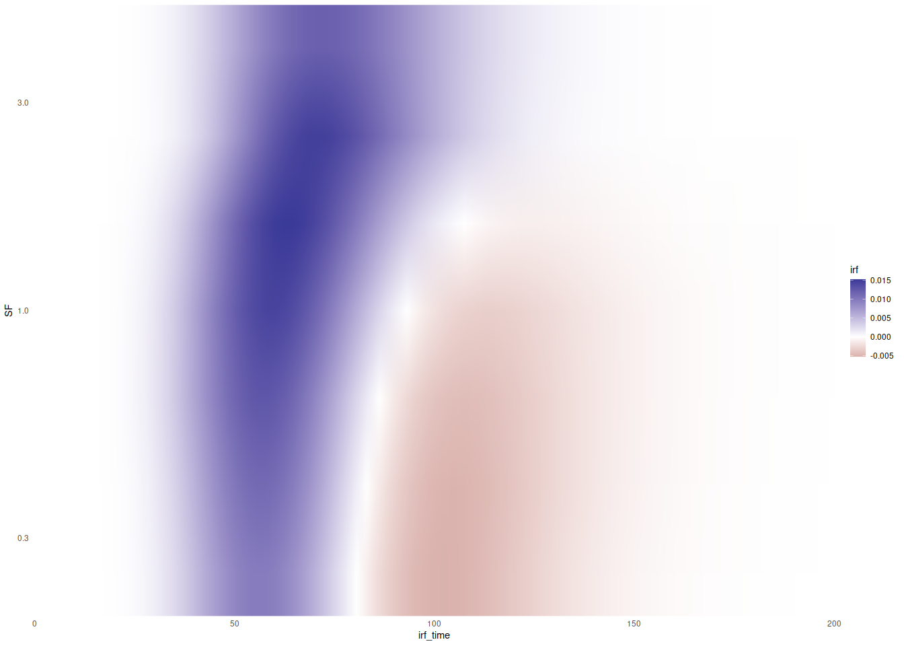<!-- -->

``` r
# plot a few TRFs
ggplot(data = irf_space, aes(x = irf_time, y = irf)) + 
  geom_line(linewidth = 2) + 
  theme_minimal() + SDECTheme() + 
  facet_wrap(~round(SF, 2))
```

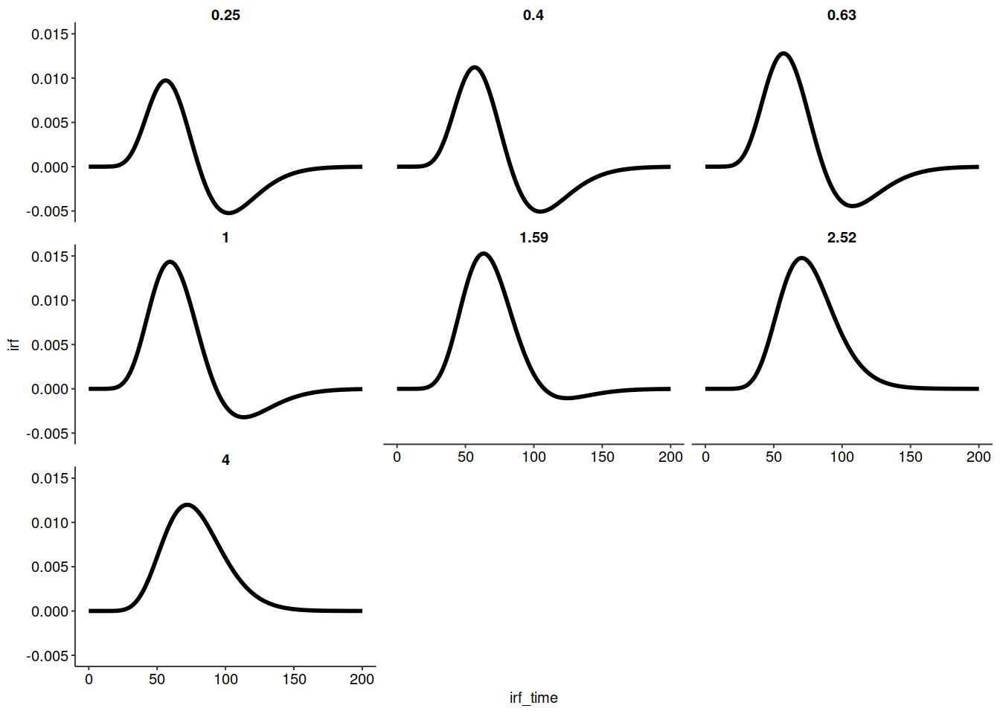<!-- -->

… and the matching Gabor filters. Note that these are the normal Gabors
that we will not use! We will use log-Gabors instead (see further
below).

``` r
source("plot_heatmap.R")
source("get_gabor_field.R")
source("get_gabor_filter_bank.R")
source("get_fft2.R")

# create the Gabor filters
min_SF <- min(SFs)
gabor_list_normal <- get_gabor_filter_bank(
  all_SF = SFs, 
  all_Ori = Oris, # positive means clockwise
  rf_width_override = (1/SFs),# NaN or (1/min_SF) # cpd, set to NaN to let the function determine RF field size
  scr_ppd = scr.ppd, 
  ppd_scaler = 1/spatial_resolution,
  make_gaussian_aperture = TRUE)
# how many have we got?
length(gabor_list_normal)
```

    ## [1] 56

``` r
plot_heatmap(gabor_list_normal[[1]][[1]])
```

    ## Loading required package: reshape2

    ## 
    ## Attaching package: 'reshape2'

    ## The following objects are masked from 'package:data.table':
    ## 
    ##     dcast, melt

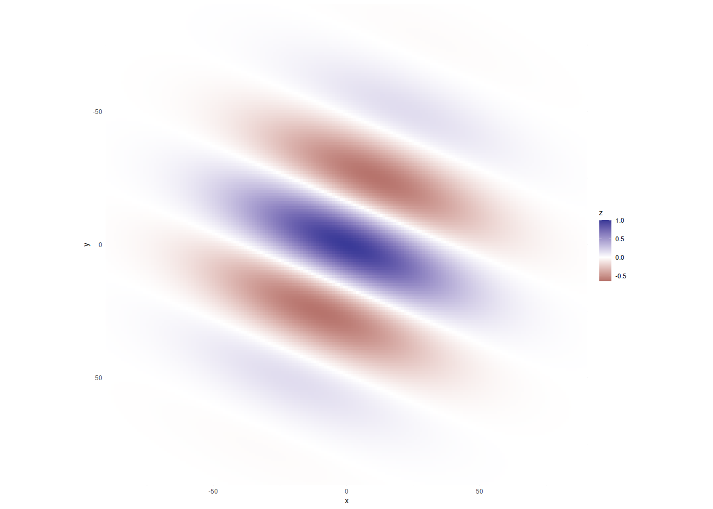<!-- -->

``` r
gabor_list_normal[[1]][[3]]
```

    ##     rf_freq_dva    rf_width_dva        rf_width   rf_mesh_width          rf_ori 
    ##        0.250000        4.000000       60.324704      180.974113       -1.178097 
    ##         scr.ppd      ppd_scaler mesh_resolution 
    ##       15.081176        1.000000        1.000000

``` r
max_mesh_width_normal <- ceiling(gabor_list_normal[[1]][[3]]['rf_mesh_width'])
# are_equal(round(diff(range(as.numeric(dimnames(gabor_list_normal[[1]][[1]])[[1]]))) / scr.ppd), 
#           round(6 * (1/SFs[1]) / 2))

# a sanity check
p_gabor_list_1 <- vector(mode = "list")
p_gabor_list_2 <- vector(mode = "list")
p_gabor_fft <- vector(mode = "list")
for (gi in 1:length(gabor_list_normal)) {
  p_gabor_list_1[[gi]] <- plot_heatmap(mat = gabor_list_normal[[gi]][[1]], 
                                       do_print = FALSE, 
                                       use_xy_limits = c(-max_mesh_width_normal/2, max_mesh_width_normal/2)) + 
    theme(legend.position = "none") + theme_nothing()
  p_gabor_list_2[[gi]] <- plot_heatmap(mat = gabor_list_normal[[gi]][[2]], 
                                       do_print = FALSE, 
                                       use_xy_limits = c(-max_mesh_width_normal/2, max_mesh_width_normal/2)) + 
    theme(legend.position = "none") + theme_nothing()
  # fft:
  gabor_fft <- get_fft2(stim_image_gray = gabor_list_normal[[gi]][[1]], scr.ppd = scr.ppd, pad_image_size = 200)
  p_gabor_fft[[gi]] <- plot_heatmap(mat = gabor_fft[[4]], do_print = FALSE)  + 
    theme(legend.position = "none") + theme_nothing()
  rm(gabor_fft)
}
```

    ## Loading required package: gsignal

    ## 
    ## Attaching package: 'gsignal'

    ## The following objects are masked from 'package:pracma':
    ## 
    ##     conv, detrend, fftshift, findpeaks, ifft, ifftshift

    ## The following objects are masked from 'package:stats':
    ## 
    ##     filter, gaussian, poly

    ## Loading required package: fields

    ## Loading required package: spam

    ## Spam version 2.11-0 (2024-10-03) is loaded.
    ## Type 'help( Spam)' or 'demo( spam)' for a short introduction 
    ## and overview of this package.
    ## Help for individual functions is also obtained by adding the
    ## suffix '.spam' to the function name, e.g. 'help( chol.spam)'.

    ## 
    ## Attaching package: 'spam'

    ## The following object is masked from 'package:Matrix':
    ## 
    ##     det

    ## The following objects are masked from 'package:base':
    ## 
    ##     backsolve, forwardsolve

    ## 
    ## Try help(fields) to get started.

``` r
# plot 1: zero phase
plot_grid(plotlist = p_gabor_list_1, nrow = length(SFs))
```

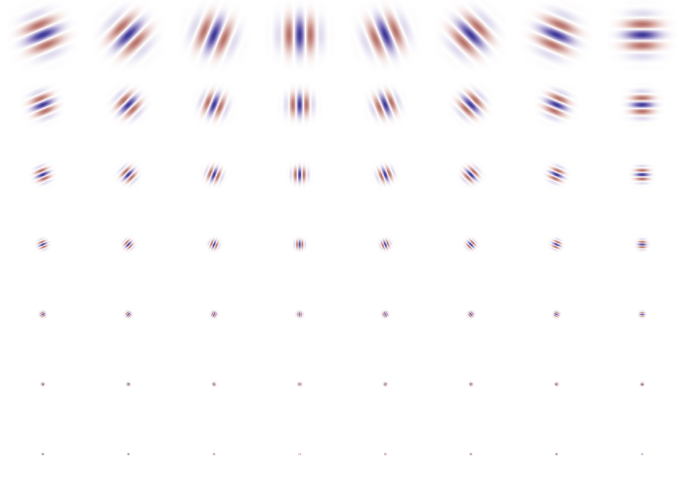<!-- -->

``` r
rm(p_gabor_list_1)
# plot 2: half phase
plot_grid(plotlist = p_gabor_list_2, nrow = length(SFs))
```

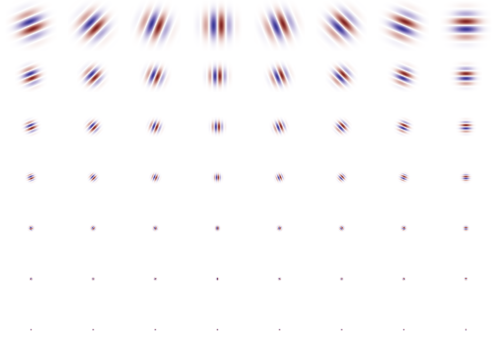<!-- -->

``` r
rm(p_gabor_list_2)
# plot 3: fft
plot_grid(plotlist = p_gabor_fft, nrow = length(SFs))
```

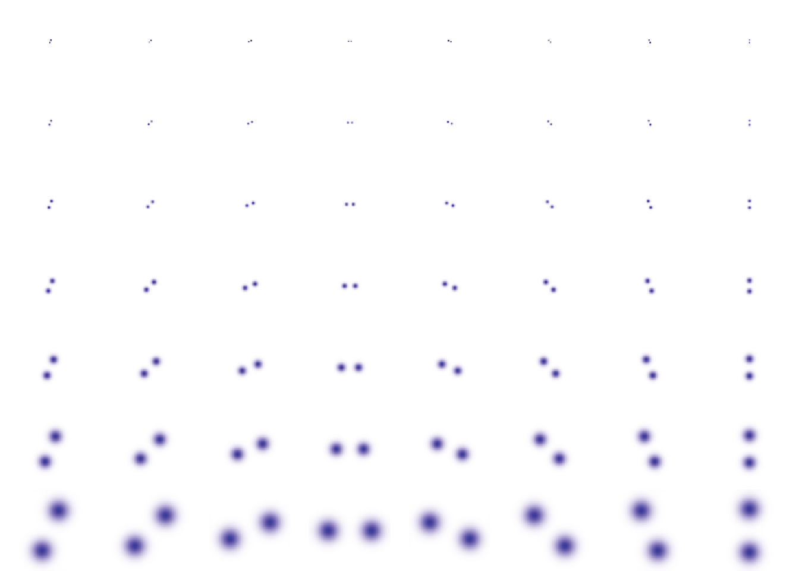<!-- -->

``` r
rm(p_gabor_fft)
```

Now Heiko Schuett’s Gabor function:

``` r
source("get_log_gabor_heiko.R")
source("get_gabor_field_heiko.R")
heiko_SD_scaler <- 8 # have many SD on the Gaussian?

gabor_list_heiko <- get_gabor_filter_bank(
  use_log_gabor_heiko = TRUE,
  all_SF = SFs, 
  all_Ori = Oris, # positive means clockwise
  rf_width_override = (1/SFs) / 2 * heiko_SD_scaler, # let's say eight times the Gaussian SD
  scr_ppd = scr.ppd, 
  ppd_scaler = 1/spatial_resolution,
  make_gaussian_aperture = TRUE)
length(gabor_list_heiko)
```

    ## [1] 56

``` r
## visual comparison of Gabors
max_mesh_width_heiko <- ceiling(max(as.numeric(dimnames(gabor_list_heiko[[1]][[1]])[[1]])))
gabor_comparison_nr <- 4
# Heiko's log-Gabor
gabor_heiko <- gabor_list_heiko[[gabor_comparison_nr]][[1]]
dimnames(gabor_heiko) <- NULL
# the normal Gabor
gabor_normal <- gabor_list_normal[[gabor_comparison_nr]][[1]]
gabor_normal_adj <- matrix(0, nrow = nrow(gabor_heiko), ncol = ncol(gabor_heiko))
gabor_normal_adj[round(nrow(gabor_normal_adj)/2-nrow(gabor_normal)/2):round(nrow(gabor_normal_adj)/2-
                                                                              nrow(gabor_normal)/2+nrow(gabor_normal)-1), 
                 round(ncol(gabor_normal_adj)/2-ncol(gabor_normal)/2):round(ncol(gabor_normal_adj)/2-
                                                                              ncol(gabor_normal)/2+ncol(gabor_normal)-1)] <- 
  gabor_normal
dimnames(gabor_normal_adj) <- NULL
# plot them together
plot_grid(plot_heatmap(gabor_heiko), 
          plot_heatmap(gabor_normal_adj), 
          ncol = 2)
```

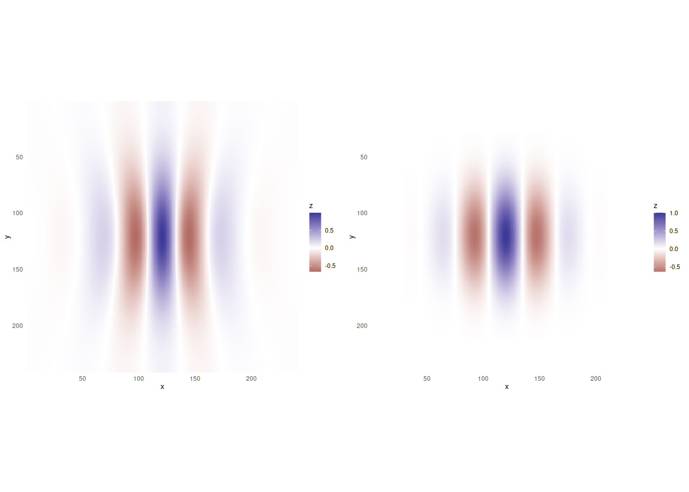<!-- -->

``` r
plot_grid(plot_heatmap(abs(get_fft2(gabor_heiko, scr.ppd = scr.ppd)[[4]])) + 
            geom_vline(xintercept = gabor_list_heiko[[gabor_comparison_nr]][[3]]['rf_freq_dva'], linetype = "dotted", linewidth = 0.4), 
          plot_heatmap(abs(get_fft2(gabor_normal_adj, scr.ppd = scr.ppd)[[4]])) + 
            geom_vline(xintercept = gabor_list_heiko[[gabor_comparison_nr]][[3]]['rf_freq_dva'], linetype = "dotted", linewidth = 0.4), 
          ncol = 2)
```

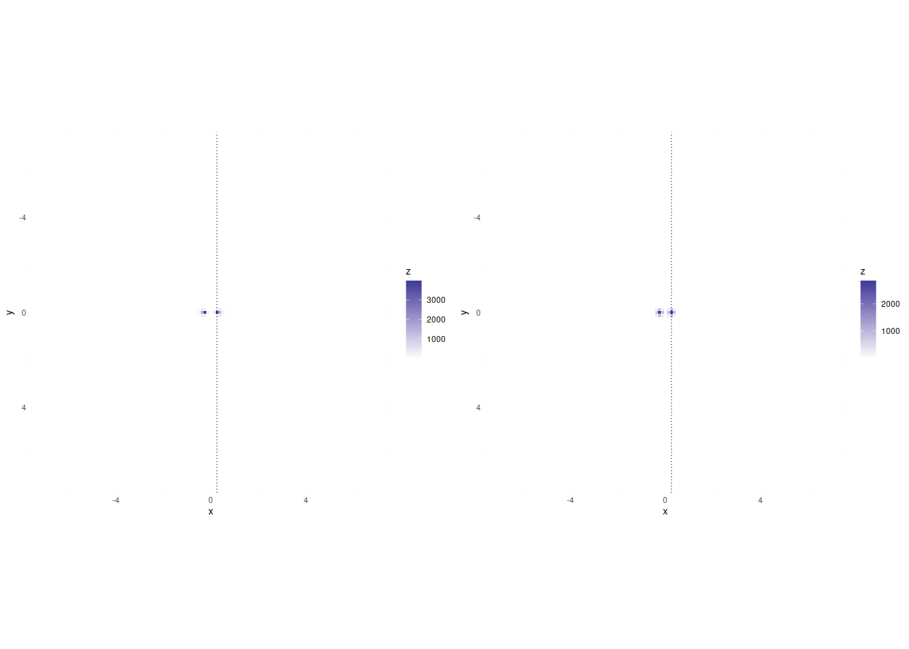<!-- -->

``` r
# Gabor matrix sizes - comparison
rbind(unlist(lapply(X = gabor_list_heiko, FUN = function(x) { nrow(x[[1]]) })), 
      unlist(lapply(X = gabor_list_normal, FUN = function(x) { nrow(x[[1]]) }))
)
```

    ##      [,1] [,2] [,3] [,4] [,5] [,6] [,7] [,8] [,9] [,10] [,11] [,12] [,13] [,14]
    ## [1,]  241  241  241  241  241  241  241  241  153   153   153   153   153   153
    ## [2,]  181  181  181  181  181  181  181  181  115   115   115   115   115   115
    ##      [,15] [,16] [,17] [,18] [,19] [,20] [,21] [,22] [,23] [,24] [,25] [,26]
    ## [1,]   153   153    97    97    97    97    97    97    97    97    61    61
    ## [2,]   115   115    73    73    73    73    73    73    73    73    47    47
    ##      [,27] [,28] [,29] [,30] [,31] [,32] [,33] [,34] [,35] [,36] [,37] [,38]
    ## [1,]    61    61    61    61    61    61    39    39    39    39    39    39
    ## [2,]    47    47    47    47    47    47    29    29    29    29    29    29
    ##      [,39] [,40] [,41] [,42] [,43] [,44] [,45] [,46] [,47] [,48] [,49] [,50]
    ## [1,]    39    39    25    25    25    25    25    25    25    25    15    15
    ## [2,]    29    29    19    19    19    19    19    19    19    19    13    13
    ##      [,51] [,52] [,53] [,54] [,55] [,56]
    ## [1,]    15    15    15    15    15    15
    ## [2,]    13    13    13    13    13    13

``` r
# a sanity check
p_gabor_list_1 <- vector(mode = "list")
p_gabor_list_2 <- vector(mode = "list")
p_gabor_fft <- vector(mode = "list")
for (gi in 1:length(gabor_list_heiko)) {
  p_gabor_list_1[[gi]] <- plot_heatmap(mat = gabor_list_heiko[[gi]][[1]], 
                                       use_xy_limits = c(-max_mesh_width_heiko/2, max_mesh_width_heiko/2), 
                                       do_print = FALSE) + 
    theme(legend.position = "none") + theme_nothing()
  p_gabor_list_2[[gi]] <- plot_heatmap(mat = gabor_list_heiko[[gi]][[2]], 
                                       use_xy_limits = c(-max_mesh_width_heiko/2, max_mesh_width_heiko/2), 
                                       do_print = FALSE) + 
    theme(legend.position = "none") + theme_nothing()
  # fft:
  gabor_fft <- get_fft2(stim_image_gray = gabor_list_heiko[[gi]][[1]], 
                        scr.ppd = scr.ppd, pad_image_size = 512)
  p_gabor_fft[[gi]] <- plot_heatmap(mat = gabor_fft[[4]], do_print = FALSE)  + 
    theme(legend.position = "none") + theme_nothing()
  rm(gabor_fft)
}
# plot 1: zero phase
plot_grid(plotlist = p_gabor_list_1, nrow = length(SFs))
```

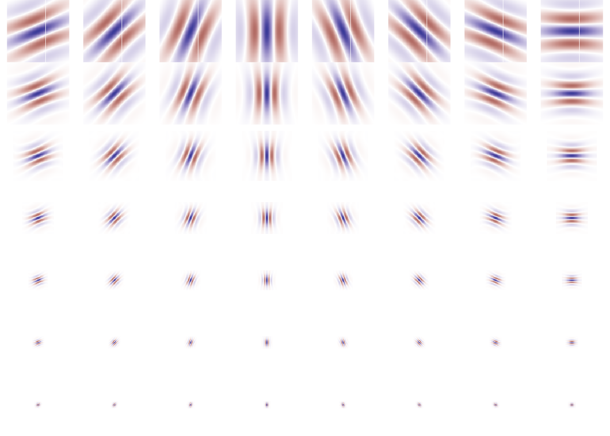<!-- -->

``` r
rm(p_gabor_list_1)
# plot 2: half phase
plot_grid(plotlist = p_gabor_list_2, nrow = length(SFs))
```

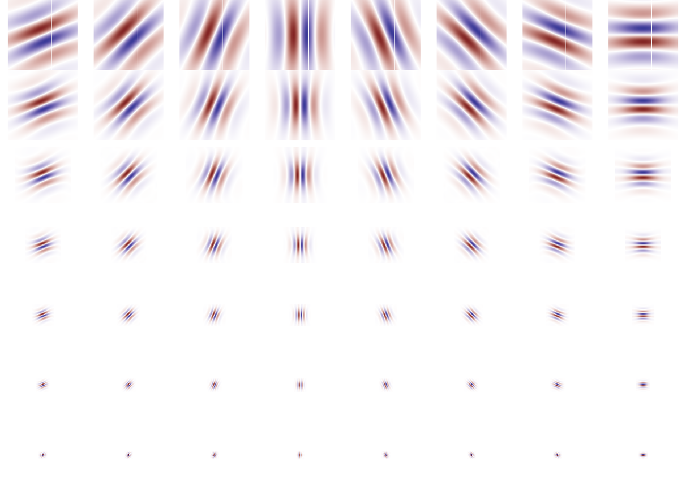<!-- -->

``` r
rm(p_gabor_list_2)
# plot 3: fft
plot_grid(plotlist = p_gabor_fft, nrow = length(SFs))
```

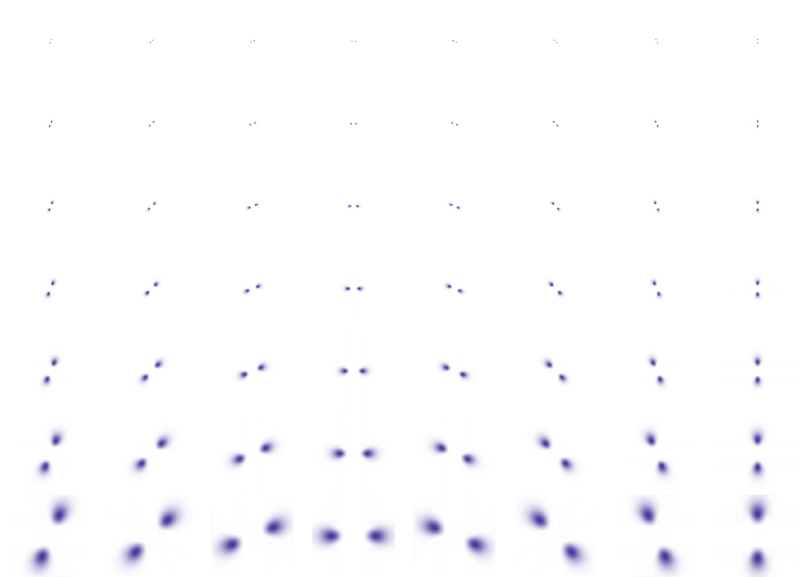<!-- -->

``` r
rm(p_gabor_fft)
```

Heikos RFs get insanely huge at low SFs, if the bandwidth is kept
constant.

First, determine how orientation bandwidth increases with lower SFs…

``` r
# check two Gabor functions
test_seq <- seq(-3, 3, 0.1)# from -3 to 3 dva
meshlist <- meshgrid(x = test_seq, y = test_seq) 
gaussian_aperture_sd <- 0.5
# formula #1
rf_gaussian <- exp(-(meshlist$X^2+meshlist$Y^2) * (1/(2*gaussian_aperture_sd^2)))
dimnames(rf_gaussian) <- list(test_seq, test_seq)
plot_heatmap(rf_gaussian)
```

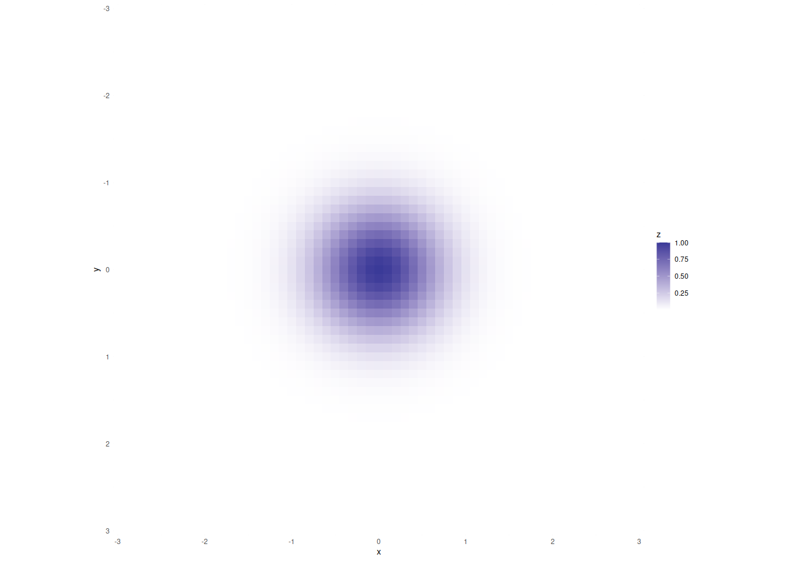<!-- -->

``` r
# formula #2 from Movellan
K <- 1 # scaler of the Gaussian
x0 <- y0 <- 0 # centers of Gaussian
a <- b <- sqrt(1/(2*pi*gaussian_aperture_sd^2)) # "scaling parameters" - this is their relationship to SD
rf_gaussian_2 <- K * exp(-pi * ((a^2)*(meshlist$X-x0)^2+(b^2)*(meshlist$Y-y0)^2))
rf_gaussian_2 <- K * exp(-pi * ((meshlist$X-x0)^2+(meshlist$Y-y0)^2) * (a^2)) # equivalent if a=b, that is, a symmetric Gaussian
dimnames(rf_gaussian_2) <- list(test_seq, test_seq)
plot_heatmap(rf_gaussian_2)
```

<!-- -->

``` r
# now Movellan says that this applies:
C <- sqrt(log(2)/pi)
F0 <- SFs # the SF 
(ori_band <- 2 * atan(b*C/F0))
```

    ## [1] 1.9650488 1.5136110 1.0733637 0.7171578 0.4637033 0.2952993 0.1868451

``` r
# with respect to Gaussian SD
(ori_band_2 <- 2 * atan((sqrt(1/(2*pi*gaussian_aperture_sd^2))*C)/F0) )
```

    ## [1] 1.9650488 1.5136110 1.0733637 0.7171578 0.4637033 0.2952993 0.1868451

``` r
# suppose the sigma is a ratio of the SF (6 SDs per cycle), then we should have constant bandwidth
2 * atan((sqrt(1/(2*pi*(6/F0)^2))*C)/F0) # indeed
```

    ## [1] 0.06244324 0.06244324 0.06244324 0.06244324 0.06244324 0.06244324 0.06244324

``` r
# now: RF sizes according to Anderson & Burr (1986). For the RF width is 2*SD
source("anderson_burr_RF_width.R")
SFs_ext <- c(0.1, SFs, 10)
RF_size_theory <- anderson_burr_RF_width(SFs_ext)
loglog(SFs_ext, RF_size_theory, type = "l")
```

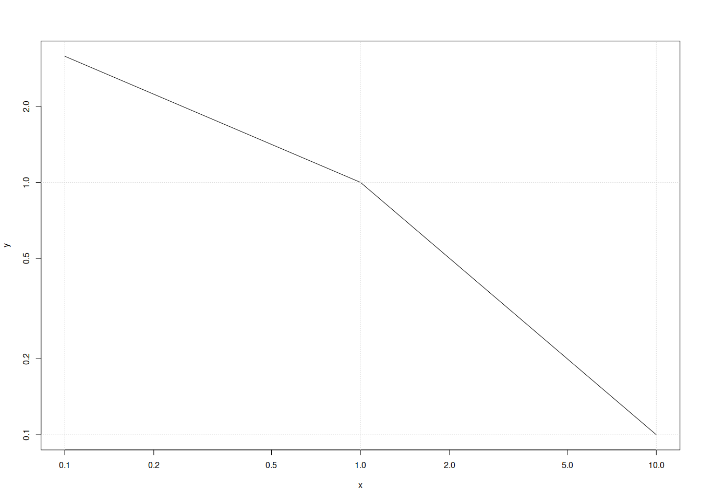<!-- -->

``` r
# now have a look how orientation bandwidth is expected to change according to these RF sizes
source("SD_to_bandwidth_at_half_height.R") # conversion function Gaussian SD <> bandwidth at half height
source("orientation_bandwidth_from_aperture_SD.R")
ori_bandwidth_theory <- orientation_bandwidth_from_aperture_SD(SF = SFs_ext, Gaussian_SD = RF_size_theory/2)
ori_bandwidth_theory/2 # this is the half bandwidth for our SFs and their predicted Gaussian SD
```

    ## [1] 0.8699324 0.6432211 0.5366819 0.4411570 0.3585789 0.3585789 0.3585789
    ## [8] 0.3585789 0.3585789

``` r
rad2deg(ori_bandwidth_theory/2) # ... in degrees
```

    ## [1] 49.84346 36.85385 30.74961 25.27644 20.54506 20.54506 20.54506 20.54506
    ## [9] 20.54506

``` r
semilogx(SFs_ext, rad2deg(ori_bandwidth_theory), type = "l") # thisis extremely similar to Burr & Wijesundra (1991), Figure 1
```

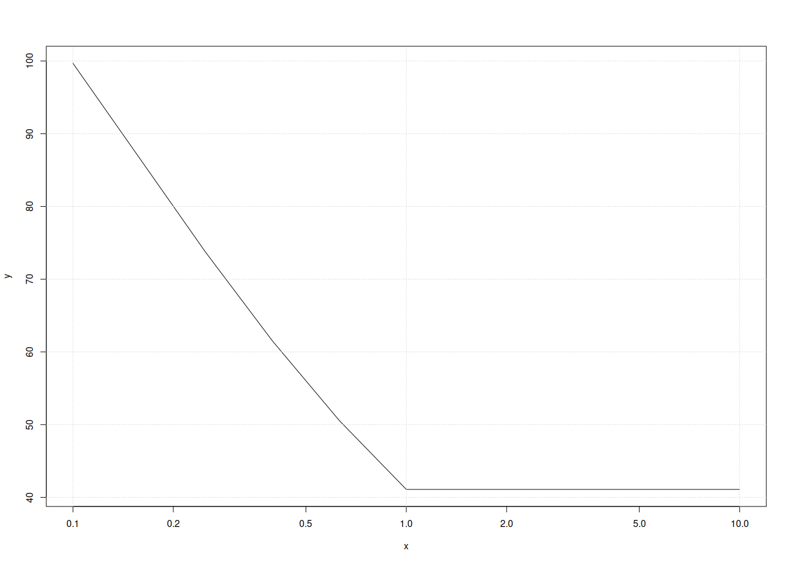<!-- -->

``` r
# now compare these values to the SD used by Heiko, which should translate to 20 deg
rad2deg(SD_to_bandwidth_at_half_height(SD=0.2965)/2) # indeed
```

    ## [1] 20.00208

``` r
# we have bandwidths, so we'll have to convert back to Gaussian SD
SD_to_bandwidth_at_half_height(SD = ori_bandwidth_theory, run_inverse = TRUE) # indeed, very close to 0.2965
```

    ## [1] 0.7388526 0.5463017 0.4558156 0.3746843 0.3045489 0.3045489 0.3045489
    ## [8] 0.3045489 0.3045489

Anderson & Burr (1989) describe how SF-bandwidth changes at low spatial
frequencies, we’ll use that increase the bandwidth as SFs get smaller.

``` r
# RF bandwidths according to Anderson & Burr (1989)
source("anderson_burr_SF_bandwidth.R")
# 0.5945 is the SD value in octaves described in Heikos paper
SFs_ext_2 <- c(0.03, SFs_ext)
SF_SD_theory <- anderson_burr_SF_bandwidth(SFs_ext_2, 
                                           bw_minimum = 0.5945) # 0.5945 is an SD, SHOULD NOT BE USED like this
# INSTEAD, convert to bandwidth before supplying it to the function
SF_band_theory <- anderson_burr_SF_bandwidth(SFs_ext_2, 
                                             bw_minimum = SD_to_bandwidth_at_half_height(0.5945)) # full bandwidth
# check that the function gives the correct bandwidth at 0.03 cpd (anderson & Burr, 1989)
# the have a full bandwidth of 1.5 at SFs > 2 cpd, we now use 1.4, because that's what Heiko gets (see below)
# we should arrive at ~3 octaves
semilogx(SFs_ext_2, anderson_burr_SF_bandwidth(SF = SFs_ext_2, bw_minimum = 1.4, do_plot = TRUE), type = "l") 
```

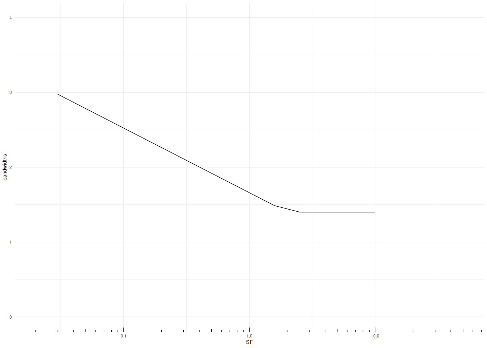<!-- -->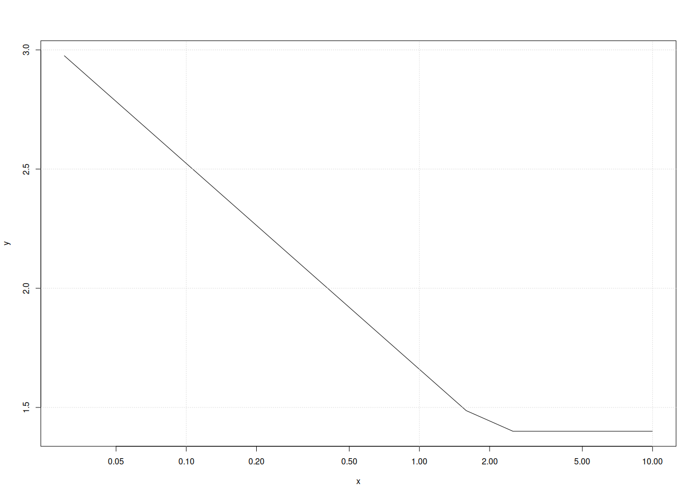<!-- -->

``` r
# sanity check: convert Heikos SD for SF bandwidth (0.5945 octaves) to half bandwidth at half height
SD_to_bandwidth_at_half_height(0.5945)/2 # indeed, it should be ~0.7 octaves
```

    ## [1] 0.6999703

``` r
SD_to_bandwidth_at_half_height(0.7*2, run_inverse = TRUE) # also the inverse works
```

    ## [1] 0.5945253

``` r
# convert to Gaussian SD (as used in Heiko's paper) from half bandwidth at half height
SF_SDtoband_theory <- SD_to_bandwidth_at_half_height(SF_SD_theory)
rbind(SF_band_theory, 
      SF_SDtoband_theory) # compare these two, the upper is correct
```

    ##                        [,1]     [,2]     [,3]     [,4]     [,5]     [,6]
    ## SF_band_theory     2.975253 2.523642 2.179941 2.006607 1.833274 1.659941
    ## SF_SDtoband_theory 5.109518 4.046055 3.236700 2.828531 2.420363 2.012194
    ##                        [,7]     [,8]     [,9]    [,10]
    ## SF_band_theory     1.486607 1.399941 1.399941 1.399941
    ## SF_SDtoband_theory 1.604025 1.399941 1.399941 1.399941

``` r
semilogx(SFs_ext_2, SF_SDtoband_theory, type = "l") # this is WRONG!
```

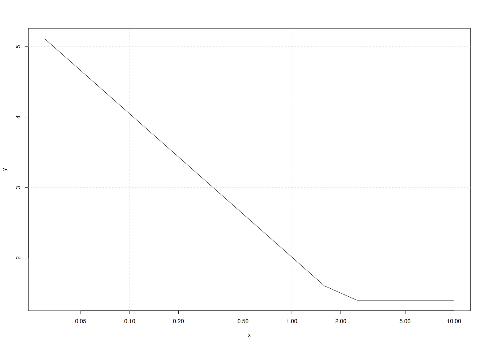<!-- -->

Now create new set of log Gabor filters with increased bandwidth at low
SFs:

``` r
heiko_SD_scaler_2 <- 8 * 2 # times two to avoid strange edges artifacts 
                           # resulting from the underdetermination of the filters
gabor_list_heiko_2 <- get_gabor_filter_bank(
  use_log_gabor_heiko = TRUE,
  use_log_gabor_SF_band_adjustment = TRUE, # use SF adjustment (default: FALSE)
  use_log_gabor_orientation_band_adjustment = TRUE, # use Ori adjustment (default: FALSE)
  all_SF = SFs, 
  all_Ori = Oris, # positive means clockwise
  #rf_width_override = (1/SFs) / 2 * heiko_SD_scaler_2, # let's say eight times the Gaussian SD
  rf_width_override = anderson_burr_RF_width(SFs) / 2 * heiko_SD_scaler_2,
  scr_ppd = scr.ppd, 
  ppd_scaler = 1/spatial_resolution,
  make_gaussian_aperture = TRUE)
length(gabor_list_heiko_2)
```

    ## [1] 56

``` r
# for plotting
max_mesh_width_heiko_2 <- ceiling(max(as.numeric(dimnames(gabor_list_heiko_2[[1]][[1]])[[1]])))

# final Gabor matrix sizes - comparison
rbind(unlist(lapply(X = gabor_list_heiko, FUN = function(x) { nrow(x[[1]]) })), 
      unlist(lapply(X = gabor_list_heiko_2, FUN = function(x) { nrow(x[[1]]) })), 
      unlist(lapply(X = gabor_list_normal, FUN = function(x) { nrow(x[[1]]) }))
)
```

    ##      [,1] [,2] [,3] [,4] [,5] [,6] [,7] [,8] [,9] [,10] [,11] [,12] [,13] [,14]
    ## [1,]  241  241  241  241  241  241  241  241  153   153   153   153   153   153
    ## [2,]  241  241  241  241  241  241  241  241  193   193   193   193   193   193
    ## [3,]  181  181  181  181  181  181  181  181  115   115   115   115   115   115
    ##      [,15] [,16] [,17] [,18] [,19] [,20] [,21] [,22] [,23] [,24] [,25] [,26]
    ## [1,]   153   153    97    97    97    97    97    97    97    97    61    61
    ## [2,]   193   193   153   153   153   153   153   153   153   153   121   121
    ## [3,]   115   115    73    73    73    73    73    73    73    73    47    47
    ##      [,27] [,28] [,29] [,30] [,31] [,32] [,33] [,34] [,35] [,36] [,37] [,38]
    ## [1,]    61    61    61    61    61    61    39    39    39    39    39    39
    ## [2,]   121   121   121   121   121   121    77    77    77    77    77    77
    ## [3,]    47    47    47    47    47    47    29    29    29    29    29    29
    ##      [,39] [,40] [,41] [,42] [,43] [,44] [,45] [,46] [,47] [,48] [,49] [,50]
    ## [1,]    39    39    25    25    25    25    25    25    25    25    15    15
    ## [2,]    77    77    49    49    49    49    49    49    49    49    31    31
    ## [3,]    29    29    19    19    19    19    19    19    19    19    13    13
    ##      [,51] [,52] [,53] [,54] [,55] [,56]
    ## [1,]    15    15    15    15    15    15
    ## [2,]    31    31    31    31    31    31
    ## [3,]    13    13    13    13    13    13

``` r
# look at the adjusted log Gabors (2nd row) !

# a final sanity check
p_gabor_list_1 <- vector(mode = "list")
p_gabor_list_2 <- vector(mode = "list")
p_gabor_fft <- vector(mode = "list")
for (gi in 1:length(gabor_list_heiko)) {
  p_gabor_list_1[[gi]] <- plot_heatmap(mat = gabor_list_heiko_2[[gi]][[1]], 
                                       use_xy_limits = c(-max_mesh_width_heiko/2, max_mesh_width_heiko/2), 
                                       do_print = FALSE) + 
    theme(legend.position = "none") + theme_nothing()
  p_gabor_list_2[[gi]] <- plot_heatmap(mat = gabor_list_heiko_2[[gi]][[2]], 
                                       use_xy_limits = c(-max_mesh_width_heiko/2, max_mesh_width_heiko/2), 
                                       do_print = FALSE) + 
    theme(legend.position = "none") + theme_nothing()
  # fft:
  gabor_fft <- get_fft2(stim_image_gray = gabor_list_heiko_2[[gi]][[1]], 
                        scr.ppd = scr.ppd, pad_image_size = 512)
  p_gabor_fft[[gi]] <- plot_heatmap(mat = gabor_fft[[4]], do_print = FALSE)  + 
    theme(legend.position = "none") + theme_nothing()
  rm(gabor_fft)
}
# plot 1: zero phase
plot_grid(plotlist = p_gabor_list_1, nrow = length(SFs))
```

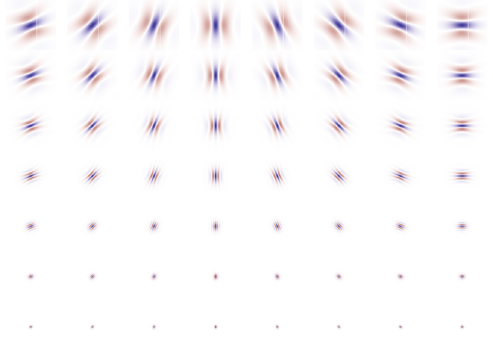<!-- -->

``` r
rm(p_gabor_list_1)
# plot 2: half phase
plot_grid(plotlist = p_gabor_list_2, nrow = length(SFs))
```

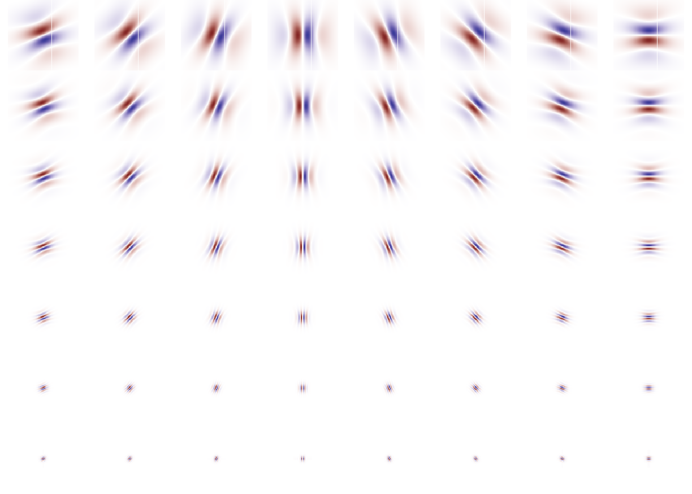<!-- -->

``` r
rm(p_gabor_list_2)
# plot 3: fft
plot_grid(plotlist = p_gabor_fft, nrow = length(SFs))
```

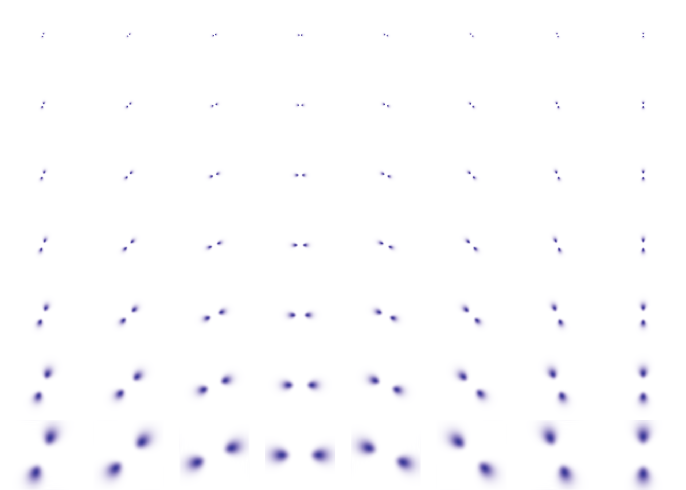<!-- -->

``` r
rm(p_gabor_fft)
```

Now try delayed normalization model

``` r
source("normSum.R")

# assume a certain stimulus
t_dn <- seq(0, 1000, by = temporal_resolution)
stim_dn <- rep(0, times = length(t_dn))
stim_dn[t_dn >= 10 & t_dn <= 310] <- 1

# V1 params for Iris Groens model:
prm.tau1 = 0.03 # see Figure 10 of https://doi.org/10.1523/JNEUROSCI.1812-21.2022
prm.weight = 0.4
prm.tau2 = 0.75/3
prm.sigma = 0.07
prm.n = 1.4
# get Iris Groen's gamma fun (see supplemented code: https://github.com/irisgroen/temporalECoG)
gammaPDF <- function(x, tau, n) {
  y = (x / tau)^(n-1) * exp(-x / tau) / (tau*factorial(n - 1))
  y = y / sum(y)
  return(y)
}
irf_dn_time <- seq(0, 1000, by = temporal_resolution)
irf_pos = gammaPDF(irf_dn_time/1000, prm.tau1, 2)
irf_neg = gammaPDF(irf_dn_time/1000, prm.tau1*1.5, 2)
iris_groen_irf = normSum(irf_pos - prm.weight * irf_neg)

# get Iris Groen's declining exponential function - the low-pass filter
iris_groen_irf_norm = normSum(exp(-((irf_dn_time/1000)/prm.tau2)))

iris_groen_df <- data.table(time = irf_dn_time, 
                            irf = iris_groen_irf, 
                            lp = iris_groen_irf_norm)
# gamma pdf
ggplot(data = iris_groen_df, aes(x = time, y = irf)) + 
  geom_line(linewidth = 2) + 
  theme_minimal() + SDECTheme()
```

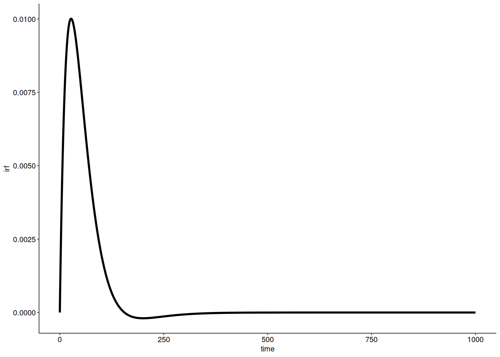<!-- -->

``` r
# exponential
ggplot(data = iris_groen_df, aes(x = time, y = lp)) + 
  geom_line(linewidth = 2) + 
  theme_minimal() + SDECTheme()
```

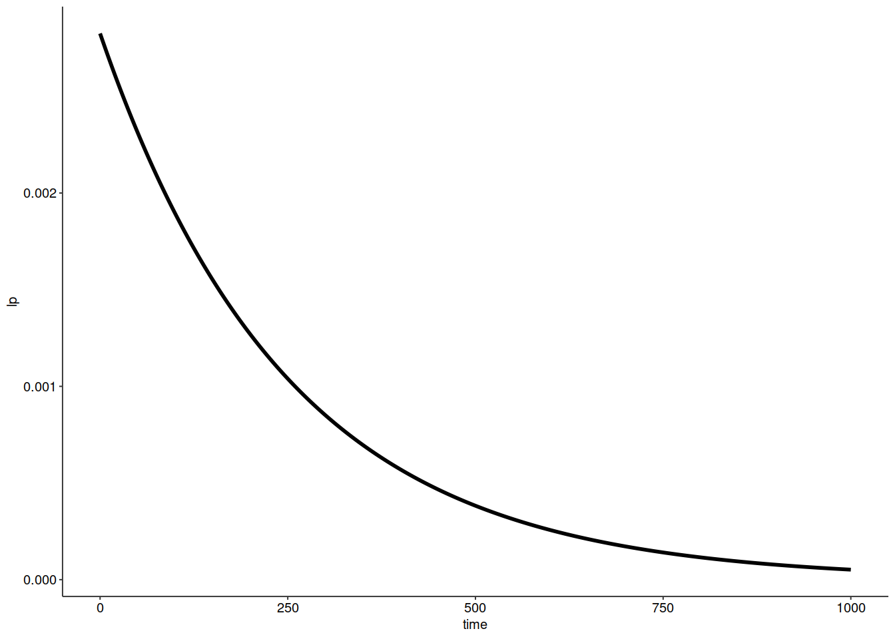<!-- -->

``` r
# plot Gaussian lowpass, as well
gaussian_lowpass <- data.table(time = seq(-3, 3, 0.05))
gaussian_lowpass[ , lp := dnorm(time, 0, 0.5)]
ggplot(data = gaussian_lowpass, aes(x = time, y = lp)) + 
  geom_line(linewidth = 2) + 
  theme_minimal() + SDECTheme()
```

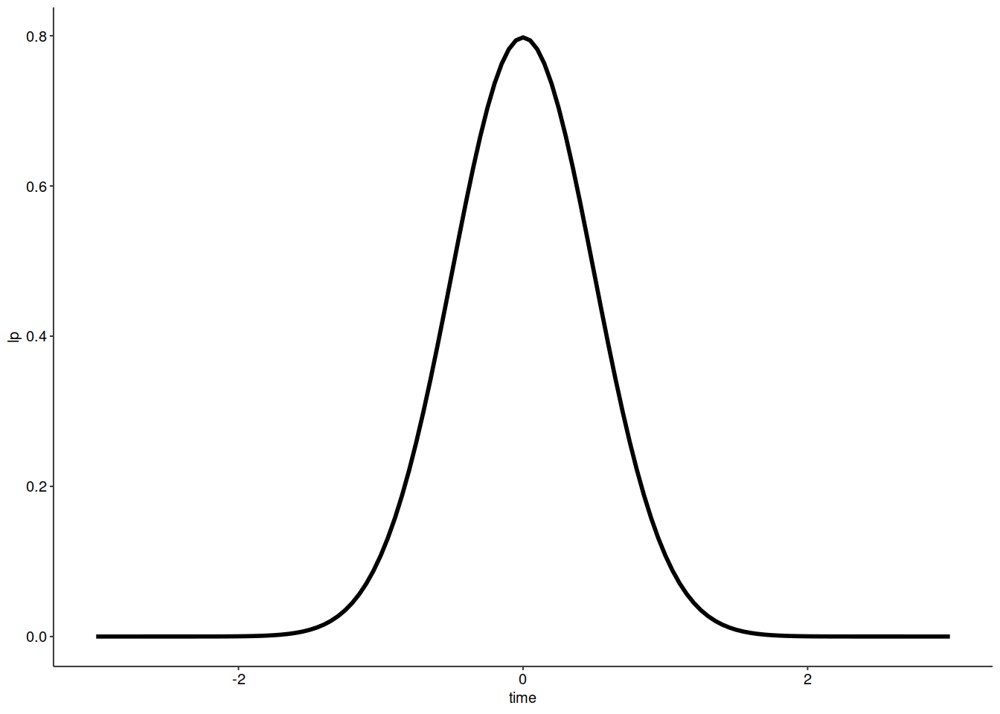<!-- -->

``` r
# 1st convolution + exponentiation
convoluted_iris <- zapsmall(convolve(stim_dn, rev(iris_groen_irf), type = "open"))[1:length(stim_dn)]
convoluted_iris_exp <- abs(convoluted_iris)^prm.n
# 2nd convolution with low-pass filter + exponentiation
convoluted_iris_lowpass <- zapsmall(convolve(convoluted_iris, rev(iris_groen_irf_norm), type = "open"))[1:length(stim_dn)]
convoluted_iris_lowpass_exp <- abs(convoluted_iris_lowpass)^prm.n

# normalization
normalized_iris <- convoluted_iris_exp / ((prm.sigma^prm.n) + convoluted_iris_lowpass_exp)

# plot result
plot(t_dn, stim_dn, type = "l")
lines(t_dn, convoluted_iris_exp, col = "red")
lines(t_dn, convoluted_iris_lowpass_exp, col = "blue")
lines(t_dn, normalized_iris / max(normalized_iris), col = "green")
```

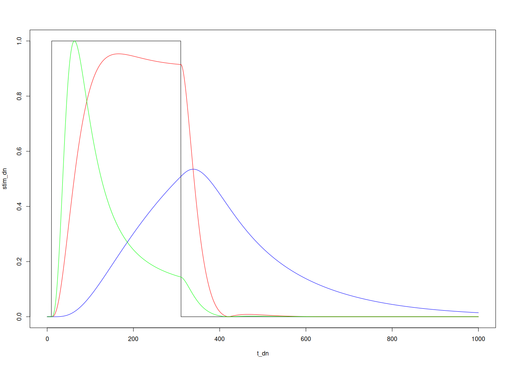<!-- -->

Plot the normalization pool…

``` r
SF_ori_grid <- data.table(expand.grid(SF = exp(seq(log(min(SFs))-0.5, log(max(SFs))+0.5, length.out = 100)), 
                                      Ori = seq(min(Oris), max(Oris), length.out = 100)))
SF_ori_grid[ , SF_rel := log2(1/SF) ]
SF_ori_grid[ , Ori_rel := pi/8 - Ori ]
SF_ori_grid[ , z := normSum(dnorm(SF_rel, sd = 1))*normSum(dnorm(Ori_rel, sd = 0.2008))]

ggplot(data = SF_ori_grid, aes(x = Ori_rel, y = SF_rel, fill = z)) + 
  geom_raster(interpolate = TRUE) + 
  theme_minimal() + SDECTheme() + 
  coord_cartesian(expand = FALSE, xlim = c(-pi/2+pi/8, pi/2-pi/8)) + 
  scale_fill_gradient2(low = "white", high = "black")
```

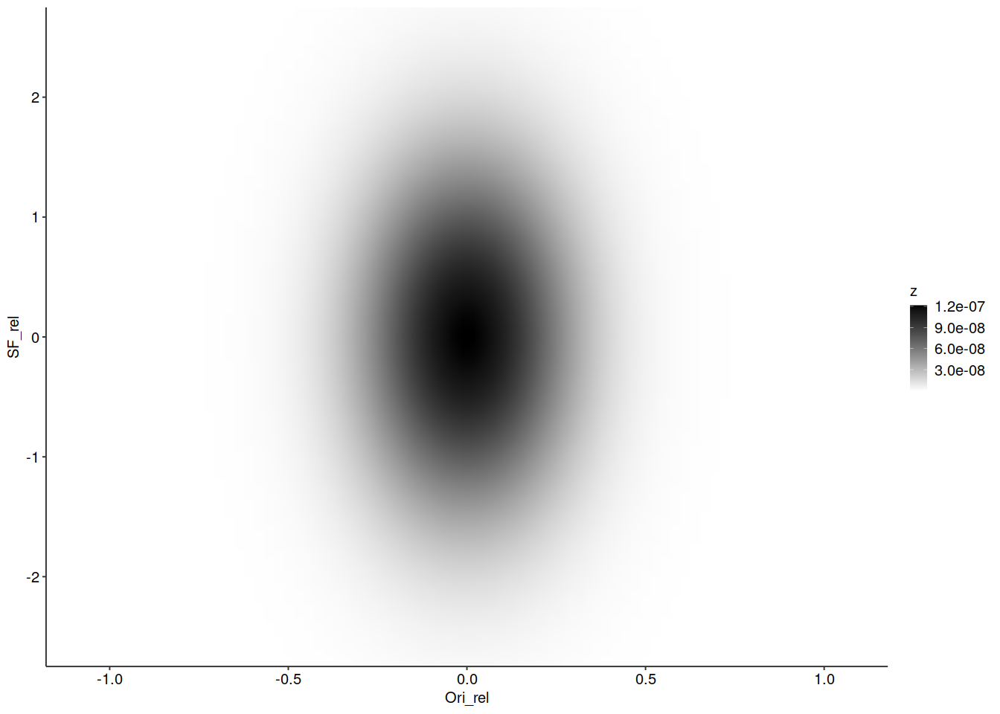<!-- -->

``` r
ggplot(data = SF_ori_grid, aes(x = Ori_rel, y = SF_rel, fill = z)) + 
  geom_contour(aes(z = z), linewidth = 2, color = "black", bins = 10) + 
  theme_minimal() + SDECTheme() + 
  coord_cartesian(expand = TRUE, xlim = c(-pi/2+pi/8, pi/2-pi/8)) + 
  scale_fill_viridis_c(option = "mako")
```

    ## Warning: The following aesthetics were dropped during statistical transformation: fill.
    ## ℹ This can happen when ggplot fails to infer the correct grouping structure in
    ##   the data.
    ## ℹ Did you forget to specify a `group` aesthetic or to convert a numerical
    ##   variable into a factor?

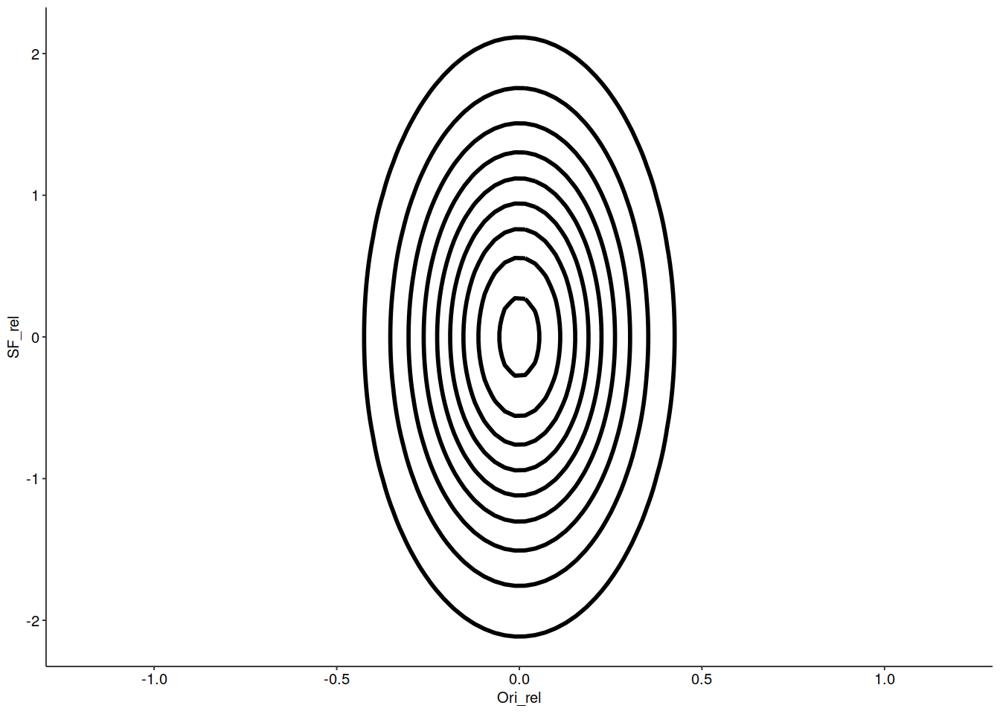<!-- -->

# Test the model

Now load a random stimulus from SDEC and create arbitrary trajectory

``` r
do_pad_and_extrapolate <- TRUE
source("load_noise_patch.R")
all_noise_patch_paths <- dir("stimuli_matrices", pattern = "*.csv")
# load them all
all_noise_patches <- vector(mode = "list", length = length(all_noise_patch_paths))
all_noise_patches_descriptions <- vector(mode = "list", length = length(all_noise_patch_paths))
all_noise_patch_plots <- vector(mode = "list", length = length(all_noise_patch_paths))
for (noise_patch_path_i in 1:length(all_noise_patch_paths)) {
  noise_patch_path <- all_noise_patch_paths[noise_patch_path_i]
  all_noise_patches[[noise_patch_path_i]] <- load_noise_patch(stim_name = noise_patch_path)
  # extrapolate to reduce edge effects?
  if (do_pad_and_extrapolate) {
    source("pad_and_extrapolate.R")
    future_noise <- pad_and_extrapolate(x = all_noise_patches[[noise_patch_path_i]])
    all_noise_patches[[noise_patch_path_i]] <- future_noise # overwrite with new version
  }
  all_noise_patch_plots[[noise_patch_path_i]] <- plot_heatmap(mat = all_noise_patches[[noise_patch_path_i]]) + 
    ggtitle(noise_patch_path)
  
  # extra: get fft spectrum of noise patch
  noise_patch_fft <- get_fft2(stim_image_gray = all_noise_patches[[noise_patch_path_i]], 
                              scr.ppd = scr.ppd, 
                              pad_image_size = 5000, downsample_factor = 1)
  noise_patch_fft_df <- noise_patch_fft[[1]]
  setDT(noise_patch_fft_df)
  noise_patch_fft_df[ , rf_freq_dva_round := round(rf_freq_dva, 3)]
  noise_patch_fft_df_freq <- noise_patch_fft_df[ , .(log_power = mean(log(power)) ), 
                                                 by = .(rf_freq_dva_round)]
  noise_patch_fft_df_freq[ , max_pow := max(log_power[rf_freq_dva_round>0.3])]
  noise_patch_fft_df_freq[ , freq_max_pow := noise_patch_fft_df_freq[log_power==max_pow, rf_freq_dva_round]]
  noise_patch_fft_df_freq[ , db_max_pow := 10*log10(exp(log_power)/exp(max_pow))]
  noise_patch_fft_df_freq[ , pow_above_3db := db_max_pow >= (-3)]
  ggplot(noise_patch_fft_df_freq, aes(x = rf_freq_dva_round, y = db_max_pow, color = pow_above_3db)) +
    geom_point() + scale_color_viridis_d() + coord_cartesian(xlim = c(0, 2))
  # search the cutoffs
  noise_patch_fft_df_freq <- noise_patch_fft_df_freq[order(rf_freq_dva_round)]
  # ... for low
  where_i = which(noise_patch_fft_df_freq$rf_freq_dva_round==noise_patch_fft_df_freq$freq_max_pow)
  while (noise_patch_fft_df_freq$pow_above_3db[where_i]) {
    where_i <- where_i - 1
  }
  low_cutoff <- noise_patch_fft_df_freq$rf_freq_dva_round[where_i]
  # ... for high
  where_i = which(noise_patch_fft_df_freq$rf_freq_dva_round==noise_patch_fft_df_freq$freq_max_pow)
  while (noise_patch_fft_df_freq$pow_above_3db[where_i]) {
    where_i <- where_i + 1
  }
  high_cutoff <- noise_patch_fft_df_freq$rf_freq_dva_round[where_i]
  
  all_noise_patches_descriptions[[noise_patch_path_i]] <- 
    noise_patch_fft_df_freq[pow_above_3db==TRUE,
                            .(high_cutoff = high_cutoff, 
                              low_cutoff = low_cutoff, 
                              max_pow = unique(freq_max_pow))]
}
```

    ## Loading required package: smoothie

``` r
plot_grid(plotlist = all_noise_patch_plots, align = "hv")
```

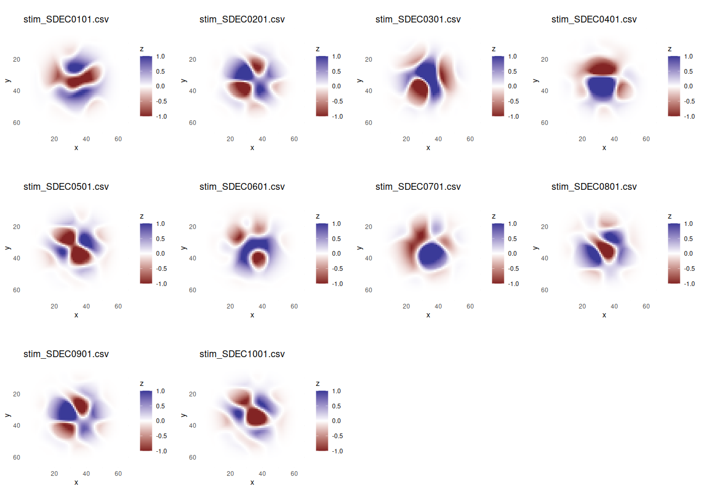<!-- -->

``` r
# what's the size of the noise patch?
dim(load_noise_patch(stim_name = noise_patch_path)) / scr.ppd
```

    ## [1] 3.381699 3.381699

``` r
sti.sd * 6 # this is their specified size
```

    ## [1] 3.36

``` r
# create data table from list and make summar
all_noise_patches_descriptions <- rbindlist(all_noise_patches_descriptions)
all_noise_patches_descriptions
```

    ##     high_cutoff low_cutoff max_pow
    ##           <num>      <num>   <num>
    ##  1:       1.036      0.290   0.641
    ##  2:       1.084      0.331   0.691
    ##  3:       1.014      0.262   0.680
    ##  4:       0.801      0.174   0.435
    ##  5:       1.089      0.386   0.794
    ##  6:       1.132      0.475   0.783
    ##  7:       0.806      0.194   0.475
    ##  8:       1.130      0.438   0.781
    ##  9:       1.049      0.370   0.691
    ## 10:       1.082      0.461   0.794

``` r
all_noise_patches_descriptions_agg <- 
  all_noise_patches_descriptions[ , .(high_cutoff = mean(high_cutoff), 
                                      low_cutoff = mean(low_cutoff), 
                                      max_pow = mean(max_pow), 
                                      high_cutoff_sd = sd(high_cutoff), 
                                      low_cutoff_sd = sd(low_cutoff), 
                                      max_pow_sd = sd(max_pow)
                                      )]
all_noise_patches_descriptions_agg
```

    ##    high_cutoff low_cutoff max_pow high_cutoff_sd low_cutoff_sd max_pow_sd
    ##          <num>      <num>   <num>          <num>         <num>      <num>
    ## 1:      1.0223     0.3381  0.6765      0.1211895     0.1069719  0.1293112

``` r
# clean up
rm(noise_patch_fft, noise_patch_fft_df, noise_patch_fft_df_freq, 
   low_cutoff, high_cutoff, where_i)
```

Gotta try something:

``` r
# what's the dimension of a noise patch?
try_noise_patch <- load_noise_patch(stim_name = noise_patch_path)
dim(try_noise_patch)
```

    ## [1] 51 51

``` r
# make three Gabors, using the wrong monitor specs
try_gabors <- get_gabor_filter_bank(all_SF = c(0.25, 0.5, 1.0), 
                                    all_Ori = c(0), 
                                    use_log_gabor_heiko = FALSE,
                                    make_gaussian_aperture = TRUE, 
                                    scr_ppd = monitor.screen_ppd_old, 
                                    rf_width_override = 0.5*2)
dimnames(try_gabors[[1]][[2]]) <- NULL
dimnames(try_gabors[[2]][[2]]) <- NULL
dimnames(try_gabors[[3]][[2]]) <- NULL
gabor_sum <- try_gabors[[1]][[2]]+try_gabors[[2]][[2]]+try_gabors[[3]][[2]]
plot_grid(
  plot_heatmap(try_noise_patch), 
  plot_heatmap(try_gabors[[1]][[2]]), 
  plot_heatmap(try_gabors[[2]][[2]]), 
  plot_heatmap(try_gabors[[3]][[2]]), 
  plot_heatmap(gabor_sum), 
  nrow = 1, align = "hv")
```

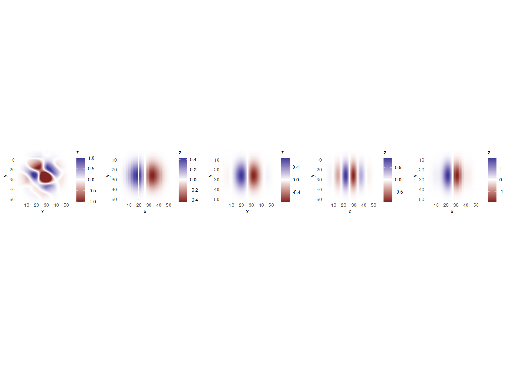<!-- -->

``` r
# see the spectrum of these Gabors
for (gabor_i in 1:3) {
  gabor_1_fft <- get_fft2(stim_image_gray = try_gabors[[gabor_i]][[2]], 
                          scr.ppd =  scr.ppd, 
                          pad_image_size = 1000, downsample_factor = 1)
  print(gabor_1_fft[[1]]$rf_freq_dva[gabor_1_fft[[1]]$power==max(gabor_1_fft[[1]]$power)])
  p_gabor_1_fft <- ggplot(gabor_1_fft[[1]], aes(x = rf_ori, y = rf_freq_dva, color = (power) )) + 
    geom_point() + scale_color_viridis_c() + coord_cartesian(expand=FALSE, ylim = c(0, 2))
  print(p_gabor_1_fft)
}
```

    ## [1] 0.3092561

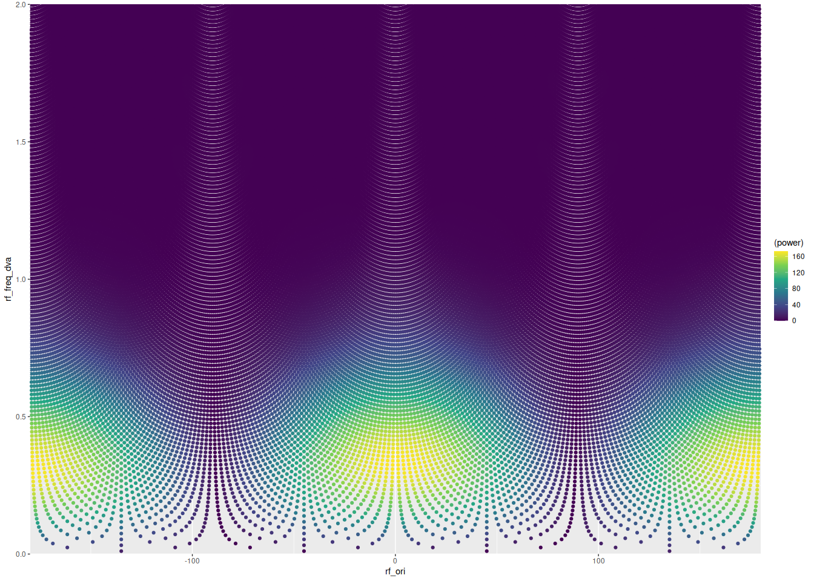<!-- -->

    ## [1] 0.4600377

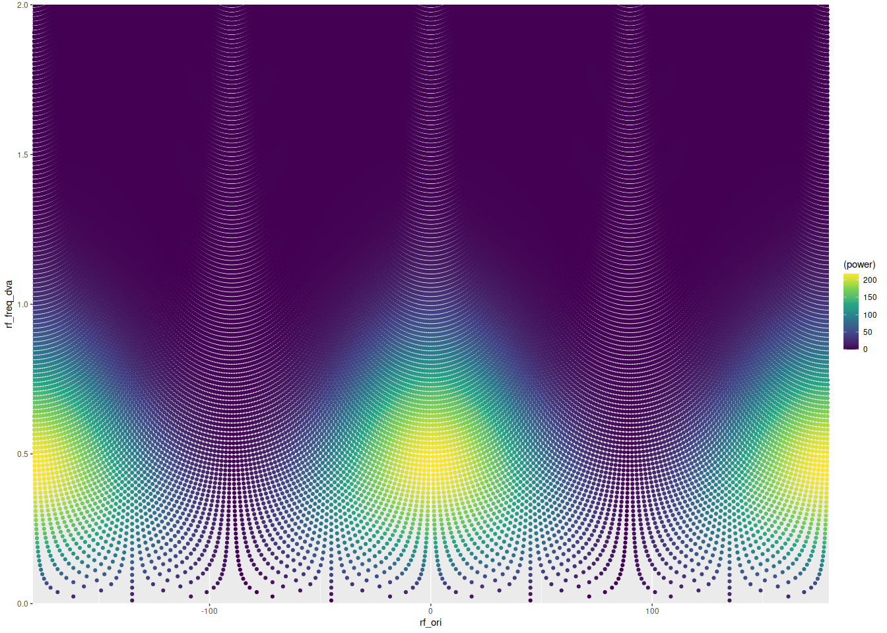<!-- -->

    ## [1] 0.8973617

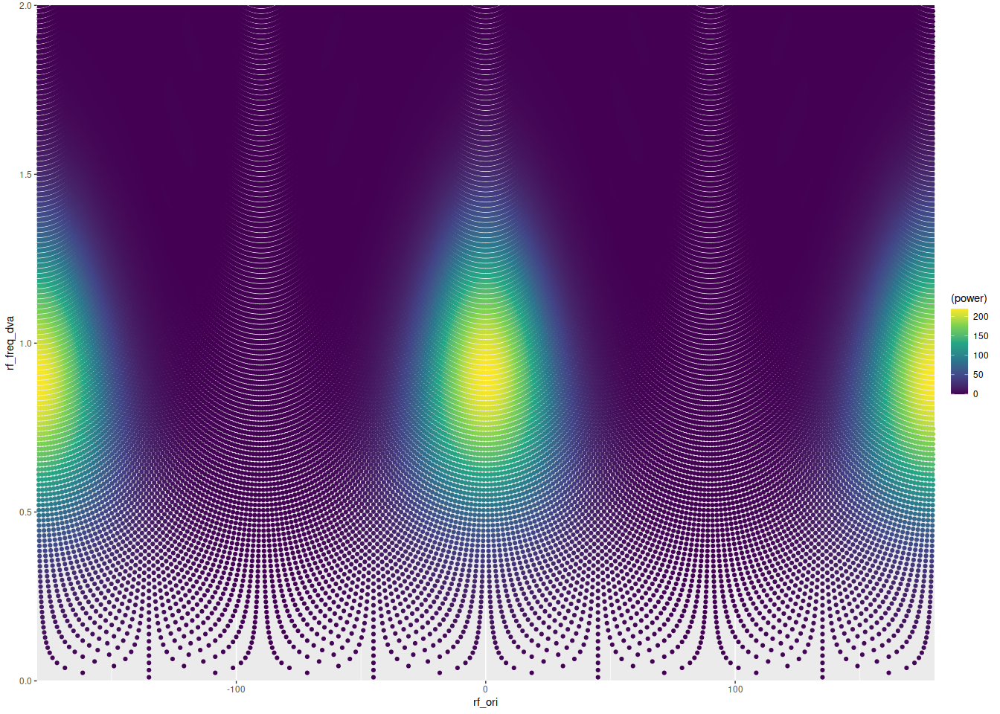<!-- -->

``` r
gabor_sum_fft <- get_fft2(stim_image_gray = gabor_sum, 
                          scr.ppd = scr.ppd, 
                          pad_image_size = 1000, downsample_factor = 1)
print(gabor_sum_fft[[1]]$rf_freq_dva[gabor_sum_fft[[1]]$power==max(gabor_sum_fft[[1]]$power)])
```

    ## [1] 0.4600377

``` r
p_gabor_sum_fft <- ggplot(gabor_sum_fft[[1]], aes(x = rf_ori, y = rf_freq_dva, color = (power) )) + 
  geom_point() + scale_color_viridis_c() + coord_cartesian(expand=FALSE, ylim = c(0, 2))
print(p_gabor_sum_fft)
```

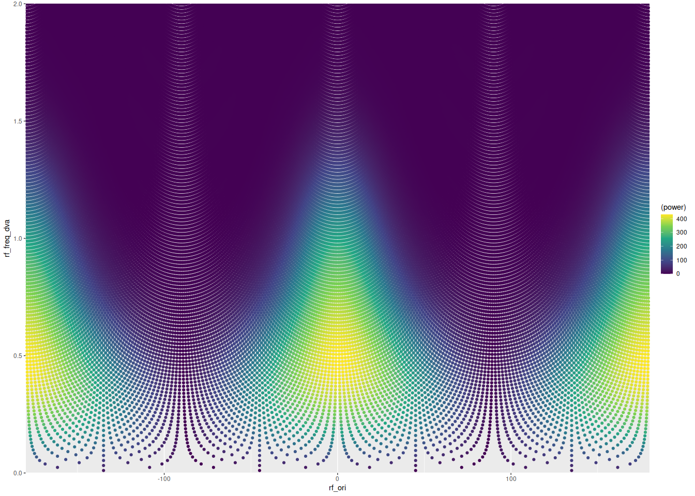<!-- -->

``` r
gabor_noise_fft <- get_fft2(stim_image_gray = try_noise_patch, 
                          scr.ppd = scr.ppd, 
                          pad_image_size = 1000, downsample_factor = 1)
print(gabor_noise_fft[[1]]$rf_freq_dva[gabor_noise_fft[[1]]$power==max(gabor_noise_fft[[1]]$power)])
```

    ## [1] 0.8110953

``` r
p_gabor_noise_fft <- ggplot(gabor_noise_fft[[1]], aes(x = rf_ori, y = rf_freq_dva, color = (power) )) + 
  geom_point() + scale_color_viridis_c() + coord_cartesian(expand=FALSE, ylim = c(0, 2))
print(p_gabor_noise_fft)
```

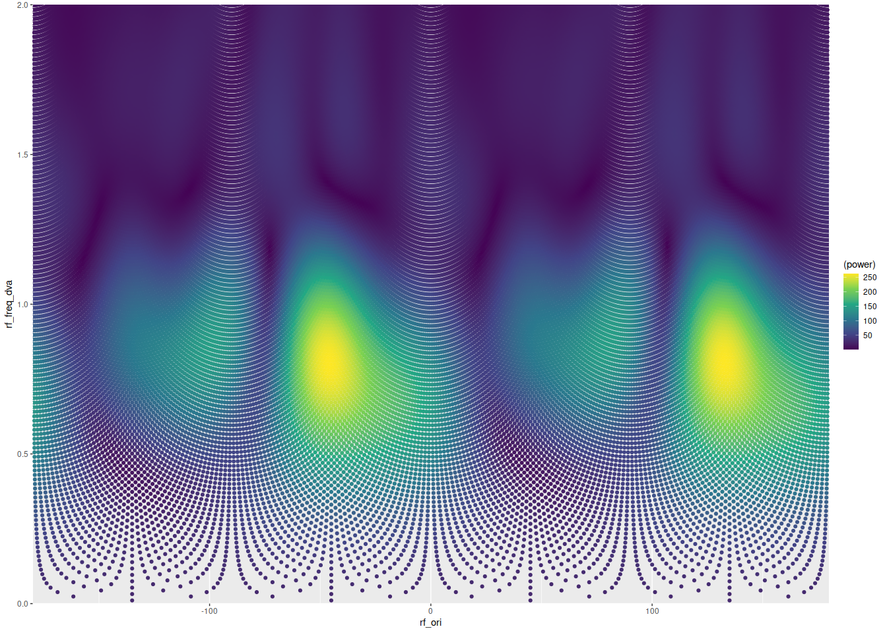<!-- -->

This is the model:

``` r
# to debug:
# signal_x = x_stim_traj[200:250]
# signal_y = y_stim_traj[200:250]
# signal_t = t_stim_traj[200:250]
# gabor_list = gabor_list_heiko
# irf_df = irf_space
# stim_mat = all_noise_patches[[1]]


# source the two spatial convolution functions here:
source("standard_conv_with_torch_3d.R")
source("fft_conv_with_torch_3d.R")
source("plot_heatmap.R")
source("temporal_conv_kelly_fft.R")
source("kelly_vel.R")
source("resample_yxt.R")

# this is the V1 module
source("v1.R")
```

Simulate very primitive model output…

``` r
normMax <- function(x) { x / max(x) }
rotate <- function(x) t(apply(x, 2, rev)) # https://stackoverflow.com/questions/16496210/rotate-a-matrix-in-r-by-90-degrees-clockwise
# some data
t_primitive <- seq(0, 100)
primitive_xy <- data.table(t = t_primitive, 
                           x = rev(5*cumsum(normMax(dnorm(x = t_primitive, mean = 50, sd = 50/4)))), 
                           y = rev(1/5*cumsum(normMax(dnorm(x = t_primitive, mean = 50, sd = 50/4)))) )
plot(primitive_xy$t, primitive_xy$x)
```

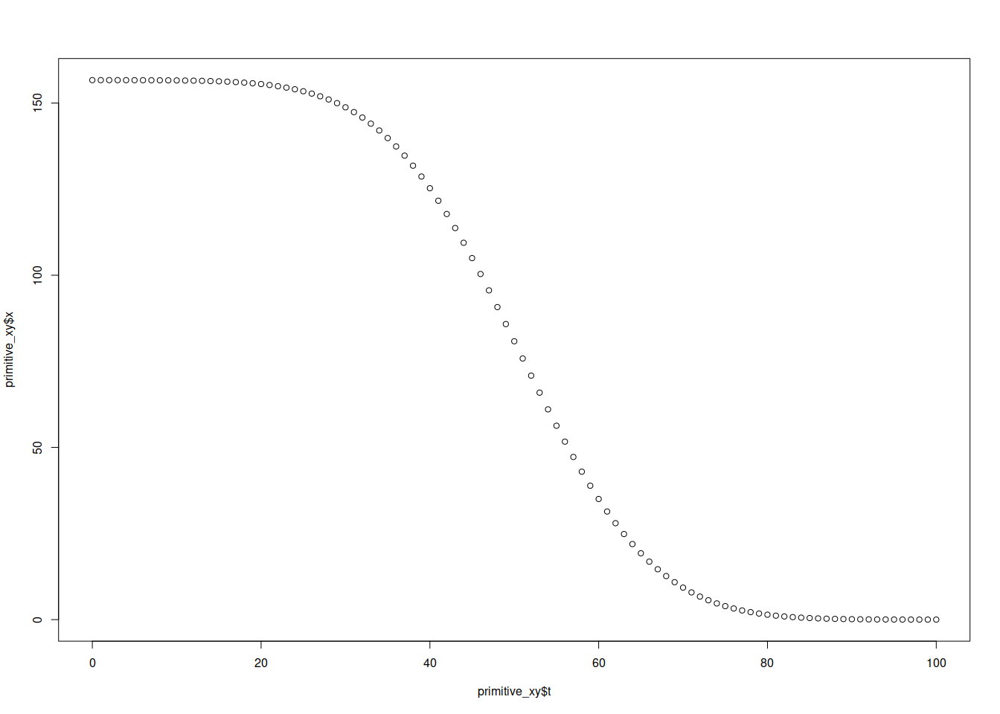<!-- -->

``` r
# make a subset of the heiko log Gabors
primitive_SFs <-  SFs[3:5]
primitive_Oris <- Oris#[6:8]
gabor_list_heiko_primitive <- get_gabor_filter_bank(
  use_log_gabor_heiko = TRUE,
  use_log_gabor_SF_band_adjustment = TRUE, # use SF adjustment (default: FALSE)
  use_log_gabor_orientation_band_adjustment = TRUE, # use Ori adjustment (default: FALSE)
  all_SF = primitive_SFs, 
  all_Ori = primitive_Oris, # positive means clockwise
  #rf_width_override = (1/SFs) / 2 * heiko_SD_scaler_2, # let's say eight times the Gaussian SD
  rf_width_override = anderson_burr_RF_width(primitive_SFs) / 2 * heiko_SD_scaler_2,
  scr_ppd = scr.ppd, 
  ppd_scaler = 1/spatial_resolution,
  make_gaussian_aperture = TRUE)
length(gabor_list_heiko_primitive)
```

    ## [1] 24

``` r
# get corresponding TRF
primitive_irf_space <- irf_space[is.element(SF, primitive_SFs)]
table(primitive_irf_space$SF, useNA = "ifany")
```

    ## 
    ## 0.629960524947437                 1   1.5874010519682 
    ##               289               289               289

``` r
# visual processing
v1_primitive <- v1(stim_mat = all_noise_patches[[8]], # the noise patch as a matrix
                gabor_list = gabor_list_heiko_primitive, # a list of gabor filters created by 'get_gabor_filter_bank'
                irf_df = primitive_irf_space, # a data.frame of IRFs resolved in SF x time created by 'get_IRF_df'
                signal_x = primitive_xy$x, 
                signal_y = primitive_xy$y, 
                signal_t = primitive_xy$t, # properties of the signal (relative to saccade onset)
                output_full_sequences = TRUE, # TRUE: returns complete sequences. WARNING: this is memory-intense
                signal_x_range = NULL, signal_y_range = NULL, signal_t_range = NULL, # the min and max of temporal scale
                no_CUDA = FALSE, # set to TRUE if you want to use CPU instead of GPU (but torch)
                use_half_precision = FALSE, # if a GPU is available, use half-precision?
                spatial_resolution = spatial_resolution, # spatial resolution of processing function in dva
                temporal_resolution = temporal_resolution, # temporal resolution of processing function in milliseconds
                use_normalization_pool = TRUE, # use normalization pool?
                debug_mode = FALSE, # shows output at every step
                show_final_maps = TRUE,  # shows all resulting 2D maps at the end
                final_maps_filename = "v1_primitive.pdf" # name of the pdf file if show_final_maps==TRUE
)
```

    ## [1] "dim(mat_over_t) = 139,289,433 [y,x,t]"
    ## [1] "Gabor filter 1 of 24, SF=0.63, Ori=-1.18"
    ## standard 2D convolution: 1.131 sec elapsed
    ## Temporal conv and low-pass: 0.28 sec elapsed
    ## [1] "Gabor filter 2 of 24, SF=0.63, Ori=-0.79"
    ## standard 2D convolution: 1.117 sec elapsed
    ## Temporal conv and low-pass: 0.273 sec elapsed
    ## [1] "Gabor filter 3 of 24, SF=0.63, Ori=-0.39"
    ## standard 2D convolution: 1.053 sec elapsed
    ## Temporal conv and low-pass: 0.278 sec elapsed
    ## [1] "Gabor filter 4 of 24, SF=0.63, Ori=0"
    ## standard 2D convolution: 1.079 sec elapsed
    ## Temporal conv and low-pass: 0.589 sec elapsed
    ## [1] "Gabor filter 5 of 24, SF=0.63, Ori=0.39"
    ## standard 2D convolution: 1.113 sec elapsed
    ## Temporal conv and low-pass: 0.26 sec elapsed
    ## [1] "Gabor filter 6 of 24, SF=0.63, Ori=0.79"
    ## standard 2D convolution: 1.083 sec elapsed
    ## Temporal conv and low-pass: 0.257 sec elapsed
    ## [1] "Gabor filter 7 of 24, SF=0.63, Ori=1.18"
    ## standard 2D convolution: 1.031 sec elapsed
    ## Temporal conv and low-pass: 0.422 sec elapsed
    ## [1] "Gabor filter 8 of 24, SF=0.63, Ori=1.57"
    ## standard 2D convolution: 1.036 sec elapsed
    ## Temporal conv and low-pass: 0.256 sec elapsed
    ## [1] "Gabor filter 9 of 24, SF=1, Ori=-1.18"
    ## standard 2D convolution: 0.651 sec elapsed
    ## Temporal conv and low-pass: 0.273 sec elapsed
    ## [1] "Gabor filter 10 of 24, SF=1, Ori=-0.79"
    ## standard 2D convolution: 0.642 sec elapsed
    ## Temporal conv and low-pass: 0.399 sec elapsed
    ## [1] "Gabor filter 11 of 24, SF=1, Ori=-0.39"
    ## standard 2D convolution: 0.654 sec elapsed
    ## Temporal conv and low-pass: 0.26 sec elapsed
    ## [1] "Gabor filter 12 of 24, SF=1, Ori=0"
    ## standard 2D convolution: 0.635 sec elapsed
    ## Temporal conv and low-pass: 0.259 sec elapsed
    ## [1] "Gabor filter 13 of 24, SF=1, Ori=0.39"
    ## standard 2D convolution: 0.634 sec elapsed
    ## Temporal conv and low-pass: 0.419 sec elapsed
    ## [1] "Gabor filter 14 of 24, SF=1, Ori=0.79"
    ## standard 2D convolution: 0.644 sec elapsed
    ## Temporal conv and low-pass: 0.25 sec elapsed
    ## [1] "Gabor filter 15 of 24, SF=1, Ori=1.18"
    ## standard 2D convolution: 0.64 sec elapsed
    ## Temporal conv and low-pass: 0.253 sec elapsed
    ## [1] "Gabor filter 16 of 24, SF=1, Ori=1.57"
    ## standard 2D convolution: 0.643 sec elapsed
    ## Temporal conv and low-pass: 0.392 sec elapsed
    ## [1] "Gabor filter 17 of 24, SF=1.59, Ori=-1.18"
    ## standard 2D convolution: 0.262 sec elapsed
    ## Temporal conv and low-pass: 0.244 sec elapsed
    ## [1] "Gabor filter 18 of 24, SF=1.59, Ori=-0.79"
    ## standard 2D convolution: 0.268 sec elapsed
    ## Temporal conv and low-pass: 0.252 sec elapsed
    ## [1] "Gabor filter 19 of 24, SF=1.59, Ori=-0.39"
    ## standard 2D convolution: 0.276 sec elapsed
    ## Temporal conv and low-pass: 0.407 sec elapsed
    ## [1] "Gabor filter 20 of 24, SF=1.59, Ori=0"
    ## standard 2D convolution: 0.274 sec elapsed
    ## Temporal conv and low-pass: 0.262 sec elapsed
    ## [1] "Gabor filter 21 of 24, SF=1.59, Ori=0.39"
    ## standard 2D convolution: 0.263 sec elapsed
    ## Temporal conv and low-pass: 0.261 sec elapsed
    ## [1] "Gabor filter 22 of 24, SF=1.59, Ori=0.79"
    ## standard 2D convolution: 0.266 sec elapsed
    ## Temporal conv and low-pass: 0.401 sec elapsed
    ## [1] "Gabor filter 23 of 24, SF=1.59, Ori=1.18"
    ## standard 2D convolution: 0.264 sec elapsed
    ## Temporal conv and low-pass: 0.273 sec elapsed
    ## [1] "Gabor filter 24 of 24, SF=1.59, Ori=1.57"
    ## standard 2D convolution: 0.262 sec elapsed
    ## Temporal conv and low-pass: 0.256 sec elapsed
    ## [1] "Performing normalization using normalization pool..."
    ## Normalization of responses (filter 1 of 24): 0.995 sec elapsed
    ## Normalization of responses (filter 2 of 24): 1.044 sec elapsed
    ## Normalization of responses (filter 3 of 24): 1.092 sec elapsed
    ## Normalization of responses (filter 4 of 24): 1.07 sec elapsed
    ## Normalization of responses (filter 5 of 24): 0.96 sec elapsed
    ## Normalization of responses (filter 6 of 24): 1.156 sec elapsed
    ## Normalization of responses (filter 7 of 24): 0.919 sec elapsed
    ## Normalization of responses (filter 8 of 24): 1.218 sec elapsed
    ## Normalization of responses (filter 9 of 24): 0.972 sec elapsed
    ## Normalization of responses (filter 10 of 24): 1.583 sec elapsed
    ## Normalization of responses (filter 11 of 24): 1.007 sec elapsed
    ## Normalization of responses (filter 12 of 24): 0.937 sec elapsed
    ## Normalization of responses (filter 13 of 24): 1.138 sec elapsed
    ## Normalization of responses (filter 14 of 24): 0.928 sec elapsed
    ## Normalization of responses (filter 15 of 24): 1.223 sec elapsed
    ## Normalization of responses (filter 16 of 24): 0.978 sec elapsed
    ## Normalization of responses (filter 17 of 24): 1.185 sec elapsed
    ## Normalization of responses (filter 18 of 24): 0.938 sec elapsed
    ## Normalization of responses (filter 19 of 24): 1.218 sec elapsed
    ## Normalization of responses (filter 20 of 24): 1.06 sec elapsed
    ## Normalization of responses (filter 21 of 24): 1.271 sec elapsed
    ## Normalization of responses (filter 22 of 24): 1.402 sec elapsed
    ## Normalization of responses (filter 23 of 24): 1.071 sec elapsed
    ## Normalization of responses (filter 24 of 24): 1.361 sec elapsed
    ## [1] "Plotting..."

    ## Loading required package: gridExtra

    ## [1] "Done."
    ## [1] "Resulting dim(final_2d_over_filters) = 24,139,289 [y,x,t]"

``` r
do <- torch_tensor(v1_primitive[[4]])
do <- do$nansum(dim = 1)
do_max <- as.numeric(do$max())
do_time_indeces <- seq(50, 240, 10)
do_plots <- vector(mode = "list", length = length(do_time_indeces))
for (do_i in 1:length(do_time_indeces)) {
  do_plots[[do_i]] <- plot_heatmap(mat = as_array(do[ , , do_time_indeces[do_i]]), 
                                   use_viridis = TRUE, use_limits = c(0, do_max*3/4)) + 
    theme(legend.position = "none")
}
plot_grid(plotlist = do_plots, align = "hv")
```

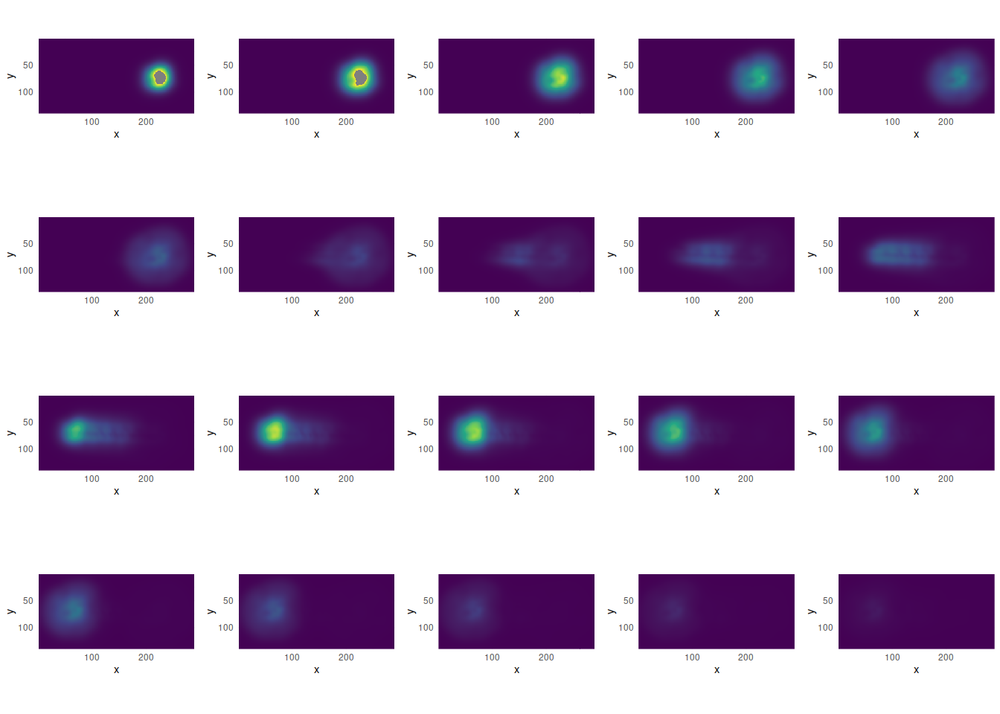<!-- -->

``` r
# clean up
rm(v1_primitive)
```

Now get all saccade data …

``` r
# do the preprocessing of saccades again? if so, set to TRUE:
do_overwrite_all_saccades <- FALSE

if (!file.exists("all_saccades.rda") || do_overwrite_all_saccades) { # process all saccades again? (slow)
  
  source("five_point_smoother.R")
  source("resample_signal_df.R")
  
  # this is the path to the cleaned eye+EEG data
  path_to_saccade_data <- "/home/richard/Seafile/Intrasaccadic VEPs/SDEC/SDEC DATA/Data"
  load(file = file.path(path_to_saccade_data, "SDEC_data_cleaned_rej2.rda"))
  rm(SDEC_eeg, SDEC_eeg_event, SDEC_eeg_timings, SDEC_data, sdec2)
  
  # go through all trials and extract primary saccade
  setkeyv(SDEC_sac_raw, "ID")
  setkeyv(sdec, "ID")
  all_IDs <- unique(sdec$ID) 
  are_equal(sort(all_IDs), sort(unique(SDEC_sac_raw$ID))) # make sure everything is complete
  do_fits <- FALSE
  assert_that(do_fits == FALSE) # code not prepared for fits (anymore)
  if (do_fits) {
    source("compressed_exp.R")
    source("harmonic_osc.R")
    saccade_params <- vector(mode = "list", length = length(all_IDs))
  } else {
    all_saccades <- vector(mode = "list", length = length(all_IDs))
  }
  # go through all trials
  for (id_i in 1:length(all_IDs)) {
    # get data 
    id <- all_IDs[id_i]
    trial <- sdec[.(id)]
    assert_that(nrow(trial)==1)
    sac <- SDEC_sac_raw[.(id)]
    assert_that(nrow(sac)>100)
    sac[ , time_sac_on := time - trial$primary_onset]
    sac[ , time_sac_off := time - trial$primary_offset]
    sac[ , time_stim_on := time - trial$stim_on_time]
    sac[ , time_secondary_on := time - trial$secondary_onset]
    # extract and add factors
    if (any(is.na(sac$time_secondary_on))) {
      sac <- sac[time_sac_on>=(-100) & time_sac_on<=120]
    } else {
      sac <- sac[time_sac_on>=(-100) & time_secondary_on<=(-5)]
    }
    sac[ , start_left_f := trial$start_left_f]
    sac[ , streak_present_f := trial$streak_present_f]
    sac[ , move_direction_f := trial$move_direction_f]
    # apply smoothing
    sac[ , X := five_point_smoother(X)]
    sac[ , Y := five_point_smoother(Y)]
    # upsample
    #  plot(sac$time_sac_on, sac$X)
    sac <- resample_signal_df(df = sac, 
                              time_col = "time", 
                              id_cols = c("ID", "subj_id", "session_id", "start_left_f", "streak_present_f", "move_direction_f"), 
                              constant_cols = c(),
                              signal_cols = c("X", "Y", "PUPIL"), 
                              linear_cols = c("time_cue_on", "time_stim_on", "time_sac_on", "time_sac_off"), 
                              new_samp_rate = monitor.fps, 
                              plot_results = FALSE, debug_mode = FALSE)
    #  points(sac$time_sac_on, sac$X, col = "red")
    assert_that(round(median(diff(sac$time), na.rm = TRUE), 3)==round(temporal_resolution, 3))
    # for replay: get stimulus position over time
    stim_on_here <- which.min(abs(sac$time_stim_on))
    stim_frames <- round(trial$stim_dur*1000/temporal_resolution)
    assert_that(stim_frames==36) # this is always the case
    setDT(sac)
    # static stimulus:
    sac[ , static_stim_x := trial$stim_pos_x_start]
    sac[ , static_stim_y := trial$stim_pos_y_start]
    # moving stimulus:
    sac[1:stim_on_here, stim_x := trial$stim_pos_x_start]
    sac[1:stim_on_here, stim_y := trial$stim_pos_y_start]
    sac[ , stim_moving := FALSE]
    sac[stim_on_here:(stim_on_here+stim_frames-1), 
        stim_moving := TRUE]
    sac[stim_on_here:(stim_on_here+stim_frames-1), 
        stim_x := seq(trial$stim_pos_x_start, trial$stim_pos_x_final, 
                      length.out = stim_frames)]
    sac[stim_on_here:(stim_on_here+stim_frames-1), 
        stim_y := seq(trial$stim_pos_y_start, trial$stim_pos_y_final, 
                      length.out = stim_frames)]
    sac[(stim_on_here+stim_frames):nrow(sac), stim_x := trial$stim_pos_x_final]
    sac[(stim_on_here+stim_frames):nrow(sac), stim_y := trial$stim_pos_y_final]
    # compute retinal coordinates:
    sac[ , retinal_x := stim_x - X]
    sac[ , retinal_y := stim_y - Y]
    sac[ , retinal_x_static := static_stim_x - X]
    sac[ , retinal_y_static := static_stim_y - Y]
    # fit harmonic oscillator to the distance to catch PSO ???? - not needed
    if (!do_fits) {
      # add saccade to our list
      all_saccades[[id_i]] <- sac
    } else {
      sac$dist <- sqrt((sac$X-sac$X[1])^2 + (sac$Y-sac$Y[1])^2 ) / scr.ppd
      sac$dir <- atan2(sac$Y-sac$Y[1], sac$X-sac$X[1]) #### * 180/pi
      mean_sac_dir <- mean(sac$dir[sac$time_sac_off>=0])
      # rotate so that we capture the orthogonal deviation
      sac$x_r <- (sac$X-sac$X[1]) * cos(-mean_sac_dir) - (sac$Y-sac$Y[1]) * sin(-mean_sac_dir) + sac$X[1]
      sac$y_r <- (sac$X-sac$X[1]) * sin(-mean_sac_dir) + (sac$Y-sac$Y[1]) * cos(-mean_sac_dir) + sac$Y[1]
      sac$dir_control <- atan2(sac$y_r-sac$y_r[1], sac$x-sac$x_r[1]) 
      # go fit?
      fit_worked <- FALSE
      try({
        hof <- nlsLM(data = sac, formula = dist ~ harmonic_osc(time_sac_on, delay, amp, dur, omega), 
                     start = c(delay = 0, amp = max(sac$dist), 
                               dur = sac$time_sac_on[sac$time_sac_off>=0][1]/2, 
                               omega = 0.05), 
                     lower = c(delay = min(sac$time_sac_on), amp = 0, dur = 0, omega = 0),
                     control = nls.lm.control(maxiter = 200))
        coef_hof <- data.table(t(coef(hof)))
        coef_hof[ , subj_id := trial$subj_id]
        coef_hof[ , ID := trial$ID]
        coef_hof[ , start_left := trial$start_left_f]
        coef_hof[ , streak_present := trial$streak_present_f]
        coef_hof[ , move_direction := trial$move_direction_f]
        # fit polynomial to saccade curvature
        curv <- lm(data = sac, formula = y_r ~ poly(time_sac_on,3)) # cubic
        coef_curv <- data.table(t(coef(curv)))
        colnames(coef_curv) <- c("d", "c", "b", "a")
        # combine the two
        params_now <- cbind(coef_curv, coef_hof)
        saccade_params[[id_i]] <- params_now
        fit_worked <- TRUE
        # # plot PSO fit?
        # plot(sac$time_sac_on, sac$dist)
        # lines(sac$time_sac_on, predict(hof))
        # # plot curvature fit?
        # plot(sac$time_sac_on, sac$y_r)
        # lines(sac$time_sac_on, predict(curv))
      }, silent = TRUE)
      #if (!fit_worked) { print(paste0("Could not fit at id_i=", id_i)) }
    } 
  }
  # make data table
  if (do_fits) {
    saccade_params <- rbindlist(saccade_params)
  } else {
    all_saccades <- rbindlist(all_saccades)
    all_saccades <- all_saccades[!is.na(time)]
  }
  # clean up the saccade data
  rm(SDEC_sac_raw)
  
  # plot all retinal trajectories?
  for (subj_now in unique(all_saccades$subj_id)) {
    p_retinal_subj <- ggplot(data = all_saccades[subj_id==subj_now], 
                             aes(x = retinal_x, y = retinal_y, 
                                 color = stim_moving, group = paste(ID, stim_moving) )) + 
      geom_point(size = 0.1, alpha = 0.1) + 
      facet_wrap(~start_left_f+move_direction_f, nrow = 2, scales = "free") + 
      theme_minimal() + ggtitle(subj_now)
    print(p_retinal_subj)
  }
  rm(p_retinal_subj)
  
  # save this:
  save(list = c("all_saccades", "sdec"), file = "all_saccades.rda", compress = "xz")
  
} else { # the file is there:
  
  # load all the saccades and their retinal trajectories
  load("all_saccades.rda")
  
}

# pick a random saccade
random_sac_ID <- sample(unique(all_saccades[move_direction_f=="downward" & start_left_f=="rightward saccade", ID]))[1]
random_sac <- all_saccades[ID==random_sac_ID]
x_stim_traj <- random_sac$retinal_x
y_stim_traj <- random_sac$retinal_y
x_static_stim_traj <- random_sac$retinal_x_static
y_static_stim_traj <- random_sac$retinal_y_static
t_stim_traj <- random_sac$time_cue_on-random_sac$time_cue_on[1]
plot(x_stim_traj, y_stim_traj)
points(x_static_stim_traj, y_static_stim_traj, col = "red")
```

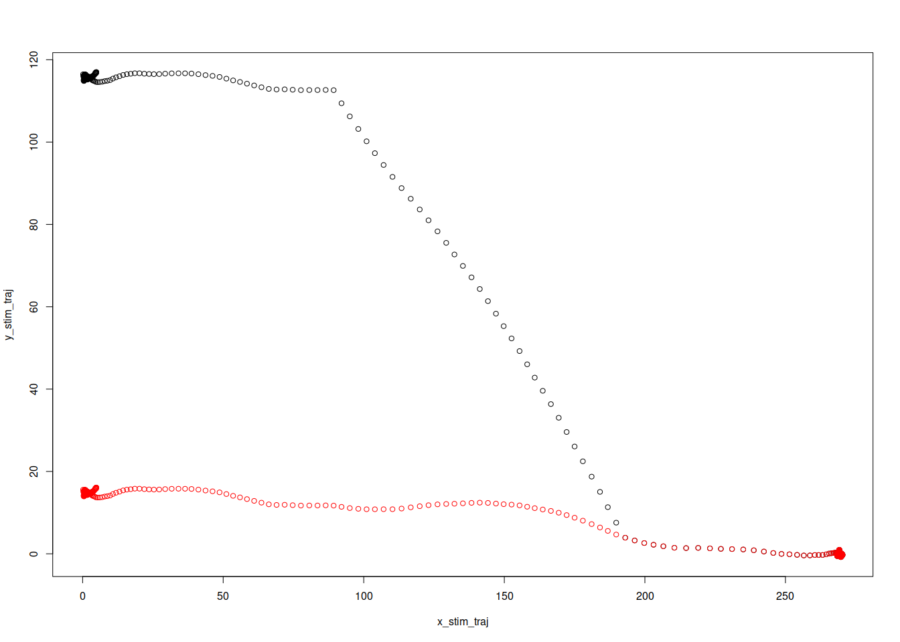<!-- -->

``` r
plot(t_stim_traj, sqrt((x_stim_traj-x_stim_traj[1])^2 + (y_stim_traj-y_stim_traj[1])^2))
points(t_stim_traj, sqrt((x_static_stim_traj-x_static_stim_traj[1])^2 + (y_static_stim_traj-y_static_stim_traj[1])^2), col = "red")
```

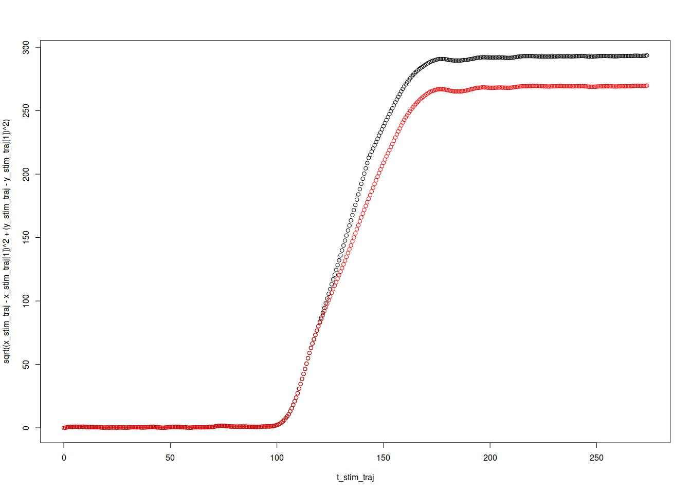<!-- -->

Test this function, let it plot, etc.
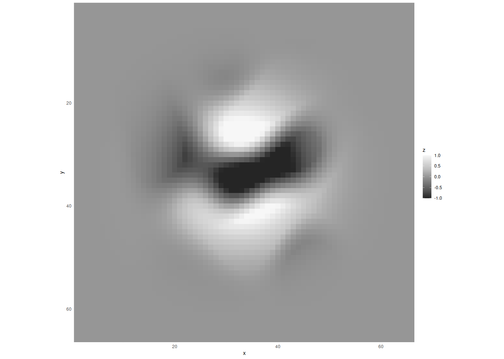<!-- -->

    ## [1] "dim(mat_over_t) = 250,403,683 [y,x,t]"
    ## [1] "Gabor filter 1 of 56, SF=0.25, Ori=-1.18"
    ## fft-based 2D convolution: 6.856 sec elapsed
    ## Temporal conv and low-pass: 1.736 sec elapsed
    ## [1] "Gabor filter 2 of 56, SF=0.25, Ori=-0.79"
    ## fft-based 2D convolution: 3.064 sec elapsed
    ## Temporal conv and low-pass: 1.717 sec elapsed
    ## [1] "Gabor filter 3 of 56, SF=0.25, Ori=-0.39"
    ## fft-based 2D convolution: 2.759 sec elapsed
    ## Temporal conv and low-pass: 1.731 sec elapsed
    ## [1] "Gabor filter 4 of 56, SF=0.25, Ori=0"
    ## fft-based 2D convolution: 2.76 sec elapsed
    ## Temporal conv and low-pass: 1.75 sec elapsed
    ## [1] "Gabor filter 5 of 56, SF=0.25, Ori=0.39"
    ## fft-based 2D convolution: 2.758 sec elapsed
    ## Temporal conv and low-pass: 1.748 sec elapsed
    ## [1] "Gabor filter 6 of 56, SF=0.25, Ori=0.79"
    ## fft-based 2D convolution: 2.766 sec elapsed
    ## Temporal conv and low-pass: 1.694 sec elapsed
    ## [1] "Gabor filter 7 of 56, SF=0.25, Ori=1.18"
    ## fft-based 2D convolution: 2.743 sec elapsed
    ## Temporal conv and low-pass: 1.708 sec elapsed
    ## [1] "Gabor filter 8 of 56, SF=0.25, Ori=1.57"
    ## fft-based 2D convolution: 2.748 sec elapsed
    ## Temporal conv and low-pass: 1.705 sec elapsed
    ## [1] "Gabor filter 9 of 56, SF=0.4, Ori=-1.18"
    ## fft-based 2D convolution: 2.744 sec elapsed
    ## Temporal conv and low-pass: 1.72 sec elapsed
    ## [1] "Gabor filter 10 of 56, SF=0.4, Ori=-0.79"
    ## fft-based 2D convolution: 2.731 sec elapsed
    ## Temporal conv and low-pass: 1.736 sec elapsed
    ## [1] "Gabor filter 11 of 56, SF=0.4, Ori=-0.39"
    ## fft-based 2D convolution: 2.748 sec elapsed
    ## Temporal conv and low-pass: 1.732 sec elapsed
    ## [1] "Gabor filter 12 of 56, SF=0.4, Ori=0"
    ## fft-based 2D convolution: 2.787 sec elapsed
    ## Temporal conv and low-pass: 1.709 sec elapsed
    ## [1] "Gabor filter 13 of 56, SF=0.4, Ori=0.39"
    ## fft-based 2D convolution: 2.813 sec elapsed
    ## Temporal conv and low-pass: 1.769 sec elapsed
    ## [1] "Gabor filter 14 of 56, SF=0.4, Ori=0.79"
    ## fft-based 2D convolution: 2.814 sec elapsed
    ## Temporal conv and low-pass: 1.708 sec elapsed
    ## [1] "Gabor filter 15 of 56, SF=0.4, Ori=1.18"
    ## fft-based 2D convolution: 2.838 sec elapsed
    ## Temporal conv and low-pass: 1.723 sec elapsed
    ## [1] "Gabor filter 16 of 56, SF=0.4, Ori=1.57"
    ## fft-based 2D convolution: 2.773 sec elapsed
    ## Temporal conv and low-pass: 1.72 sec elapsed
    ## [1] "Gabor filter 17 of 56, SF=0.63, Ori=-1.18"
    ## standard 2D convolution: 0.928 sec elapsed
    ## Temporal conv and low-pass: 1.471 sec elapsed
    ## [1] "Gabor filter 18 of 56, SF=0.63, Ori=-0.79"
    ## standard 2D convolution: 0.944 sec elapsed
    ## Temporal conv and low-pass: 1.437 sec elapsed
    ## [1] "Gabor filter 19 of 56, SF=0.63, Ori=-0.39"
    ## standard 2D convolution: 0.963 sec elapsed
    ## Temporal conv and low-pass: 1.435 sec elapsed
    ## [1] "Gabor filter 20 of 56, SF=0.63, Ori=0"
    ## standard 2D convolution: 0.939 sec elapsed
    ## Temporal conv and low-pass: 1.451 sec elapsed
    ## [1] "Gabor filter 21 of 56, SF=0.63, Ori=0.39"
    ## standard 2D convolution: 0.956 sec elapsed
    ## Temporal conv and low-pass: 1.458 sec elapsed
    ## [1] "Gabor filter 22 of 56, SF=0.63, Ori=0.79"
    ## standard 2D convolution: 0.974 sec elapsed
    ## Temporal conv and low-pass: 1.681 sec elapsed
    ## [1] "Gabor filter 23 of 56, SF=0.63, Ori=1.18"
    ## standard 2D convolution: 0.93 sec elapsed
    ## Temporal conv and low-pass: 1.465 sec elapsed
    ## [1] "Gabor filter 24 of 56, SF=0.63, Ori=1.57"
    ## standard 2D convolution: 0.949 sec elapsed
    ## Temporal conv and low-pass: 1.464 sec elapsed
    ## [1] "Gabor filter 25 of 56, SF=1, Ori=-1.18"
    ## standard 2D convolution: 0.408 sec elapsed
    ## Temporal conv and low-pass: 1.467 sec elapsed
    ## [1] "Gabor filter 26 of 56, SF=1, Ori=-0.79"
    ## standard 2D convolution: 0.423 sec elapsed
    ## Temporal conv and low-pass: 1.425 sec elapsed
    ## [1] "Gabor filter 27 of 56, SF=1, Ori=-0.39"
    ## standard 2D convolution: 0.672 sec elapsed
    ## Temporal conv and low-pass: 1.427 sec elapsed
    ## [1] "Gabor filter 28 of 56, SF=1, Ori=0"
    ## standard 2D convolution: 0.426 sec elapsed
    ## Temporal conv and low-pass: 1.734 sec elapsed
    ## [1] "Gabor filter 29 of 56, SF=1, Ori=0.39"
    ## standard 2D convolution: 0.406 sec elapsed
    ## Temporal conv and low-pass: 1.507 sec elapsed
    ## [1] "Gabor filter 30 of 56, SF=1, Ori=0.79"
    ## standard 2D convolution: 0.443 sec elapsed
    ## Temporal conv and low-pass: 1.519 sec elapsed
    ## [1] "Gabor filter 31 of 56, SF=1, Ori=1.18"
    ## standard 2D convolution: 0.426 sec elapsed
    ## Temporal conv and low-pass: 1.694 sec elapsed
    ## [1] "Gabor filter 32 of 56, SF=1, Ori=1.57"
    ## standard 2D convolution: 0.433 sec elapsed
    ## Temporal conv and low-pass: 1.474 sec elapsed
    ## [1] "Gabor filter 33 of 56, SF=1.59, Ori=-1.18"
    ## standard 2D convolution: 0.187 sec elapsed
    ## Temporal conv and low-pass: 1.614 sec elapsed
    ## [1] "Gabor filter 34 of 56, SF=1.59, Ori=-0.79"
    ## standard 2D convolution: 0.199 sec elapsed
    ## Temporal conv and low-pass: 1.725 sec elapsed
    ## [1] "Gabor filter 35 of 56, SF=1.59, Ori=-0.39"
    ## standard 2D convolution: 0.185 sec elapsed
    ## Temporal conv and low-pass: 1.493 sec elapsed
    ## [1] "Gabor filter 36 of 56, SF=1.59, Ori=0"
    ## standard 2D convolution: 0.186 sec elapsed
    ## Temporal conv and low-pass: 1.463 sec elapsed
    ## [1] "Gabor filter 37 of 56, SF=1.59, Ori=0.39"
    ## standard 2D convolution: 0.183 sec elapsed
    ## Temporal conv and low-pass: 1.474 sec elapsed
    ## [1] "Gabor filter 38 of 56, SF=1.59, Ori=0.79"
    ## standard 2D convolution: 0.181 sec elapsed
    ## Temporal conv and low-pass: 1.464 sec elapsed
    ## [1] "Gabor filter 39 of 56, SF=1.59, Ori=1.18"
    ## standard 2D convolution: 0.181 sec elapsed
    ## Temporal conv and low-pass: 1.678 sec elapsed
    ## [1] "Gabor filter 40 of 56, SF=1.59, Ori=1.57"
    ## standard 2D convolution: 0.18 sec elapsed
    ## Temporal conv and low-pass: 1.425 sec elapsed
    ## [1] "Gabor filter 41 of 56, SF=2.52, Ori=-1.18"
    ## standard 2D convolution: 0.099 sec elapsed
    ## Temporal conv and low-pass: 1.434 sec elapsed
    ## [1] "Gabor filter 42 of 56, SF=2.52, Ori=-0.79"
    ## standard 2D convolution: 0.098 sec elapsed
    ## Temporal conv and low-pass: 1.45 sec elapsed
    ## [1] "Gabor filter 43 of 56, SF=2.52, Ori=-0.39"
    ## standard 2D convolution: 0.095 sec elapsed
    ## Temporal conv and low-pass: 1.471 sec elapsed
    ## [1] "Gabor filter 44 of 56, SF=2.52, Ori=0"
    ## standard 2D convolution: 0.097 sec elapsed
    ## Temporal conv and low-pass: 1.468 sec elapsed
    ## [1] "Gabor filter 45 of 56, SF=2.52, Ori=0.39"
    ## standard 2D convolution: 0.097 sec elapsed
    ## Temporal conv and low-pass: 1.705 sec elapsed
    ## [1] "Gabor filter 46 of 56, SF=2.52, Ori=0.79"
    ## standard 2D convolution: 0.096 sec elapsed
    ## Temporal conv and low-pass: 1.697 sec elapsed
    ## [1] "Gabor filter 47 of 56, SF=2.52, Ori=1.18"
    ## standard 2D convolution: 0.102 sec elapsed
    ## Temporal conv and low-pass: 1.467 sec elapsed
    ## [1] "Gabor filter 48 of 56, SF=2.52, Ori=1.57"
    ## standard 2D convolution: 0.095 sec elapsed
    ## Temporal conv and low-pass: 1.468 sec elapsed
    ## [1] "Gabor filter 49 of 56, SF=4, Ori=-1.18"
    ## standard 2D convolution: 0.061 sec elapsed
    ## Temporal conv and low-pass: 1.48 sec elapsed
    ## [1] "Gabor filter 50 of 56, SF=4, Ori=-0.79"
    ## standard 2D convolution: 0.06 sec elapsed
    ## Temporal conv and low-pass: 1.474 sec elapsed
    ## [1] "Gabor filter 51 of 56, SF=4, Ori=-0.39"
    ## standard 2D convolution: 0.322 sec elapsed
    ## Temporal conv and low-pass: 1.529 sec elapsed
    ## [1] "Gabor filter 52 of 56, SF=4, Ori=0"
    ## standard 2D convolution: 0.066 sec elapsed
    ## Temporal conv and low-pass: 1.407 sec elapsed
    ## [1] "Gabor filter 53 of 56, SF=4, Ori=0.39"
    ## standard 2D convolution: 0.061 sec elapsed
    ## Temporal conv and low-pass: 1.595 sec elapsed
    ## [1] "Gabor filter 54 of 56, SF=4, Ori=0.79"
    ## standard 2D convolution: 0.059 sec elapsed
    ## Temporal conv and low-pass: 1.672 sec elapsed
    ## [1] "Gabor filter 55 of 56, SF=4, Ori=1.18"
    ## standard 2D convolution: 0.061 sec elapsed
    ## Temporal conv and low-pass: 1.481 sec elapsed
    ## [1] "Gabor filter 56 of 56, SF=4, Ori=1.57"
    ## standard 2D convolution: 0.06 sec elapsed
    ## Temporal conv and low-pass: 1.452 sec elapsed
    ## [1] "Performing normalization using normalization pool..."
    ## Normalization of responses (filter 1 of 56): 1.478 sec elapsed
    ## Normalization of responses (filter 2 of 56): 1.557 sec elapsed
    ## Normalization of responses (filter 3 of 56): 1.7 sec elapsed
    ## Normalization of responses (filter 4 of 56): 1.542 sec elapsed
    ## Normalization of responses (filter 5 of 56): 1.608 sec elapsed
    ## Normalization of responses (filter 6 of 56): 1.826 sec elapsed
    ## Normalization of responses (filter 7 of 56): 1.673 sec elapsed
    ## Normalization of responses (filter 8 of 56): 1.681 sec elapsed
    ## Normalization of responses (filter 9 of 56): 2.175 sec elapsed
    ## Normalization of responses (filter 10 of 56): 2.323 sec elapsed
    ## Normalization of responses (filter 11 of 56): 2.461 sec elapsed
    ## Normalization of responses (filter 12 of 56): 3.223 sec elapsed
    ## Normalization of responses (filter 13 of 56): 2.223 sec elapsed
    ## Normalization of responses (filter 14 of 56): 2.418 sec elapsed
    ## Normalization of responses (filter 15 of 56): 2.335 sec elapsed
    ## Normalization of responses (filter 16 of 56): 2.038 sec elapsed
    ## Normalization of responses (filter 17 of 56): 2.923 sec elapsed
    ## Normalization of responses (filter 18 of 56): 2.606 sec elapsed
    ## Normalization of responses (filter 19 of 56): 3.57 sec elapsed
    ## Normalization of responses (filter 20 of 56): 2.993 sec elapsed
    ## Normalization of responses (filter 21 of 56): 2.774 sec elapsed
    ## Normalization of responses (filter 22 of 56): 3.057 sec elapsed
    ## Normalization of responses (filter 23 of 56): 2.623 sec elapsed
    ## Normalization of responses (filter 24 of 56): 2.818 sec elapsed
    ## Normalization of responses (filter 25 of 56): 3.085 sec elapsed
    ## Normalization of responses (filter 26 of 56): 3.14 sec elapsed
    ## Normalization of responses (filter 27 of 56): 2.779 sec elapsed
    ## Normalization of responses (filter 28 of 56): 2.724 sec elapsed
    ## Normalization of responses (filter 29 of 56): 2.866 sec elapsed
    ## Normalization of responses (filter 30 of 56): 2.601 sec elapsed
    ## Normalization of responses (filter 31 of 56): 5.406 sec elapsed
    ## Normalization of responses (filter 32 of 56): 2.939 sec elapsed
    ## Normalization of responses (filter 33 of 56): 3.194 sec elapsed
    ## Normalization of responses (filter 34 of 56): 2.886 sec elapsed
    ## Normalization of responses (filter 35 of 56): 2.705 sec elapsed
    ## Normalization of responses (filter 36 of 56): 2.887 sec elapsed
    ## Normalization of responses (filter 37 of 56): 2.59 sec elapsed
    ## Normalization of responses (filter 38 of 56): 3.876 sec elapsed
    ## Normalization of responses (filter 39 of 56): 2.939 sec elapsed
    ## Normalization of responses (filter 40 of 56): 2.857 sec elapsed
    ## Normalization of responses (filter 41 of 56): 2.491 sec elapsed
    ## Normalization of responses (filter 42 of 56): 2.324 sec elapsed
    ## Normalization of responses (filter 43 of 56): 2.243 sec elapsed
    ## Normalization of responses (filter 44 of 56): 2.061 sec elapsed
    ## Normalization of responses (filter 45 of 56): 3.18 sec elapsed
    ## Normalization of responses (filter 46 of 56): 2.628 sec elapsed
    ## Normalization of responses (filter 47 of 56): 2.178 sec elapsed
    ## Normalization of responses (filter 48 of 56): 2.659 sec elapsed
    ## Normalization of responses (filter 49 of 56): 1.756 sec elapsed
    ## Normalization of responses (filter 50 of 56): 1.763 sec elapsed
    ## Normalization of responses (filter 51 of 56): 1.689 sec elapsed
    ## Normalization of responses (filter 52 of 56): 1.684 sec elapsed
    ## Normalization of responses (filter 53 of 56): 1.72 sec elapsed
    ## Normalization of responses (filter 54 of 56): 2.85 sec elapsed
    ## Normalization of responses (filter 55 of 56): 2.348 sec elapsed
    ## Normalization of responses (filter 56 of 56): 1.921 sec elapsed
    ## [1] "Plotting..."
    ## [1] "Done."
    ## [1] "Resulting dim(final_2d_over_filters) = 56,250,403 [y,x,t]"

    ## [1] "dim(mat_over_t) = 250,403,683 [y,x,t]"
    ## [1] "Gabor filter 1 of 56, SF=0.25, Ori=-1.18"
    ## fft-based 2D convolution: 4.372 sec elapsed
    ## Temporal conv and low-pass: 1.011 sec elapsed
    ## [1] "Gabor filter 2 of 56, SF=0.25, Ori=-0.79"
    ## fft-based 2D convolution: 2.636 sec elapsed
    ## Temporal conv and low-pass: 0.725 sec elapsed
    ## [1] "Gabor filter 3 of 56, SF=0.25, Ori=-0.39"
    ## fft-based 2D convolution: 2.506 sec elapsed
    ## Temporal conv and low-pass: 0.677 sec elapsed
    ## [1] "Gabor filter 4 of 56, SF=0.25, Ori=0"
    ## fft-based 2D convolution: 2.014 sec elapsed
    ## Temporal conv and low-pass: 0.989 sec elapsed
    ## [1] "Gabor filter 5 of 56, SF=0.25, Ori=0.39"
    ## fft-based 2D convolution: 1.913 sec elapsed
    ## Temporal conv and low-pass: 0.966 sec elapsed
    ## [1] "Gabor filter 6 of 56, SF=0.25, Ori=0.79"
    ## fft-based 2D convolution: 2.254 sec elapsed
    ## Temporal conv and low-pass: 0.666 sec elapsed
    ## [1] "Gabor filter 7 of 56, SF=0.25, Ori=1.18"
    ## fft-based 2D convolution: 2.197 sec elapsed
    ## Temporal conv and low-pass: 0.647 sec elapsed
    ## [1] "Gabor filter 8 of 56, SF=0.25, Ori=1.57"
    ## fft-based 2D convolution: 2.165 sec elapsed
    ## Temporal conv and low-pass: 0.681 sec elapsed
    ## [1] "Gabor filter 9 of 56, SF=0.4, Ori=-1.18"
    ## fft-based 2D convolution: 2.167 sec elapsed
    ## Temporal conv and low-pass: 0.705 sec elapsed
    ## [1] "Gabor filter 10 of 56, SF=0.4, Ori=-0.79"
    ## fft-based 2D convolution: 2.292 sec elapsed
    ## Temporal conv and low-pass: 0.674 sec elapsed
    ## [1] "Gabor filter 11 of 56, SF=0.4, Ori=-0.39"
    ## fft-based 2D convolution: 2.193 sec elapsed
    ## Temporal conv and low-pass: 0.673 sec elapsed
    ## [1] "Gabor filter 12 of 56, SF=0.4, Ori=0"
    ## fft-based 2D convolution: 2.193 sec elapsed
    ## Temporal conv and low-pass: 0.684 sec elapsed
    ## [1] "Gabor filter 13 of 56, SF=0.4, Ori=0.39"
    ## fft-based 2D convolution: 2.205 sec elapsed
    ## Temporal conv and low-pass: 0.699 sec elapsed
    ## [1] "Gabor filter 14 of 56, SF=0.4, Ori=0.79"
    ## fft-based 2D convolution: 2.113 sec elapsed
    ## Temporal conv and low-pass: 0.693 sec elapsed
    ## [1] "Gabor filter 15 of 56, SF=0.4, Ori=1.18"
    ## fft-based 2D convolution: 2.105 sec elapsed
    ## Temporal conv and low-pass: 0.984 sec elapsed
    ## [1] "Gabor filter 16 of 56, SF=0.4, Ori=1.57"
    ## fft-based 2D convolution: 1.652 sec elapsed
    ## Temporal conv and low-pass: 0.955 sec elapsed
    ## [1] "Gabor filter 17 of 56, SF=0.63, Ori=-1.18"
    ## standard 2D convolution: 0.99 sec elapsed
    ## Temporal conv and low-pass: 0.648 sec elapsed
    ## [1] "Gabor filter 18 of 56, SF=0.63, Ori=-0.79"
    ## standard 2D convolution: 0.97 sec elapsed
    ## Temporal conv and low-pass: 0.651 sec elapsed
    ## [1] "Gabor filter 19 of 56, SF=0.63, Ori=-0.39"
    ## standard 2D convolution: 0.997 sec elapsed
    ## Temporal conv and low-pass: 0.68 sec elapsed
    ## [1] "Gabor filter 20 of 56, SF=0.63, Ori=0"
    ## standard 2D convolution: 0.991 sec elapsed
    ## Temporal conv and low-pass: 0.94 sec elapsed
    ## [1] "Gabor filter 21 of 56, SF=0.63, Ori=0.39"
    ## standard 2D convolution: 0.989 sec elapsed
    ## Temporal conv and low-pass: 0.659 sec elapsed
    ## [1] "Gabor filter 22 of 56, SF=0.63, Ori=0.79"
    ## standard 2D convolution: 0.972 sec elapsed
    ## Temporal conv and low-pass: 0.635 sec elapsed
    ## [1] "Gabor filter 23 of 56, SF=0.63, Ori=1.18"
    ## standard 2D convolution: 0.948 sec elapsed
    ## Temporal conv and low-pass: 0.643 sec elapsed
    ## [1] "Gabor filter 24 of 56, SF=0.63, Ori=1.57"
    ## standard 2D convolution: 0.957 sec elapsed
    ## Temporal conv and low-pass: 0.945 sec elapsed
    ## [1] "Gabor filter 25 of 56, SF=1, Ori=-1.18"
    ## standard 2D convolution: 0.449 sec elapsed
    ## Temporal conv and low-pass: 0.651 sec elapsed
    ## [1] "Gabor filter 26 of 56, SF=1, Ori=-0.79"
    ## standard 2D convolution: 0.426 sec elapsed
    ## Temporal conv and low-pass: 0.649 sec elapsed
    ## [1] "Gabor filter 27 of 56, SF=1, Ori=-0.39"
    ## standard 2D convolution: 0.429 sec elapsed
    ## Temporal conv and low-pass: 0.681 sec elapsed
    ## [1] "Gabor filter 28 of 56, SF=1, Ori=0"
    ## standard 2D convolution: 0.446 sec elapsed
    ## Temporal conv and low-pass: 0.669 sec elapsed
    ## [1] "Gabor filter 29 of 56, SF=1, Ori=0.39"
    ## standard 2D convolution: 0.427 sec elapsed
    ## Temporal conv and low-pass: 0.682 sec elapsed
    ## [1] "Gabor filter 30 of 56, SF=1, Ori=0.79"
    ## standard 2D convolution: 0.432 sec elapsed
    ## Temporal conv and low-pass: 0.647 sec elapsed
    ## [1] "Gabor filter 31 of 56, SF=1, Ori=1.18"
    ## standard 2D convolution: 0.435 sec elapsed
    ## Temporal conv and low-pass: 0.654 sec elapsed
    ## [1] "Gabor filter 32 of 56, SF=1, Ori=1.57"
    ## standard 2D convolution: 0.432 sec elapsed
    ## Temporal conv and low-pass: 0.641 sec elapsed
    ## [1] "Gabor filter 33 of 56, SF=1.59, Ori=-1.18"
    ## standard 2D convolution: 0.183 sec elapsed
    ## Temporal conv and low-pass: 0.663 sec elapsed
    ## [1] "Gabor filter 34 of 56, SF=1.59, Ori=-0.79"
    ## standard 2D convolution: 0.185 sec elapsed
    ## Temporal conv and low-pass: 0.667 sec elapsed
    ## [1] "Gabor filter 35 of 56, SF=1.59, Ori=-0.39"
    ## standard 2D convolution: 0.188 sec elapsed
    ## Temporal conv and low-pass: 0.66 sec elapsed
    ## [1] "Gabor filter 36 of 56, SF=1.59, Ori=0"
    ## standard 2D convolution: 0.189 sec elapsed
    ## Temporal conv and low-pass: 0.672 sec elapsed
    ## [1] "Gabor filter 37 of 56, SF=1.59, Ori=0.39"
    ## standard 2D convolution: 0.188 sec elapsed
    ## Temporal conv and low-pass: 0.667 sec elapsed
    ## [1] "Gabor filter 38 of 56, SF=1.59, Ori=0.79"
    ## standard 2D convolution: 0.192 sec elapsed
    ## Temporal conv and low-pass: 0.641 sec elapsed
    ## [1] "Gabor filter 39 of 56, SF=1.59, Ori=1.18"
    ## standard 2D convolution: 0.188 sec elapsed
    ## Temporal conv and low-pass: 0.916 sec elapsed
    ## [1] "Gabor filter 40 of 56, SF=1.59, Ori=1.57"
    ## standard 2D convolution: 0.173 sec elapsed
    ## Temporal conv and low-pass: 0.639 sec elapsed
    ## [1] "Gabor filter 41 of 56, SF=2.52, Ori=-1.18"
    ## standard 2D convolution: 0.103 sec elapsed
    ## Temporal conv and low-pass: 0.631 sec elapsed
    ## [1] "Gabor filter 42 of 56, SF=2.52, Ori=-0.79"
    ## standard 2D convolution: 0.092 sec elapsed
    ## Temporal conv and low-pass: 0.604 sec elapsed
    ## [1] "Gabor filter 43 of 56, SF=2.52, Ori=-0.39"
    ## standard 2D convolution: 0.09 sec elapsed
    ## Temporal conv and low-pass: 0.623 sec elapsed
    ## [1] "Gabor filter 44 of 56, SF=2.52, Ori=0"
    ## standard 2D convolution: 0.093 sec elapsed
    ## Temporal conv and low-pass: 0.628 sec elapsed
    ## [1] "Gabor filter 45 of 56, SF=2.52, Ori=0.39"
    ## standard 2D convolution: 0.091 sec elapsed
    ## Temporal conv and low-pass: 0.624 sec elapsed
    ## [1] "Gabor filter 46 of 56, SF=2.52, Ori=0.79"
    ## standard 2D convolution: 0.091 sec elapsed
    ## Temporal conv and low-pass: 0.628 sec elapsed
    ## [1] "Gabor filter 47 of 56, SF=2.52, Ori=1.18"
    ## standard 2D convolution: 0.092 sec elapsed
    ## Temporal conv and low-pass: 0.637 sec elapsed
    ## [1] "Gabor filter 48 of 56, SF=2.52, Ori=1.57"
    ## standard 2D convolution: 0.092 sec elapsed
    ## Temporal conv and low-pass: 0.626 sec elapsed
    ## [1] "Gabor filter 49 of 56, SF=4, Ori=-1.18"
    ## standard 2D convolution: 0.061 sec elapsed
    ## Temporal conv and low-pass: 0.636 sec elapsed
    ## [1] "Gabor filter 50 of 56, SF=4, Ori=-0.79"
    ## standard 2D convolution: 0.057 sec elapsed
    ## Temporal conv and low-pass: 0.629 sec elapsed
    ## [1] "Gabor filter 51 of 56, SF=4, Ori=-0.39"
    ## standard 2D convolution: 0.061 sec elapsed
    ## Temporal conv and low-pass: 0.621 sec elapsed
    ## [1] "Gabor filter 52 of 56, SF=4, Ori=0"
    ## standard 2D convolution: 0.06 sec elapsed
    ## Temporal conv and low-pass: 0.606 sec elapsed
    ## [1] "Gabor filter 53 of 56, SF=4, Ori=0.39"
    ## standard 2D convolution: 0.059 sec elapsed
    ## Temporal conv and low-pass: 0.625 sec elapsed
    ## [1] "Gabor filter 54 of 56, SF=4, Ori=0.79"
    ## standard 2D convolution: 0.059 sec elapsed
    ## Temporal conv and low-pass: 0.935 sec elapsed
    ## [1] "Gabor filter 55 of 56, SF=4, Ori=1.18"
    ## standard 2D convolution: 0.059 sec elapsed
    ## Temporal conv and low-pass: 0.635 sec elapsed
    ## [1] "Gabor filter 56 of 56, SF=4, Ori=1.57"
    ## standard 2D convolution: 0.06 sec elapsed
    ## Temporal conv and low-pass: 0.626 sec elapsed
    ## [1] "Performing normalization..."
    ## Normalization of responses (filter 1 of 56): 0.146 sec elapsed
    ## Normalization of responses (filter 2 of 56): 0.152 sec elapsed
    ## Normalization of responses (filter 3 of 56): 0.438 sec elapsed
    ## Normalization of responses (filter 4 of 56): 0.15 sec elapsed
    ## Normalization of responses (filter 5 of 56): 0.153 sec elapsed
    ## Normalization of responses (filter 6 of 56): 0.152 sec elapsed
    ## Normalization of responses (filter 7 of 56): 0.154 sec elapsed
    ## Normalization of responses (filter 8 of 56): 0.425 sec elapsed
    ## Normalization of responses (filter 9 of 56): 0.148 sec elapsed
    ## Normalization of responses (filter 10 of 56): 0.155 sec elapsed
    ## Normalization of responses (filter 11 of 56): 0.149 sec elapsed
    ## Normalization of responses (filter 12 of 56): 0.15 sec elapsed
    ## Normalization of responses (filter 13 of 56): 0.444 sec elapsed
    ## Normalization of responses (filter 14 of 56): 0.157 sec elapsed
    ## Normalization of responses (filter 15 of 56): 0.137 sec elapsed
    ## Normalization of responses (filter 16 of 56): 0.143 sec elapsed
    ## Normalization of responses (filter 17 of 56): 0.147 sec elapsed
    ## Normalization of responses (filter 18 of 56): 0.409 sec elapsed
    ## Normalization of responses (filter 19 of 56): 0.147 sec elapsed
    ## Normalization of responses (filter 20 of 56): 0.151 sec elapsed
    ## Normalization of responses (filter 21 of 56): 0.144 sec elapsed
    ## Normalization of responses (filter 22 of 56): 0.14 sec elapsed
    ## Normalization of responses (filter 23 of 56): 0.436 sec elapsed
    ## Normalization of responses (filter 24 of 56): 0.145 sec elapsed
    ## Normalization of responses (filter 25 of 56): 0.157 sec elapsed
    ## Normalization of responses (filter 26 of 56): 0.14 sec elapsed
    ## Normalization of responses (filter 27 of 56): 0.14 sec elapsed
    ## Normalization of responses (filter 28 of 56): 0.137 sec elapsed
    ## Normalization of responses (filter 29 of 56): 0.143 sec elapsed
    ## Normalization of responses (filter 30 of 56): 0.412 sec elapsed
    ## Normalization of responses (filter 31 of 56): 2.328 sec elapsed
    ## Normalization of responses (filter 32 of 56): 0.142 sec elapsed
    ## Normalization of responses (filter 33 of 56): 0.138 sec elapsed
    ## Normalization of responses (filter 34 of 56): 0.14 sec elapsed
    ## Normalization of responses (filter 35 of 56): 0.214 sec elapsed
    ## Normalization of responses (filter 36 of 56): 0.154 sec elapsed
    ## Normalization of responses (filter 37 of 56): 0.146 sec elapsed
    ## Normalization of responses (filter 38 of 56): 0.146 sec elapsed
    ## Normalization of responses (filter 39 of 56): 0.147 sec elapsed
    ## Normalization of responses (filter 40 of 56): 0.398 sec elapsed
    ## Normalization of responses (filter 41 of 56): 0.14 sec elapsed
    ## Normalization of responses (filter 42 of 56): 0.145 sec elapsed
    ## Normalization of responses (filter 43 of 56): 0.143 sec elapsed
    ## Normalization of responses (filter 44 of 56): 0.146 sec elapsed
    ## Normalization of responses (filter 45 of 56): 0.395 sec elapsed
    ## Normalization of responses (filter 46 of 56): 0.146 sec elapsed
    ## Normalization of responses (filter 47 of 56): 0.139 sec elapsed
    ## Normalization of responses (filter 48 of 56): 0.146 sec elapsed
    ## Normalization of responses (filter 49 of 56): 0.144 sec elapsed
    ## Normalization of responses (filter 50 of 56): 0.135 sec elapsed
    ## Normalization of responses (filter 51 of 56): 0.404 sec elapsed
    ## Normalization of responses (filter 52 of 56): 0.147 sec elapsed
    ## Normalization of responses (filter 53 of 56): 0.146 sec elapsed
    ## Normalization of responses (filter 54 of 56): 0.145 sec elapsed
    ## Normalization of responses (filter 55 of 56): 0.142 sec elapsed
    ## Normalization of responses (filter 56 of 56): 0.416 sec elapsed
    ## [1] "Plotting..."
    ## [1] "Done."
    ## [1] "Resulting dim(final_2d_over_filters) = 56,250,403 [y,x,t]"

    ## [1] "dim(mat_over_t) = 250,403,683 [y,x,t]"
    ## [1] "Gabor filter 1 of 56, SF=0.25, Ori=-1.18"
    ## fft-based 2D convolution: 4.278 sec elapsed
    ## Temporal conv and low-pass: 1.736 sec elapsed
    ## [1] "Gabor filter 2 of 56, SF=0.25, Ori=-0.79"
    ## fft-based 2D convolution: 2.265 sec elapsed
    ## Temporal conv and low-pass: 1.639 sec elapsed
    ## [1] "Gabor filter 3 of 56, SF=0.25, Ori=-0.39"
    ## fft-based 2D convolution: 2.612 sec elapsed
    ## Temporal conv and low-pass: 1.638 sec elapsed
    ## [1] "Gabor filter 4 of 56, SF=0.25, Ori=0"
    ## fft-based 2D convolution: 2.137 sec elapsed
    ## Temporal conv and low-pass: 1.541 sec elapsed
    ## [1] "Gabor filter 5 of 56, SF=0.25, Ori=0.39"
    ## fft-based 2D convolution: 2.249 sec elapsed
    ## Temporal conv and low-pass: 1.615 sec elapsed
    ## [1] "Gabor filter 6 of 56, SF=0.25, Ori=0.79"
    ## fft-based 2D convolution: 2.296 sec elapsed
    ## Temporal conv and low-pass: 1.61 sec elapsed
    ## [1] "Gabor filter 7 of 56, SF=0.25, Ori=1.18"
    ## fft-based 2D convolution: 2.369 sec elapsed
    ## Temporal conv and low-pass: 1.595 sec elapsed
    ## [1] "Gabor filter 8 of 56, SF=0.25, Ori=1.57"
    ## fft-based 2D convolution: 2.244 sec elapsed
    ## Temporal conv and low-pass: 1.531 sec elapsed
    ## [1] "Gabor filter 9 of 56, SF=0.4, Ori=-1.18"
    ## fft-based 2D convolution: 2.159 sec elapsed
    ## Temporal conv and low-pass: 1.48 sec elapsed
    ## [1] "Gabor filter 10 of 56, SF=0.4, Ori=-0.79"
    ## fft-based 2D convolution: 2.134 sec elapsed
    ## Temporal conv and low-pass: 1.597 sec elapsed
    ## [1] "Gabor filter 11 of 56, SF=0.4, Ori=-0.39"
    ## fft-based 2D convolution: 2.204 sec elapsed
    ## Temporal conv and low-pass: 1.601 sec elapsed
    ## [1] "Gabor filter 12 of 56, SF=0.4, Ori=0"
    ## fft-based 2D convolution: 2.165 sec elapsed
    ## Temporal conv and low-pass: 1.566 sec elapsed
    ## [1] "Gabor filter 13 of 56, SF=0.4, Ori=0.39"
    ## fft-based 2D convolution: 2.229 sec elapsed
    ## Temporal conv and low-pass: 1.669 sec elapsed
    ## [1] "Gabor filter 14 of 56, SF=0.4, Ori=0.79"
    ## fft-based 2D convolution: 2.246 sec elapsed
    ## Temporal conv and low-pass: 1.659 sec elapsed
    ## [1] "Gabor filter 15 of 56, SF=0.4, Ori=1.18"
    ## fft-based 2D convolution: 2.252 sec elapsed
    ## Temporal conv and low-pass: 1.603 sec elapsed
    ## [1] "Gabor filter 16 of 56, SF=0.4, Ori=1.57"
    ## fft-based 2D convolution: 2.265 sec elapsed
    ## Temporal conv and low-pass: 1.617 sec elapsed
    ## [1] "Gabor filter 17 of 56, SF=0.63, Ori=-1.18"
    ## fft-based 2D convolution: 2.405 sec elapsed
    ## Temporal conv and low-pass: 1.606 sec elapsed
    ## [1] "Gabor filter 18 of 56, SF=0.63, Ori=-0.79"
    ## fft-based 2D convolution: 2.255 sec elapsed
    ## Temporal conv and low-pass: 1.661 sec elapsed
    ## [1] "Gabor filter 19 of 56, SF=0.63, Ori=-0.39"
    ## fft-based 2D convolution: 2.295 sec elapsed
    ## Temporal conv and low-pass: 1.636 sec elapsed
    ## [1] "Gabor filter 20 of 56, SF=0.63, Ori=0"
    ## fft-based 2D convolution: 2.252 sec elapsed
    ## Temporal conv and low-pass: 1.626 sec elapsed
    ## [1] "Gabor filter 21 of 56, SF=0.63, Ori=0.39"
    ## fft-based 2D convolution: 2.418 sec elapsed
    ## Temporal conv and low-pass: 1.59 sec elapsed
    ## [1] "Gabor filter 22 of 56, SF=0.63, Ori=0.79"
    ## fft-based 2D convolution: 2.193 sec elapsed
    ## Temporal conv and low-pass: 1.565 sec elapsed
    ## [1] "Gabor filter 23 of 56, SF=0.63, Ori=1.18"
    ## fft-based 2D convolution: 2.345 sec elapsed
    ## Temporal conv and low-pass: 1.655 sec elapsed
    ## [1] "Gabor filter 24 of 56, SF=0.63, Ori=1.57"
    ## fft-based 2D convolution: 2.258 sec elapsed
    ## Temporal conv and low-pass: 1.528 sec elapsed
    ## [1] "Gabor filter 25 of 56, SF=1, Ori=-1.18"
    ## fft-based 2D convolution: 2.14 sec elapsed
    ## Temporal conv and low-pass: 1.587 sec elapsed
    ## [1] "Gabor filter 26 of 56, SF=1, Ori=-0.79"
    ## fft-based 2D convolution: 2.138 sec elapsed
    ## Temporal conv and low-pass: 1.504 sec elapsed
    ## [1] "Gabor filter 27 of 56, SF=1, Ori=-0.39"
    ## fft-based 2D convolution: 2.183 sec elapsed
    ## Temporal conv and low-pass: 1.524 sec elapsed
    ## [1] "Gabor filter 28 of 56, SF=1, Ori=0"
    ## fft-based 2D convolution: 2.226 sec elapsed
    ## Temporal conv and low-pass: 1.58 sec elapsed
    ## [1] "Gabor filter 29 of 56, SF=1, Ori=0.39"
    ## fft-based 2D convolution: 2.186 sec elapsed
    ## Temporal conv and low-pass: 1.567 sec elapsed
    ## [1] "Gabor filter 30 of 56, SF=1, Ori=0.79"
    ## fft-based 2D convolution: 2.23 sec elapsed
    ## Temporal conv and low-pass: 1.563 sec elapsed
    ## [1] "Gabor filter 31 of 56, SF=1, Ori=1.18"
    ## fft-based 2D convolution: 2.079 sec elapsed
    ## Temporal conv and low-pass: 1.565 sec elapsed
    ## [1] "Gabor filter 32 of 56, SF=1, Ori=1.57"
    ## fft-based 2D convolution: 2.054 sec elapsed
    ## Temporal conv and low-pass: 1.51 sec elapsed
    ## [1] "Gabor filter 33 of 56, SF=1.59, Ori=-1.18"
    ## standard 2D convolution: 1.035 sec elapsed
    ## Temporal conv and low-pass: 1.305 sec elapsed
    ## [1] "Gabor filter 34 of 56, SF=1.59, Ori=-0.79"
    ## standard 2D convolution: 1.043 sec elapsed
    ## Temporal conv and low-pass: 1.297 sec elapsed
    ## [1] "Gabor filter 35 of 56, SF=1.59, Ori=-0.39"
    ## standard 2D convolution: 1.043 sec elapsed
    ## Temporal conv and low-pass: 1.353 sec elapsed
    ## [1] "Gabor filter 36 of 56, SF=1.59, Ori=0"
    ## standard 2D convolution: 1.043 sec elapsed
    ## Temporal conv and low-pass: 1.366 sec elapsed
    ## [1] "Gabor filter 37 of 56, SF=1.59, Ori=0.39"
    ## standard 2D convolution: 1.064 sec elapsed
    ## Temporal conv and low-pass: 1.679 sec elapsed
    ## [1] "Gabor filter 38 of 56, SF=1.59, Ori=0.79"
    ## standard 2D convolution: 1.101 sec elapsed
    ## Temporal conv and low-pass: 1.289 sec elapsed
    ## [1] "Gabor filter 39 of 56, SF=1.59, Ori=1.18"
    ## standard 2D convolution: 1.049 sec elapsed
    ## Temporal conv and low-pass: 1.234 sec elapsed
    ## [1] "Gabor filter 40 of 56, SF=1.59, Ori=1.57"
    ## standard 2D convolution: 1.047 sec elapsed
    ## Temporal conv and low-pass: 1.504 sec elapsed
    ## [1] "Gabor filter 41 of 56, SF=2.52, Ori=-1.18"
    ## standard 2D convolution: 0.442 sec elapsed
    ## Temporal conv and low-pass: 1.251 sec elapsed
    ## [1] "Gabor filter 42 of 56, SF=2.52, Ori=-0.79"
    ## standard 2D convolution: 0.477 sec elapsed
    ## Temporal conv and low-pass: 1.348 sec elapsed
    ## [1] "Gabor filter 43 of 56, SF=2.52, Ori=-0.39"
    ## standard 2D convolution: 0.441 sec elapsed
    ## Temporal conv and low-pass: 1.226 sec elapsed
    ## [1] "Gabor filter 44 of 56, SF=2.52, Ori=0"
    ## standard 2D convolution: 0.438 sec elapsed
    ## Temporal conv and low-pass: 1.319 sec elapsed
    ## [1] "Gabor filter 45 of 56, SF=2.52, Ori=0.39"
    ## standard 2D convolution: 0.476 sec elapsed
    ## Temporal conv and low-pass: 1.224 sec elapsed
    ## [1] "Gabor filter 46 of 56, SF=2.52, Ori=0.79"
    ## standard 2D convolution: 0.442 sec elapsed
    ## Temporal conv and low-pass: 1.542 sec elapsed
    ## [1] "Gabor filter 47 of 56, SF=2.52, Ori=1.18"
    ## standard 2D convolution: 0.444 sec elapsed
    ## Temporal conv and low-pass: 1.308 sec elapsed
    ## [1] "Gabor filter 48 of 56, SF=2.52, Ori=1.57"
    ## standard 2D convolution: 0.443 sec elapsed
    ## Temporal conv and low-pass: 1.246 sec elapsed
    ## [1] "Gabor filter 49 of 56, SF=4, Ori=-1.18"
    ## standard 2D convolution: 0.486 sec elapsed
    ## Temporal conv and low-pass: 1.285 sec elapsed
    ## [1] "Gabor filter 50 of 56, SF=4, Ori=-0.79"
    ## standard 2D convolution: 0.201 sec elapsed
    ## Temporal conv and low-pass: 1.345 sec elapsed
    ## [1] "Gabor filter 51 of 56, SF=4, Ori=-0.39"
    ## standard 2D convolution: 0.195 sec elapsed
    ## Temporal conv and low-pass: 1.322 sec elapsed
    ## [1] "Gabor filter 52 of 56, SF=4, Ori=0"
    ## standard 2D convolution: 0.194 sec elapsed
    ## Temporal conv and low-pass: 1.294 sec elapsed
    ## [1] "Gabor filter 53 of 56, SF=4, Ori=0.39"
    ## standard 2D convolution: 0.195 sec elapsed
    ## Temporal conv and low-pass: 1.296 sec elapsed
    ## [1] "Gabor filter 54 of 56, SF=4, Ori=0.79"
    ## standard 2D convolution: 0.194 sec elapsed
    ## Temporal conv and low-pass: 1.517 sec elapsed
    ## [1] "Gabor filter 55 of 56, SF=4, Ori=1.18"
    ## standard 2D convolution: 0.194 sec elapsed
    ## Temporal conv and low-pass: 1.305 sec elapsed
    ## [1] "Gabor filter 56 of 56, SF=4, Ori=1.57"
    ## standard 2D convolution: 0.194 sec elapsed
    ## Temporal conv and low-pass: 1.23 sec elapsed
    ## [1] "Performing normalization using normalization pool..."
    ## Normalization of responses (filter 1 of 56): 1.55 sec elapsed
    ## Normalization of responses (filter 2 of 56): 1.739 sec elapsed
    ## Normalization of responses (filter 3 of 56): 1.797 sec elapsed
    ## Normalization of responses (filter 4 of 56): 1.71 sec elapsed
    ## Normalization of responses (filter 5 of 56): 1.798 sec elapsed
    ## Normalization of responses (filter 6 of 56): 1.738 sec elapsed
    ## Normalization of responses (filter 7 of 56): 1.724 sec elapsed
    ## Normalization of responses (filter 8 of 56): 1.796 sec elapsed
    ## Normalization of responses (filter 9 of 56): 2.411 sec elapsed
    ## Normalization of responses (filter 10 of 56): 2.387 sec elapsed
    ## Normalization of responses (filter 11 of 56): 2.32 sec elapsed
    ## Normalization of responses (filter 12 of 56): 2.892 sec elapsed
    ## Normalization of responses (filter 13 of 56): 2.426 sec elapsed
    ## Normalization of responses (filter 14 of 56): 2.362 sec elapsed
    ## Normalization of responses (filter 15 of 56): 2.345 sec elapsed
    ## Normalization of responses (filter 16 of 56): 2.166 sec elapsed
    ## Normalization of responses (filter 17 of 56): 3.026 sec elapsed
    ## Normalization of responses (filter 18 of 56): 2.754 sec elapsed
    ## Normalization of responses (filter 19 of 56): 3.611 sec elapsed
    ## Normalization of responses (filter 20 of 56): 2.864 sec elapsed
    ## Normalization of responses (filter 21 of 56): 2.781 sec elapsed
    ## Normalization of responses (filter 22 of 56): 2.984 sec elapsed
    ## Normalization of responses (filter 23 of 56): 2.889 sec elapsed
    ## Normalization of responses (filter 24 of 56): 3.111 sec elapsed
    ## Normalization of responses (filter 25 of 56): 3.328 sec elapsed
    ## Normalization of responses (filter 26 of 56): 2.781 sec elapsed
    ## Normalization of responses (filter 27 of 56): 2.995 sec elapsed
    ## Normalization of responses (filter 28 of 56): 2.759 sec elapsed
    ## Normalization of responses (filter 29 of 56): 3.027 sec elapsed
    ## Normalization of responses (filter 30 of 56): 2.812 sec elapsed
    ## Normalization of responses (filter 31 of 56): 6.084 sec elapsed
    ## Normalization of responses (filter 32 of 56): 2.875 sec elapsed
    ## Normalization of responses (filter 33 of 56): 2.894 sec elapsed
    ## Normalization of responses (filter 34 of 56): 3.205 sec elapsed
    ## Normalization of responses (filter 35 of 56): 3.022 sec elapsed
    ## Normalization of responses (filter 36 of 56): 3.222 sec elapsed
    ## Normalization of responses (filter 37 of 56): 3.631 sec elapsed
    ## Normalization of responses (filter 38 of 56): 3.002 sec elapsed
    ## Normalization of responses (filter 39 of 56): 3.102 sec elapsed
    ## Normalization of responses (filter 40 of 56): 2.801 sec elapsed
    ## Normalization of responses (filter 41 of 56): 2.422 sec elapsed
    ## Normalization of responses (filter 42 of 56): 2.422 sec elapsed
    ## Normalization of responses (filter 43 of 56): 2.125 sec elapsed
    ## Normalization of responses (filter 44 of 56): 3.042 sec elapsed
    ## Normalization of responses (filter 45 of 56): 2.464 sec elapsed
    ## Normalization of responses (filter 46 of 56): 2.39 sec elapsed
    ## Normalization of responses (filter 47 of 56): 2.175 sec elapsed
    ## Normalization of responses (filter 48 of 56): 2.441 sec elapsed
    ## Normalization of responses (filter 49 of 56): 1.782 sec elapsed
    ## Normalization of responses (filter 50 of 56): 1.696 sec elapsed
    ## Normalization of responses (filter 51 of 56): 1.756 sec elapsed
    ## Normalization of responses (filter 52 of 56): 1.683 sec elapsed
    ## Normalization of responses (filter 53 of 56): 2.579 sec elapsed
    ## Normalization of responses (filter 54 of 56): 1.723 sec elapsed
    ## Normalization of responses (filter 55 of 56): 1.774 sec elapsed
    ## Normalization of responses (filter 56 of 56): 1.721 sec elapsed
    ## [1] "Plotting..."
    ## [1] "Done."
    ## [1] "Resulting dim(final_2d_over_filters) = 56,250,403 [y,x,t]"

    ## [1] "dim(mat_over_t) = 250,403,683 [y,x,t]"
    ## [1] "Gabor filter 1 of 56, SF=0.25, Ori=-1.18"
    ## fft-based 2D convolution: 7.324 sec elapsed
    ## Temporal conv and low-pass: 0.715 sec elapsed
    ## [1] "Gabor filter 2 of 56, SF=0.25, Ori=-0.79"
    ## fft-based 2D convolution: 3.597 sec elapsed
    ## Temporal conv and low-pass: 0.944 sec elapsed
    ## [1] "Gabor filter 3 of 56, SF=0.25, Ori=-0.39"
    ## fft-based 2D convolution: 2.969 sec elapsed
    ## Temporal conv and low-pass: 0.943 sec elapsed
    ## [1] "Gabor filter 4 of 56, SF=0.25, Ori=0"
    ## fft-based 2D convolution: 3.092 sec elapsed
    ## Temporal conv and low-pass: 0.983 sec elapsed
    ## [1] "Gabor filter 5 of 56, SF=0.25, Ori=0.39"
    ## fft-based 2D convolution: 3.063 sec elapsed
    ## Temporal conv and low-pass: 0.981 sec elapsed
    ## [1] "Gabor filter 6 of 56, SF=0.25, Ori=0.79"
    ## fft-based 2D convolution: 3.031 sec elapsed
    ## Temporal conv and low-pass: 0.921 sec elapsed
    ## [1] "Gabor filter 7 of 56, SF=0.25, Ori=1.18"
    ## fft-based 2D convolution: 3.057 sec elapsed
    ## Temporal conv and low-pass: 0.953 sec elapsed
    ## [1] "Gabor filter 8 of 56, SF=0.25, Ori=1.57"
    ## fft-based 2D convolution: 2.997 sec elapsed
    ## Temporal conv and low-pass: 0.956 sec elapsed
    ## [1] "Gabor filter 9 of 56, SF=0.4, Ori=-1.18"
    ## fft-based 2D convolution: 2.983 sec elapsed
    ## Temporal conv and low-pass: 0.928 sec elapsed
    ## [1] "Gabor filter 10 of 56, SF=0.4, Ori=-0.79"
    ## fft-based 2D convolution: 2.945 sec elapsed
    ## Temporal conv and low-pass: 0.95 sec elapsed
    ## [1] "Gabor filter 11 of 56, SF=0.4, Ori=-0.39"
    ## fft-based 2D convolution: 2.985 sec elapsed
    ## Temporal conv and low-pass: 0.939 sec elapsed
    ## [1] "Gabor filter 12 of 56, SF=0.4, Ori=0"
    ## fft-based 2D convolution: 3.09 sec elapsed
    ## Temporal conv and low-pass: 0.938 sec elapsed
    ## [1] "Gabor filter 13 of 56, SF=0.4, Ori=0.39"
    ## fft-based 2D convolution: 3.071 sec elapsed
    ## Temporal conv and low-pass: 0.94 sec elapsed
    ## [1] "Gabor filter 14 of 56, SF=0.4, Ori=0.79"
    ## fft-based 2D convolution: 2.853 sec elapsed
    ## Temporal conv and low-pass: 0.925 sec elapsed
    ## [1] "Gabor filter 15 of 56, SF=0.4, Ori=1.18"
    ## fft-based 2D convolution: 2.873 sec elapsed
    ## Temporal conv and low-pass: 0.932 sec elapsed
    ## [1] "Gabor filter 16 of 56, SF=0.4, Ori=1.57"
    ## fft-based 2D convolution: 3.099 sec elapsed
    ## Temporal conv and low-pass: 0.951 sec elapsed
    ## [1] "Gabor filter 17 of 56, SF=0.63, Ori=-1.18"
    ## fft-based 2D convolution: 3.079 sec elapsed
    ## Temporal conv and low-pass: 0.948 sec elapsed
    ## [1] "Gabor filter 18 of 56, SF=0.63, Ori=-0.79"
    ## fft-based 2D convolution: 3.002 sec elapsed
    ## Temporal conv and low-pass: 0.926 sec elapsed
    ## [1] "Gabor filter 19 of 56, SF=0.63, Ori=-0.39"
    ## fft-based 2D convolution: 3.057 sec elapsed
    ## Temporal conv and low-pass: 0.924 sec elapsed
    ## [1] "Gabor filter 20 of 56, SF=0.63, Ori=0"
    ## fft-based 2D convolution: 3.047 sec elapsed
    ## Temporal conv and low-pass: 0.929 sec elapsed
    ## [1] "Gabor filter 21 of 56, SF=0.63, Ori=0.39"
    ## fft-based 2D convolution: 3.057 sec elapsed
    ## Temporal conv and low-pass: 0.96 sec elapsed
    ## [1] "Gabor filter 22 of 56, SF=0.63, Ori=0.79"
    ## fft-based 2D convolution: 3.016 sec elapsed
    ## Temporal conv and low-pass: 0.991 sec elapsed
    ## [1] "Gabor filter 23 of 56, SF=0.63, Ori=1.18"
    ## fft-based 2D convolution: 3.092 sec elapsed
    ## Temporal conv and low-pass: 0.943 sec elapsed
    ## [1] "Gabor filter 24 of 56, SF=0.63, Ori=1.57"
    ## fft-based 2D convolution: 3.16 sec elapsed
    ## Temporal conv and low-pass: 0.996 sec elapsed
    ## [1] "Gabor filter 25 of 56, SF=1, Ori=-1.18"
    ## fft-based 2D convolution: 3.087 sec elapsed
    ## Temporal conv and low-pass: 0.958 sec elapsed
    ## [1] "Gabor filter 26 of 56, SF=1, Ori=-0.79"
    ## fft-based 2D convolution: 3.14 sec elapsed
    ## Temporal conv and low-pass: 0.949 sec elapsed
    ## [1] "Gabor filter 27 of 56, SF=1, Ori=-0.39"
    ## fft-based 2D convolution: 3.219 sec elapsed
    ## Temporal conv and low-pass: 0.978 sec elapsed
    ## [1] "Gabor filter 28 of 56, SF=1, Ori=0"
    ## fft-based 2D convolution: 3.123 sec elapsed
    ## Temporal conv and low-pass: 0.956 sec elapsed
    ## [1] "Gabor filter 29 of 56, SF=1, Ori=0.39"
    ## fft-based 2D convolution: 3.209 sec elapsed
    ## Temporal conv and low-pass: 0.965 sec elapsed
    ## [1] "Gabor filter 30 of 56, SF=1, Ori=0.79"
    ## fft-based 2D convolution: 3.112 sec elapsed
    ## Temporal conv and low-pass: 0.943 sec elapsed
    ## [1] "Gabor filter 31 of 56, SF=1, Ori=1.18"
    ## fft-based 2D convolution: 3.194 sec elapsed
    ## Temporal conv and low-pass: 0.951 sec elapsed
    ## [1] "Gabor filter 32 of 56, SF=1, Ori=1.57"
    ## fft-based 2D convolution: 3.111 sec elapsed
    ## Temporal conv and low-pass: 0.953 sec elapsed
    ## [1] "Gabor filter 33 of 56, SF=1.59, Ori=-1.18"
    ## standard 2D convolution: 1.05 sec elapsed
    ## Temporal conv and low-pass: 0.67 sec elapsed
    ## [1] "Gabor filter 34 of 56, SF=1.59, Ori=-0.79"
    ## standard 2D convolution: 1.092 sec elapsed
    ## Temporal conv and low-pass: 0.673 sec elapsed
    ## [1] "Gabor filter 35 of 56, SF=1.59, Ori=-0.39"
    ## standard 2D convolution: 1.093 sec elapsed
    ## Temporal conv and low-pass: 0.944 sec elapsed
    ## [1] "Gabor filter 36 of 56, SF=1.59, Ori=0"
    ## standard 2D convolution: 1.106 sec elapsed
    ## Temporal conv and low-pass: 0.648 sec elapsed
    ## [1] "Gabor filter 37 of 56, SF=1.59, Ori=0.39"
    ## standard 2D convolution: 1.103 sec elapsed
    ## Temporal conv and low-pass: 0.957 sec elapsed
    ## [1] "Gabor filter 38 of 56, SF=1.59, Ori=0.79"
    ## standard 2D convolution: 1.099 sec elapsed
    ## Temporal conv and low-pass: 0.643 sec elapsed
    ## [1] "Gabor filter 39 of 56, SF=1.59, Ori=1.18"
    ## standard 2D convolution: 1.096 sec elapsed
    ## Temporal conv and low-pass: 0.94 sec elapsed
    ## [1] "Gabor filter 40 of 56, SF=1.59, Ori=1.57"
    ## standard 2D convolution: 1.104 sec elapsed
    ## Temporal conv and low-pass: 0.639 sec elapsed
    ## [1] "Gabor filter 41 of 56, SF=2.52, Ori=-1.18"
    ## standard 2D convolution: 0.473 sec elapsed
    ## Temporal conv and low-pass: 0.922 sec elapsed
    ## [1] "Gabor filter 42 of 56, SF=2.52, Ori=-0.79"
    ## standard 2D convolution: 0.462 sec elapsed
    ## Temporal conv and low-pass: 0.655 sec elapsed
    ## [1] "Gabor filter 43 of 56, SF=2.52, Ori=-0.39"
    ## standard 2D convolution: 0.475 sec elapsed
    ## Temporal conv and low-pass: 0.895 sec elapsed
    ## [1] "Gabor filter 44 of 56, SF=2.52, Ori=0"
    ## standard 2D convolution: 0.462 sec elapsed
    ## Temporal conv and low-pass: 0.652 sec elapsed
    ## [1] "Gabor filter 45 of 56, SF=2.52, Ori=0.39"
    ## standard 2D convolution: 0.461 sec elapsed
    ## Temporal conv and low-pass: 0.926 sec elapsed
    ## [1] "Gabor filter 46 of 56, SF=2.52, Ori=0.79"
    ## standard 2D convolution: 0.464 sec elapsed
    ## Temporal conv and low-pass: 0.661 sec elapsed
    ## [1] "Gabor filter 47 of 56, SF=2.52, Ori=1.18"
    ## standard 2D convolution: 0.46 sec elapsed
    ## Temporal conv and low-pass: 0.908 sec elapsed
    ## [1] "Gabor filter 48 of 56, SF=2.52, Ori=1.57"
    ## standard 2D convolution: 0.459 sec elapsed
    ## Temporal conv and low-pass: 0.663 sec elapsed
    ## [1] "Gabor filter 49 of 56, SF=4, Ori=-1.18"
    ## standard 2D convolution: 0.207 sec elapsed
    ## Temporal conv and low-pass: 0.937 sec elapsed
    ## [1] "Gabor filter 50 of 56, SF=4, Ori=-0.79"
    ## standard 2D convolution: 0.194 sec elapsed
    ## Temporal conv and low-pass: 0.625 sec elapsed
    ## [1] "Gabor filter 51 of 56, SF=4, Ori=-0.39"
    ## standard 2D convolution: 0.198 sec elapsed
    ## Temporal conv and low-pass: 0.908 sec elapsed
    ## [1] "Gabor filter 52 of 56, SF=4, Ori=0"
    ## standard 2D convolution: 0.193 sec elapsed
    ## Temporal conv and low-pass: 0.625 sec elapsed
    ## [1] "Gabor filter 53 of 56, SF=4, Ori=0.39"
    ## standard 2D convolution: 0.194 sec elapsed
    ## Temporal conv and low-pass: 0.629 sec elapsed
    ## [1] "Gabor filter 54 of 56, SF=4, Ori=0.79"
    ## standard 2D convolution: 0.192 sec elapsed
    ## Temporal conv and low-pass: 0.682 sec elapsed
    ## [1] "Gabor filter 55 of 56, SF=4, Ori=1.18"
    ## standard 2D convolution: 0.2 sec elapsed
    ## Temporal conv and low-pass: 0.63 sec elapsed
    ## [1] "Gabor filter 56 of 56, SF=4, Ori=1.57"
    ## standard 2D convolution: 0.194 sec elapsed
    ## Temporal conv and low-pass: 0.68 sec elapsed
    ## [1] "Performing normalization..."
    ## Normalization of responses (filter 1 of 56): 0.144 sec elapsed
    ## Normalization of responses (filter 2 of 56): 0.14 sec elapsed
    ## Normalization of responses (filter 3 of 56): 0.424 sec elapsed
    ## Normalization of responses (filter 4 of 56): 0.152 sec elapsed
    ## Normalization of responses (filter 5 of 56): 0.153 sec elapsed
    ## Normalization of responses (filter 6 of 56): 0.147 sec elapsed
    ## Normalization of responses (filter 7 of 56): 0.153 sec elapsed
    ## Normalization of responses (filter 8 of 56): 0.434 sec elapsed
    ## Normalization of responses (filter 9 of 56): 0.161 sec elapsed
    ## Normalization of responses (filter 10 of 56): 0.155 sec elapsed
    ## Normalization of responses (filter 11 of 56): 0.426 sec elapsed
    ## Normalization of responses (filter 12 of 56): 0.146 sec elapsed
    ## Normalization of responses (filter 13 of 56): 0.142 sec elapsed
    ## Normalization of responses (filter 14 of 56): 0.411 sec elapsed
    ## Normalization of responses (filter 15 of 56): 0.149 sec elapsed
    ## Normalization of responses (filter 16 of 56): 0.154 sec elapsed
    ## Normalization of responses (filter 17 of 56): 0.142 sec elapsed
    ## Normalization of responses (filter 18 of 56): 0.43 sec elapsed
    ## Normalization of responses (filter 19 of 56): 0.147 sec elapsed
    ## Normalization of responses (filter 20 of 56): 0.146 sec elapsed
    ## Normalization of responses (filter 21 of 56): 0.424 sec elapsed
    ## Normalization of responses (filter 22 of 56): 0.155 sec elapsed
    ## Normalization of responses (filter 23 of 56): 0.149 sec elapsed
    ## Normalization of responses (filter 24 of 56): 0.427 sec elapsed
    ## Normalization of responses (filter 25 of 56): 0.157 sec elapsed
    ## Normalization of responses (filter 26 of 56): 0.142 sec elapsed
    ## Normalization of responses (filter 27 of 56): 0.439 sec elapsed
    ## Normalization of responses (filter 28 of 56): 0.153 sec elapsed
    ## Normalization of responses (filter 29 of 56): 0.149 sec elapsed
    ## Normalization of responses (filter 30 of 56): 0.427 sec elapsed
    ## Normalization of responses (filter 31 of 56): 2.45 sec elapsed
    ## Normalization of responses (filter 32 of 56): 0.141 sec elapsed
    ## Normalization of responses (filter 33 of 56): 0.512 sec elapsed
    ## Normalization of responses (filter 34 of 56): 0.15 sec elapsed
    ## Normalization of responses (filter 35 of 56): 0.152 sec elapsed
    ## Normalization of responses (filter 36 of 56): 0.415 sec elapsed
    ## Normalization of responses (filter 37 of 56): 0.156 sec elapsed
    ## Normalization of responses (filter 38 of 56): 0.144 sec elapsed
    ## Normalization of responses (filter 39 of 56): 0.411 sec elapsed
    ## Normalization of responses (filter 40 of 56): 0.142 sec elapsed
    ## Normalization of responses (filter 41 of 56): 0.145 sec elapsed
    ## Normalization of responses (filter 42 of 56): 0.419 sec elapsed
    ## Normalization of responses (filter 43 of 56): 0.146 sec elapsed
    ## Normalization of responses (filter 44 of 56): 0.144 sec elapsed
    ## Normalization of responses (filter 45 of 56): 0.425 sec elapsed
    ## Normalization of responses (filter 46 of 56): 0.146 sec elapsed
    ## Normalization of responses (filter 47 of 56): 0.14 sec elapsed
    ## Normalization of responses (filter 48 of 56): 0.163 sec elapsed
    ## Normalization of responses (filter 49 of 56): 0.152 sec elapsed
    ## Normalization of responses (filter 50 of 56): 0.146 sec elapsed
    ## Normalization of responses (filter 51 of 56): 0.429 sec elapsed
    ## Normalization of responses (filter 52 of 56): 0.155 sec elapsed
    ## Normalization of responses (filter 53 of 56): 0.146 sec elapsed
    ## Normalization of responses (filter 54 of 56): 0.451 sec elapsed
    ## Normalization of responses (filter 55 of 56): 0.154 sec elapsed
    ## Normalization of responses (filter 56 of 56): 0.146 sec elapsed
    ## [1] "Plotting..."
    ## [1] "Done."
    ## [1] "Resulting dim(final_2d_over_filters) = 56,250,403 [y,x,t]"

Test the capability to spatially downsample with a reduced number of
filters here:

``` r
reduced_gabor_list_heiko <- list(gabor_list_heiko_2[[36]], gabor_list_heiko_2[[37]])
reduced_irf_space <- irf_space[SF==reduced_gabor_list_heiko[[1]][[3]]['rf_freq_dva']]
# no downsampling
v1_output_original <- v1(stim_mat = all_noise_patches[[1]], # the noise patch as a matrix
                         gabor_list = reduced_gabor_list_heiko, # a list of gabor filters created by 'get_gabor_filter_bank'
                         irf_df = reduced_irf_space, # a data.frame of IRFs resolved in SF x time created by 'get_IRF_df'
                         signal_x = x_stim_traj, 
                         signal_y = y_stim_traj, 
                         signal_t = t_stim_traj, # properties of the signal (relative to saccade onset)
                         output_full_sequences = TRUE, # TRUE: returns complete sequences. WARNING: this is memory-intense
                         output_full_sequences_spatial_resample_to = NULL, 
                         signal_x_range = NULL, signal_y_range = NULL, signal_t_range = NULL, # the min and max of temporal scale
                         no_CUDA = FALSE, # set to TRUE if you want to use CPU instead of GPU (but torch)
                         use_half_precision = TRUE, # if a GPU is available, use half-precision?
                         spatial_resolution = spatial_resolution, # spatial resolution of processing function in dva
                         temporal_resolution = temporal_resolution, # temporal resolution of processing function in milliseconds
                         use_normalization_pool = FALSE, # use normalization pool?
                         debug_mode = FALSE, # shows output at every step
                         show_final_maps = TRUE,  # shows all resulting 2D maps at the end
                         final_maps_filename = "" # name of the pdf file if show_final_maps==TRUE
)
```

    ## [1] "dim(mat_over_t) = 250,403,683 [y,x,t]"
    ## [1] "Gabor filter 1 of 2, SF=1.59, Ori=0"
    ## standard 2D convolution: 1.222 sec elapsed
    ## Temporal conv and low-pass: 2.66 sec elapsed
    ## [1] "Gabor filter 2 of 2, SF=1.59, Ori=0.39"
    ## standard 2D convolution: 1.203 sec elapsed
    ## Temporal conv and low-pass: 0.468 sec elapsed
    ## [1] "Performing normalization..."
    ## Normalization of responses (filter 1 of 2): 2.976 sec elapsed
    ## Normalization of responses (filter 2 of 2): 5.63 sec elapsed
    ## [1] "Done."
    ## [1] "Resulting dim(final_2d_over_filters) = 2,250,403 [y,x,t]"

``` r
plot_heatmap(v1_output_original[[1]][1, , ])
```

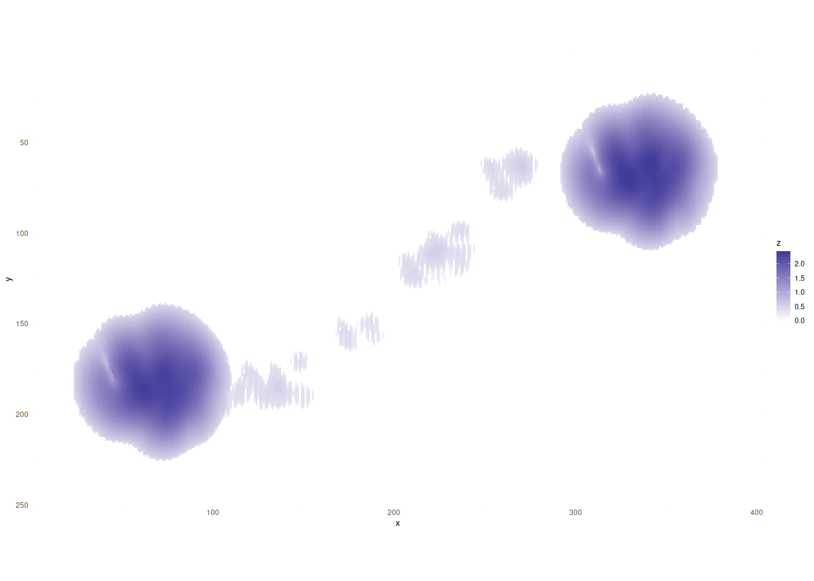<!-- -->

``` r
str(v1_output_original[[4]])
```

    ##  num [1:2, 1:250, 1:403, 1:683] 0 0 0 0 0 0 0 0 0 0 ...
    ##  - attr(*, "dimnames")=List of 4
    ##   ..$ : chr [1:2] "1.5874010519682_0" "1.5874010519682_0.392699081698724"
    ##   ..$ : chr [1:250] "-66.8023148097114" "-65.8023148097114" "-64.8023148097114" "-63.8023148097114" ...
    ##   ..$ : chr [1:403] "-65.8300863816789" "-64.8300863816789" "-63.8300863816789" "-62.8300863816789" ...
    ##   ..$ : chr [1:683] "0" "0.694444444444444" "1.38888888888889" "2.08333333333333" ...

``` r
plot_heatmap(v1_output_original[[4]][1, , , 250])
```

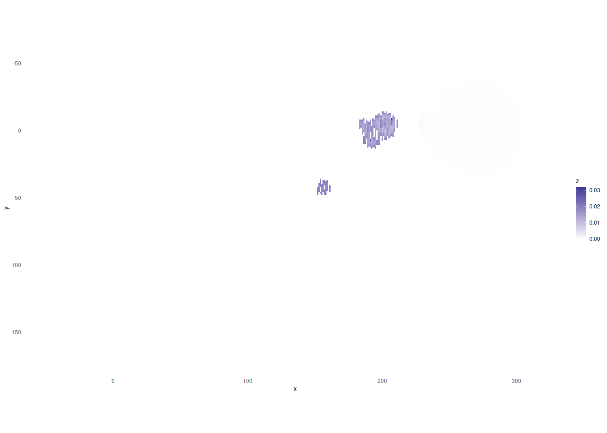<!-- -->

``` r
# with downsampling
v1_output_downsampled <- v1(stim_mat = all_noise_patches[[1]], # the noise patch as a matrix
                            gabor_list = reduced_gabor_list_heiko, # a list of gabor filters created by 'get_gabor_filter_bank'
                            irf_df = reduced_irf_space, # a data.frame of IRFs resolved in SF x time created by 'get_IRF_df'
                            signal_x = x_stim_traj, 
                            signal_y = y_stim_traj, 
                            signal_t = t_stim_traj, # properties of the signal (relative to saccade onset)
                            output_full_sequences = TRUE, # TRUE: returns complete sequences. WARNING: this is memory-intense
                            output_full_sequences_spatial_resample_to = c(20, 40), 
                            signal_x_range = NULL, signal_y_range = NULL, signal_t_range = NULL, # the min and max of temporal scale
                            no_CUDA = FALSE, # set to TRUE if you want to use CPU instead of GPU (but torch)
                            use_half_precision = TRUE, # if a GPU is available, use half-precision?
                            spatial_resolution = spatial_resolution, # spatial resolution of processing function in dva
                            temporal_resolution = temporal_resolution, # temporal resolution of processing function in milliseconds
                            use_normalization_pool = FALSE, # use normalization pool?
                            debug_mode = FALSE, # shows output at every step
                            show_final_maps = TRUE,  # shows all resulting 2D maps at the end
                            final_maps_filename = "" # name of the pdf file if show_final_maps==TRUE
)
```

    ## [1] "dim(mat_over_t) = 250,403,683 [y,x,t]"
    ## [1] "Gabor filter 1 of 2, SF=1.59, Ori=0"
    ## standard 2D convolution: 1.211 sec elapsed
    ## Temporal conv and low-pass: 0.397 sec elapsed
    ## [1] "Gabor filter 2 of 2, SF=1.59, Ori=0.39"
    ## standard 2D convolution: 1.196 sec elapsed
    ## Temporal conv and low-pass: 0.448 sec elapsed
    ## [1] "Performing normalization..."
    ## Normalization of responses (filter 1 of 2): 0.365 sec elapsed
    ## Normalization of responses (filter 2 of 2): 2.406 sec elapsed
    ## [1] "Done."
    ## [1] "Resulting dim(final_2d_over_filters) = 2,250,403 [y,x,t]"

``` r
plot_heatmap(v1_output_downsampled[[1]][1, , ]) # just make sure it's the same
```

<!-- -->

``` r
str(v1_output_downsampled[[4]])
```

    ##  num [1:2, 1:20, 1:40, 1:683] 0 0 0 0 0 0 0 0 0 0 ...
    ##  - attr(*, "dimnames")=List of 4
    ##   ..$ : chr [1:2] "1.5874010519682_0" "1.5874010519682_0.392699081698724"
    ##   ..$ : chr [1:20] "-66.8023148097114" "-53.6970516518167" "-40.5917884939219" "-27.4865253360272" ...
    ##   ..$ : chr [1:40] "-65.8300863816789" "-55.5223940739866" "-45.2147017662943" "-34.907009458602" ...
    ##   ..$ : chr [1:683] "0" "0.694444444444444" "1.38888888888889" "2.08333333333333" ...

``` r
plot_heatmap(v1_output_downsampled[[4]][1, , , 250])
```

<!-- -->

``` r
# clean up
rm(v1_output_original, v1_output_downsampled)
```

# Make a illustration of the motion-streak system

``` r
# we will need this function
convolve_with_irf <- function(x, irf, crop_length=FALSE) {
  if (crop_length) {
    y <- zapsmall(convolve(x, rev(irf), type = "open"))[1:length(x)]
  } else {
    y <- zapsmall(convolve(x, rev(irf), type = "open"))
  }
  return(y)
}

# get the RFs and TRFs
two_Gabors <- list(gabor_list_heiko_2[[20]], gabor_list_heiko_2[[24]])
two_Gabors_SF <- two_Gabors[[2]][[3]]['rf_freq_dva']
two_Gabors_trf <- irf_space[irf_space$SF==two_Gabors_SF, ]
plot_heatmap(two_Gabors[[1]][[1]]) # orthogonal
```

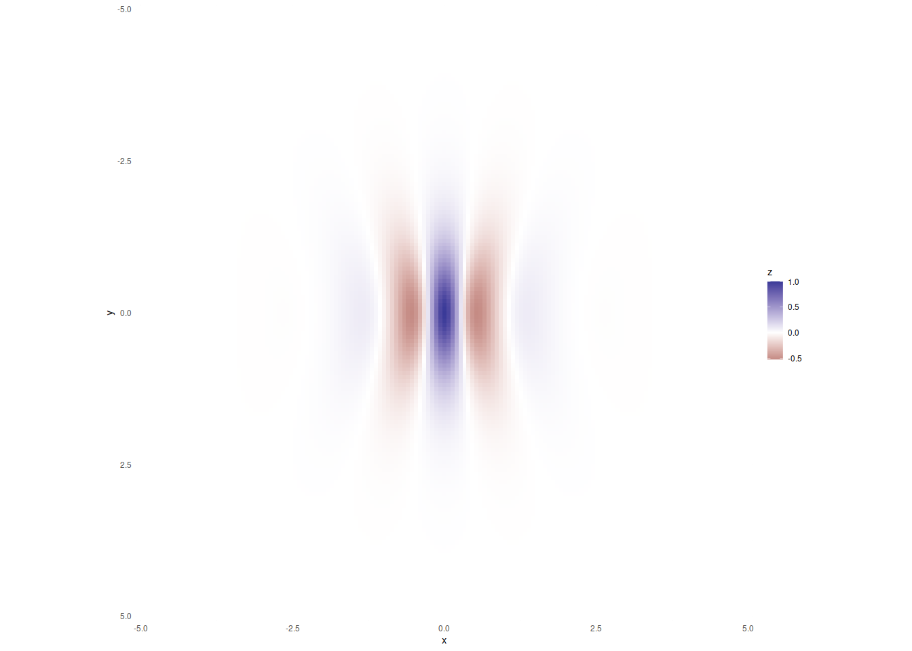<!-- -->

``` r
plot_heatmap(two_Gabors[[2]][[1]]) # parallel
```

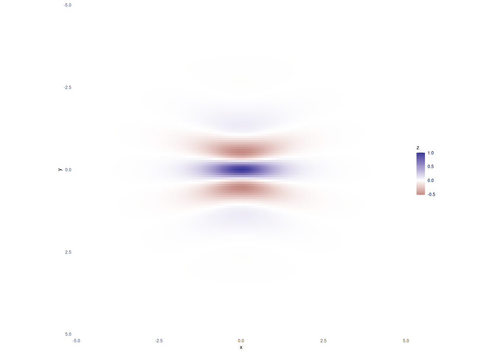<!-- -->

``` r
are_equal(dim(two_Gabors[[2]][[1]]), dim(two_Gabors[[1]][[1]]))
```

    ## [1] TRUE

``` r
# simulate two types of movements - slow and fast
use_colors <- c('#7fbf7b', '#998ec3')
move_amp <- unique(dim(two_Gabors[[2]][[1]]))
move_amp_dva <- move_amp / scr.ppd
vel_slow = 10 # dva/s
vel_fast = 100
dur_slow = move_amp_dva / vel_slow
dur_fast = move_amp_dva / vel_fast
move_traj_slow <- seq(0, move_amp, length.out = round(dur_slow / (temporal_resolution/1000)))
time_slow <- seq(temporal_resolution/1000, length(move_traj_slow)*temporal_resolution/1000, 
                 by = temporal_resolution/1000)
are_equal(length(move_traj_slow), length(time_slow))
```

    ## [1] TRUE

``` r
median(diff(move_traj_slow)) / (temporal_resolution/1000) / scr.ppd
```

    ## [1] 10.00612

``` r
move_traj_fast <- seq(0, move_amp, length.out = round(dur_fast / (temporal_resolution/1000)))
time_fast <- seq(temporal_resolution/1000, length(move_traj_fast)*temporal_resolution/1000, 
                 by = temporal_resolution/1000)
are_equal(length(move_traj_fast), length(time_fast))
```

    ## [1] TRUE

``` r
median(diff(move_traj_fast)) / (temporal_resolution/1000) / scr.ppd
```

    ## [1] 100.7513

``` r
# simulate the dot pass through the RF - spatial convolution
two_Gabors_resp <- NULL
for (move_type in c("10 dva/s", "100 dva/s")) {
  if (move_type=="10 dva/s") {
    move_traj_now <- move_traj_slow
    time_now <- time_slow
  } else {
    move_traj_now <- move_traj_fast
    time_now <- time_fast
  }
  for (move_x_i in 1:length(move_traj_now)) {
    timenow <- time_now[move_x_i]
    # make Gaussian blob
    meshi <- meshgrid(x = seq(0, move_amp, length.out = move_amp), 
                      y = seq(0, move_amp, length.out = move_amp))
    meshi$X <- meshi$X - move_traj_now[move_x_i]
    meshi$Y <- meshi$Y - move_amp%/%2
    stim <- dnorm(x = sqrt(meshi$X^2+meshi$Y^2), mean = 0, sd = 0.1 * scr.ppd)
    stim <- stim / max(stim)
    # spatial convolution
    parallel_resp_even <- sum(stim*two_Gabors[[2]][[1]])
    parallel_resp_odd <- sum(stim*two_Gabors[[2]][[2]])
    orthogonal_resp_even <- sum(stim*two_Gabors[[1]][[1]])
    orthogonal_resp_odd <- sum(stim*two_Gabors[[1]][[2]])
    # save
    two_Gabors_resp <- rbind(two_Gabors_resp, 
                             data.table(move_type, timenow, 
                                        parallel_resp_even, parallel_resp_odd, 
                                        orthogonal_resp_even, orthogonal_resp_odd))
  }
}
# norm by maximum
two_Gabors_resp[ , parallel_max := max(c(max(parallel_resp_even), max(parallel_resp_odd)))]
two_Gabors_resp[ , orthogonal_max := max(c(max(parallel_resp_even), max(parallel_resp_odd)))]
two_Gabors_resp[ , parallel_resp_even := parallel_resp_even / parallel_max]
two_Gabors_resp[ , parallel_resp_odd := parallel_resp_odd / parallel_max]
two_Gabors_resp[ , orthogonal_resp_even := orthogonal_resp_even / orthogonal_max]
two_Gabors_resp[ , orthogonal_resp_odd := orthogonal_resp_odd / orthogonal_max]

# temporal convolution
irf_with_delay <- c(rep(0, 100/temporal_resolution), two_Gabors_trf$irf)
two_Gabors_resp_trf <- two_Gabors_resp[ , .(parallel_resp_even_trf = convolve_with_irf(parallel_resp_even,
                                                                                       irf_with_delay), 
                                            parallel_resp_odd_trf = convolve_with_irf(parallel_resp_odd,
                                                                                      irf_with_delay), 
                                            orthogonal_resp_even_trf = convolve_with_irf(orthogonal_resp_even,
                                                                                         irf_with_delay), 
                                            orthogonal_resp_odd_trf = convolve_with_irf(orthogonal_resp_odd,
                                                                                        irf_with_delay)), 
                                        by = .(move_type)]
two_Gabors_resp_trf[ , timenow := seq(temporal_resolution/1000, 
                                      length(parallel_resp_even_trf)*temporal_resolution/1000, 
                                      by = temporal_resolution/1000), 
                     by = .(move_type)]
two_Gabors_resp_trf[ , parallel_resp_trf := sqrt(parallel_resp_even_trf^2 + parallel_resp_odd_trf^2)]
two_Gabors_resp_trf[ , orthogonal_resp_trf := sqrt(orthogonal_resp_even_trf^2 + orthogonal_resp_odd_trf^2)]

# perform delayed normalization
two_Gabors_resp_trf[ , parallel_resp_lp := convolve_with_irf(parallel_resp_trf, iris_groen_irf_norm, 
                                                             crop_length = TRUE), 
                     by = .(move_type)]
two_Gabors_resp_trf[ , orthogonal_resp_lp := convolve_with_irf(orthogonal_resp_trf, iris_groen_irf_norm, 
                                                               crop_length = TRUE), 
                     by = .(move_type)]
two_Gabors_resp_trf[ , parallel_resp_norm := (parallel_resp_trf^prm.n) /
                       ((prm.sigma^prm.n) + (((parallel_resp_lp*1.3+orthogonal_resp_lp*0.7)/2)^prm.n))]
two_Gabors_resp_trf[ , orthogonal_resp_norm := (orthogonal_resp_trf^prm.n) /
                       ((prm.sigma^prm.n) + (((parallel_resp_lp*1.3+orthogonal_resp_lp*0.7)/2)^prm.n))]


# this is what you'd expect
p_twoGabors_trf <- ggplot(data = two_Gabors_resp_trf, aes(x = timenow, y = parallel_resp_even_trf, 
                                       color = "parallel", linetype = "even")) +
  geom_line(data = two_Gabors_resp, aes(x = timenow, y = parallel_resp_even, 
                                        color = "parallel", linetype = "even"), 
            alpha = 0.3) + 
  geom_line(data = two_Gabors_resp, aes(x = timenow, y = parallel_resp_odd, 
                                        color = "parallel", linetype = "odd"), 
            alpha = 0.3) + 
  geom_line(data = two_Gabors_resp, aes(x = timenow, y = orthogonal_resp_even, 
                                        color = "orthogonal", linetype = "even"), 
            alpha = 0.3) +
  geom_line(data = two_Gabors_resp, aes(x = timenow, y = orthogonal_resp_odd, 
                                        color = "orthogonal", linetype = "odd"), 
            alpha = 0.3) +
  geom_line(data = two_Gabors_resp_trf, aes(x = timenow, y = orthogonal_resp_even_trf, 
                                            color = "orthogonal", linetype = "even"), 
            size = 1.5, alpha = 0.8) + 
  geom_line(data = two_Gabors_resp_trf, aes(x = timenow, y = orthogonal_resp_odd_trf, 
                                            color = "orthogonal", linetype = "odd"), 
            size = 1.5, alpha = 0.8) + 
  geom_line(data = two_Gabors_resp_trf, aes(x = timenow, y = parallel_resp_odd_trf, 
                                            color = "parallel", linetype = "odd"), 
            size = 1.5, alpha = 0.8) + 
  geom_line(size = 1.5, alpha = 0.8) + 
  facet_wrap(~move_type, scales = "free_x") + 
  theme_minimal() + SDECTheme() + 
  labs(x = "Time [s]", y = "Response after\ntemporal filtering", color = "RF orientation", 
       linetype = "RF phase") + 
  scale_color_manual(values = use_colors) + scale_x_continuous(expand = c(0,0)) + 
  scale_linetype_manual(values = c("solid", "dashed"))
```

    ## Warning: Using `size` aesthetic for lines was deprecated in ggplot2 3.4.0.
    ## ℹ Please use `linewidth` instead.
    ## This warning is displayed once every 8 hours.
    ## Call `lifecycle::last_lifecycle_warnings()` to see where this warning was
    ## generated.

``` r
# after squaring
p_twoGabors_lp <- ggplot(data = two_Gabors_resp_trf, aes(x = timenow, y = parallel_resp_trf, 
                                                         color = "parallel", alpha = "squared")) +
  geom_line(data = two_Gabors_resp_trf, aes(x = timenow, y = orthogonal_resp_trf, 
                                            color = "orthogonal", alpha = "squared"), 
            size = 1.5) + 
  geom_line(size = 1.5) + 
  geom_line(data = two_Gabors_resp_trf, aes(x = timenow, y = orthogonal_resp_lp, 
                                            color = "orthogonal", alpha = "delayed"),
            size = 1.5) +
  geom_line(data = two_Gabors_resp_trf, aes(x = timenow, y = parallel_resp_lp, 
                                            color = "parallel", alpha = "delayed"),
            size = 1.5) +
  facet_wrap(~move_type, scales = "free_x") + 
  scale_alpha_manual(values = c(0.3, 0.8)) + 
  theme_minimal() + SDECTheme() + 
  labs(x = "Time [s]", y = "Response after\nsquaring", color = "RF orientation", alpha = "Response") + 
  scale_color_manual(values = use_colors) + scale_x_continuous(expand = c(0,0))

# after delayed normalization
p_twoGabors_norm <- ggplot(data = two_Gabors_resp_trf, aes(x = timenow, y = parallel_resp_norm, 
                                                           color = "parallel")) +
  geom_line(data = two_Gabors_resp_trf, aes(x = timenow, y = orthogonal_resp_norm, 
                                            color = "orthogonal"), 
            size = 1.5, alpha = 0.8) + 
  geom_line(size = 1.5, alpha = 0.8) + 
  facet_wrap(~move_type, scales = "free_x") + 
  theme_minimal() + SDECTheme() + 
  labs(x = "Time [s]", y = "Response after\ndelayed normalization", color = "RF orientation") + 
  scale_color_manual(values = use_colors) + scale_x_continuous(expand = c(0,0))

# combine
plot_grid(p_twoGabors_trf, p_twoGabors_lp, p_twoGabors_norm, 
          nrow = 3, align = "hv", axis = "tblr") # export as 8x8
```

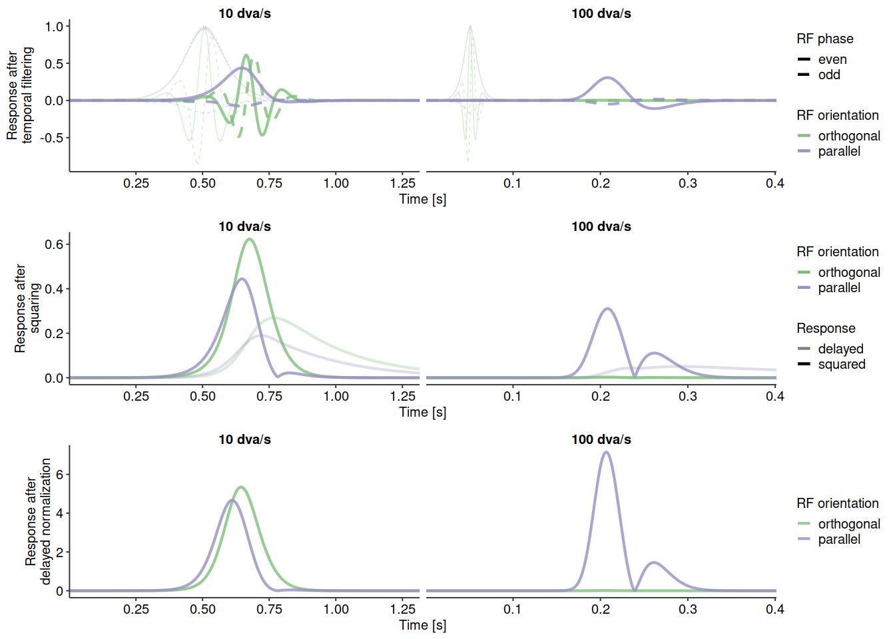<!-- -->

# Let the model output the engagement of SF-orientation channels

``` r
run_channel_engagement <- FALSE 
# parameters
millis_after_sac_offset <- 100
try_par_save <- TRUE
seed_add <- 1000 # used to scale the random seed (which depends on the trial counter), first run: 1000

if (run_channel_engagement) {
  
  n_trials <- 10 # number of trials to sample for each condition and observer
  
  # preallocate
  all_pred <- vector(mode = "list", 
                     length = length(unique(all_saccades$subj_id))*
                       length(unique(all_saccades$move_direction_f))*
                       length(unique(all_saccades$streak_present_f))*
                       n_trials)
  trial_i <- 1
  for (subj_now in unique(all_saccades$subj_id)) {
    noise_patch_now <- all_noise_patches[[as.integer(subj_now)]]
    for (cond_now in unique(all_saccades$move_direction_f)) {
      for (streak_now in unique(all_saccades$streak_present_f)) {
        print(paste(subj_now, cond_now, streak_now))
        # get the subset of saccade data, use only rightward saccades for now
        data_now <- all_saccades[subj_id==subj_now & 
                                   move_direction_f==cond_now & 
                                   streak_present_f==streak_now & 
                                   start_left_f==unique(start_left_f)[1]]
        # sample from unique trial ID
        set.seed(seed_add+trial_i)
        subset_IDs <- sample(sort(unique(data_now$ID)))[1:n_trials]
        
        # loop across trials
        for (subset_ID in subset_IDs) {
          
          # get trial data
          data_ID <- data_now[ID==subset_ID] 
          data_ID <- data_ID[time_sac_off<=millis_after_sac_offset]
          # make sure we do not display continuous motion in the absent condition
          if (grepl(x = streak_now, pattern = "absent")) { 
            data_ID <- data_ID[stim_moving==FALSE]
            assert_that(all(!data_ID$stim_moving))
          }
          # for checks: plot(data_ID$retinal_x, data_ID$retinal_y)
          x_stim_traj <- data_ID$retinal_x
          y_stim_traj <- data_ID$retinal_y
          x_static_stim_traj <- data_ID$retinal_x_static
          y_static_stim_traj <- data_ID$retinal_y_static
          t_stim_traj <- data_ID$time_sac_off # we know that the sequence starts 100 ms prior to saccade onset
          
          # run the visual processing
          v1_output <- v1(stim_mat = noise_patch_now, # the noise patch as a matrix
                          gabor_list = gabor_list_heiko_2, # a list of gabor filters created by 'get_gabor_filter_bank'
                          irf_df = irf_space, # a data.frame of IRFs resolved in SF x time created by 'get_IRF_df'
                          signal_x = x_stim_traj, 
                          signal_y = y_stim_traj, 
                          signal_t = t_stim_traj, # properties of the signal (relative to saccade onset)
                          output_full_sequences = TRUE, # TRUE: returns complete sequences. WARNING: this is memory-intense
                          output_full_sequences_spatial_resample_to = c(50, 100), # spatial downsampling to make things easier
                          signal_x_range = NULL, signal_y_range = NULL, signal_t_range = NULL, # the min and max of temporal scale
                          no_CUDA = FALSE, # set to TRUE if you want to use CPU instead of GPU (but torch)
                          use_half_precision = FALSE, # if a GPU is available, use half-precision?
                          spatial_resolution = spatial_resolution, # spatial resolution of processing function in dva
                          temporal_resolution = temporal_resolution, # temporal resolution of processing function in milliseconds
                          use_normalization_pool = TRUE, # use normalization pool?
                          debug_mode = FALSE, # shows output at every step
                          show_final_maps = FALSE,  # shows all resulting 2D maps at the end
                          final_maps_filename = "" # name of the pdf file if show_final_maps==TRUE
          )
          output_now <- zapsmall(v1_output[[1]], digits = 4)
          output_now_full <- zapsmall(v1_output[[4]], digits = 4)
          # apply sums
          sums_now <- apply(X = output_now, MARGIN = 1, FUN = sum)
          means_now <- apply(X = output_now, MARGIN = 1, FUN = mean)
          kernel_dims <- unlist(lapply(X = gabor_list_heiko_2, FUN = function(x) { prod(dim(x[[1]])) } ))
          kernel_SF <- unlist(lapply(X = gabor_list_heiko_2, FUN = function(x) { x[[3]]['rf_freq_dva'] } ))
          kernel_Ori <- unlist(lapply(X = gabor_list_heiko_2, FUN = function(x) { x[[3]]['rf_ori'] } ))
          # convert to data table
          df_now <- data.table(SF = kernel_SF, Ori = kernel_Ori, 
                               total_mean = means_now, 
                               total_sum = sums_now, kernel_dim = kernel_dims)
          df_now[ , ID := subset_ID]
          df_now[ , subj_id := subj_now]
          df_now[ , move_direction_f := cond_now]
          df_now[ , streak_present_f := streak_now]
          df_now[ , corrected_sum := total_sum / kernel_dim]
          # quick plot
          p_quick <- ggplot(df_now, aes(x = Ori, y = SF, fill = total_mean)) +
            geom_tile() + scale_y_log10() + coord_cartesian(expand = FALSE) + 
            labs(title = paste(subset_ID, unique(df_now$move_direction_f), unique(df_now$streak_present_f), sep = ", ")) + 
            scale_fill_viridis_c(option = "mako")
          print(p_quick)
          
          # save full output along with a few descriptive variables
          output_list <- list(df_now, output_now, output_now_full)
          print(paste("Saving", paste0("v1_output_", subset_ID, ".rda"), "with dimensions", 
                      paste(dim(output_now_full), collapse = ","), "..."))
          if (try_par_save) {
            con <- pipe(paste0("xz -T16 -6 -e > ", file.path("model_output", paste0("v1_output_", subset_ID, ".xz"))), "wb")
            save(output_list, file = con)
            close(con)
            # # read with
            # con <- xzfile(file.path("model_output", paste0("v1_output_", subset_ID, ".xz")), "r")
            # load(con)
            # close(con)
          } else {
            save(output_list, file = file.path("model_output", paste0("v1_output_", subset_ID, ".rda")), 
                 compress = "xz")
          }
          print(paste("... done."))
          # save here
          all_pred[[trial_i]] <- df_now
          trial_i <- trial_i + 1
          # clean up
          rm(v1_output, df_now, output_now, output_now_full, output_list, p_quick)
        } # across trials
      } # across present/absent
    } # across move directions
  } # across subjects
  # convert to data.frame and save
  all_pred <- rbindlist(all_pred)
  # save
  save(all_pred, file = "all_channel_engagement.rda", compress = "xz")
  
} else {
  
  load("all_channel_engagement.rda")
  
}
```

Pretty plots on overall channel engagement:

``` r
# estimate direction of streak-present retinal direction and minimum retinal velocity
direction_agg_ID <- all_saccades[start_left_f=="rightward saccade" & streak_present_f=="streak present" &
                                   stim_moving==TRUE, 
                                 .(retinal_dir = median(atan2(diff(retinal_x), diff(retinal_y) )), 
                                   retinal_speed = min(sqrt(diff(retinal_x/scr.ppd /(1/1440))^2 + 
                                                                 diff(retinal_y/scr.ppd /(1/1440))^2))), 
                                 by = .(subj_id, ID, move_direction_f)]
direction_agg_ID[ , retinal_dir := retinal_dir + pi/2]
direction_agg_ID[retinal_dir>pi/2 , retinal_dir := retinal_dir - pi]
ggplot(direction_agg_ID, aes(x = retinal_dir, color = move_direction_f)) + geom_freqpoly()
```

    ## `stat_bin()` using `bins = 30`. Pick better value with `binwidth`.

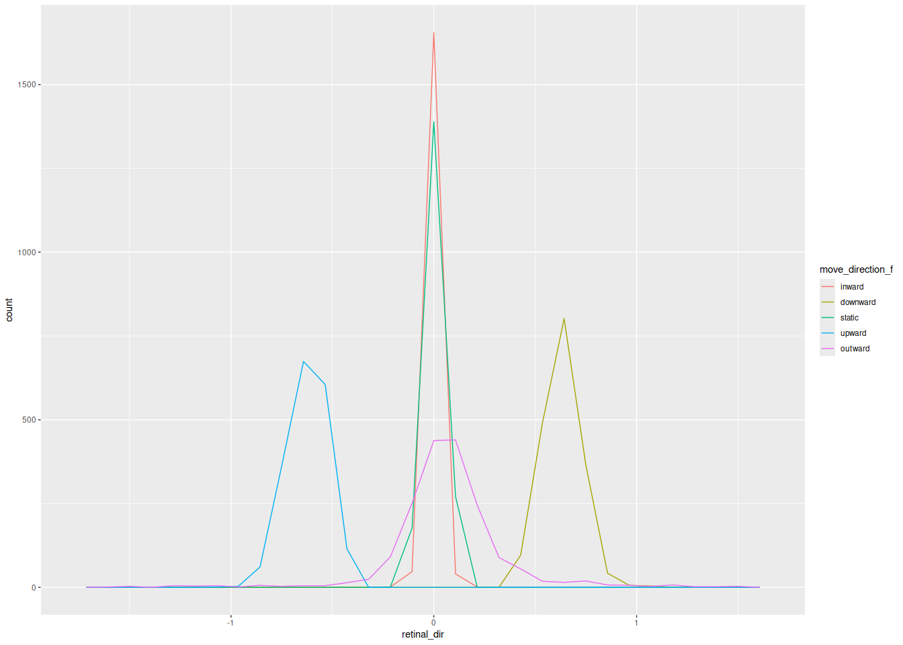<!-- -->

``` r
direction_agg <- direction_agg_ID[ , .(retinal_dir = mean(retinal_dir), 
                                       retinal_dir_sd = sd(retinal_dir), 
                                       retinal_speed = mean(retinal_speed), 
                                       retinal_speed_sd = sd(retinal_speed)), 
                                   by = .(move_direction_f)]
direction_agg
```

    ##    move_direction_f  retinal_dir retinal_dir_sd retinal_speed retinal_speed_sd
    ##              <fctr>        <num>          <num>         <num>            <num>
    ## 1:         downward  0.631182556     0.09066427     366.44197         51.38555
    ## 2:           static  0.006294357     0.04588523     252.03111         70.72044
    ## 3:           upward -0.622230118     0.09554911     369.70152         49.84808
    ## 4:          outward  0.069246275     0.27783682      29.87679         30.21123
    ## 5:           inward  0.001867511     0.02709597     521.58617         71.93563

``` r
# merge with stimulus frequency cutoffs
direction_agg_ext <- cbind(direction_agg, all_noise_patches_descriptions_agg)
direction_agg_ext[ , max_pow_se := max_pow_sd / sqrt(length(unique(sdec$subj_id)))]

# remap Orientation, so that 0 is horizontal 
all_pred[ , Ori_remap := Ori - pi/2]
all_pred[Ori_remap<(-pi/2), Ori_remap := Ori_remap + pi]
all_pred[ , Ori_remap := -1*Ori_remap]

## make an overview plot
# observer x condition
all_pred_subj_condition <- all_pred[ , .(total_mean = mean(total_sum)), 
                                     by = .(subj_id, move_direction_f, streak_present_f, SF, Ori_remap)]
# reorder conditions
all_pred_subj_condition$move_direction_f <- factor(all_pred_subj_condition$move_direction_f, 
                                                   levels = c("static", "inward", "outward", "downward", "upward"))
# duplicate the vertical orientations
vertical_temp <- all_pred_subj_condition[Ori_remap==min(Ori_remap)]
vertical_temp[ , Ori_remap := abs(Ori_remap)]
all_pred_subj_condition <- rbind(all_pred_subj_condition, vertical_temp)
rm(vertical_temp)

# normalize?
all_pred_subj_condition[ , total_mean.n := (total_mean) / (max(total_mean)), 
                         by = .(subj_id, #streak_present_f,  
                                move_direction_f)]

# overview plot
ggplot(data = all_pred_subj_condition, aes(x = Ori_remap, y = SF, fill = total_mean.n)) + 
  coord_cartesian(expand = FALSE) + 
  scale_y_log10() + 
  scale_fill_viridis_c(option = "mako") + 
  geom_tile() + 
  theme_minimal() + SDECTheme() + 
  labs(x = "Orientation", y = "SF") + 
  facet_grid(move_direction_f+streak_present_f~subj_id)
```

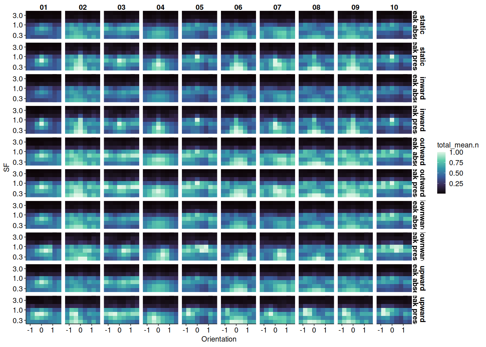<!-- -->

``` r
## grand aggregate for streak-present plot
all_pred_present <- all_pred_subj_condition[ , #streak_present_f=="streak present", 
                                            .(total_mean = mean(total_mean.n)), 
                                            by = .(move_direction_f, SF, Ori_remap)] 
# 
p_channels_overview <- ggplot(data = all_pred_present, aes(x = Ori_remap, y = SF)) + 
  coord_cartesian(expand = FALSE) + 
  scale_y_log10() + 
  scale_fill_viridis_c(option = "mako") + 
  geom_raster(aes(fill = total_mean ), interpolate = FALSE) + 
  theme_minimal() + SDECTheme() + 
  labs(x = "Orientation", y = "SF") + 
  facet_grid(.~move_direction_f)
p_channels_overview
```

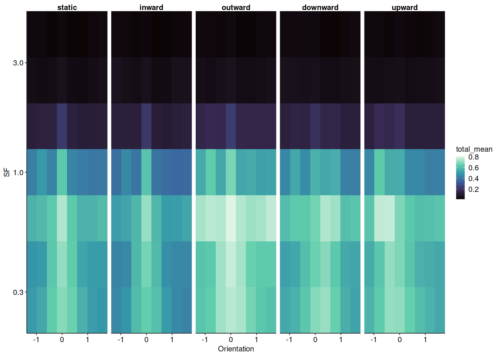<!-- -->

``` r
## present-absent difference
all_pred_presentabsent_subj <- 
  all_pred_subj_condition[ , 
                           .(total_diff = mean(total_mean.n[streak_present_f=="streak present"]-
                                                 total_mean.n[streak_present_f=="streak absent"])), 
                           by = .(subj_id, move_direction_f, SF, Ori_remap)] 
all_pred_presentabsent <- all_pred_presentabsent_subj[ , .(total_diff = mean(total_diff)), 
                                                       by = .(move_direction_f, SF, Ori_remap)]

p_channels_diff <- ggplot(data = all_pred_presentabsent, aes(x = Ori_remap, y = SF)) + 
  coord_cartesian(expand = FALSE) + 
  scale_y_log10() + 
  geom_raster(aes(fill = total_diff), interpolate = FALSE) + 
  scale_fill_viridis_c(option = "mako") + 
  # geom_point(data = direction_agg_ext, aes(x = retinal_dir, y = max_pow), 
  #            color = "red", size = 1, alpha = 0.8) + 
  geom_errorbarh(data = direction_agg_ext, aes(x = retinal_dir, 
                                               xmax = retinal_dir+2*retinal_dir_sd,
                                               xmin = retinal_dir-2*retinal_dir_sd,
                                               y = max_pow), 
                 color = "red", size = 1, height = 0, alpha = 0.8) +
  geom_errorbar(data = direction_agg_ext, aes(x = retinal_dir, 
                                           ymax = max_pow+max_pow_sd,
                                           ymin = max_pow-max_pow_sd,
                                           #ymax = high_cutoff, 
                                           #ymin = low_cutoff,
                                           y = max_pow), 
                 color = "red", size = 1, width = 0, alpha = 0.8) +
  theme_minimal() + SDECTheme() + 
  labs(x = "Orientation", y = "SF") + 
  facet_grid(.~move_direction_f)
```

    ## Warning in geom_errorbarh(data = direction_agg_ext, aes(x = retinal_dir, :
    ## Ignoring unknown aesthetics: x

``` r
p_channels_diff
```

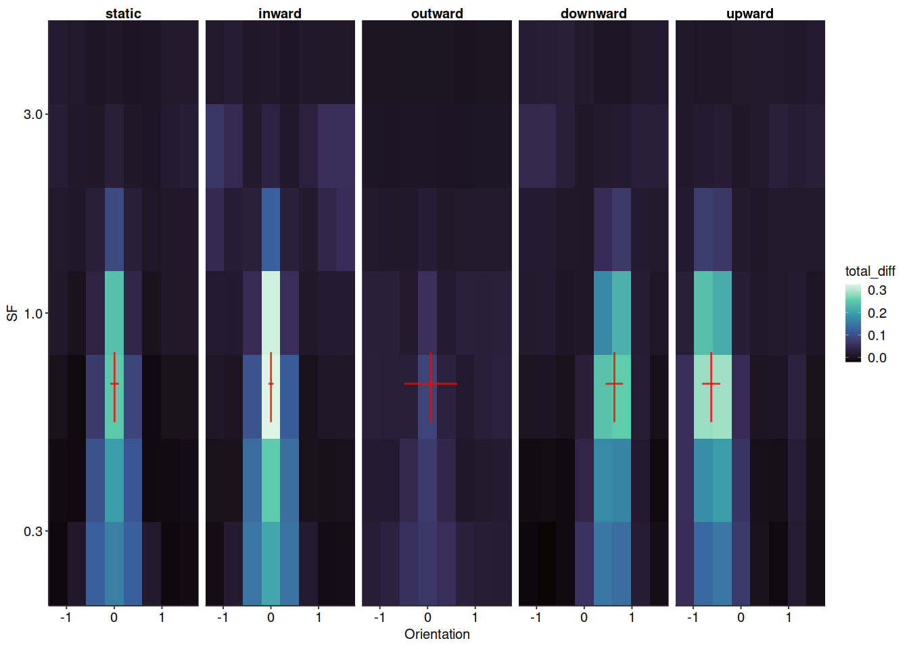<!-- -->

``` r
# combine the two
plot_grid(p_channels_overview, p_channels_diff, nrow = 2, align = "hv")
```

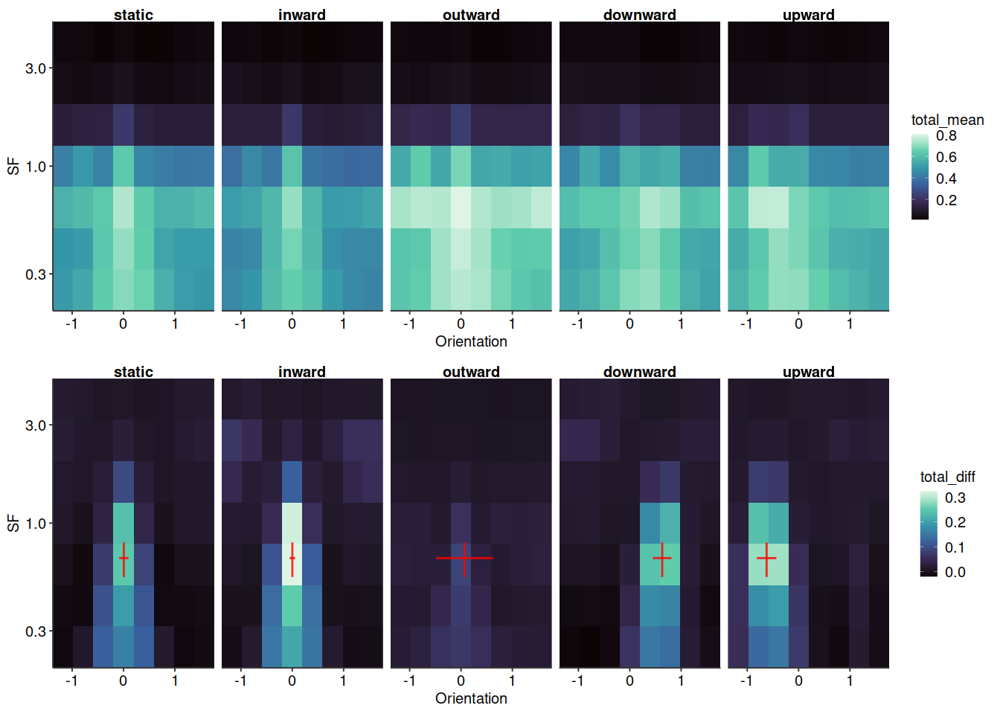<!-- -->

Aggregate saccade landing positions… Because what is the
decision-relevant variable? - the post-saccadic target position.

``` r
require(ez)
```

    ## Loading required package: ez

``` r
# initial fixation points prior to saccade
startpoints <- all_saccades[time_sac_on<0 & time_sac_on>(-20), # previously 50
                            .(retinal_x = mean(retinal_x / scr.ppd),
                              retinal_y = mean(retinal_y / scr.ppd),
                              retinal_x_static = mean(retinal_x_static / scr.ppd),
                              retinal_y_static = mean(retinal_y_static / scr.ppd) ),
                            by = .(start_left_f, streak_present_f, move_direction_f, subj_id, ID)]
startpoints_summary <- startpoints[ ,
                                    .(retinal_x_m = mean(retinal_x_static),
                                      retinal_x_sd = sd(retinal_x_static),
                                      retinal_y_m = mean(retinal_y_static),
                                      retinal_y_sd = sd(retinal_y_static)),
                                    by = .(start_left_f, streak_present_f, move_direction_f, subj_id)]
startpoints_summary[ , retinal_x_m_corr := retinal_x_m]
startpoints_summary[start_left_f=="leftward saccade", retinal_x_m_corr := retinal_x_m_corr * (-1)]
ezStats(data = startpoints_summary, dv = .(retinal_x_m_corr), wid = .(subj_id),
        within = .(move_direction_f))
```

    ## Warning: Converting "subj_id" to factor for ANOVA.

    ## Warning: Collapsing data to cell means. *IF* the requested effects are a subset
    ## of the full design, you must use the "within_full" argument, else results may
    ## be inaccurate.

    ##   move_direction_f  N     Mean        SD       FLSD
    ## 1           inward 10 18.08708 0.1624917 0.01453177
    ## 2         downward 10 18.09537 0.1618896 0.01453177
    ## 3           static 10 18.09622 0.1503748 0.01453177
    ## 4           upward 10 18.08337 0.1666430 0.01453177
    ## 5          outward 10 18.09112 0.1634057 0.01453177

``` r
ezStats(data = startpoints_summary, dv = .(retinal_y_m), wid = .(subj_id),
        within = .(move_direction_f))
```

    ## Warning: Converting "subj_id" to factor for ANOVA.
    ## Warning: Collapsing data to cell means. *IF* the requested effects are a subset
    ## of the full design, you must use the "within_full" argument, else results may
    ## be inaccurate.

    ##   move_direction_f  N        Mean        SD       FLSD
    ## 1           inward 10 -0.02116909 0.2690689 0.01493802
    ## 2         downward 10 -0.01620314 0.2600767 0.01493802
    ## 3           static 10 -0.01140876 0.2699453 0.01493802
    ## 4           upward 10 -0.01055621 0.2640341 0.01493802
    ## 5          outward 10 -0.01536813 0.2566213 0.01493802

``` r
# test for the vertical component of primary saccades
primary_dir_agg <- sdec[ , .(fix_y = mean((primary_start_y-start_pos_y)/scr.ppd), 
                             amplitude_y = mean(primary_amplitude_y)), 
                         by = .(subj_id, streak_present_f, move_direction_f, start_left_f)]
primary_dir_agg
```

    ##      subj_id streak_present_f move_direction_f      start_left_f       fix_y
    ##       <char>           <fctr>           <fctr>            <fctr>       <num>
    ##   1:      01    streak absent         downward rightward saccade  0.28875312
    ##   2:      01    streak absent         downward  leftward saccade  0.08398546
    ##   3:      01    streak absent           static rightward saccade  0.31984812
    ##   4:      01    streak absent           upward rightward saccade  0.31018088
    ##   5:      01    streak absent          outward rightward saccade  0.31785692
    ##  ---                                                                        
    ## 196:      10   streak present          outward rightward saccade -0.26574379
    ## 197:      10   streak present           inward rightward saccade -0.34605632
    ## 198:      10    streak absent           upward  leftward saccade -0.54044656
    ## 199:      10    streak absent          outward  leftward saccade -0.51733671
    ## 200:      10    streak absent           inward  leftward saccade -0.55757617
    ##      amplitude_y
    ##            <num>
    ##   1: -0.57255884
    ##   2:  0.07769048
    ##   3: -0.59046542
    ##   4: -0.54490579
    ##   5: -0.50358328
    ##  ---            
    ## 196: -1.02903199
    ## 197: -0.98779694
    ## 198: -0.46735288
    ## 199: -0.31295165
    ## 200: -0.20509656

``` r
ezStats(data = primary_dir_agg, dv = .(amplitude_y), wid = .(subj_id), 
        within = .(streak_present_f, start_left_f, move_direction_f))
```

    ## Warning: Converting "subj_id" to factor for ANOVA.

    ##    streak_present_f      start_left_f move_direction_f  N        Mean        SD
    ## 1     streak absent  leftward saccade           inward 10 -0.02826222 0.3280336
    ## 2     streak absent  leftward saccade         downward 10 -0.04849254 0.3519278
    ## 3     streak absent  leftward saccade           static 10 -0.05335957 0.3626726
    ## 4     streak absent  leftward saccade           upward 10 -0.06380132 0.3779370
    ## 5     streak absent  leftward saccade          outward 10 -0.03413258 0.3551692
    ## 6     streak absent rightward saccade           inward 10 -0.24790887 0.4792036
    ## 7     streak absent rightward saccade         downward 10 -0.25588226 0.4857567
    ## 8     streak absent rightward saccade           static 10 -0.24655467 0.4893076
    ## 9     streak absent rightward saccade           upward 10 -0.25747671 0.4952840
    ## 10    streak absent rightward saccade          outward 10 -0.27989093 0.4495900
    ## 11   streak present  leftward saccade           inward 10 -0.03078753 0.3468039
    ## 12   streak present  leftward saccade         downward 10 -0.01253155 0.3510872
    ## 13   streak present  leftward saccade           static 10 -0.02076175 0.3488267
    ## 14   streak present  leftward saccade           upward 10 -0.04355227 0.3296191
    ## 15   streak present  leftward saccade          outward 10 -0.01961085 0.3649712
    ## 16   streak present rightward saccade           inward 10 -0.24954655 0.4985004
    ## 17   streak present rightward saccade         downward 10 -0.25730622 0.4863280
    ## 18   streak present rightward saccade           static 10 -0.26978586 0.4665493
    ## 19   streak present rightward saccade           upward 10 -0.27204275 0.4781196
    ## 20   streak present rightward saccade          outward 10 -0.25379122 0.5004743
    ##          FLSD
    ## 1  0.05193731
    ## 2  0.05193731
    ## 3  0.05193731
    ## 4  0.05193731
    ## 5  0.05193731
    ## 6  0.05193731
    ## 7  0.05193731
    ## 8  0.05193731
    ## 9  0.05193731
    ## 10 0.05193731
    ## 11 0.05193731
    ## 12 0.05193731
    ## 13 0.05193731
    ## 14 0.05193731
    ## 15 0.05193731
    ## 16 0.05193731
    ## 17 0.05193731
    ## 18 0.05193731
    ## 19 0.05193731
    ## 20 0.05193731

``` r
ezANOVA(data = primary_dir_agg, dv = .(amplitude_y), wid = .(subj_id), 
        within = .(streak_present_f, start_left_f, move_direction_f))
```

    ## Warning: Converting "subj_id" to factor for ANOVA.

    ## $ANOVA
    ##                                           Effect DFn DFd         F         p
    ## 2                               streak_present_f   1   9 1.3845941 0.2695029
    ## 3                                   start_left_f   1   9 1.9237906 0.1988248
    ## 4                               move_direction_f   4  36 0.5013697 0.7348679
    ## 5                  streak_present_f:start_left_f   1   9 1.4793129 0.2548175
    ## 6              streak_present_f:move_direction_f   4  36 0.3698586 0.8285109
    ## 7                  start_left_f:move_direction_f   4  36 0.4162814 0.7957614
    ## 8 streak_present_f:start_left_f:move_direction_f   4  36 0.6081074 0.6593913
    ##   p<.05          ges
    ## 2       0.0001150976
    ## 3       0.0720604706
    ## 4       0.0002775240
    ## 5       0.0002075938
    ## 6       0.0001165558
    ## 7       0.0001418581
    ## 8       0.0002479585
    ## 
    ## $`Mauchly's Test for Sphericity`
    ##                                           Effect         W          p p<.05
    ## 4                               move_direction_f 0.4998727 0.82779485      
    ## 6              streak_present_f:move_direction_f 0.1242077 0.08694604      
    ## 7                  start_left_f:move_direction_f 0.3660077 0.60158074      
    ## 8 streak_present_f:start_left_f:move_direction_f 0.1408187 0.11385865      
    ## 
    ## $`Sphericity Corrections`
    ##                                           Effect       GGe     p[GG] p[GG]<.05
    ## 4                               move_direction_f 0.7733695 0.6898889          
    ## 6              streak_present_f:move_direction_f 0.6005071 0.7322364          
    ## 7                  start_left_f:move_direction_f 0.6740843 0.7225848          
    ## 8 streak_present_f:start_left_f:move_direction_f 0.5536026 0.5701852          
    ##         HFe     p[HF] p[HF]<.05
    ## 4 1.2246963 0.7348679          
    ## 6 0.8343581 0.7954717          
    ## 7 0.9900344 0.7939548          
    ## 8 0.7421648 0.6139274

``` r
# no significant effect across conditions, so make grand aggregate
primary_dir_agg_subj <- primary_dir_agg[ , .(amplitude_y = mean(amplitude_y)), 
                                         by = .(subj_id)]
summary(primary_dir_agg_subj$amplitude_y)
```

    ##     Min.  1st Qu.   Median     Mean  3rd Qu.     Max. 
    ## -0.67691 -0.33633 -0.09475 -0.14727  0.08923  0.25220

``` r
# endpoints
endpoints <- all_saccades[time_sac_off>=0 & time_sac_off<=20, # previously 50
                          .(retinal_x = mean(retinal_x / scr.ppd),
                            retinal_y = mean(retinal_y / scr.ppd),
                            retinal_x_static = mean(retinal_x_static / scr.ppd),
                            retinal_y_static = mean(retinal_y_static / scr.ppd) ),
                          by = .(start_left_f, streak_present_f, move_direction_f, subj_id, ID)]
# check whether there is any systematic effect on the landing position of the saccade
endpoints_summary <- endpoints[ ,
                               .(retinal_x_m = mean(retinal_x_static),
                                 retinal_x_sd = sd(retinal_x_static),
                                 retinal_y_m = mean(retinal_y_static),
                                 retinal_y_sd = sd(retinal_y_static)),
                               by = .(start_left_f, streak_present_f, move_direction_f, subj_id)]
endpoints_summary[ , retinal_x_m_corr := retinal_x_m]
endpoints_summary[start_left_f=="leftward saccade", retinal_x_m_corr := retinal_x_m_corr * (-1)]

# effect on landing position accuracy? - there are none!
# x dimension
ezANOVA(data = endpoints_summary, dv = .(retinal_x_m_corr), wid = .(subj_id),
        within = .(start_left_f, streak_present_f, move_direction_f),
        detailed = TRUE)
```

    ## Warning: Converting "subj_id" to factor for ANOVA.

    ## $ANOVA
    ##                                           Effect DFn DFd          SSn
    ## 1                                    (Intercept)   1   9 60.523288414
    ## 2                                   start_left_f   1   9  9.821562106
    ## 3                               streak_present_f   1   9  0.009667753
    ## 4                               move_direction_f   4  36  0.017403001
    ## 5                  start_left_f:streak_present_f   1   9  0.004840204
    ## 6                  start_left_f:move_direction_f   4  36  0.032739833
    ## 7              streak_present_f:move_direction_f   4  36  0.087221029
    ## 8 start_left_f:streak_present_f:move_direction_f   4  36  0.023408188
    ##            SSd         F          p p<.05          ges
    ## 1 164.94321194 3.3024069 0.10254913       2.186030e-01
    ## 2  50.09500528 1.7645284 0.21675767       4.342707e-02
    ## 3   0.15983211 0.5443823 0.47941695       4.468565e-05
    ## 4   0.36531221 0.4287484 0.78687668       8.043612e-05
    ## 5   0.02572068 1.6936504 0.22544613       2.237257e-05
    ## 6   0.17297319 1.7034923 0.17061919       1.513118e-04
    ## 7   0.36229680 2.1667022 0.09251508       4.030028e-04
    ## 8   0.21627446 0.9741034 0.43373070       1.081889e-04
    ## 
    ## $`Mauchly's Test for Sphericity`
    ##                                           Effect          W          p p<.05
    ## 4                               move_direction_f 0.29385988 0.44335173      
    ## 6                  start_left_f:move_direction_f 0.75640044 0.99068377      
    ## 7              streak_present_f:move_direction_f 0.07403028 0.02640355     *
    ## 8 start_left_f:streak_present_f:move_direction_f 0.67130139 0.96732351      
    ## 
    ## $`Sphericity Corrections`
    ##                                           Effect       GGe     p[GG] p[GG]<.05
    ## 4                               move_direction_f 0.7534732 0.7348978          
    ## 6                  start_left_f:move_direction_f 0.8643414 0.1808499          
    ## 7              streak_present_f:move_direction_f 0.5023729 0.1432060          
    ## 8 start_left_f:streak_present_f:move_direction_f 0.8443294 0.4254896          
    ##         HFe     p[HF] p[HF]<.05
    ## 4 1.1751764 0.7868767          
    ## 6 1.4692317 0.1706192          
    ## 7 0.6471244 0.1260916          
    ## 8 1.4127233 0.4337307

``` r
ezStats(data = endpoints_summary, dv = .(retinal_x_m_corr), wid = .(subj_id),
        within = .(start_left_f, streak_present_f))
```

    ## Warning: Converting "subj_id" to factor for ANOVA.
    ## Warning: Collapsing data to cell means. *IF* the requested effects are a subset
    ## of the full design, you must use the "within_full" argument, else results may
    ## be inaccurate.

    ##        start_left_f streak_present_f  N      Mean       SD       FLSD
    ## 1  leftward saccade    streak absent 10 0.7737418 1.016890 0.02418648
    ## 2  leftward saccade   streak present 10 0.7696755 1.023678 0.02418648
    ## 3 rightward saccade    streak absent 10 0.3403751 1.188377 0.02418648
    ## 4 rightward saccade   streak present 10 0.3166310 1.135134 0.02418648

``` r
ezStats(data = endpoints_summary, dv = .(retinal_x_m_corr), wid = .(subj_id),
        within = .(move_direction_f))
```

    ## Warning: Converting "subj_id" to factor for ANOVA.
    ## Warning: Collapsing data to cell means. *IF* the requested effects are a subset
    ## of the full design, you must use the "within_full" argument, else results may
    ## be inaccurate.

    ##   move_direction_f  N      Mean        SD       FLSD
    ## 1           inward 10 0.5501782 0.9585325 0.04568293
    ## 2         downward 10 0.5488166 0.9539912 0.04568293
    ## 3           static 10 0.5651444 0.9374376 0.04568293
    ## 4           upward 10 0.5357207 0.9709700 0.04568293
    ## 5          outward 10 0.5506693 0.9702823 0.04568293

``` r
# y dimension - the target is by tendency in the lower visual field
ezANOVA(data = endpoints_summary, dv = .(retinal_y_m), wid = .(subj_id),
        within = .(start_left_f, streak_present_f, move_direction_f),
        detailed = TRUE)
```

    ## Warning: Converting "subj_id" to factor for ANOVA.

    ## $ANOVA
    ##                                           Effect DFn DFd          SSn
    ## 1                                    (Intercept)   1   9 6.127298e-01
    ## 2                                   start_left_f   1   9 9.305132e-01
    ## 3                               streak_present_f   1   9 8.830691e-05
    ## 4                               move_direction_f   4  36 1.054176e-02
    ## 5                  start_left_f:streak_present_f   1   9 2.506360e-03
    ## 6                  start_left_f:move_direction_f   4  36 5.817728e-03
    ## 7              streak_present_f:move_direction_f   4  36 1.492824e-02
    ## 8 start_left_f:streak_present_f:move_direction_f   4  36 3.246599e-03
    ##           SSd         F         p p<.05          ges
    ## 1 31.37641373 0.1757552 0.6848758       1.705421e-02
    ## 2  3.59856347 2.3272115 0.1614704       2.567206e-02
    ## 3  0.01795837 0.0442558 0.8380640       2.500499e-06
    ## 4  0.10058499 0.9432405 0.4502302       2.984122e-04
    ## 5  0.01339663 1.6837992 0.2266911       7.096523e-05
    ## 6  0.08697425 0.6020122 0.6636295       1.647081e-04
    ## 7  0.06042448 2.2235060 0.0858199       4.225306e-04
    ## 8  0.06131681 0.4765314 0.7526658       9.192248e-05
    ## 
    ## $`Mauchly's Test for Sphericity`
    ##                                           Effect          W         p p<.05
    ## 4                               move_direction_f 0.38602699 0.6418121      
    ## 6                  start_left_f:move_direction_f 0.06814555 0.0215998     *
    ## 7              streak_present_f:move_direction_f 0.26936717 0.3868611      
    ## 8 start_left_f:streak_present_f:move_direction_f 0.32240608 0.5079396      
    ## 
    ## $`Sphericity Corrections`
    ##                                           Effect       GGe     p[GG] p[GG]<.05
    ## 4                               move_direction_f 0.7067444 0.4299214          
    ## 6                  start_left_f:move_direction_f 0.5332148 0.5679271          
    ## 7              streak_present_f:move_direction_f 0.7418222 0.1091895          
    ## 8 start_left_f:streak_present_f:move_direction_f 0.6355857 0.6715119          
    ##         HFe     p[HF] p[HF]<.05
    ## 4 1.0638945 0.4502302          
    ## 6 0.7036623 0.6096166          
    ## 7 1.1467848 0.0858199          
    ## 8 0.9068083 0.7352563

``` r
ezStats(data = endpoints_summary, dv = .(retinal_y_m), wid = .(subj_id),
        within = .(move_direction_f))
```

    ## Warning: Converting "subj_id" to factor for ANOVA.
    ## Warning: Collapsing data to cell means. *IF* the requested effects are a subset
    ## of the full design, you must use the "within_full" argument, else results may
    ## be inaccurate.

    ##   move_direction_f  N       Mean        SD       FLSD
    ## 1           inward 10 0.04773375 0.4231832 0.02397113
    ## 2         downward 10 0.05206319 0.4241535 0.02397113
    ## 3           static 10 0.05853479 0.4213224 0.02397113
    ## 4           upward 10 0.06800734 0.4130960 0.02397113
    ## 5          outward 10 0.05041214 0.4089132 0.02397113

``` r
# effect on landing position SD
ezANOVA(data = endpoints_summary, dv = .(retinal_x_sd), wid = .(subj_id),
        within = .(start_left_f, streak_present_f, move_direction_f),
        detailed = TRUE)
```

    ## Warning: Converting "subj_id" to factor for ANOVA.

    ## $ANOVA
    ##                                           Effect DFn DFd          SSn
    ## 1                                    (Intercept)   1   9 2.437999e+02
    ## 2                                   start_left_f   1   9 1.468184e-02
    ## 3                               streak_present_f   1   9 2.190836e-03
    ## 4                               move_direction_f   4  36 4.725921e-02
    ## 5                  start_left_f:streak_present_f   1   9 2.668208e-02
    ## 6                  start_left_f:move_direction_f   4  36 5.278670e-02
    ## 7              streak_present_f:move_direction_f   4  36 2.175321e-02
    ## 8 start_left_f:streak_present_f:move_direction_f   4  36 3.369795e-02
    ##           SSd            F            p p<.05          ges
    ## 1 12.06800358 181.81957125 2.835451e-07     * 0.9411550607
    ## 2  1.58563996   0.08333329 7.793685e-01       0.0009622347
    ## 3  0.02148672   0.91766070 3.631143e-01       0.0001437030
    ## 4  0.35002280   1.21515758 3.214041e-01       0.0030907265
    ## 5  0.24165049   0.99374394 3.448744e-01       0.0017473449
    ## 6  0.45870886   1.03569016 4.022704e-01       0.0034509737
    ## 7  0.22854796   0.85662069 4.991570e-01       0.0014250253
    ## 8  0.28932706   1.04823079 3.961017e-01       0.0022057839
    ## 
    ## $`Mauchly's Test for Sphericity`
    ##                                           Effect         W         p p<.05
    ## 4                               move_direction_f 0.4484025 0.7532913      
    ## 6                  start_left_f:move_direction_f 0.1758321 0.1792862      
    ## 7              streak_present_f:move_direction_f 0.1884596 0.2052088      
    ## 8 start_left_f:streak_present_f:move_direction_f 0.1507925 0.1313912      
    ## 
    ## $`Sphericity Corrections`
    ##                                           Effect       GGe     p[GG] p[GG]<.05
    ## 4                               move_direction_f 0.7313835 0.3232016          
    ## 6                  start_left_f:move_direction_f 0.5382228 0.3786727          
    ## 7              streak_present_f:move_direction_f 0.6876995 0.4682088          
    ## 8 start_left_f:streak_present_f:move_direction_f 0.5394083 0.3743941          
    ##         HFe     p[HF] p[HF]<.05
    ## 4 1.1217175 0.3214041          
    ## 6 0.7130349 0.3906149          
    ## 7 1.0204495 0.4991570          
    ## 8 0.7152618 0.3856004

``` r
ezStats(data = endpoints_summary, dv = .(retinal_x_sd), wid = .(subj_id),
        within = .(start_left_f, streak_present_f))
```

    ## Warning: Converting "subj_id" to factor for ANOVA.
    ## Warning: Collapsing data to cell means. *IF* the requested effects are a subset
    ## of the full design, you must use the "within_full" argument, else results may
    ## be inaccurate.

    ##        start_left_f streak_present_f  N     Mean        SD       FLSD
    ## 1  leftward saccade    streak absent 10 1.120892 0.2859291 0.07413535
    ## 2  leftward saccade   streak present 10 1.104410 0.2584642 0.07413535
    ## 3 rightward saccade    streak absent 10 1.080655 0.2536021 0.07413535
    ## 4 rightward saccade   streak present 10 1.110375 0.3104651 0.07413535

``` r
# plot them (retinal positions)
ggplot(data = endpoints, aes(x = retinal_x, y = retinal_y,
                             color = move_direction_f)) +
  geom_hline(yintercept = 0, linetype = "dashed") + 
  geom_vline(xintercept = 0, linetype = "dashed") + 
  geom_point(alpha = 0.2) +
  coord_fixed() + theme_minimal() + scale_y_reverse() + 
  facet_grid(start_left_f~subj_id)
```

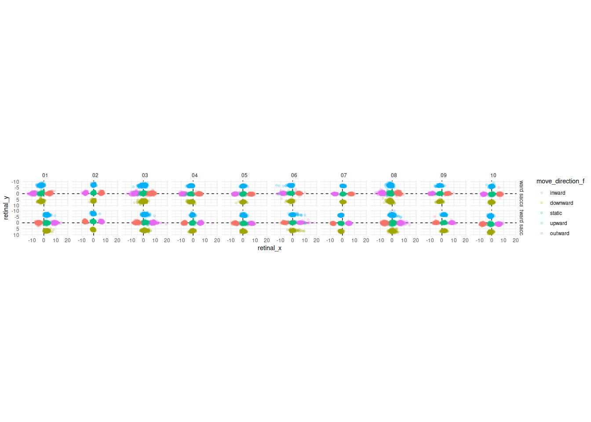<!-- -->

``` r
# plot them (landing positions)
ggplot(data = endpoints, aes(x = retinal_x_static, y = retinal_y_static,
                             color = move_direction_f)) +
  geom_hline(yintercept = 0, linetype = "dashed") + 
  geom_vline(xintercept = 0, linetype = "dashed") + 
  geom_point(alpha = 0.2) +
  coord_fixed() + theme_minimal() + scale_y_reverse() + 
  facet_grid(start_left_f~subj_id)
```

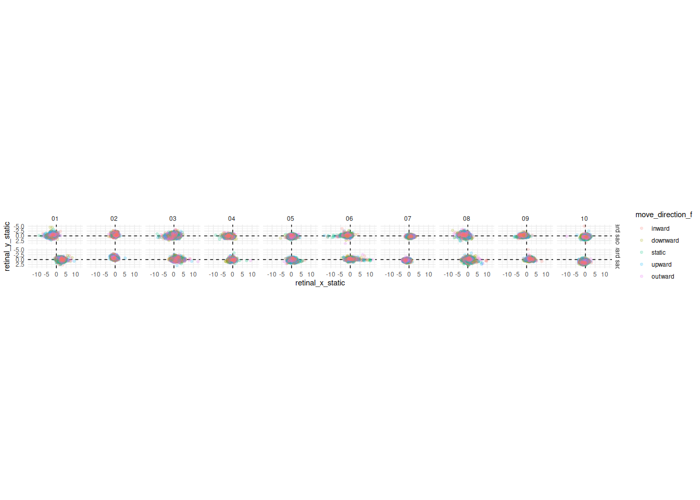<!-- -->

``` r
# test relationship between x and y dimension
endpoints_cortest <- endpoints[move_direction_f=="static" & start_left_f=="rightward saccade"]
endpoints_cortest[start_left_f=="leftward saccade", retinal_x := -1*retinal_x]
endpoints_cortest_lmer <- lmer(data = endpoints_cortest, 
                               formula = retinal_y ~ retinal_x + (1 + retinal_x | subj_id))
summary(endpoints_cortest_lmer)
```

    ## Linear mixed model fit by REML ['lmerMod']
    ## Formula: retinal_y ~ retinal_x + (1 + retinal_x | subj_id)
    ##    Data: endpoints_cortest
    ## 
    ## REML criterion at convergence: 6493.9
    ## 
    ## Scaled residuals: 
    ##     Min      1Q  Median      3Q     Max 
    ## -6.0291 -0.6002  0.0262  0.6372  4.6432 
    ## 
    ## Random effects:
    ##  Groups   Name        Variance Std.Dev. Corr 
    ##  subj_id  (Intercept) 0.268702 0.51837       
    ##           retinal_x   0.001662 0.04077  -0.45
    ##  Residual             0.341705 0.58456       
    ## Number of obs: 3640, groups:  subj_id, 10
    ## 
    ## Fixed effects:
    ##             Estimate Std. Error t value
    ## (Intercept) 0.129558   0.164416   0.788
    ## retinal_x   0.005014   0.015819   0.317
    ## 
    ## Correlation of Fixed Effects:
    ##           (Intr)
    ## retinal_x -0.370

``` r
confint.merMod(endpoints_cortest_lmer, method = "boot")
```

    ## Computing bootstrap confidence intervals ...

    ## 
    ## 50 message(s): boundary (singular) fit: see help('isSingular')
    ## 9 warning(s): Model failed to converge with max|grad| = 0.00201513 (tol = 0.002, component 1) (and others)

    ##                   2.5 %     97.5 %
    ## .sig01       0.28439084 0.72787908
    ## .sig02      -1.00000000 0.62773631
    ## .sig03       0.01139889 0.06798489
    ## .sigma       0.57090570 0.59725614
    ## (Intercept) -0.18207616 0.45077749
    ## retinal_x   -0.02281210 0.03673393

``` r
# individual-level correlation
endpoints_cortest_results <- NULL
for (subj_now in unique(endpoints_cortest$subj_id)) {
  # use a robust correlation here
  a <- wincor(endpoints_cortest$retinal_x[endpoints_cortest$subj_id==subj_now], 
              endpoints_cortest$retinal_y[endpoints_cortest$subj_id==subj_now])
  endpoints_cortest_results <- rbind(endpoints_cortest_results, 
                                     data.frame(t = a$test, p = a$p.value, 
                                                r = a$cor, df = a$n, 
                                                subj_id = subj_now))
}
endpoints_cortest_results
```

    ##              t           p            r  df subj_id
    ## 1   0.25095705 0.802051015  0.012201041 425      01
    ## 2   2.99044552 0.003112049  0.156539346 358      02
    ## 3  -1.79991769 0.073225217 -0.092794093 375      03
    ## 4  -2.70531057 0.007387130 -0.143720953 349      04
    ## 5   2.06223872 0.040490650  0.112797998 332      05
    ## 6  -0.19315850 0.847051414 -0.011095983 305      06
    ## 7  -0.05422292 0.956807678 -0.002857787 362      07
    ## 8   1.69552532 0.091384120  0.087923689 371      08
    ## 9  -1.15669536 0.248487839 -0.056151719 425      09
    ## 10 -0.80751491 0.420319741 -0.044010864 338      10

``` r
# function how to compute the mahalanobis distance
compute_mahalanobis <- function(x, y, x_ref, y_ref, return_prob=TRUE) {
  xy = cbind(x, y)
  S = cov(cbind(x_ref, y_ref))
  mu = colMeans(cbind(x_ref, y_ref))
  d = mahalanobis(xy, mu, S)
  if (return_prob) {
    # see: https://en.wikipedia.org/wiki/Mahalanobis_distance#Normal_distributions
    prob = (1/sqrt(det(2*pi*S))) * exp(-(d^2)/2) 
  } else {
    prob = NaN
  }
  return(list(md = d, prob = prob))
}
```

For the sensorimotor contingency, however, it may be the entire
trajectory. We will thus approximate sensory consequences of the
“normal” saccade.

``` r
# this function takes a map and samples points from it, based on probability z
sample_from_2d_space <- function(x, y, z, n_points=1000) {
  assertthat::are_equal(length(x), length(y), length(z))
  ind = 1:length(x)
  if (sum(z)==0) {
    x_select = NULL
    y_select = NULL
  } else {
    prob = z / sum(z)
    sampled_ind <- sample(x = ind, size = n_points, replace = TRUE, prob = prob)
    x_select <- x[sampled_ind]
    y_select <- y[sampled_ind]
  }
  return(list(x = x_select, y = y_select))
}

# get all file that contain static-present data
all_output_files <- list.files(path = file.path("model_output"), pattern = "*.xz")
all_output_file_IDs <- gsub(pattern = "v1_output_", replacement = "", x = all_output_files)
all_output_file_IDs <- gsub(pattern = ".xz", replacement = "", x = all_output_file_IDs)
all_static_trials <- sdec[move_direction_f=="static" & streak_present_f=="streak present", ID]
all_static_files <- all_output_files[is.element(all_output_file_IDs, all_static_trials)]

# preallocate where we'll store every sampled data
sensorimotor_contingency_samples <- vector(mode = "list", length = length(all_static_files))
sensorimotor_contingency_diff_samples <- vector(mode = "list", length = length(all_static_files))
sensorimotor_v1_output <- vector(mode = "list", length = length(unique(sdec$subj_id))) # here we'll compute a spatial average over time
sensorimotor_v1_output_counter <- vector(mode = "numeric", length = length(unique(sdec$subj_id)))

# read from all those files
for (file_i in 1:length(all_static_files)) { # length(all_output_files)
  # read file
  read_con <- file.path("model_output", all_static_files[file_i])
  print(paste(file_i, read_con))
  con <- xzfile(read_con, "r")
  load(con)
  close(con)
  # find out what trial this is
  df_output <- output_list[[1]]
  assert_that(unique(df_output$move_direction_f)=="static")
  assert_that(unique(df_output$streak_present_f)=="streak present")
  # now sum across filters
  v1_output_over_time <- output_list[[3]] 
  v1_output_over_time <- apply(v1_output_over_time, MARGIN = c(2,3,4), FUN = sum)
  dim(v1_output_over_time)
  # trim down time points
  zero_index = which.min(abs(as.numeric(dimnames(v1_output_over_time)[[3]])))
  v1_output_over_time <- v1_output_over_time[ , , (zero_index-150):(zero_index+100)]
  dim(v1_output_over_time)
  rm(zero_index)
  #plot_heatmap(v1_output_over_time[ , , 250])
  
  # get subject id
  subject_nr = as.numeric(unique(df_output$subj_id))
  # ... and save this output
  if (sensorimotor_v1_output_counter[subject_nr]==0) {
    sensorimotor_v1_output[[subject_nr]] <- v1_output_over_time
  } else {
    sensorimotor_v1_output[[subject_nr]] <- sensorimotor_v1_output[[subject_nr]] + v1_output_over_time
    # adjust the dimnames, too
    dimnames(sensorimotor_v1_output[[subject_nr]]) = list(
      as.numeric(dimnames(sensorimotor_v1_output[[subject_nr]])[[1]])+as.numeric(dimnames(v1_output_over_time)[[1]]),
      as.numeric(dimnames(sensorimotor_v1_output[[subject_nr]])[[2]])+as.numeric(dimnames(v1_output_over_time)[[2]]),
      as.numeric(dimnames(sensorimotor_v1_output[[subject_nr]])[[3]])+as.numeric(dimnames(v1_output_over_time)[[3]])
    )
  }
  sensorimotor_v1_output_counter[subject_nr] <- sensorimotor_v1_output_counter[subject_nr] + 1
  print(sensorimotor_v1_output_counter)
  
  # differentiate
  v1_output_over_time_diff <- apply(v1_output_over_time, MARGIN = c(1,2), FUN = diff)
  v1_output_over_time_diff <- aperm(v1_output_over_time_diff, c(2,3,1))
  dim(v1_output_over_time_diff)
  
  # transform to data.table
  v1_output_df <- reshape2::melt(v1_output_over_time) 
  colnames(v1_output_df) <- c("y", "x", "time", "resp")
  setDT(v1_output_df)
  v1_output_df_diff <- reshape2::melt(v1_output_over_time_diff) 
  colnames(v1_output_df_diff) <- c("y", "x", "time", "resp")
  setDT(v1_output_df_diff)
  # and transform to dva
  v1_output_df[ , x := x / scr.ppd]
  v1_output_df[ , y := y / scr.ppd]
  v1_output_df_diff[ , x := x / scr.ppd]
  v1_output_df_diff[ , y := y / scr.ppd]
  # sample from each time point
  # ... for spatial data
  sampled_positions_over_time <- v1_output_df[resp>0, 
                                              c(sample_from_2d_space(x, y, resp, n_points = 50)), 
                                              by = .(time)]
  sampled_positions_over_time[ , ID := unique(df_output$ID)]
  sampled_positions_over_time[ , subj_id := unique(df_output$subj_id)]
  # ... for spatial gradients
  sampled_positions_over_time_diff <- v1_output_df_diff[resp>0, 
                                                        c(sample_from_2d_space(x, y, resp, n_points = 50)), 
                                                        by = .(time)]
  sampled_positions_over_time_diff[ , ID := unique(df_output$ID)]
  sampled_positions_over_time_diff[ , subj_id := unique(df_output$subj_id)]
  
  # save
  sensorimotor_contingency_samples[[file_i]] <- sampled_positions_over_time
  sensorimotor_contingency_diff_samples[[file_i]] <- sampled_positions_over_time_diff
  
  # # check plot
  # ggplot(data = sampled_positions_over_time,
  #        aes(x = x, y = y, color = round(time), group = round(time) )) +
  #   geom_jitter() +
  #   #geom_density2d() +
  #   scale_color_viridis_c() +
  #   theme_minimal() + coord_fixed()
  # 
}
```

    ## [1] "1 model_output/v1_output_0101_3292_1.xz"
    ##  [1] 1 0 0 0 0 0 0 0 0 0
    ## [1] "2 model_output/v1_output_0101_3336_1.xz"
    ##  [1] 2 0 0 0 0 0 0 0 0 0
    ## [1] "3 model_output/v1_output_0103_3236_1.xz"
    ##  [1] 3 0 0 0 0 0 0 0 0 0
    ## [1] "4 model_output/v1_output_0103_3259_1.xz"
    ##  [1] 4 0 0 0 0 0 0 0 0 0
    ## [1] "5 model_output/v1_output_0105_3205_1.xz"
    ##  [1] 5 0 0 0 0 0 0 0 0 0
    ## [1] "6 model_output/v1_output_0105_3384_1.xz"
    ##  [1] 6 0 0 0 0 0 0 0 0 0
    ## [1] "7 model_output/v1_output_0107_3245_1.xz"
    ##  [1] 7 0 0 0 0 0 0 0 0 0
    ## [1] "8 model_output/v1_output_0107_3256_1.xz"
    ##  [1] 8 0 0 0 0 0 0 0 0 0
    ## [1] "9 model_output/v1_output_0107_3385_1.xz"
    ##  [1] 9 0 0 0 0 0 0 0 0 0
    ## [1] "10 model_output/v1_output_0108_3273_1.xz"
    ##  [1] 10  0  0  0  0  0  0  0  0  0
    ## [1] "11 model_output/v1_output_0201_3211_1.xz"
    ##  [1] 10  1  0  0  0  0  0  0  0  0
    ## [1] "12 model_output/v1_output_0202_3231_1.xz"
    ##  [1] 10  2  0  0  0  0  0  0  0  0
    ## [1] "13 model_output/v1_output_0202_3259_1.xz"
    ##  [1] 10  3  0  0  0  0  0  0  0  0
    ## [1] "14 model_output/v1_output_0202_3283_1.xz"
    ##  [1] 10  4  0  0  0  0  0  0  0  0
    ## [1] "15 model_output/v1_output_0203_3265_1.xz"
    ##  [1] 10  5  0  0  0  0  0  0  0  0
    ## [1] "16 model_output/v1_output_0206_3354_1.xz"
    ##  [1] 10  6  0  0  0  0  0  0  0  0
    ## [1] "17 model_output/v1_output_0207_3268_1.xz"
    ##  [1] 10  7  0  0  0  0  0  0  0  0
    ## [1] "18 model_output/v1_output_0207_3388_1.xz"
    ##  [1] 10  8  0  0  0  0  0  0  0  0
    ## [1] "19 model_output/v1_output_0208_3207_1.xz"
    ##  [1] 10  9  0  0  0  0  0  0  0  0
    ## [1] "20 model_output/v1_output_0208_3256_1.xz"
    ##  [1] 10 10  0  0  0  0  0  0  0  0
    ## [1] "21 model_output/v1_output_0301_3276_1.xz"
    ##  [1] 10 10  1  0  0  0  0  0  0  0
    ## [1] "22 model_output/v1_output_0301_3282_2.xz"
    ##  [1] 10 10  2  0  0  0  0  0  0  0
    ## [1] "23 model_output/v1_output_0302_3279_1.xz"
    ##  [1] 10 10  3  0  0  0  0  0  0  0
    ## [1] "24 model_output/v1_output_0302_3310_1.xz"
    ##  [1] 10 10  4  0  0  0  0  0  0  0
    ## [1] "25 model_output/v1_output_0303_3265_1.xz"
    ##  [1] 10 10  5  0  0  0  0  0  0  0
    ## [1] "26 model_output/v1_output_0303_3270_1.xz"
    ##  [1] 10 10  6  0  0  0  0  0  0  0
    ## [1] "27 model_output/v1_output_0305_3263_1.xz"
    ##  [1] 10 10  7  0  0  0  0  0  0  0
    ## [1] "28 model_output/v1_output_0308_3269_1.xz"
    ##  [1] 10 10  8  0  0  0  0  0  0  0
    ## [1] "29 model_output/v1_output_0308_3274_1.xz"
    ##  [1] 10 10  9  0  0  0  0  0  0  0
    ## [1] "30 model_output/v1_output_0308_3342_1.xz"
    ##  [1] 10 10 10  0  0  0  0  0  0  0
    ## [1] "31 model_output/v1_output_0403_3248_1.xz"
    ##  [1] 10 10 10  1  0  0  0  0  0  0
    ## [1] "32 model_output/v1_output_0403_3268_1.xz"
    ##  [1] 10 10 10  2  0  0  0  0  0  0
    ## [1] "33 model_output/v1_output_0403_3277_1.xz"
    ##  [1] 10 10 10  3  0  0  0  0  0  0
    ## [1] "34 model_output/v1_output_0403_3338_1.xz"
    ##  [1] 10 10 10  4  0  0  0  0  0  0
    ## [1] "35 model_output/v1_output_0403_3374_1.xz"
    ##  [1] 10 10 10  5  0  0  0  0  0  0
    ## [1] "36 model_output/v1_output_0404_3301_1.xz"
    ##  [1] 10 10 10  6  0  0  0  0  0  0
    ## [1] "37 model_output/v1_output_0405_3226_1.xz"
    ##  [1] 10 10 10  7  0  0  0  0  0  0
    ## [1] "38 model_output/v1_output_0406_3260_1.xz"
    ##  [1] 10 10 10  8  0  0  0  0  0  0
    ## [1] "39 model_output/v1_output_0406_3291_1.xz"
    ##  [1] 10 10 10  9  0  0  0  0  0  0
    ## [1] "40 model_output/v1_output_0408_3348_1.xz"
    ##  [1] 10 10 10 10  0  0  0  0  0  0
    ## [1] "41 model_output/v1_output_0501_3297_1.xz"
    ##  [1] 10 10 10 10  1  0  0  0  0  0
    ## [1] "42 model_output/v1_output_0502_3270_1.xz"
    ##  [1] 10 10 10 10  2  0  0  0  0  0
    ## [1] "43 model_output/v1_output_0504_3211_1.xz"
    ##  [1] 10 10 10 10  3  0  0  0  0  0
    ## [1] "44 model_output/v1_output_0504_3257_1.xz"
    ##  [1] 10 10 10 10  4  0  0  0  0  0
    ## [1] "45 model_output/v1_output_0505_3335_1.xz"
    ##  [1] 10 10 10 10  5  0  0  0  0  0
    ## [1] "46 model_output/v1_output_0505_3385_1.xz"
    ##  [1] 10 10 10 10  6  0  0  0  0  0
    ## [1] "47 model_output/v1_output_0507_3390_1.xz"
    ##  [1] 10 10 10 10  7  0  0  0  0  0
    ## [1] "48 model_output/v1_output_0508_3242_1.xz"
    ##  [1] 10 10 10 10  8  0  0  0  0  0
    ## [1] "49 model_output/v1_output_0508_3304_1.xz"
    ##  [1] 10 10 10 10  9  0  0  0  0  0
    ## [1] "50 model_output/v1_output_0508_3391_1.xz"
    ##  [1] 10 10 10 10 10  0  0  0  0  0
    ## [1] "51 model_output/v1_output_0601_3252_1.xz"
    ##  [1] 10 10 10 10 10  1  0  0  0  0
    ## [1] "52 model_output/v1_output_0601_3257_2.xz"
    ##  [1] 10 10 10 10 10  2  0  0  0  0
    ## [1] "53 model_output/v1_output_0601_3300_1.xz"
    ##  [1] 10 10 10 10 10  3  0  0  0  0
    ## [1] "54 model_output/v1_output_0601_3383_1.xz"
    ##  [1] 10 10 10 10 10  4  0  0  0  0
    ## [1] "55 model_output/v1_output_0603_3222_1.xz"
    ##  [1] 10 10 10 10 10  5  0  0  0  0
    ## [1] "56 model_output/v1_output_0603_3358_1.xz"
    ##  [1] 10 10 10 10 10  6  0  0  0  0
    ## [1] "57 model_output/v1_output_0604_3333_1.xz"
    ##  [1] 10 10 10 10 10  7  0  0  0  0
    ## [1] "58 model_output/v1_output_0605_3278_1.xz"
    ##  [1] 10 10 10 10 10  8  0  0  0  0
    ## [1] "59 model_output/v1_output_0605_3375_1.xz"
    ##  [1] 10 10 10 10 10  9  0  0  0  0
    ## [1] "60 model_output/v1_output_0607_3351_1.xz"
    ##  [1] 10 10 10 10 10 10  0  0  0  0
    ## [1] "61 model_output/v1_output_0703_3256_1.xz"
    ##  [1] 10 10 10 10 10 10  1  0  0  0
    ## [1] "62 model_output/v1_output_0703_3395_1.xz"
    ##  [1] 10 10 10 10 10 10  2  0  0  0
    ## [1] "63 model_output/v1_output_0705_3269_1.xz"
    ##  [1] 10 10 10 10 10 10  3  0  0  0
    ## [1] "64 model_output/v1_output_0705_3314_1.xz"
    ##  [1] 10 10 10 10 10 10  4  0  0  0
    ## [1] "65 model_output/v1_output_0705_3318_1.xz"
    ##  [1] 10 10 10 10 10 10  5  0  0  0
    ## [1] "66 model_output/v1_output_0706_3368_1.xz"
    ##  [1] 10 10 10 10 10 10  6  0  0  0
    ## [1] "67 model_output/v1_output_0707_3211_1.xz"
    ##  [1] 10 10 10 10 10 10  7  0  0  0
    ## [1] "68 model_output/v1_output_0707_3255_1.xz"
    ##  [1] 10 10 10 10 10 10  8  0  0  0
    ## [1] "69 model_output/v1_output_0707_3315_1.xz"
    ##  [1] 10 10 10 10 10 10  9  0  0  0
    ## [1] "70 model_output/v1_output_0708_3331_1.xz"
    ##  [1] 10 10 10 10 10 10 10  0  0  0
    ## [1] "71 model_output/v1_output_0802_3315_1.xz"
    ##  [1] 10 10 10 10 10 10 10  1  0  0
    ## [1] "72 model_output/v1_output_0802_3392_1.xz"
    ##  [1] 10 10 10 10 10 10 10  2  0  0
    ## [1] "73 model_output/v1_output_0803_3211_1.xz"
    ##  [1] 10 10 10 10 10 10 10  3  0  0
    ## [1] "74 model_output/v1_output_0805_3219_1.xz"
    ##  [1] 10 10 10 10 10 10 10  4  0  0
    ## [1] "75 model_output/v1_output_0805_3291_1.xz"
    ##  [1] 10 10 10 10 10 10 10  5  0  0
    ## [1] "76 model_output/v1_output_0805_3318_1.xz"
    ##  [1] 10 10 10 10 10 10 10  6  0  0
    ## [1] "77 model_output/v1_output_0806_3304_1.xz"
    ##  [1] 10 10 10 10 10 10 10  7  0  0
    ## [1] "78 model_output/v1_output_0807_3204_1.xz"
    ##  [1] 10 10 10 10 10 10 10  8  0  0
    ## [1] "79 model_output/v1_output_0807_3230_1.xz"
    ##  [1] 10 10 10 10 10 10 10  9  0  0
    ## [1] "80 model_output/v1_output_0808_3208_1.xz"
    ##  [1] 10 10 10 10 10 10 10 10  0  0
    ## [1] "81 model_output/v1_output_0901_3222_1.xz"
    ##  [1] 10 10 10 10 10 10 10 10  1  0
    ## [1] "82 model_output/v1_output_0901_3278_1.xz"
    ##  [1] 10 10 10 10 10 10 10 10  2  0
    ## [1] "83 model_output/v1_output_0901_3341_1.xz"
    ##  [1] 10 10 10 10 10 10 10 10  3  0
    ## [1] "84 model_output/v1_output_0904_3379_1.xz"
    ##  [1] 10 10 10 10 10 10 10 10  4  0
    ## [1] "85 model_output/v1_output_0905_3325_1.xz"
    ##  [1] 10 10 10 10 10 10 10 10  5  0
    ## [1] "86 model_output/v1_output_0906_3221_1.xz"
    ##  [1] 10 10 10 10 10 10 10 10  6  0
    ## [1] "87 model_output/v1_output_0907_3397_2.xz"
    ##  [1] 10 10 10 10 10 10 10 10  7  0
    ## [1] "88 model_output/v1_output_0908_3364_1.xz"
    ##  [1] 10 10 10 10 10 10 10 10  8  0
    ## [1] "89 model_output/v1_output_0908_3394_1.xz"
    ##  [1] 10 10 10 10 10 10 10 10  9  0
    ## [1] "90 model_output/v1_output_0909_3225_1.xz"
    ##  [1] 10 10 10 10 10 10 10 10 10  0
    ## [1] "91 model_output/v1_output_1001_3397_1.xz"
    ##  [1] 10 10 10 10 10 10 10 10 10  1
    ## [1] "92 model_output/v1_output_1002_3378_1.xz"
    ##  [1] 10 10 10 10 10 10 10 10 10  2
    ## [1] "93 model_output/v1_output_1003_3229_1.xz"
    ##  [1] 10 10 10 10 10 10 10 10 10  3
    ## [1] "94 model_output/v1_output_1003_3374_1.xz"
    ##  [1] 10 10 10 10 10 10 10 10 10  4
    ## [1] "95 model_output/v1_output_1004_3261_1.xz"
    ##  [1] 10 10 10 10 10 10 10 10 10  5
    ## [1] "96 model_output/v1_output_1004_3301_2.xz"
    ##  [1] 10 10 10 10 10 10 10 10 10  6
    ## [1] "97 model_output/v1_output_1004_3315_1.xz"
    ##  [1] 10 10 10 10 10 10 10 10 10  7
    ## [1] "98 model_output/v1_output_1005_3208_1.xz"
    ##  [1] 10 10 10 10 10 10 10 10 10  8
    ## [1] "99 model_output/v1_output_1006_3352_1.xz"
    ##  [1] 10 10 10 10 10 10 10 10 10  9
    ## [1] "100 model_output/v1_output_1006_3396_1.xz"
    ##  [1] 10 10 10 10 10 10 10 10 10 10

``` r
# list to data table
sensorimotor_contingency_samples <- rbindlist(sensorimotor_contingency_samples)
sensorimotor_contingency_diff_samples <- rbindlist(sensorimotor_contingency_diff_samples)

# compute the mean activation by adjusting the counter
for (it in 1:length(sensorimotor_v1_output_counter)) {
  sensorimotor_v1_output[[it]] <- sensorimotor_v1_output[[it]] / sensorimotor_v1_output_counter[it]
  dimnames(sensorimotor_v1_output[[it]]) = list(
      as.numeric(dimnames(sensorimotor_v1_output[[it]])[[1]]) / sensorimotor_v1_output_counter[it],
      as.numeric(dimnames(sensorimotor_v1_output[[it]])[[2]]) / sensorimotor_v1_output_counter[it],
      as.numeric(dimnames(sensorimotor_v1_output[[it]])[[3]]) / sensorimotor_v1_output_counter[it]
    )
}

#plot_heatmap(sensorimotor_v1_output[[7]][ , ,200])

# clean up
rm(output_list, v1_output_df, v1_output_df_diff, v1_output_over_time, v1_output_over_time_diff)
```

From this we will be able to read out the mean position and covariance
matrix at each time point.

Load all output rda files and make spatial aggregates. We’ll also run
the spatial localization model…

``` r
# function to apply softmax
softmax <- function(x) {
  require(torch)
  m = nn_softmax(dim=1)
  input = torch_tensor(as.vector(x))
  output = as_array(m(input))
  output = matrix(output, nrow = nrow(x), ncol = ncol(x))
  return(output)
}

# function to get prior (or whatever) matrix into coordinate system of measurement
interpolate_to_size <- function(prior, meas) {
  require(fields)
  image_obj <- list(x = as.numeric(dimnames(prior)[[1]]), 
                    y = as.numeric(dimnames(prior)[[2]]), 
                    z = prior) 
  query_points <- expand.grid(rows = as.numeric(dimnames(meas)[[1]]), 
                              cols = as.numeric(dimnames(meas)[[2]]))
  prior_2 <- interp.surface( obj = image_obj, loc = query_points )
  prior_2 <- matrix(data = prior_2, 
                    nrow = length(dimnames(meas)[[1]]), 
                    ncol = length(dimnames(meas)[[2]]), 
                    byrow = FALSE, dimnames = list(dimnames(meas)[[1]], dimnames(meas)[[2]]))
  prior_2[is.na(prior_2)] <- 0
  return(prior_2)
}


do_make_spatial_agg_and_localization <- FALSE

if (do_make_spatial_agg_and_localization) {
  
  # get all files
  all_output_files <- list.files(path = file.path("model_output"), pattern = "*.xz")
  
  ## preallocate structures
  all_output_conditions <- c("static", "inward", "outward", "downward", "upward")
  all_localization_results <- vector(mode = "list", length = length(all_output_files))
  all_output_agg <- array(0, dim = c(length(all_output_conditions), 50, 100)) # 5 conditions, 50 vertical pix, 100 horizontal pix
  all_output_y <- array(0, dim = c(length(all_output_conditions), 50, 1))
  all_output_x <- array(0, dim = c(length(all_output_conditions), 1, 100))
  all_output_conditions_counter <- rep(0, length(all_output_conditions))
  all_output_conditions_counter_absent <- rep(0, length(all_output_conditions))
  # over time arrays
  trim_down_time <- c(150, 100) # that's the temporal interval we trim down to
  all_output_overtime_present <- array(0, dim = c(length(all_output_conditions), 50, 100, sum(trim_down_time)+1))
  all_output_overtime_absent <- array(0, dim = c(length(all_output_conditions), 50, 100, sum(trim_down_time)+1))
  all_output_t_present <- array(0, dim = c(length(all_output_conditions), sum(trim_down_time)+1))
  all_output_t_absent <- array(0, dim = c(length(all_output_conditions), sum(trim_down_time)+1))
  
  # shall the endpoint locations be used for localization?
  use_endpoint_loc = FALSE
  
  # shall we use distance-weighting when estimating the current position?
  use_distance_weighting <- FALSE
  if (use_distance_weighting) {
    source("pop_mean_function.R")
  }
  
  # run through files (inward-absent: 997, inward-present:1000)
  # (upward-absent: 2, upward-present: 9)
  # (static-absent: 1, static-present: 7)
  for (file_i in 1:length(all_output_files)) { # length(all_output_files)
    # read file
    read_con <- file.path("model_output", all_output_files[file_i])
    print(paste(file_i, read_con))
    con <- xzfile(read_con, "r")
    load(con)
    close(con)
    # find out what trial this is
    df_output <- output_list[[1]]
    cond_now <- unique(df_output$move_direction_f)
    streak_now <- unique(df_output$streak_present_f)
    subj_id_now <- unique(df_output$subj_id)
    print(paste(subj_id_now, cond_now, streak_now, sep = ", "))
    # now sum across filters
    v1_output_over_time <- output_list[[3]] 
    v1_output_over_time <- apply(v1_output_over_time, MARGIN = c(2,3,4), FUN = sum)
    dim(v1_output_over_time)
    
    # trim down time points
    zero_index = which.min(abs(as.numeric(dimnames(v1_output_over_time)[[3]])))
    v1_output_over_time <- v1_output_over_time[ , , (zero_index-trim_down_time[1]):(zero_index+trim_down_time[2])]
    dim(v1_output_over_time)
    rm(zero_index)
    
    # differentiate?
    v1_output_over_time_diff <- apply(v1_output_over_time, MARGIN = c(1,2), FUN = function(x) {c(0, diff(x))})
    v1_output_over_time_diff <- aperm(v1_output_over_time_diff, c(2,3,1))
    dim(v1_output_over_time_diff)
    #plot_heatmap(v1_output_over_time_diff[ , , index_right_after_zero+8])
    
    ## SPATIOTEMPORAL AGGREGATES
    # find out what the condition is
    which_condition_i <- which(all_output_conditions==cond_now)
    assert_that(which_condition_i>=1 & which_condition_i<=length(all_output_conditions))
    if (streak_now=="streak present") {
      # increment counter, present
      all_output_conditions_counter[which_condition_i] <- all_output_conditions_counter[which_condition_i] + 1
      print(all_output_conditions_counter)
      # save output
      all_output_overtime_present[which_condition_i, , , ] <- all_output_overtime_present[which_condition_i, , , ] + 
        v1_output_over_time
      # ... and temporal scale
      all_output_t_present[which_condition_i, ] <- all_output_t_present[which_condition_i, ] + 
        as.numeric(dimnames(v1_output_over_time)[[3]])
    } else {
      # increment counter, absent
      all_output_conditions_counter_absent[which_condition_i] <- all_output_conditions_counter_absent[which_condition_i] + 1
      print(all_output_conditions_counter_absent)
      # save output
      all_output_overtime_absent[which_condition_i, , , ] <- all_output_overtime_absent[which_condition_i, , , ] + 
        v1_output_over_time
      # ... and temporal scale
      all_output_t_absent[which_condition_i, ] <- all_output_t_absent[which_condition_i, ] + 
        as.numeric(dimnames(v1_output_over_time)[[3]])
    }
    
    
    ## SPATIAL AGGREGATES
    if (streak_now=="streak present") {
      # sum over time
      v1_output <- apply(v1_output_over_time, MARGIN = c(1,2), FUN = sum)
      dim(v1_output)
      #plot_heatmap(v1_output)
      # save the output
      all_output_agg[which_condition_i, , ] <- all_output_agg[which_condition_i, , ] + 
        v1_output
      all_output_y[which_condition_i, , 1] <- all_output_y[which_condition_i, , 1] + 
        as.numeric(dimnames(v1_output)[[1]]) / scr.ppd
      all_output_x[which_condition_i, 1, ] <- all_output_x[which_condition_i, 1, ] + 
        as.numeric(dimnames(v1_output)[[2]]) / scr.ppd
      # clean up
      rm(v1_output)
    } # if streak is present
    
    
    ## LOCALIZATION MODEL
    # get the distribution of expected endpoints
    endpoints_subj <- endpoints[start_left_f=="rightward saccade" &
                                  subj_id==unique(df_output$subj_id),
                                .(retinal_x, retinal_y, retinal_x_static, retinal_y_static),
                                by = .(move_direction_f)]
    # make Gaussian summary of distributions
    endpoints_subj_mean <- endpoints_subj[ , 
                                           .(x = mean(retinal_x), 
                                             y = mean(retinal_y), 
                                             x_sd = sd(retinal_x),  
                                             y_sd = sd(retinal_y) ), 
                                           by = .(move_direction_f)]
    
    # get the sensorimotor contingency (the prediction) of the subject
    sensorimotor_mat <- sensorimotor_v1_output[[as.numeric(unique(df_output$subj_id))]]
    # differentiate?
    sensorimotor_mat_diff <- apply(sensorimotor_mat, MARGIN = c(1,2), FUN = function(x) {c(0, diff(x))})
    sensorimotor_mat_diff <- aperm(sensorimotor_mat_diff, c(2,3,1))
    dim(sensorimotor_mat)
    # get the sensorimotor samples, in case we want to localize based on predictions
    if (!use_endpoint_loc) {
      sensorimotor_samples_diff <- 
        sensorimotor_contingency_diff_samples[subj_id==unique(df_output$subj_id)]
    }
    # make sure dimensions match
    assert_that(all(dim(sensorimotor_mat)==dim(v1_output_over_time)))
    ## the threshold:
    # we assume a threshold where intrasaccadic changes are noticed
    positive_sum_time <- apply(X = sensorimotor_mat_diff, MARGIN = c(3), 
                               function(x) { if (any(x>0)) {
                                 res = sum(x[x>0])
                               } else {
                                 res = 0
                               }
                               })
    # compute based on median-based standard deviation 
    thres_fac <- 1 # what should we multiply this with?
    thres <- thres_fac * 
      sqrt(median((positive_sum_time[positive_sum_time>0]-median(positive_sum_time[positive_sum_time>0]))^2))
    
    # not pre-allocate the values of interest
    prediction_output <- NULL
    K <- 0 # by default we go according to the prediction
    sensorimotor_temporal_window = 30 # ms
    
    # time-point-wise updating
    for (it in 1:dim(v1_output_over_time)[3]) {
      time_now = round(as.numeric(dimnames(v1_output_over_time)[[3]])[it], 2)
      # get the temporal window
      temporal_win_now = which(as.numeric(dimnames(v1_output_over_time)[[3]])>=(time_now-sensorimotor_temporal_window/2) & 
                                 as.numeric(dimnames(v1_output_over_time)[[3]])<=(time_now+sensorimotor_temporal_window/2))
      # get the measurement
      meas = v1_output_over_time_diff[ , , it]
      meas[meas<0] = 0
      meas = pad_and_extrapolate(meas, average_filter_size = 10) # take care of edges
      # in case we're at t=0, we must initialize
      if (it==1) { # intialize with the initial position
        posterior = sensorimotor_mat[ , ,1]
        posterior = pad_and_extrapolate(posterior, average_filter_size = 10) # take care of edges
        posterior = interpolate_to_size(posterior, meas)
      }
      assert_that(all(dim(posterior)==dim(meas)))
      
      # what's the predicted change?
      # pred <- sensorimotor_mat_diff[ , , it]
      pred <- sensorimotor_mat_diff[ , , temporal_win_now] # the entire temporal window
      pred[pred<0] = 0
      pred <- apply(X = pred, MARGIN = c(1, 2), FUN = max)
      pred = pad_and_extrapolate(pred, average_filter_size = 10) # take care of edges
      pred = interpolate_to_size(pred, posterior)
      assert_that(all(dim(posterior)==dim(pred)))
      
      # compute offset between measurement and prior, the residual
      y_residual <- meas - pred
      # this is the prediction error
      
      # and determine Kalman gain
      if (!((sum(abs(pred))==0 & sum(abs(meas))==0) |  # no change at all, no need to adjust
            (sum(meas>0)==0 & sum(pred>0)==0))) { 
        # metric Kalman gain:
        #K <- sum(meas[meas>0]) / (sum(meas[meas>0]) + sum(pred[pred>0]))
        #K[is.na(K)] <- 0
        
        # compute the size of the prediction error
        current_sum = sum(y_residual[y_residual>0])
        
        # discrete Kalman gain based on prediction error, only after saccade was initiated
        if (K==0) {
          if (current_sum>thres & time_now>(-1*mean(sdec$primary_dur, na.rm = TRUE))) {
            K <- 1
          } 
        }
      }
      # weight the residual according to the Kalman gain
      weighted_residual <- y_residual * K
      # so what's the update?
      updat <- pred + weighted_residual
      # compute posterior
      posterior <- posterior + updat
      
      # determine position of update
      updat_df <- reshape2::melt(updat)
      colnames(updat_df) <- c("y", "x", "w")
      updat_pos <- c(weighted.mean(updat_df$x / scr.ppd, updat_df$w), 
                     weighted.mean(updat_df$y / scr.ppd, updat_df$w))
      updat_pos_df <- data.frame(t(updat_pos))
      colnames(updat_pos_df) <- c("retinal_x", "retinal_y")
      updat_w <- sum(updat_df$w)
      
      # plot this
      if (FALSE) {
        common_ref = c(min(c(pred, posterior, meas)), max(c(pred, posterior, meas)))
        if (mod(it, 5)==0 & time_now>=(-40) & time_now<=(50)) {
          title <- ggdraw() + 
            draw_label(paste0(it, ", t=", time_now, "ms, K=", round(mean(K), 3), 
                              ", s=", round(current_sum, 2)), fontface='bold')
          p <- plot_grid(plotlist = list(plot_heatmap(pred) + ggtitle("predicted"), 
                                         plot_heatmap(meas) + ggtitle("measured"), 
                                         plot_heatmap(y_residual) + ggtitle("prediction error"),
                                         plot_heatmap(updat) + ggtitle("weighted update"),
                                         plot_heatmap(posterior) + ggtitle("posterior")), 
                         nrow = 3, align = "hv")
          p <- plot_grid(title, p, ncol=1, rel_heights=c(0.1, 1))
          print(p)
        }
      }
      
      # compute mahalanobis distance, but only once the prediction error has occurred
      dist_to_static <- compute_mahalanobis(x = updat_pos[1], y = updat_pos[2], 
                                            x_ref = endpoints_subj[move_direction_f=="static", retinal_x], 
                                            y_ref = endpoints_subj[move_direction_f=="static", retinal_y])
      dist_to_target <- compute_mahalanobis(x = updat_pos[1], y = updat_pos[2], 
                                            x_ref = endpoints_subj[move_direction_f==cond_now, retinal_x], 
                                            y_ref = endpoints_subj[move_direction_f==cond_now, retinal_y])
      
      # create the reference
      if (!use_endpoint_loc) {
        # compute sensorimotor summary
        sensorimotor_samples_diff_mean <- 
          sensorimotor_samples_diff[time>=(time_now-sensorimotor_temporal_window/2) & 
                                      time<=(time_now+sensorimotor_temporal_window/2), 
                                           .(x = mean(x), y = mean(y), 
                                             x_sd = sd(x),  y_sd = sd(y) )]
      }
      
      # compute the probability of measuring a position given the landing position
      if (use_endpoint_loc) {
        p_vertical = pnorm(q = updat_pos[2], 
                           mean = endpoints_subj_mean[move_direction_f=="static", y], 
                           sd = endpoints_subj_mean[move_direction_f=="static", y_sd])
      } else {
        p_vertical = pnorm(q = updat_pos[2], 
                           mean = sensorimotor_samples_diff_mean$y, 
                           sd = sensorimotor_samples_diff_mean$y_sd)
      }
      if (cond_now=="upward") {
        p_vertical = 1 - p_vertical
      }
      if (use_endpoint_loc) {
        p_horizontal = pnorm(q = updat_pos[1], 
                             mean = endpoints_subj_mean[move_direction_f=="static", x], 
                             sd = endpoints_subj_mean[move_direction_f=="static", x_sd])
      } else {
        p_horizontal = pnorm(q = updat_pos[1], 
                             mean = sensorimotor_samples_diff_mean$x, 
                             sd = sensorimotor_samples_diff_mean$x_sd)
      }
      if (cond_now=="inward") {
        p_horizontal = 1 - p_horizontal
      }
      
      # save time courses
      prediction_output <- rbind(prediction_output, 
                                 data.table(subj_id = unique(df_output$subj_id), 
                                            ID = unique(df_output$ID),
                                            move_direction_f = cond_now, 
                                            streak_present_f = streak_now, 
                                            time = time_now, 
                                            pred_error = current_sum, 
                                            thres = thres, 
                                            K = K,
                                            updat_x = updat_pos[1], 
                                            updat_y = updat_pos[2], 
                                            updat_w = updat_w, 
                                            md_static = dist_to_static$md, 
                                            prob_static = dist_to_static$prob,
                                            md_target = dist_to_target$md, 
                                            prob_target = dist_to_target$prob, 
                                            prob_vertical = p_vertical, 
                                            prob_horizontal = p_horizontal
                                            ))
      
    } # end of prediction loop over time
    
    
    
    
    
    # have a look at the prediction error
    if (FALSE) {
      par(mfrow=c(1,3))
      plot(prediction_output$time, prediction_output$pred_error, 
           main = paste(cond_now, streak_now, sep = ", "))
      abline(h = prediction_output$thres)
      # static/displaced mahalanobis distance
      plot(prediction_output$time, prediction_output$md_static, 
           ylim = c(0, max(c(prediction_output$md_static, prediction_output$md_target), na.rm = TRUE)))
      points(prediction_output$time, prediction_output$md_target, col = "red")
      lines(prediction_output$time, prediction_output$K*10, col = "red")
      # weighted cumulative probability
      cum_time <- prediction_output$time[prediction_output$time>(-30) & prediction_output$time<(+40)]
      plot(cum_time, 
           prediction_output$prob_vertical[is.element(prediction_output$time, cum_time)], 
           ylim = c(0, 1), 
           main = paste(cond_now, streak_now, sep = ", "))
      points(cum_time, 
             prediction_output$prob_horizontal[is.element(prediction_output$time, cum_time)], col = "red")
      abline(v = min(prediction_output$time[prediction_output$K>0]))
      par(mfrow=c(1,1))
    }
    
    # save localization results
    all_localization_results[[file_i]] <- prediction_output
    
    # clean up
    rm(df_output, cond_now, streak_now, 
       output_list, v1_output_over_time, v1_output_over_time_diff, 
       endpoints_subj, sensorimotor_mat, sensorimotor_mat_diff, K, prediction_output, 
       time_now, meas, posterior, pred, y_residual, weighted_residual, updat, 
       updat_df, updat_pos, updat_pos_df, updat_w, 
       dist_to_static, dist_to_target, endpoints_subj_mean, p_vertical, p_horizontal)
    
  } # loop over files
  
  # for localization results: convert to data.table
  all_localization_results <- rbindlist(all_localization_results)
  
  # for spatial aggregates: normalize by dividing with counter, so that we get the mean
  for (condition_i in (1:length(all_output_conditions_counter))) {
    cond_count <- all_output_conditions_counter[condition_i]
    all_output_agg[condition_i, , ] <- all_output_agg[condition_i, , ] / cond_count
    all_output_y[condition_i, , 1] <- all_output_y[condition_i, , 1] / cond_count
    all_output_x[condition_i, 1, ] <- all_output_x[condition_i, 1, ] / cond_count
    # additional spatiotemporal
    all_output_overtime_absent[condition_i, , , ] <- all_output_overtime_absent[condition_i, , , ] / cond_count
    all_output_overtime_present[condition_i, , , ] <- all_output_overtime_present[condition_i, , , ] / cond_count
    all_output_t_absent[condition_i, ] <- all_output_t_absent[condition_i, ] / cond_count
    all_output_t_present[condition_i, ] <- all_output_t_present[condition_i, ] / cond_count
  }
  
  # save spatial aggregates and localization results
  save(list = c("all_localization_results", "all_output_agg", "all_output_x", "all_output_y", 
                "all_output_overtime_absent", "all_output_t_absent", 
                "all_output_overtime_present", "all_output_t_present"), 
       file = "model_output_analysis.rda", compress = "xz")
  
} else {
  
  all_output_conditions <- c("static", "inward", "outward", "downward", "upward")
  load("model_output_analysis.rda")
  
}

# forgot: apply dimnames to all_output_overtime
dimnames(all_output_overtime_absent) <- list(all_output_conditions, 
                                             apply(all_output_y, MARGIN = 2, mean), 
                                             apply(all_output_x, MARGIN = 3, mean), 
                                             apply(all_output_t_absent, MARGIN = 2, mean) )
```

Look at spatial aggregates:

``` r
source("pad_and_extrapolate.R")
# the size we'll interpolate to
interpolate_to_mat <- matrix(0, nrow = 240, ncol = 380, 
                               dimnames = list(seq(-12, 12, length.out = 240), 
                                               seq(-12, 26, length.out = 380)))
assert_that(all(dim(all_output_overtime_absent)==dim(all_output_overtime_present)))
```

    ## [1] TRUE

``` r
# preallocate target array
super_array <- array(0, dim = c(2, # for streak present and absent
                                dim(all_output_overtime_present)[1],
                                        dim(all_output_overtime_present)[4], 
                                        dim(interpolate_to_mat)), 
                             dimnames = list(c("streak present", "streak absent"), 
                                             all_output_conditions, 
                                             apply(rbind(all_output_t_present, 
                                                         all_output_t_absent), MARGIN = 2, mean), 
                                             dimnames(interpolate_to_mat)[[1]], 
                                             dimnames(interpolate_to_mat)[[2]]))


# plot the averages across all channels
all_output_plotlist <- vector(mode = "list", length = length(all_output_conditions))
all_output_samesize <- vector(mode = "list", length = length(all_output_conditions))
for (condition_i in (1:length(all_output_conditions))) {
  # get aggregated output
  condition_output_now <- all_output_agg[condition_i, , ]
  dimnames(condition_output_now) <- list(-1 * all_output_y[condition_i, , 1], # y axis is reversed
                                         all_output_x[condition_i, 1, ])
  ## spatial aggregates
  # deal with edges
  condition_output_now <- pad_and_extrapolate(condition_output_now, average_filter_size = 10)
  # interpolate to size 
  all_output_samesize[[condition_i]] <- interpolate_to_size(condition_output_now, interpolate_to_mat)
  # plot routine
  all_output_plotlist[[condition_i]] <- plot_heatmap(all_output_samesize[[condition_i]], 
                                                     use_viridis = TRUE, 
                                                     use_limits = c(0, max(all_output_agg)), 
                                                     reverse_y_axis = FALSE) + 
    theme_bw() + SDECTheme() + 
    theme(panel.background = element_rect(fill = scales::pal_viridis(option = "viridis")(3)[1]), 
          panel.grid = element_blank(), legend.position = "bottom") + 
    ggtitle(all_output_conditions[condition_i]) + 
    coord_fixed(#xlim = c(-12, 26), ylim = c(-12, 12)
                ) 
  ## spatiotemporal aggregates
  for (streak_i in 1:2) {
    print(paste0("condition_i=", condition_i, ", streak_i=", streak_i))
    if (streak_i==1) { 
      time_dim = dim(super_array)[3] 
      output_array <- all_output_overtime_present
    } else {
      time_dim = dim(super_array)[3]
      output_array <- all_output_overtime_absent
    }
    for (time_i in 1:time_dim) {
      # get the slice
      a <- output_array[condition_i, , , time_i]
      dimnames(a) <- list(all_output_y[condition_i, , ], all_output_x[condition_i, , ])
      # deal with edges
      a <- pad_and_extrapolate(a, average_filter_size = 10)
      # interpolate to size 
      super_array[streak_i, condition_i, time_i, , ] <- interpolate_to_size(a, interpolate_to_mat)
    }
  }
}
```

    ## Loading required package: Hmisc

    ## 
    ## Attaching package: 'Hmisc'

    ## The following object is masked from 'package:fields':
    ## 
    ##     describe

    ## The following object is masked from 'package:pracma':
    ## 
    ##     ceil

    ## The following objects are masked from 'package:base':
    ## 
    ##     format.pval, units

    ## Coordinate system already present. Adding new coordinate system, which will
    ## replace the existing one.

    ## [1] "condition_i=1, streak_i=1"
    ## [1] "condition_i=1, streak_i=2"

    ## Coordinate system already present. Adding new coordinate system, which will
    ## replace the existing one.

    ## [1] "condition_i=2, streak_i=1"
    ## [1] "condition_i=2, streak_i=2"

    ## Coordinate system already present. Adding new coordinate system, which will
    ## replace the existing one.

    ## [1] "condition_i=3, streak_i=1"
    ## [1] "condition_i=3, streak_i=2"

    ## Coordinate system already present. Adding new coordinate system, which will
    ## replace the existing one.

    ## [1] "condition_i=4, streak_i=1"
    ## [1] "condition_i=4, streak_i=2"

    ## Coordinate system already present. Adding new coordinate system, which will
    ## replace the existing one.

    ## [1] "condition_i=5, streak_i=1"
    ## [1] "condition_i=5, streak_i=2"

``` r
# show all spatial aggregates
# plot_grid(plotlist = lapply(all_output_plotlist, function(x) {ggrastr::rasterize(x + coord_fixed(expand = FALSE), 
#                                                                                  dpi=300)}), 
#           nrow = 1)
plot_grid(plotlist = lapply(all_output_plotlist, function(x) {x + coord_fixed(expand = FALSE)}),
          nrow = 1)
```

    ## Coordinate system already present. Adding new coordinate system, which will
    ## replace the existing one.
    ## Coordinate system already present. Adding new coordinate system, which will
    ## replace the existing one.
    ## Coordinate system already present. Adding new coordinate system, which will
    ## replace the existing one.
    ## Coordinate system already present. Adding new coordinate system, which will
    ## replace the existing one.
    ## Coordinate system already present. Adding new coordinate system, which will
    ## replace the existing one.

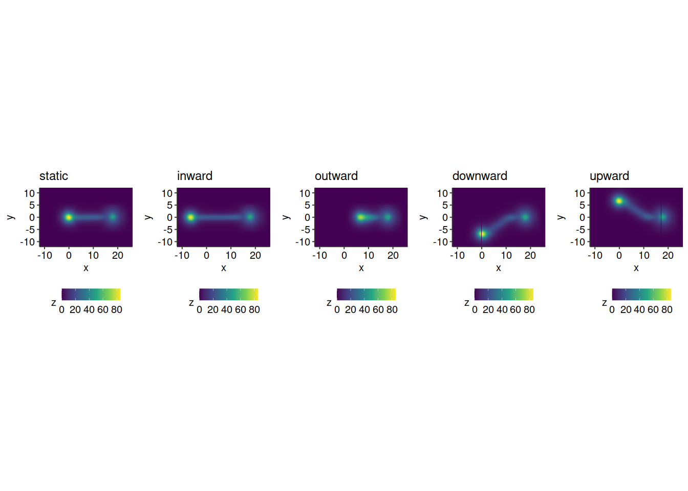<!-- -->

``` r
# ... and combined with other plots
p_all_channel_engagement <- 
  plot_grid(#plot_grid(plotlist = lapply(X = all_output_plotlist, 
            #                            FUN = function(x) {x + theme(legend.position = "none")}), 
            #          nrow = 1), 
            p_channels_overview, 
            p_channels_diff, 
            nrow = 3, align = "hv", axis = "lr")
p_all_channel_engagement # export as landscape A4
```

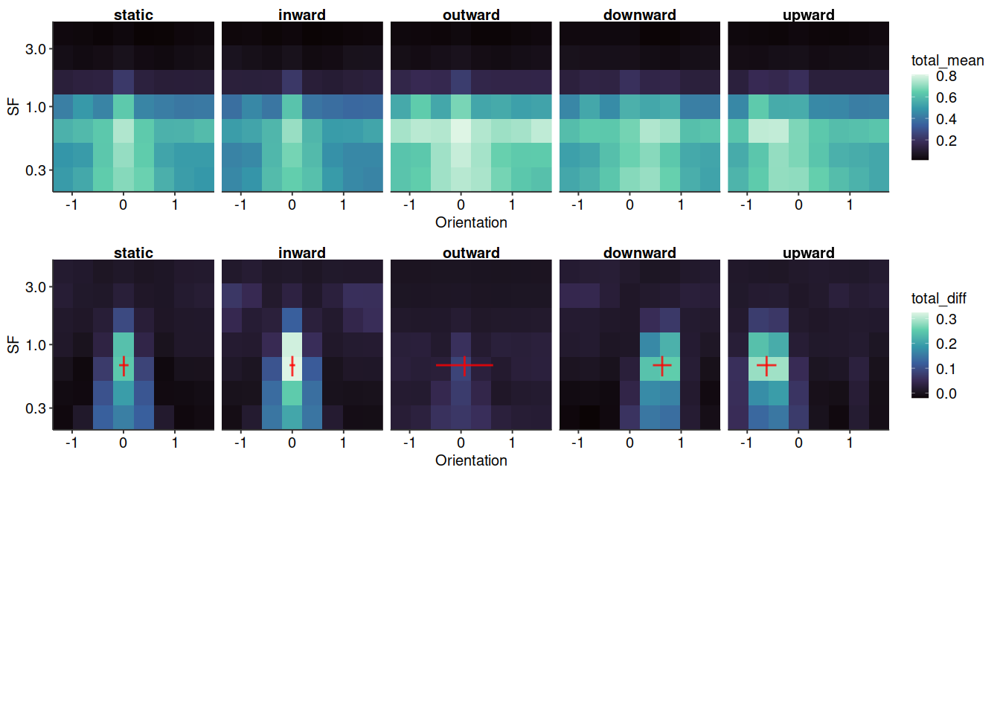<!-- -->

``` r
# show two slices just for checks
plot_grid(plotlist = list(plot_heatmap(super_array[1, 1, 150, , ]), 
                          plot_heatmap(super_array[1, 2, 150, , ]), 
                          plot_heatmap(super_array[1, 3, 150, , ]), 
                          plot_heatmap(super_array[1, 4, 150, , ]), 
                          plot_heatmap(super_array[1, 5, 150, , ]), 
                          plot_heatmap(super_array[2, 1, 150, , ]), 
                          plot_heatmap(super_array[2, 2, 150, , ]), 
                          plot_heatmap(super_array[2, 3, 150, , ]), 
                          plot_heatmap(super_array[2, 4, 150, , ]), 
                          plot_heatmap(super_array[2, 5, 150, , ])), nrow = 2)
```

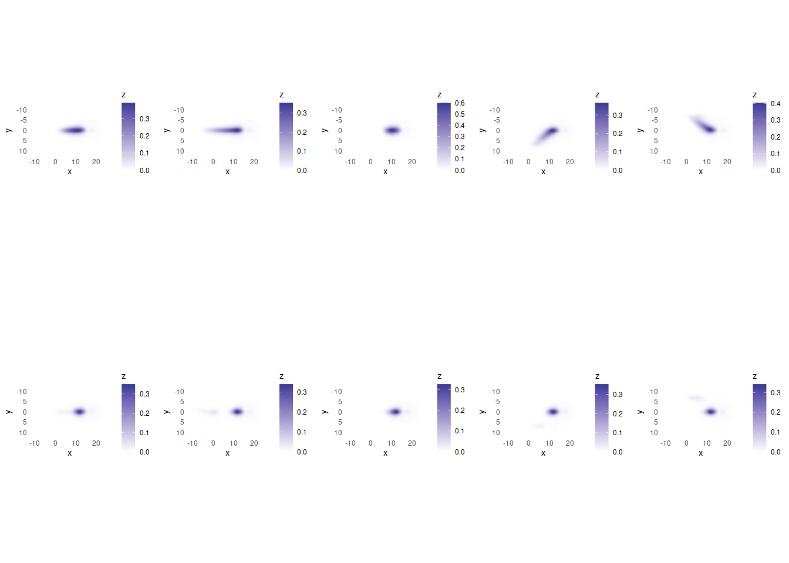<!-- -->

Now there’s a theory. How well different conditions can be separated
determines the classification accuracy.

``` r
plot_heatmap(all_output_samesize[[5]])
```

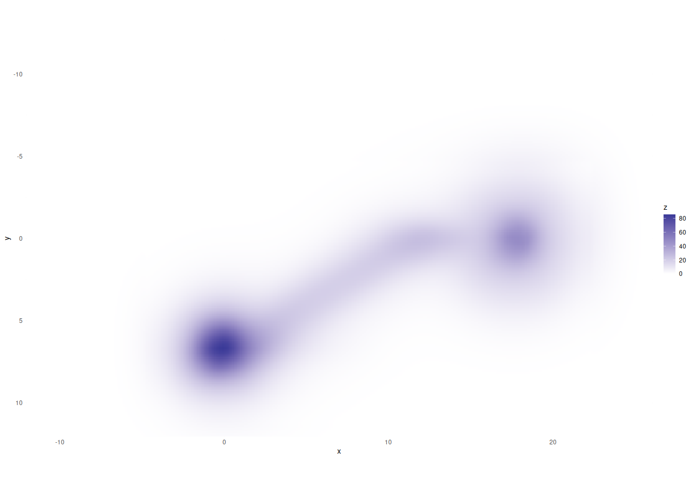<!-- -->

``` r
# run this on the spatial aggregates
compare_grid <- data.table(expand.grid(list(a = all_output_conditions, b = all_output_conditions)))
for (row_i in 1:nrow(compare_grid)) {
  compare_grid[row_i, mse := mean((all_output_samesize[[which(all_output_conditions==compare_grid[row_i, a])]]-
                                     all_output_samesize[[which(all_output_conditions==compare_grid[row_i, b])]])^2)]  
}
ggplot(data = compare_grid, aes(x = a, y = b, fill = mse)) + 
  geom_tile() + geom_label(aes(label = round(mse, 2))) + 
  SDECTheme() + 
  scale_fill_viridis(option = "mako")
```

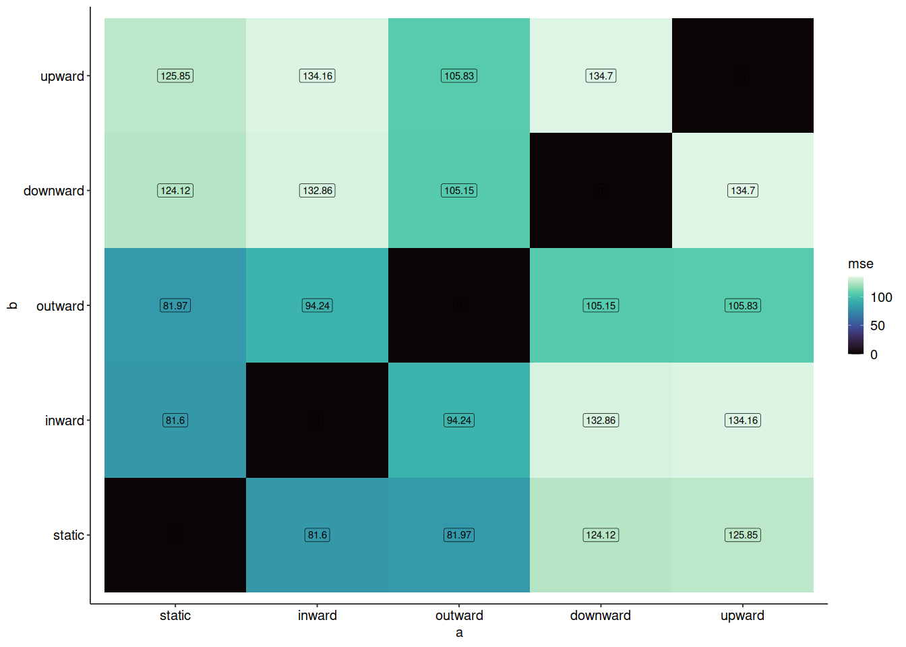<!-- -->

``` r
# and run this on the spatiotemporal aggregates

# # cumulative sum?
# super_array <- apply(super_array, MARGIN = c(1, 2, 4, 5), FUN = cumsum)
# super_array <- aperm(super_array, c(2, 3, 1, 4, 5))
# dim(super_array)

# broaden the array?
super_array_broad <- apply(super_array, MARGIN = c(1, 2, 3), 
                           FUN = function(x) {pracma::Reshape(x, 1)})
super_array_broad <- aperm(super_array_broad, c(2, 3, 4, 1))
dim(super_array_broad)
```

    ## [1]     2     5   251 91200

``` r
# make pairwise comparisons
compare_grid_overtime <- data.table(expand.grid(list(t_index = 1:dim(super_array)[[3]], 
                                                     a = all_output_conditions, 
                                                     b = all_output_conditions)))
for (row_i in 1:nrow(compare_grid_overtime)) {
  compare_grid_overtime[row_i, time := as.numeric(dimnames(super_array)[[3]])[compare_grid_overtime$t_index[row_i]]]
  compare_grid_overtime[row_i, 
                        mse_present := mean((super_array[1, 
                                                         which(all_output_conditions==compare_grid_overtime[row_i, a]), 
                                                         compare_grid_overtime$t_index[row_i], , ] - 
                                               super_array[1, 
                                                           which(all_output_conditions==compare_grid_overtime[row_i, b]), 
                                                           compare_grid_overtime$t_index[row_i], , ])^2)]  
  compare_grid_overtime[row_i, 
                        mse_absent := mean((super_array[2, 
                                                        which(all_output_conditions==compare_grid_overtime[row_i, a]), 
                                                        compare_grid_overtime$t_index[row_i], , ] - 
                                              super_array[2, 
                                                          which(all_output_conditions==compare_grid_overtime[row_i, b]), 
                                                          compare_grid_overtime$t_index[row_i], , ])^2)]  
  # train classifier?
  # TO DO: efficiently transform to training data matrix
}
# summary
compare_grid_overtime_agg <- compare_grid_overtime[ , .(mse_present = mean(mse_present), 
                                                        mse_absent = mean(mse_absent)), 
                                                    by = .(time, a)]
compare_grid_overtime_agg <- compare_grid_overtime_agg[order(a, time)]
compare_grid_overtime_agg[ , mse_present_diff := c(0, diff(mse_present)), by = .(a)]
compare_grid_overtime_agg[ , mse_absent_diff := c(0, diff(mse_absent)), by = .(a)]
# plot
ggplot(compare_grid_overtime_agg, aes(x = time, y = mse_present_diff, color = a)) + 
  geom_line(data = compare_grid_overtime_agg, aes(x = time, y = mse_absent_diff, color = a), 
            linetype = "dashed", size = 1.5) + 
  geom_line(size = 1.5) + 
  theme_minimal() + 
  scale_color_viridis_d(option = "magma", end = 0.7)
```

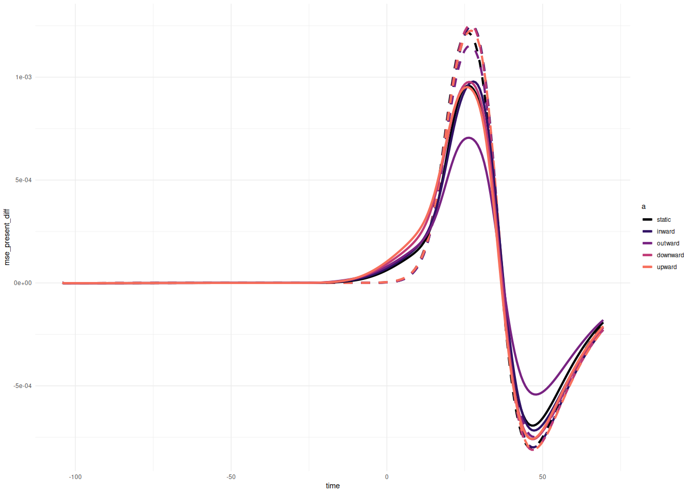<!-- -->

Have a look at the time of prediction error

``` r
source("five_point_smoother.R")

# determine move onset
trial_ID_used <- unique(sensorimotor_contingency_diff_samples$ID)
move_off_re_sac_off <- sdec[is.element(ID, trial_ID_used), move_offset_re_primary_offset]

# round(time) so that we can aggregate
all_localization_results_2 <- copy(all_localization_results)
all_localization_results_2[ , time_round := round(time)]
# agg for subjects
all_loc_agg <- all_localization_results_2[ , .(pred_error = mean(pred_error, na.rm = TRUE), 
                                               thres = mean(thres, na.rm = TRUE), 
                                               K = mean(K, na.rm = TRUE),
                                               p_horizontal = mean(prob_horizontal, na.rm = TRUE), 
                                               p_vertical = mean(prob_vertical, na.rm = TRUE)), 
                                           by = .(subj_id, streak_present_f, move_direction_f, 
                                                  time_round)]
all_loc_agg[ , move_direction_of := ordered(move_direction_f, 
                                            levels = c("static", "inward", "outward", "downward", "upward"))]
all_loc_agg[ , p_horizontal_sum := sum(p_horizontal), by = .(subj_id, streak_present_f, time_round)]
all_loc_agg[ , p_vertical_sum := sum(p_vertical), by = .(subj_id, streak_present_f, time_round)]
# plot for each subject
ggplot(all_loc_agg, aes(x = time_round, y = pred_error, color = move_direction_of)) + 
  geom_vline(xintercept = c(0), linetype = "dotted") + 
  geom_line(data = all_loc_agg, aes(x = time_round, y = thres, color = move_direction_of)) + 
  geom_line() + 
  facet_grid(streak_present_f~subj_id) + 
  SDECTheme() + 
  coord_cartesian(expand=FALSE) + 
  xlim(-50, 50)
```

    ## Warning: Removed 370 rows containing missing values or values outside the scale range
    ## (`geom_line()`).
    ## Removed 370 rows containing missing values or values outside the scale range
    ## (`geom_line()`).

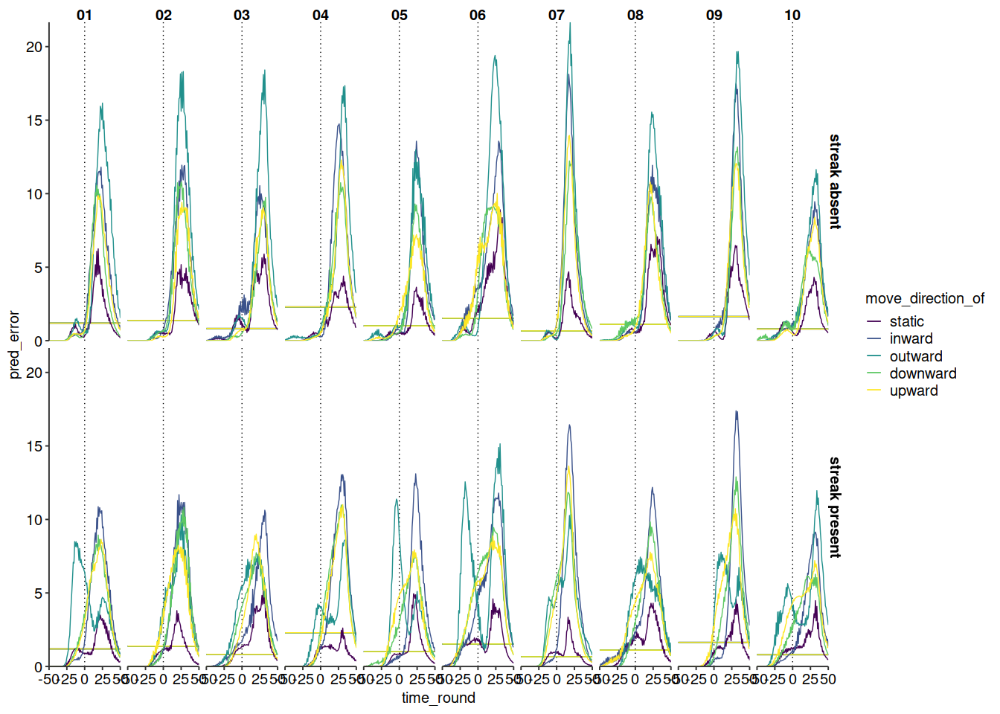<!-- -->

``` r
# prediction error population aggregate
all_loc_agg_all <- all_loc_agg[ , .(pred_error = mean(pred_error, na.rm = TRUE), 
                                    pred_error_se = sd(pred_error) / sqrt(length(unique(subj_id))),
                                    thres = mean(thres, na.rm = TRUE),
                                    thres_se = sd(thres) / sqrt(length(unique(subj_id))),
                                    K = mean(K, na.rm = TRUE),
                                    p_horizontal = mean(p_horizontal, na.rm = TRUE), 
                                    p_vertical = mean(p_vertical, na.rm = TRUE)), 
                                by = .(streak_present_f, move_direction_of, 
                                       time_round)]
# aesthetics: smooth time courses
all_loc_agg_all <- all_loc_agg_all[order(streak_present_f, move_direction_of, time_round)]
all_loc_agg_all[ , pred_error.s := five_point_smoother(pred_error), 
                 by = .(streak_present_f, move_direction_of)]
# plot now
p_predict_error_over_time <- 
  ggplot(all_loc_agg_all, aes(x = time_round, y = pred_error.s, color = move_direction_of, 
                              alpha = streak_present_f, 
                              group = paste(streak_present_f, move_direction_of))) + 
  geom_vline(xintercept = c(0), 
             linetype = "dotted") + 
  geom_vline(xintercept = c(-mean(move_off_re_sac_off), -mean(move_off_re_sac_off)-25), 
             linetype = "solid") + 
  geom_ribbon(data = all_loc_agg_all, aes(y = thres, ymax =thres + thres_se, 
                                          ymin = thres - thres_se, 
                                          x = time_round), 
              alpha = 0.05,  color = NA, fill = "black") + 
  geom_ribbon(aes(ymin = pred_error.s - pred_error_se, ymax = pred_error.s + pred_error_se, 
                  fill = move_direction_of), color = NA, alpha = 0.2) + 
  geom_line(size = 2) + 
  scale_alpha_manual(values = c(1, 1)) + 
  facet_grid(streak_present_f~.) + 
  SDECTheme() + 
  scale_color_viridis_d(end = 0.7, option = "magma") + 
  scale_fill_viridis_d(end = 0.7, option = "magma") + 
  coord_cartesian(expand=FALSE) + 
  xlim(-50, 50) + 
  labs(x = "Time re primary saccade offset [ms]", 
       y = "Prediction error [a.u.]", 
       color = "Target movement direction", fill = "Target movement direction") + 
  theme(legend.position = "bottom")
p_predict_error_over_time # export as 5x4
```

    ## Warning: Removed 740 rows containing missing values or values outside the scale range
    ## (`geom_line()`).

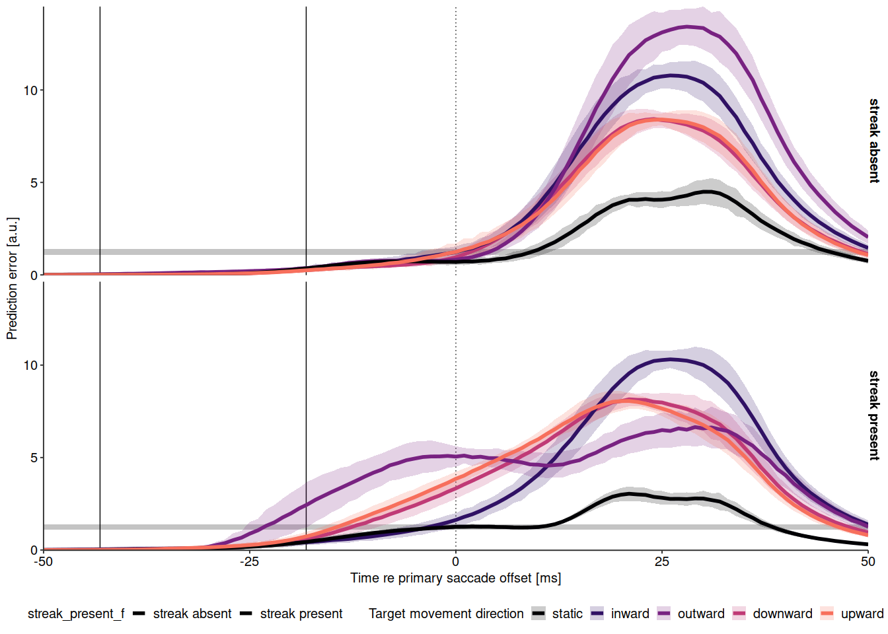<!-- -->

``` r
# aggregate area between curves
source("bootstrap_sum_se.R")
all_loc_agg_all_wide <- dcast(all_loc_agg_all, 
                              move_direction_of + time_round ~ streak_present_f, 
                              value.var = "pred_error.s")
setDT(all_loc_agg_all_wide)
colnames(all_loc_agg_all_wide) <- gsub(x = colnames(all_loc_agg_all_wide), 
                                       pattern = "streak ", replacement = "streak_")
all_loc_agg_all_wide[ , difference := streak_present - streak_absent]
all_loc_agg_all_wide_sum <- all_loc_agg_all_wide[difference>=0, 
                                                 c(bootstrap_sum_se(difference)), by = .(move_direction_of)]
```

    ## Loading required package: boot

    ## 
    ## Attaching package: 'boot'

    ## The following object is masked from 'package:pracma':
    ## 
    ##     logit

``` r
ggplot(data = all_loc_agg_all_wide_sum, 
       aes(x = move_direction_of, y = mean, fill = move_direction_of)) + 
  geom_bar(aes(color = move_direction_of), stat = "identity", alpha = 0.8) + 
  geom_errorbar(aes(ymin = lower, ymax = upper), width = 0, size = 1.5)  + 
  SDECTheme() + theme(legend.position = "none") + 
  scale_color_viridis_d(end = 0.7, option = "magma", direction = 1) + 
  scale_fill_viridis_d(end = 0.7, option = "magma", direction = 1) + 
  scale_y_continuous(expand = c(0,0)) + 
  labs(x = "Target movement direction", 
       y = "Sum of difference in prediction error [a.u.]") #+ 
```

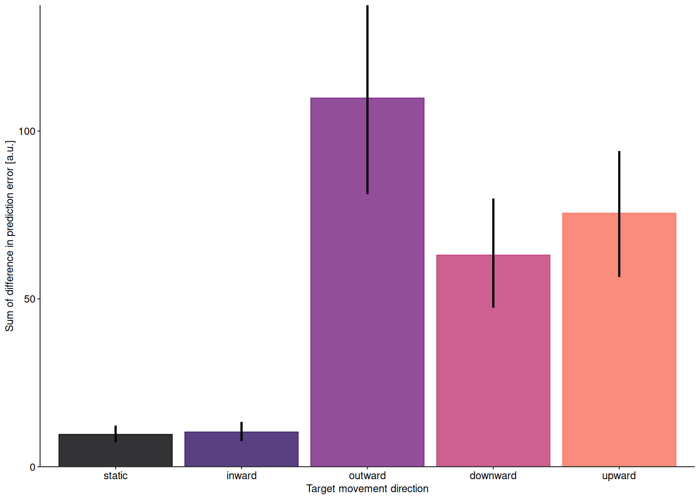<!-- -->

``` r
  #coord_flip()


# show K over time
p_K_over_time <- 
  ggplot(all_loc_agg_all, aes(x = time_round, y = K, color = move_direction_of, 
                              alpha = streak_present_f, 
                              group = paste(streak_present_f, move_direction_of))) + 
  geom_vline(xintercept = c(0), 
             linetype = "dotted") + 
  geom_vline(xintercept = c(-mean(move_off_re_sac_off), -mean(move_off_re_sac_off)-25), 
             linetype = "solid") + 
  geom_line(size = 2) + 
  scale_alpha_manual(values = c(1, 1)) + 
  facet_grid(streak_present_f~.) + 
  SDECTheme() + 
  scale_color_viridis_d(end = 0.7, option = "magma") + 
  scale_fill_viridis_d(end = 0.7, option = "magma") + 
  coord_cartesian(expand=FALSE) + 
  xlim(-50, 50) + 
  labs(x = "Time re primary saccade offset [ms]", 
       y = "Prediction error [a.u.]", 
       color = "Target movement direction", fill = "Target movement direction") + 
  theme(legend.position = "bottom")
p_K_over_time # export as 5x4
```

    ## Warning: Removed 740 rows containing missing values or values outside the scale range
    ## (`geom_line()`).

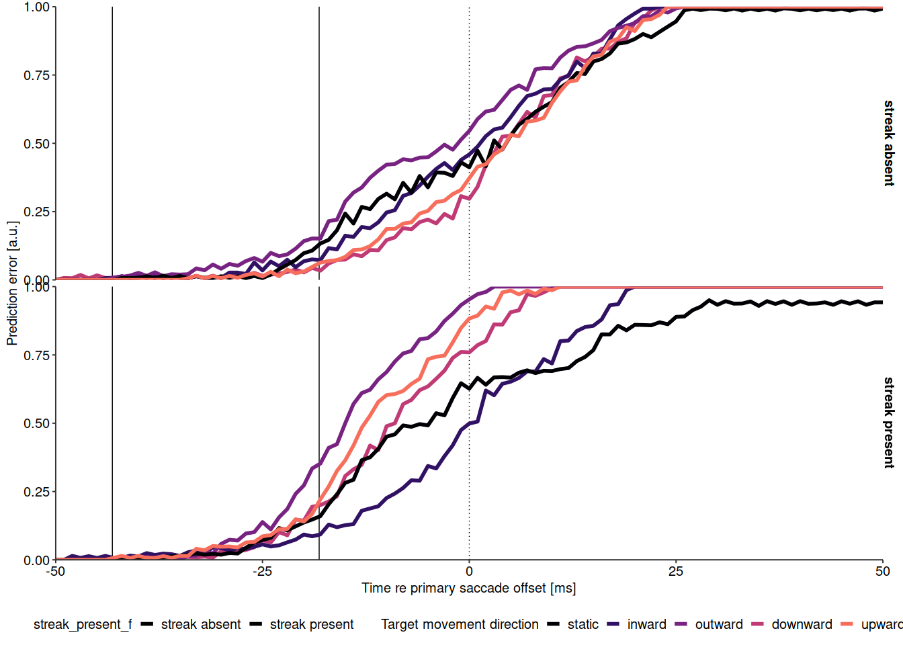<!-- -->

``` r
##### DO MODEL PRED. RELATE TO ABSOLUTE SECONDARY SACCADE LATENCIES
# get first time above threshold
all_loc_firstabove <- all_loc_agg[ , .(ta = min(time_round[time_round>=(-50) & pred_error>thres]), # this is more robust
                                       ta2 = min(time_round[K>0.5])), 
                                   by = .(subj_id, streak_present_f, move_direction_f)]
# ... and secondary saccade latencies
sec_lat_agg <- sdec[!is.na(secondary_latency_final), 
                    .(sec_lat = mean(secondary_latency_final)), 
                    by = .(subj_id, streak_present_f, move_direction_f)]
# third, merge those
merged_sec_lat_firstabove <- merge.data.table(all_loc_firstabove, sec_lat_agg, 
                                              by = c("subj_id", "streak_present_f", "move_direction_f"))
#
merged_sec_lat_firstabove_agg_subj <- merged_sec_lat_firstabove[ ,.(ta = mean(ta), 
                                                               ta_se = sd(ta) / sqrt(length(unique(subj_id))),
                                                               sec_lat = mean(sec_lat), 
                                                               sec_lat_se = sd(sec_lat) / sqrt(length(unique(subj_id))) ), 
                                                            by = .(subj_id, move_direction_f)]
merged_sec_lat_firstabove_agg_subj[ , move_direction_of := ordered(move_direction_f, 
                                            levels = c("static", "inward", "outward", "downward", "upward"))]
# remove between subject variance
merged_sec_lat_firstabove_agg_subj[ , gm_sec_lat := mean(sec_lat)]
merged_sec_lat_firstabove_agg_subj[ , gm_ta := mean(ta)]
merged_sec_lat_firstabove_agg_subj[ , sec_lat.w := sec_lat - mean(sec_lat) + gm_sec_lat, by = .(subj_id)]
merged_sec_lat_firstabove_agg_subj[ , ta.w := ta - mean(ta) + gm_ta, by = .(subj_id)]
# test correlation
cor.test(merged_sec_lat_firstabove_agg_subj$ta, merged_sec_lat_firstabove_agg_subj$sec_lat, 
         method = "spearman", exact = FALSE)
```

    ## 
    ##  Spearman's rank correlation rho
    ## 
    ## data:  merged_sec_lat_firstabove_agg_subj$ta and merged_sec_lat_firstabove_agg_subj$sec_lat
    ## S = 13735, p-value = 0.01556
    ## alternative hypothesis: true rho is not equal to 0
    ## sample estimates:
    ##       rho 
    ## 0.3404419

``` r
summary(lm(data = merged_sec_lat_firstabove_agg_subj, formula = sec_lat ~ ta))
```

    ## 
    ## Call:
    ## lm(formula = sec_lat ~ ta, data = merged_sec_lat_firstabove_agg_subj)
    ## 
    ## Residuals:
    ##     Min      1Q  Median      3Q     Max 
    ## -71.037 -19.610  -7.949  17.891 115.399 
    ## 
    ## Coefficients:
    ##             Estimate Std. Error t value Pr(>|t|)    
    ## (Intercept) 161.5209     5.9639  27.083   <2e-16 ***
    ## ta            1.1398     0.5183   2.199   0.0327 *  
    ## ---
    ## Signif. codes:  0 '***' 0.001 '**' 0.01 '*' 0.05 '.' 0.1 ' ' 1
    ## 
    ## Residual standard error: 39.33 on 48 degrees of freedom
    ## Multiple R-squared:  0.09155,    Adjusted R-squared:  0.07262 
    ## F-statistic: 4.837 on 1 and 48 DF,  p-value: 0.0327

``` r
# pop agg
merged_sec_lat_firstabove_agg <- 
  merged_sec_lat_firstabove_agg_subj[ ,.(ta = mean(ta), 
                                         ta_se = sd(ta.w) / sqrt(length(unique(subj_id))),
                                         sec_lat = mean(sec_lat), 
                                         sec_lat_se = sd(sec_lat.w) / sqrt(length(unique(subj_id))) ), 
                                      by = .(move_direction_of)]
# plot
p_predict_error_abs_lat <- 
  ggplot(data = merged_sec_lat_firstabove_agg, aes(x = ta, y = sec_lat, 
                                             color = move_direction_of)) + 
  geom_point(size = 4) + 
  geom_errorbar(aes(ymin = sec_lat - sec_lat_se, ymax = sec_lat + sec_lat_se, colour = move_direction_of), 
                width = 0, size = 2) + 
  geom_errorbarh(aes(xmin = ta - ta_se, xmax = ta + ta_se, colour = move_direction_of), 
                height = 0, size = 2) + 
  geom_point(data = merged_sec_lat_firstabove_agg_subj, aes(x = ta.w, y = sec_lat.w,
                                                            color = move_direction_of), 
             size = 2) +
  # geom_smooth(data = merged_sec_lat_firstabove_agg_subj, aes(x = ta.w, y = sec_lat.w),
  #             method = "lm", se = FALSE, color = "black") + 
  SDECTheme() + 
  scale_color_viridis_d(end = 0.7, option = "magma") + 
  labs(x = "Model-estimated time of prediction error [ms]", 
       y = "Secondary saccade latency [ms]", 
       color = "Target movement direction")
p_predict_error_abs_lat
```

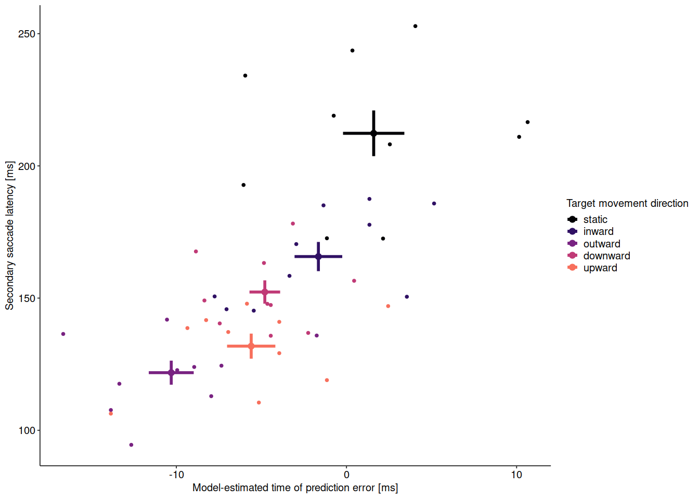<!-- -->

``` r
#### DOES THE MODEL PREDICT THE BENEFIT OF MOTION STREAKS?
merged_sec_lat_firstabove_agg_diff <- 
  merged_sec_lat_firstabove[ , 
                             .(ta = mean(ta[streak_present_f=="streak present"]-
                                           ta[streak_present_f=="streak absent"]), 
                               sec_lat = mean(sec_lat[streak_present_f=="streak present"]-
                                                sec_lat[streak_present_f=="streak absent"])), 
                             by = .(subj_id, move_direction_f)]
merged_sec_lat_firstabove_agg_diff[ , move_direction_of := ordered(move_direction_f, 
                                                                   levels = c("static", "inward", "outward", "downward", "upward"))]
# test correlation
cor.test(merged_sec_lat_firstabove_agg_diff$ta, merged_sec_lat_firstabove_agg_diff$sec_lat, 
         method = "spearman", exact = FALSE)
```

    ## 
    ##  Spearman's rank correlation rho
    ## 
    ## data:  merged_sec_lat_firstabove_agg_diff$ta and merged_sec_lat_firstabove_agg_diff$sec_lat
    ## S = 14015, p-value = 0.02046
    ## alternative hypothesis: true rho is not equal to 0
    ## sample estimates:
    ##      rho 
    ## 0.326988

``` r
# plot
merged_sec_lat_firstabove_superagg_diff <-
  merged_sec_lat_firstabove_agg_diff[ ,
                                      .(ta = mean(ta), 
                                        ta_se = sd(ta) / sqrt(length(unique(subj_id))),
                                        sec_lat = mean(sec_lat), 
                                        sec_lat_se = sd(sec_lat) / sqrt(length(unique(subj_id))) ), 
                                      by = .(move_direction_of)]

p_predict_error_diff_lat <- 
  ggplot(data = merged_sec_lat_firstabove_agg_diff, aes(x = ta, y = sec_lat, 
                                                      color = move_direction_of)) + 
  geom_hline(yintercept = 0, linetype = "dashed") + 
  geom_vline(xintercept = 0, linetype = "dashed") + 
  geom_point(size = 2) + 
  geom_errorbar(data = merged_sec_lat_firstabove_superagg_diff,
                aes(ymin = sec_lat - sec_lat_se, ymax = sec_lat + sec_lat_se, colour = move_direction_of), 
                width = 0, size = 2) +
  geom_errorbarh(data = merged_sec_lat_firstabove_superagg_diff, 
                 aes(xmin = ta - ta_se, xmax = ta + ta_se, colour = move_direction_of),
                 height = 0, size = 2) +
  geom_point(data = merged_sec_lat_firstabove_superagg_diff, aes(x = ta, y = sec_lat,
                                                                 color = move_direction_of), 
             size = 4) +
  # geom_smooth(data = merged_sec_lat_firstabove_agg_diff, aes(x = ta, y = sec_lat),
  #             method = "lm", se = FALSE, color = "black") + 
  theme_minimal() + SDECTheme() +
  scale_color_viridis_d(end = 0.7, option = "magma") + 
  labs(x = "Model-estimated latency change [ms]", 
       y = "Secondary saccade latency change [ms]", 
       color = "Target movement direction")
p_predict_error_diff_lat
```

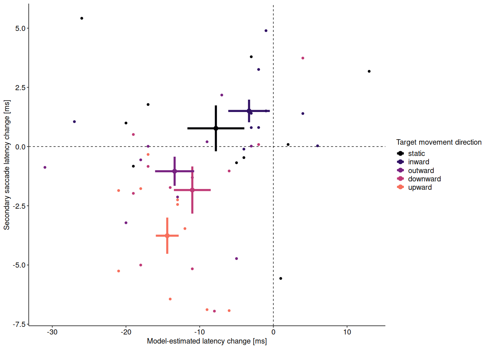<!-- -->

``` r
# combine
plot_grid(p_predict_error_abs_lat + theme(legend.position = "none"), 
          p_predict_error_diff_lat + theme(legend.position = "none"), 
          nrow = 1, rel_widths = c(1,1), align = "hv")
```

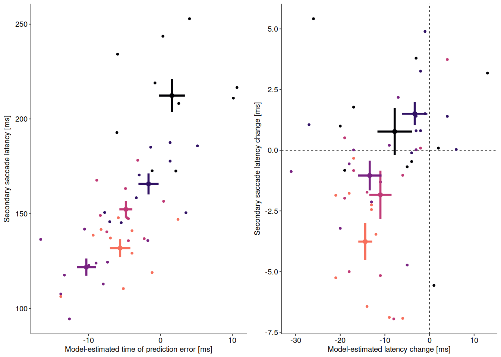<!-- -->

# A few additional model tests

To evaluate the model, let’s see whether it can make predictions about
Kelly’s stabilized motion surface…

``` r
source("kelly_vel.R") # for Kelly's (1979) function
source("create_flicker_stim.R")
source("get_gabor_field_simple.R")

# which to test? - some Kelly data will be extracted
# 1 & 0.375 cpd 1-30 Hz (Figures 3 & 4)
# 0.3 - 10 cpd at 11 dva/s and 0.15 dva/s (Figure 10)

# globals
test_nr = 1
if (test_nr==1) { # Fig 3 & 4
  (test_SFs <- c(0.375, 1))
  (test_TFs <- exp(seq(log(1), log(35), length.out = 10)))
} else if (test_nr==2) { # Fig 10
  (test_SFs <- exp(seq(log(0.2), log(5), length.out = 10))) 
  vels = c(0.15, 11)
  comp_tf = expand.grid(list(test_SFs, vels))
  TF/SF # TBC
  (test_TFs <- exp(seq(log(1), log(35), length.out = 10)))
}
```

    ##  [1]  1.000000  1.484442  2.203567  3.271066  4.855707  7.208013 10.699875
    ##  [8] 15.883339 23.577890 35.000000

``` r
pres_dur <- 4 * 8 * 28 * (1000/120)
override_normalization <- TRUE
use_normal_test_RF <- FALSE # TRUE: linear Gabors, FALSE: log Gabors
beta <- 1.2 # beta for probability summation 

# loop over SFs and TFs
prob_sums <- NULL
full_RF_outputs <- NULL
for (test_flicker in c(TRUE, FALSE)) {
  if (test_flicker) { what_now <- "Flicker" } else { what_now <- "Motion" }
  for (test_SF in test_SFs) {
    for (test_TF in test_TFs) {
      condition_now <- paste(what_now, round(test_SF, 3), round(test_TF, 3))
      print(condition_now)
      # both for flicker and motion:
      flicker_time <- seq(0, pres_dur, by = temporal_resolution)
      flicker_ramp <- dnorm(x = flicker_time, mean = pres_dur/2, 
                            sd = pres_dur/8) # SD OF GAUSSIAN RAMP! 1/8
      flicker_ramp <- flicker_ramp/max(abs(flicker_ramp)) # normalize to 1
      if (test_flicker) { # get flicker stimulus
        flicker_seq <- create_flicker_stim(dur = pres_dur, t_res = temporal_resolution, tfreq = test_TF)
        flicker_seq <- flicker_seq * flicker_ramp
        control_seq <- flicker_seq
        #plot(flicker_time, flicker_seq, type = "l", xlim = c(3000, 4000))
        #spec.ar(flicker_seq)
      } else { # get motion stimulus
        pcpf_motion = temporal_resolution/1000 * test_TF * 360
        phase_seq <- cumsum(rep(pcpf_motion, times = length(flicker_time)))
        motion_seq <- sin(deg2rad(phase_seq))*flicker_ramp
        control_seq <- motion_seq
        #plot(flicker_time, motion_seq, type = "l", xlim = c(3000, 4000))
        #spec.ar(motion_seq)
      }
      # get Gabor sequence according to the criteria 
      for (t_i in 1:length(flicker_time)) {
        if (test_flicker) {
          intensity_now <- flicker_seq[t_i]
          gabor_now <- get_gabor_field_simple(rf_freq_dva = test_SF, 
                                              rf_width_dva = (1/test_SF), # / 2
                                              rf_ori = 0, 
                                              rf_amp = intensity_now, 
                                              rf_phase_rad = pi/4, 
                                              scr.ppd = scr.ppd, ppd_scaler = 1/spatial_resolution, 
                                              mesh_size_scaler = 3, 
                                              create_aperture = TRUE, gaussian_aperture = TRUE)
        } else {
          intensity_now <- flicker_ramp[t_i]
          phase_now <- phase_seq[t_i]
          gabor_now <- get_gabor_field_simple(rf_freq_dva = test_SF, 
                                              rf_width_dva = (1/test_SF), # / 2
                                              rf_ori = 0, 
                                              rf_amp = intensity_now, 
                                              rf_phase_rad = deg2rad(phase_now), 
                                              scr.ppd = scr.ppd, ppd_scaler = 1/spatial_resolution, 
                                              mesh_size_scaler = 3, 
                                              create_aperture = TRUE, gaussian_aperture = TRUE)
        }
        if (t_i==1) {
          flicker_gabor_seq <- array(0, dim = c(dim(gabor_now[[1]]), length(flicker_time)), 
                                     dimnames = list(dimnames(gabor_now[[1]])[[1]], 
                                                     dimnames(gabor_now[[1]])[[2]], 
                                                     flicker_time))
        }
        flicker_gabor_seq[ , ,t_i] <- gabor_now[[1]]
      }
      #plot_heatmap(flicker_gabor_seq[ , , 4000], do_print = TRUE)
      #plot_heatmap(flicker_gabor_seq[ , , 4001], do_print = TRUE)
      
      # did this work?
      if (test_flicker) {
        flicker_seq_control <- apply(X = flicker_gabor_seq, 
                                   FUN = function(x) { diff(range(x)) / 2}, 
                                   MARGIN = c(3))
        #  plot(flicker_time, flicker_seq_control, type = "l)
        #  flicker_seq_control_peaks <- as.numeric(round(kmeans(which(flicker_seq_control>0.6), centers = 2)$centers))
        #  plot_heatmap(mat = flicker_gabor_seq[ , ,flicker_seq_control_peaks[1]], use_limits = c(-1, 1))
        #  plot_heatmap(mat = flicker_gabor_seq[ , ,flicker_seq_control_peaks[2]], use_limits = c(-1, 1))
      }
      
      # shall we test multiple SFs?
      test_SF_now <- test_SF#c(test_SF/1.4, test_SF, test_SF*1.4) # 1.4 according to Heiko's SF spacing
      # get receptive field/s
      if (use_normal_test_RF) { # normal Gabors
        test_RF <- get_gabor_filter_bank(
          all_SF = test_SF_now, 
          all_Ori = c(0), # positive means clockwise
          use_log_gabor_heiko = FALSE, 
          rf_width_override = (1/test_SF_now) / 2, # cpd, set to NaN to let the function determine RF field size
          scr_ppd = scr.ppd, 
          ppd_scaler = 1/spatial_resolution,
          make_gaussian_aperture = TRUE)
      } else { # log Gabors
        test_RF <- get_gabor_filter_bank(
          all_SF = test_SF_now, 
          all_Ori = c(0), # positive means clockwise
          use_log_gabor_heiko = TRUE, 
          use_log_gabor_SF_band_adjustment = TRUE, 
          use_log_gabor_orientation_band_adjustment = TRUE,
          rf_width_override = (1/test_SF_now) / 2 * 8, # let's assume 8 x RF SD
          scr_ppd = scr.ppd, 
          ppd_scaler = 1/spatial_resolution,
          make_gaussian_aperture = TRUE)
      }
      print(paste("dim(test_RF[[1]][[1]]) =", paste(dim(test_RF[[1]][[1]]), collapse = ",")))
      
      # ... and corresponding temporal response function
      test_IRF <- get_IRF_df(SFs = test_SF_now, 
                             irf_time_range = c(0, 200), 
                             temporal_resolution = temporal_resolution)
      # run our function
      test_RF_output <- v1(mat_over_t = flicker_gabor_seq, 
                           gabor_list = test_RF, # a list of gabor filters created by 'get_gabor_filter_bank'
                           irf_df = test_IRF, # a data.frame of IRFs resolved in SF x time created by 'get_IRF_df'
                           normalize_IRFs = FALSE, # ?????
                           norm_sigma = 0.07, 
                           normalize_override = override_normalization, # OVERRIDE NORMALIZATION???
                           use_normalization_pool = FALSE, 
                           output_full_sequences = TRUE, # TRUE: returns complete sequences. WARNING: this is memory-intense
                           signal_x_range = NULL, signal_y_range = NULL, signal_t_range = NULL, # the min and max of temporal scale
                           no_CUDA = FALSE, # set to TRUE if you want to use CPU instead of GPU (but torch)
                           use_half_precision = FALSE, # if a GPU is available, use half-precision?
                           spatial_resolution = spatial_resolution, # spatial resolution of processing function in dva
                           temporal_resolution = temporal_resolution, # temporal resolution of processing function in milliseconds
                           debug_mode = FALSE, # shows output at every step
                           show_final_maps = TRUE,  # shows all resulting 2D maps at the end
                           final_maps_filename = "" # name of the pdf file if show_final_maps==TRUE
      )
      # get our full output
      summed_over_time_RF_output <- test_RF_output[[1]]
      plot_heatmap(summed_over_time_RF_output[1, , ])
      full_RF_output <- test_RF_output[[4]]
      full_RF_output <- apply(X = full_RF_output, 
                              FUN = function(x) { max(x) }, 
                              MARGIN = c(1, 4))
      dim(full_RF_output)
      apply(full_RF_output, FUN = function(x) {sum(x)}, MARGIN = c(1))
      #plot(flicker_time, full_RF_output, type = "l")
      
      # save this data
      full_RF_outputs <- rbind(full_RF_outputs, 
                               data.table(resp = full_RF_output, 
                                          motion_flicker = what_now, 
                                          SF = test_SF, TF = test_TF))
      
      # probability summation
      if (dim(test_RF_output[[1]])[1]==1) { # only one filter!
        prob_sum <- trapz(x = flicker_time, y = abs(full_RF_output)^beta )^(1/beta)
        simple_sum <- max(summed_over_time_RF_output[1, , ])
        simple_sum_control <- apply(full_RF_output, FUN = function(x) {sum(x)}, MARGIN = c(1))
      } else { # multiple filters
        prob_sum <- 0
        simple_sum <- 0
        simple_sum_control <- 0
        for (it in 1:dim(full_RF_output)[1]) {
          prob_sum <- prob_sum + trapz(x = flicker_time, y = abs(full_RF_output[it, ])^beta )^(1/beta)
          simple_sum <- simple_sum + max(summed_over_time_RF_output[it, , ])
          simple_sum_control <- simple_sum_control + sum(full_RF_output[it, ])
        }
      }
      (prob_sum_now <- data.table(motion_flicker = what_now, 
                                 SF = test_SF, TF = test_TF, 
                                 prob_sum = prob_sum, 
                                 simple_sum = simple_sum,
                                 simple_sum_control = simple_sum_control
      ))
      # prob_sums[motion_flicker=="motion" & SF==0.5]
      
      # add
      prob_sums <- rbind(prob_sums, prob_sum_now)
      
      
      ## UNDERSTAND: do the processing step by step
      do_understand <- FALSE
      if (do_understand) {
        require(smoothie)
        # step 1: spatial processing: convolution with Gabor filter
        filter_resp_zero <- apply(X = flicker_gabor_seq, 
                                  FUN = function(x) { max(kernel2dsmooth(x = x, K = test_RF[[1]][[1]])) }, 
                                  MARGIN = c(3))
        filter_resp_half <- apply(X = flicker_gabor_seq, 
                                  FUN = function(x) { max(kernel2dsmooth(x = x, K = test_RF[[1]][[2]])) }, 
                                  MARGIN = c(3))
        # step 2: convolution with temporal response
        irf_resp_zero <- zapsmall(convolve(filter_resp_zero, rev(test_IRF$irf), 
                                           type = "open"))[1:length(filter_resp_zero)]
        irf_resp_half <- zapsmall(convolve(filter_resp_half, rev(test_IRF$irf), 
                                           type = "open"))[1:length(filter_resp_zero)]
        # step 3: squaring
        irf_resp_squared <- sqrt(irf_resp_zero^2 + irf_resp_half^2)
        
        # plot this
        par(mfrow = c(2, 2))
        # stim
        plot(flicker_time, control_seq, type = "l", col = "black", main = condition_now)
        # gabor resp
        plot(flicker_time, filter_resp_zero, type = "l", col = "blue")
        lines(flicker_time, filter_resp_half, col = "red")
        # IRF resp
        plot(flicker_time, irf_resp_zero, type = "l", col = "blue")
        lines(flicker_time, irf_resp_half, col = "red")
        # squared resp
        plot(flicker_time, irf_resp_squared, type = "l")
        par(mfrow = c(1, 1))
      }
      
    }# end of loop over TFs
  } # end of loop over SFs
} # end of loop over flicker/motion
```

    ## [1] "Flicker 0.375 1"
    ## [1] "dim(test_RF[[1]][[1]]) = 161,161"
    ## [1] "Gabor filter 1 of 1, SF=0.38, Ori=0"
    ## standard 2D convolution: 10.874 sec elapsed
    ## Temporal conv and low-pass: 1.638 sec elapsed
    ## Normalization of responses (filter 1 of 1): 9.651 sec elapsed
    ## [1] "Done."
    ## [1] "Resulting dim(final_2d_over_filters) = 1,121,121 [y,x,t]"
    ## [1] "Flicker 0.375 1.484"
    ## [1] "dim(test_RF[[1]][[1]]) = 161,161"
    ## [1] "Gabor filter 1 of 1, SF=0.38, Ori=0"
    ## standard 2D convolution: 10.533 sec elapsed
    ## Temporal conv and low-pass: 1.356 sec elapsed
    ## Normalization of responses (filter 1 of 1): 9.854 sec elapsed
    ## [1] "Done."
    ## [1] "Resulting dim(final_2d_over_filters) = 1,121,121 [y,x,t]"
    ## [1] "Flicker 0.375 2.204"
    ## [1] "dim(test_RF[[1]][[1]]) = 161,161"
    ## [1] "Gabor filter 1 of 1, SF=0.38, Ori=0"
    ## standard 2D convolution: 10.712 sec elapsed
    ## Temporal conv and low-pass: 1.47 sec elapsed
    ## Normalization of responses (filter 1 of 1): 10.03 sec elapsed
    ## [1] "Done."
    ## [1] "Resulting dim(final_2d_over_filters) = 1,121,121 [y,x,t]"
    ## [1] "Flicker 0.375 3.271"
    ## [1] "dim(test_RF[[1]][[1]]) = 161,161"
    ## [1] "Gabor filter 1 of 1, SF=0.38, Ori=0"
    ## standard 2D convolution: 10.977 sec elapsed
    ## Temporal conv and low-pass: 1.455 sec elapsed
    ## Normalization of responses (filter 1 of 1): 9.689 sec elapsed
    ## [1] "Done."
    ## [1] "Resulting dim(final_2d_over_filters) = 1,121,121 [y,x,t]"
    ## [1] "Flicker 0.375 4.856"
    ## [1] "dim(test_RF[[1]][[1]]) = 161,161"
    ## [1] "Gabor filter 1 of 1, SF=0.38, Ori=0"
    ## standard 2D convolution: 11.113 sec elapsed
    ## Temporal conv and low-pass: 1.469 sec elapsed
    ## Normalization of responses (filter 1 of 1): 10.28 sec elapsed
    ## [1] "Done."
    ## [1] "Resulting dim(final_2d_over_filters) = 1,121,121 [y,x,t]"
    ## [1] "Flicker 0.375 7.208"
    ## [1] "dim(test_RF[[1]][[1]]) = 161,161"
    ## [1] "Gabor filter 1 of 1, SF=0.38, Ori=0"
    ## standard 2D convolution: 11.287 sec elapsed
    ## Temporal conv and low-pass: 1.483 sec elapsed
    ## Normalization of responses (filter 1 of 1): 9.917 sec elapsed
    ## [1] "Done."
    ## [1] "Resulting dim(final_2d_over_filters) = 1,121,121 [y,x,t]"
    ## [1] "Flicker 0.375 10.7"
    ## [1] "dim(test_RF[[1]][[1]]) = 161,161"
    ## [1] "Gabor filter 1 of 1, SF=0.38, Ori=0"
    ## standard 2D convolution: 10.888 sec elapsed
    ## Temporal conv and low-pass: 1.418 sec elapsed
    ## Normalization of responses (filter 1 of 1): 9.584 sec elapsed
    ## [1] "Done."
    ## [1] "Resulting dim(final_2d_over_filters) = 1,121,121 [y,x,t]"
    ## [1] "Flicker 0.375 15.883"
    ## [1] "dim(test_RF[[1]][[1]]) = 161,161"
    ## [1] "Gabor filter 1 of 1, SF=0.38, Ori=0"
    ## standard 2D convolution: 10.803 sec elapsed
    ## Temporal conv and low-pass: 1.397 sec elapsed
    ## Normalization of responses (filter 1 of 1): 10.083 sec elapsed
    ## [1] "Done."
    ## [1] "Resulting dim(final_2d_over_filters) = 1,121,121 [y,x,t]"
    ## [1] "Flicker 0.375 23.578"
    ## [1] "dim(test_RF[[1]][[1]]) = 161,161"
    ## [1] "Gabor filter 1 of 1, SF=0.38, Ori=0"
    ## standard 2D convolution: 11.184 sec elapsed
    ## Temporal conv and low-pass: 1.682 sec elapsed
    ## Normalization of responses (filter 1 of 1): 10.544 sec elapsed
    ## [1] "Done."
    ## [1] "Resulting dim(final_2d_over_filters) = 1,121,121 [y,x,t]"
    ## [1] "Flicker 0.375 35"
    ## [1] "dim(test_RF[[1]][[1]]) = 161,161"
    ## [1] "Gabor filter 1 of 1, SF=0.38, Ori=0"
    ## standard 2D convolution: 11.162 sec elapsed
    ## Temporal conv and low-pass: 1.442 sec elapsed
    ## Normalization of responses (filter 1 of 1): 9.97 sec elapsed
    ## [1] "Done."
    ## [1] "Resulting dim(final_2d_over_filters) = 1,121,121 [y,x,t]"
    ## [1] "Flicker 1 1"
    ## [1] "dim(test_RF[[1]][[1]]) = 61,61"
    ## [1] "Gabor filter 1 of 1, SF=1, Ori=0"
    ## standard 2D convolution: 0.244 sec elapsed
    ## Temporal conv and low-pass: 0.152 sec elapsed
    ## Normalization of responses (filter 1 of 1): 1.238 sec elapsed
    ## [1] "Done."
    ## [1] "Resulting dim(final_2d_over_filters) = 1,47,47 [y,x,t]"
    ## [1] "Flicker 1 1.484"
    ## [1] "dim(test_RF[[1]][[1]]) = 61,61"
    ## [1] "Gabor filter 1 of 1, SF=1, Ori=0"
    ## standard 2D convolution: 0.235 sec elapsed
    ## Temporal conv and low-pass: 0.163 sec elapsed
    ## Normalization of responses (filter 1 of 1): 1.386 sec elapsed
    ## [1] "Done."
    ## [1] "Resulting dim(final_2d_over_filters) = 1,47,47 [y,x,t]"
    ## [1] "Flicker 1 2.204"
    ## [1] "dim(test_RF[[1]][[1]]) = 61,61"
    ## [1] "Gabor filter 1 of 1, SF=1, Ori=0"
    ## standard 2D convolution: 0.236 sec elapsed
    ## Temporal conv and low-pass: 0.161 sec elapsed
    ## Normalization of responses (filter 1 of 1): 1.174 sec elapsed
    ## [1] "Done."
    ## [1] "Resulting dim(final_2d_over_filters) = 1,47,47 [y,x,t]"
    ## [1] "Flicker 1 3.271"
    ## [1] "dim(test_RF[[1]][[1]]) = 61,61"
    ## [1] "Gabor filter 1 of 1, SF=1, Ori=0"
    ## standard 2D convolution: 0.239 sec elapsed
    ## Temporal conv and low-pass: 0.157 sec elapsed
    ## Normalization of responses (filter 1 of 1): 1.096 sec elapsed
    ## [1] "Done."
    ## [1] "Resulting dim(final_2d_over_filters) = 1,47,47 [y,x,t]"
    ## [1] "Flicker 1 4.856"
    ## [1] "dim(test_RF[[1]][[1]]) = 61,61"
    ## [1] "Gabor filter 1 of 1, SF=1, Ori=0"
    ## standard 2D convolution: 0.25 sec elapsed
    ## Temporal conv and low-pass: 0.179 sec elapsed
    ## Normalization of responses (filter 1 of 1): 1.29 sec elapsed
    ## [1] "Done."
    ## [1] "Resulting dim(final_2d_over_filters) = 1,47,47 [y,x,t]"
    ## [1] "Flicker 1 7.208"
    ## [1] "dim(test_RF[[1]][[1]]) = 61,61"
    ## [1] "Gabor filter 1 of 1, SF=1, Ori=0"
    ## standard 2D convolution: 0.23 sec elapsed
    ## Temporal conv and low-pass: 0.153 sec elapsed
    ## Normalization of responses (filter 1 of 1): 1.413 sec elapsed
    ## [1] "Done."
    ## [1] "Resulting dim(final_2d_over_filters) = 1,47,47 [y,x,t]"
    ## [1] "Flicker 1 10.7"
    ## [1] "dim(test_RF[[1]][[1]]) = 61,61"
    ## [1] "Gabor filter 1 of 1, SF=1, Ori=0"
    ## standard 2D convolution: 0.24 sec elapsed
    ## Temporal conv and low-pass: 0.153 sec elapsed
    ## Normalization of responses (filter 1 of 1): 1.5 sec elapsed
    ## [1] "Done."
    ## [1] "Resulting dim(final_2d_over_filters) = 1,47,47 [y,x,t]"
    ## [1] "Flicker 1 15.883"
    ## [1] "dim(test_RF[[1]][[1]]) = 61,61"
    ## [1] "Gabor filter 1 of 1, SF=1, Ori=0"
    ## standard 2D convolution: 0.237 sec elapsed
    ## Temporal conv and low-pass: 0.155 sec elapsed
    ## Normalization of responses (filter 1 of 1): 1.489 sec elapsed
    ## [1] "Done."
    ## [1] "Resulting dim(final_2d_over_filters) = 1,47,47 [y,x,t]"
    ## [1] "Flicker 1 23.578"
    ## [1] "dim(test_RF[[1]][[1]]) = 61,61"
    ## [1] "Gabor filter 1 of 1, SF=1, Ori=0"
    ## standard 2D convolution: 0.24 sec elapsed
    ## Temporal conv and low-pass: 0.153 sec elapsed
    ## Normalization of responses (filter 1 of 1): 1.153 sec elapsed
    ## [1] "Done."
    ## [1] "Resulting dim(final_2d_over_filters) = 1,47,47 [y,x,t]"
    ## [1] "Flicker 1 35"
    ## [1] "dim(test_RF[[1]][[1]]) = 61,61"
    ## [1] "Gabor filter 1 of 1, SF=1, Ori=0"
    ## standard 2D convolution: 0.245 sec elapsed
    ## Temporal conv and low-pass: 0.154 sec elapsed
    ## Normalization of responses (filter 1 of 1): 1.223 sec elapsed
    ## [1] "Done."
    ## [1] "Resulting dim(final_2d_over_filters) = 1,47,47 [y,x,t]"
    ## [1] "Motion 0.375 1"
    ## [1] "dim(test_RF[[1]][[1]]) = 161,161"

    ## Warning in min(which(apply(X = mat_over_t, FUN = function(x) {: no non-missing
    ## arguments to min; returning Inf

    ## [1] "Gabor filter 1 of 1, SF=0.38, Ori=0"
    ## standard 2D convolution: 10.936 sec elapsed
    ## Temporal conv and low-pass: 1.444 sec elapsed
    ## Normalization of responses (filter 1 of 1): 9.676 sec elapsed
    ## [1] "Done."
    ## [1] "Resulting dim(final_2d_over_filters) = 1,121,121 [y,x,t]"
    ## [1] "Motion 0.375 1.484"
    ## [1] "dim(test_RF[[1]][[1]]) = 161,161"

    ## Warning in min(which(apply(X = mat_over_t, FUN = function(x) {: no non-missing
    ## arguments to min; returning Inf

    ## [1] "Gabor filter 1 of 1, SF=0.38, Ori=0"
    ## standard 2D convolution: 11.051 sec elapsed
    ## Temporal conv and low-pass: 1.397 sec elapsed
    ## Normalization of responses (filter 1 of 1): 9.774 sec elapsed
    ## [1] "Done."
    ## [1] "Resulting dim(final_2d_over_filters) = 1,121,121 [y,x,t]"
    ## [1] "Motion 0.375 2.204"
    ## [1] "dim(test_RF[[1]][[1]]) = 161,161"

    ## Warning in min(which(apply(X = mat_over_t, FUN = function(x) {: no non-missing
    ## arguments to min; returning Inf

    ## [1] "Gabor filter 1 of 1, SF=0.38, Ori=0"
    ## standard 2D convolution: 10.915 sec elapsed
    ## Temporal conv and low-pass: 1.717 sec elapsed
    ## Normalization of responses (filter 1 of 1): 10.477 sec elapsed
    ## [1] "Done."
    ## [1] "Resulting dim(final_2d_over_filters) = 1,121,121 [y,x,t]"
    ## [1] "Motion 0.375 3.271"
    ## [1] "dim(test_RF[[1]][[1]]) = 161,161"

    ## Warning in min(which(apply(X = mat_over_t, FUN = function(x) {: no non-missing
    ## arguments to min; returning Inf

    ## [1] "Gabor filter 1 of 1, SF=0.38, Ori=0"
    ## standard 2D convolution: 10.729 sec elapsed
    ## Temporal conv and low-pass: 1.648 sec elapsed
    ## Normalization of responses (filter 1 of 1): 9.557 sec elapsed
    ## [1] "Done."
    ## [1] "Resulting dim(final_2d_over_filters) = 1,121,121 [y,x,t]"
    ## [1] "Motion 0.375 4.856"
    ## [1] "dim(test_RF[[1]][[1]]) = 161,161"

    ## Warning in min(which(apply(X = mat_over_t, FUN = function(x) {: no non-missing
    ## arguments to min; returning Inf

    ## [1] "Gabor filter 1 of 1, SF=0.38, Ori=0"
    ## standard 2D convolution: 11.171 sec elapsed
    ## Temporal conv and low-pass: 1.413 sec elapsed
    ## Normalization of responses (filter 1 of 1): 9.627 sec elapsed
    ## [1] "Done."
    ## [1] "Resulting dim(final_2d_over_filters) = 1,121,121 [y,x,t]"
    ## [1] "Motion 0.375 7.208"
    ## [1] "dim(test_RF[[1]][[1]]) = 161,161"

    ## Warning in min(which(apply(X = mat_over_t, FUN = function(x) {: no non-missing
    ## arguments to min; returning Inf

    ## [1] "Gabor filter 1 of 1, SF=0.38, Ori=0"
    ## standard 2D convolution: 11.091 sec elapsed
    ## Temporal conv and low-pass: 1.489 sec elapsed
    ## Normalization of responses (filter 1 of 1): 9.904 sec elapsed
    ## [1] "Done."
    ## [1] "Resulting dim(final_2d_over_filters) = 1,121,121 [y,x,t]"
    ## [1] "Motion 0.375 10.7"
    ## [1] "dim(test_RF[[1]][[1]]) = 161,161"

    ## Warning in min(which(apply(X = mat_over_t, FUN = function(x) {: no non-missing
    ## arguments to min; returning Inf

    ## [1] "Gabor filter 1 of 1, SF=0.38, Ori=0"
    ## standard 2D convolution: 11.206 sec elapsed
    ## Temporal conv and low-pass: 1.878 sec elapsed
    ## Normalization of responses (filter 1 of 1): 9.296 sec elapsed
    ## [1] "Done."
    ## [1] "Resulting dim(final_2d_over_filters) = 1,121,121 [y,x,t]"
    ## [1] "Motion 0.375 15.883"
    ## [1] "dim(test_RF[[1]][[1]]) = 161,161"

    ## Warning in min(which(apply(X = mat_over_t, FUN = function(x) {: no non-missing
    ## arguments to min; returning Inf

    ## [1] "Gabor filter 1 of 1, SF=0.38, Ori=0"
    ## standard 2D convolution: 11.004 sec elapsed
    ## Temporal conv and low-pass: 1.418 sec elapsed
    ## Normalization of responses (filter 1 of 1): 9.841 sec elapsed
    ## [1] "Done."
    ## [1] "Resulting dim(final_2d_over_filters) = 1,121,121 [y,x,t]"
    ## [1] "Motion 0.375 23.578"
    ## [1] "dim(test_RF[[1]][[1]]) = 161,161"

    ## Warning in min(which(apply(X = mat_over_t, FUN = function(x) {: no non-missing
    ## arguments to min; returning Inf

    ## [1] "Gabor filter 1 of 1, SF=0.38, Ori=0"
    ## standard 2D convolution: 11.104 sec elapsed
    ## Temporal conv and low-pass: 1.405 sec elapsed
    ## Normalization of responses (filter 1 of 1): 9.885 sec elapsed
    ## [1] "Done."
    ## [1] "Resulting dim(final_2d_over_filters) = 1,121,121 [y,x,t]"
    ## [1] "Motion 0.375 35"
    ## [1] "dim(test_RF[[1]][[1]]) = 161,161"

    ## Warning in min(which(apply(X = mat_over_t, FUN = function(x) {: no non-missing
    ## arguments to min; returning Inf

    ## [1] "Gabor filter 1 of 1, SF=0.38, Ori=0"
    ## standard 2D convolution: 11.041 sec elapsed
    ## Temporal conv and low-pass: 1.385 sec elapsed
    ## Normalization of responses (filter 1 of 1): 10.242 sec elapsed
    ## [1] "Done."
    ## [1] "Resulting dim(final_2d_over_filters) = 1,121,121 [y,x,t]"
    ## [1] "Motion 1 1"
    ## [1] "dim(test_RF[[1]][[1]]) = 61,61"

    ## Warning in min(which(apply(X = mat_over_t, FUN = function(x) {: no non-missing
    ## arguments to min; returning Inf

    ## [1] "Gabor filter 1 of 1, SF=1, Ori=0"
    ## standard 2D convolution: 0.231 sec elapsed
    ## Temporal conv and low-pass: 0.15 sec elapsed
    ## Normalization of responses (filter 1 of 1): 1.279 sec elapsed
    ## [1] "Done."
    ## [1] "Resulting dim(final_2d_over_filters) = 1,47,47 [y,x,t]"
    ## [1] "Motion 1 1.484"
    ## [1] "dim(test_RF[[1]][[1]]) = 61,61"

    ## Warning in min(which(apply(X = mat_over_t, FUN = function(x) {: no non-missing
    ## arguments to min; returning Inf

    ## [1] "Gabor filter 1 of 1, SF=1, Ori=0"
    ## standard 2D convolution: 0.236 sec elapsed
    ## Temporal conv and low-pass: 0.149 sec elapsed
    ## Normalization of responses (filter 1 of 1): 1.32 sec elapsed
    ## [1] "Done."
    ## [1] "Resulting dim(final_2d_over_filters) = 1,47,47 [y,x,t]"
    ## [1] "Motion 1 2.204"
    ## [1] "dim(test_RF[[1]][[1]]) = 61,61"

    ## Warning in min(which(apply(X = mat_over_t, FUN = function(x) {: no non-missing
    ## arguments to min; returning Inf

    ## [1] "Gabor filter 1 of 1, SF=1, Ori=0"
    ## standard 2D convolution: 0.246 sec elapsed
    ## Temporal conv and low-pass: 0.15 sec elapsed
    ## Normalization of responses (filter 1 of 1): 1.277 sec elapsed
    ## [1] "Done."
    ## [1] "Resulting dim(final_2d_over_filters) = 1,47,47 [y,x,t]"
    ## [1] "Motion 1 3.271"
    ## [1] "dim(test_RF[[1]][[1]]) = 61,61"

    ## Warning in min(which(apply(X = mat_over_t, FUN = function(x) {: no non-missing
    ## arguments to min; returning Inf

    ## [1] "Gabor filter 1 of 1, SF=1, Ori=0"
    ## standard 2D convolution: 0.238 sec elapsed
    ## Temporal conv and low-pass: 0.152 sec elapsed
    ## Normalization of responses (filter 1 of 1): 1.249 sec elapsed
    ## [1] "Done."
    ## [1] "Resulting dim(final_2d_over_filters) = 1,47,47 [y,x,t]"
    ## [1] "Motion 1 4.856"
    ## [1] "dim(test_RF[[1]][[1]]) = 61,61"

    ## Warning in min(which(apply(X = mat_over_t, FUN = function(x) {: no non-missing
    ## arguments to min; returning Inf

    ## [1] "Gabor filter 1 of 1, SF=1, Ori=0"
    ## standard 2D convolution: 0.241 sec elapsed
    ## Temporal conv and low-pass: 0.153 sec elapsed
    ## Normalization of responses (filter 1 of 1): 1.392 sec elapsed
    ## [1] "Done."
    ## [1] "Resulting dim(final_2d_over_filters) = 1,47,47 [y,x,t]"
    ## [1] "Motion 1 7.208"
    ## [1] "dim(test_RF[[1]][[1]]) = 61,61"

    ## Warning in min(which(apply(X = mat_over_t, FUN = function(x) {: no non-missing
    ## arguments to min; returning Inf

    ## [1] "Gabor filter 1 of 1, SF=1, Ori=0"
    ## standard 2D convolution: 0.244 sec elapsed
    ## Temporal conv and low-pass: 0.188 sec elapsed
    ## Normalization of responses (filter 1 of 1): 1.288 sec elapsed
    ## [1] "Done."
    ## [1] "Resulting dim(final_2d_over_filters) = 1,47,47 [y,x,t]"
    ## [1] "Motion 1 10.7"
    ## [1] "dim(test_RF[[1]][[1]]) = 61,61"

    ## Warning in min(which(apply(X = mat_over_t, FUN = function(x) {: no non-missing
    ## arguments to min; returning Inf

    ## [1] "Gabor filter 1 of 1, SF=1, Ori=0"
    ## standard 2D convolution: 0.237 sec elapsed
    ## Temporal conv and low-pass: 0.155 sec elapsed
    ## Normalization of responses (filter 1 of 1): 1.342 sec elapsed
    ## [1] "Done."
    ## [1] "Resulting dim(final_2d_over_filters) = 1,47,47 [y,x,t]"
    ## [1] "Motion 1 15.883"
    ## [1] "dim(test_RF[[1]][[1]]) = 61,61"

    ## Warning in min(which(apply(X = mat_over_t, FUN = function(x) {: no non-missing
    ## arguments to min; returning Inf

    ## [1] "Gabor filter 1 of 1, SF=1, Ori=0"
    ## standard 2D convolution: 0.238 sec elapsed
    ## Temporal conv and low-pass: 0.153 sec elapsed
    ## Normalization of responses (filter 1 of 1): 1.276 sec elapsed
    ## [1] "Done."
    ## [1] "Resulting dim(final_2d_over_filters) = 1,47,47 [y,x,t]"
    ## [1] "Motion 1 23.578"
    ## [1] "dim(test_RF[[1]][[1]]) = 61,61"

    ## Warning in min(which(apply(X = mat_over_t, FUN = function(x) {: no non-missing
    ## arguments to min; returning Inf

    ## [1] "Gabor filter 1 of 1, SF=1, Ori=0"
    ## standard 2D convolution: 0.249 sec elapsed
    ## Temporal conv and low-pass: 0.156 sec elapsed
    ## Normalization of responses (filter 1 of 1): 1.379 sec elapsed
    ## [1] "Done."
    ## [1] "Resulting dim(final_2d_over_filters) = 1,47,47 [y,x,t]"
    ## [1] "Motion 1 35"
    ## [1] "dim(test_RF[[1]][[1]]) = 61,61"

    ## Warning in min(which(apply(X = mat_over_t, FUN = function(x) {: no non-missing
    ## arguments to min; returning Inf

    ## [1] "Gabor filter 1 of 1, SF=1, Ori=0"
    ## standard 2D convolution: 0.243 sec elapsed
    ## Temporal conv and low-pass: 0.153 sec elapsed
    ## Normalization of responses (filter 1 of 1): 1.371 sec elapsed
    ## [1] "Done."
    ## [1] "Resulting dim(final_2d_over_filters) = 1,47,47 [y,x,t]"

``` r
# make a kelly reference
kelly_data_fig34 <- read.csv(file.path("Kelly_data", "Kelly1979_Fig3and4.csv"), header = TRUE)
kelly_data_fig34$motion_flicker <- kelly_data_fig34$Condition
kelly_data_fig34$sens <- 1/kelly_data_fig34$Modulation
prob_sums[ , kelly_pred := kelly_vel(SF, TF/SF)]
prob_sums[motion_flicker=="Flicker", kelly_pred := kelly_pred / 2]

# this is our output
ggplot(prob_sums, aes(x = TF, 
                      #y = simple_sum/6,
                      y = prob_sum/1.2, 
                      color = motion_flicker, group = motion_flicker)) + 
  geom_line(data = prob_sums, aes(x = TF, y = kelly_pred, color = motion_flicker, group = motion_flicker),
            linetype = "dotted", linewidth = 1.5) +
  # geom_point(data = kelly_data_fig34, aes(x = TF, y = sens, color = motion_flicker, group = motion_flicker),
  #             size = 2.5) +
  geom_line(linewidth = 1.5) +
  scale_x_log10() + 
  scale_y_log10(breaks = c(0.01, 0.1, 1, 10, 100), 
                labels = c(0.01, 0.1, 1, 10, 100)) + 
  annotation_logticks() + 
  #scale_color_viridis_c(trans = "log10") + 
  theme_minimal() + SDECTheme() + 
  facet_wrap(~SF) + 
  labs(x = "Temporal frequency [Hz]", y = "Contrast sensitivity")
```

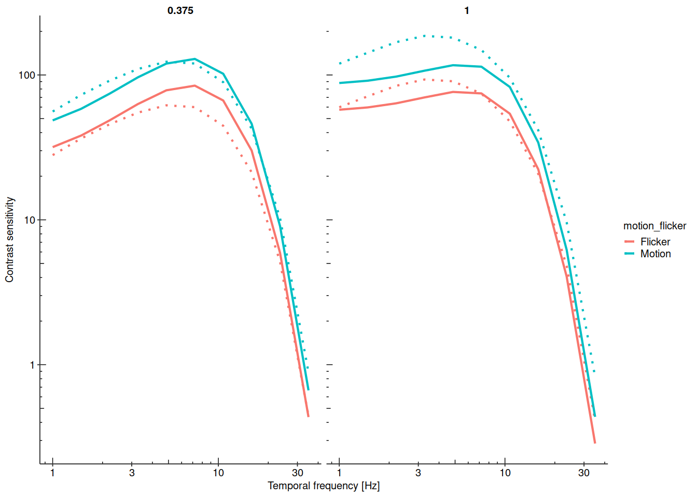<!-- -->

``` r
# check the ratios
prob_sums[motion_flicker=="Motion", simple_sum] / prob_sums[motion_flicker=="Flicker", simple_sum]
```

    ##  [1] 1.570807 1.570807 1.570808 1.570800 1.570798 1.570788 1.570802 1.570792
    ##  [9] 1.570781 1.570673 1.570769 1.570803 1.570794 1.570782 1.570796 1.570798
    ## [17] 1.570795 1.570787 1.570801 1.570627

``` r
prob_sums[motion_flicker=="Motion", prob_sum] / prob_sums[motion_flicker=="Flicker", prob_sum]
```

    ##  [1] 1.529141 1.529139 1.529150 1.529145 1.529136 1.529132 1.529145 1.529135
    ##  [9] 1.529134 1.529098 1.529124 1.529143 1.529142 1.529126 1.529137 1.529143
    ## [17] 1.529138 1.529132 1.529149 1.529077

<!-- UNUSED PLAYGROUND CODE BELOW -->
<!-- Test the effect of ocular drift on sensitivity, see Kelly, 1979 (Part I), Fig. 6.  -->
<!-- ```{r} -->
<!-- # get the self-avoiding random walk function -->
<!-- source("self_avoiding_walk.R") -->
<!-- source("vecvel.R") -->
<!-- # produce a random walk, assuming the presentation used above -->
<!-- walk_pres_dur <- 4 * 8 * 28 * (1000/120)  -->
<!-- walk_scr.ppd <- 40 -->
<!-- walk_start <- 50 -->
<!-- walk_override_normalization <- TRUE -->
<!-- walk_sampling_rate <- 60 -->
<!-- walk_time <- seq(0, walk_pres_dur, by = 1000/walk_sampling_rate) -->
<!-- walked_smooth <- self_avoiding_walk(n_steps = length(walk_time),   -->
<!--                                     relax_rate = 0.001,  -->
<!--                                     L = walk_start*2 + 1,  -->
<!--                                     U_slope = 0.2,  -->
<!--                                     U_m_sd=c(0.5, 0.2),  -->
<!--                                     use_only_direct_neighbors = TRUE,  -->
<!--                                     do_plot = TRUE,  -->
<!--                                     do_final_smooth = TRUE) -->
<!-- # and check it's velocity, so that it approximately matches empirical drift speed -->
<!-- # see Drift speed distribution for one observer during normal head-free viewing (Aytekin, Victor & Rucci 2014) -->
<!-- walked_smooth_vel <- vecvel(as.matrix(walked_smooth/(walk_scr.ppd)), # convert to arcmin per second -->
<!--                             SAMPLING = walk_sampling_rate) # the sampling rate determines the speed -->
<!-- hist(sqrt(walked_smooth_vel[ , 1]^2 + walked_smooth_vel[ , 2]^2)) -->
<!-- # upsample drift motion -->
<!-- walk_x_approx <- approxfun(walk_time, walked_smooth[ ,1]) -->
<!-- walk_y_approx <- approxfun(walk_time, walked_smooth[ ,2]) -->
<!-- walk_time_1440Hz <- seq(0, walk_pres_dur, temporal_resolution) -->
<!-- walked_smooth_1440Hz <- cbind(walk_x_approx(walk_time_1440Hz),  -->
<!--                               walk_y_approx(walk_time_1440Hz)) -->
<!-- plot(walked_smooth[ ,1], walked_smooth[ ,2]) -->
<!-- lines(walked_smooth_1440Hz[ ,1], walked_smooth_1440Hz[ ,2]) -->
<!-- # what is the extent of the walk? -->
<!-- (walk_extent <- max(c(ceiling(diff(range(walked_smooth_1440Hz[,2]))),  -->
<!--                       ceiling(diff(range(walked_smooth_1440Hz[,1])))))) -->
<!-- # test different SFs with our without stabilization -->
<!-- drift_gains <- c(0.0) -->
<!-- test_SFs <- exp(seq(log(0.5), log(10), length.out = 9)) -->
<!-- test_VELs <- c(0.001)#, 0.012, 0.15, 3, 11)  # according to  Kelly (1979b) Figure 6 -->
<!-- walk_use_IRFs <- FALSE -->
<!-- stab_res <- NULL -->
<!-- for (drift_gain in drift_gains) { -->
<!--   for (test_VEL in test_VELs) { -->
<!--     for (test_SF in test_SFs) { -->
<!--       # compute TF -->
<!--       test_TF = test_VEL * test_SF -->
<!--       print(paste("drift =", drift_gain, ", SF =", round(test_SF, 2), ", VEL =", round(test_VEL, 5), ", TF =", round(test_TF, 5))) -->
<!--       ## 1. create stimulus -->
<!--       # both for flicker and motion: -->
<!--       flicker_time <- seq(0, walk_pres_dur, by = temporal_resolution) -->
<!--       flicker_ramp <- dnorm(x = flicker_time, mean = walk_pres_dur/2,  -->
<!--                             sd = walk_pres_dur/8) # SD OF GAUSSIAN RAMP! 1/8 -->
<!--       flicker_ramp <- flicker_ramp/max(abs(flicker_ramp)) # normalize to 1 -->
<!--       test_flicker <- FALSE -->
<!--       if (test_flicker) { # get flicker stimulus -->
<!--         flicker_seq <- create_flicker_stim(dur = walk_pres_dur, t_res = temporal_resolution, tfreq = test_TF) -->
<!--         flicker_seq <- flicker_seq * flicker_ramp -->
<!--         control_seq <- flicker_seq -->
<!--         #plot(flicker_time, flicker_seq, type = "l") -->
<!--         #spec.ar(flicker_seq) -->
<!--       } else { # get motion stimulus -->
<!--         pcpf_motion = temporal_resolution/1000 * test_TF * 360 -->
<!--         phase_seq <- cumsum(rep(pcpf_motion, times = length(flicker_time))) -->
<!--         motion_seq <- cos(deg2rad(phase_seq))*flicker_ramp -->
<!--         control_seq <- motion_seq -->
<!--         #plot(flicker_time, motion_seq, type = "l") -->
<!--         #spec.ar(motion_seq) -->
<!--       } -->
<!--       # get Gabor sequence according to the criteria  -->
<!--       for (t_i in 1:length(flicker_time)) { -->
<!--         if (test_flicker) { # flicker: -->
<!--           intensity_now <- flicker_seq[t_i] -->
<!--           gabor_now <- get_gabor_field_simple(rf_freq_dva = test_SF, rf_width_dva = (1/min(test_SFs)),  -->
<!--                                               rf_ori = 0,  -->
<!--                                               rf_amp = intensity_now,  -->
<!--                                               rf_phase_rad = pi/4,  -->
<!--                                               scr.ppd = walk_scr.ppd, ppd_scaler = 1/spatial_resolution,  -->
<!--                                               mesh_size_scaler = 4,  -->
<!--                                               create_aperture = FALSE, # NO APERTURE! -->
<!--                                               gaussian_aperture = TRUE) -->
<!--         } else { # motion: -->
<!--           intensity_now <- 1#flicker_ramp[t_i] -->
<!--           phase_now <- phase_seq[t_i] -->
<!--           gabor_now <- get_gabor_field_simple(rf_freq_dva = test_SF, rf_width_dva = (1/min(test_SFs)),  -->
<!--                                               rf_ori = 0,  -->
<!--                                               rf_amp = intensity_now,  -->
<!--                                               rf_phase_rad = deg2rad(phase_now),  -->
<!--                                               scr.ppd = walk_scr.ppd, ppd_scaler = 1/spatial_resolution,  -->
<!--                                               mesh_size_scaler = 4,  -->
<!--                                               create_aperture = FALSE, # NO APERTURE! -->
<!--                                               gaussian_aperture = TRUE) -->
<!--         } -->
<!--         if (t_i==1) { -->
<!--           target_view_y_pix <- round((1/test_SF) * 2 * walk_scr.ppd) -->
<!--           target_view_x_pix <- round((1/test_SF) * 2 * walk_scr.ppd) -->
<!--           flicker_gabor_seq <- array(0, dim = c(target_view_y_pix,  -->
<!--                                                 target_view_x_pix,  -->
<!--                                                 length(flicker_time))) -->
<!--           padded_gabor_space <- matrix(0, nrow = nrow(gabor_now[[1]])+walk_extent*2,  -->
<!--                                        ncol = ncol(gabor_now[[1]])+walk_extent*2) -->
<!--           flicker_gabor_seq_center <- unique(dim(padded_gabor_space)[1:2]%/%2) -->
<!--         } -->
<!--         # embed the gabor in the center of this: -->
<!--         padded_gabor_space[seq(round(flicker_gabor_seq_center-nrow(gabor_now[[1]])/2),  -->
<!--                                round(flicker_gabor_seq_center-nrow(gabor_now[[1]])/2)+nrow(gabor_now[[1]])-1), -->
<!--                            seq(round(flicker_gabor_seq_center-ncol(gabor_now[[1]])/2), -->
<!--                                round(flicker_gabor_seq_center-ncol(gabor_now[[1]])/2)+ncol(gabor_now[[1]])-1)] <-  -->
<!--           gabor_now[[1]] -->
<!--         #    plot_heatmap(padded_gabor_space) -->
<!--         # we want to interpolate from this image -->
<!--         require(fields) -->
<!--         image_obj <- list(x = 1:nrow(padded_gabor_space), y = 1:ncol(padded_gabor_space),  -->
<!--                           z = padded_gabor_space) # here we subtract the midpoint -->
<!--         # what is the current eye position with respect to the image? -->
<!--         current_eye_x <- (walked_smooth_1440Hz[t_i, 1] - walk_start)*drift_gain + flicker_gabor_seq_center -->
<!--         current_eye_y <- (walked_smooth_1440Hz[t_i, 2] - walk_start)*drift_gain + flicker_gabor_seq_center -->
<!--         # get the current retinal view -->
<!--         select_col <- seq(from = current_eye_x-target_view_x_pix/2,  -->
<!--                           to = current_eye_x-target_view_x_pix/2+target_view_x_pix-1,  -->
<!--                           by = 1 ) -->
<!--         assert_that(length(select_col)==target_view_y_pix ) -->
<!--         select_row <- seq(from = current_eye_y-target_view_y_pix/2,  -->
<!--                           to = current_eye_y-target_view_y_pix/2+target_view_y_pix-1,  -->
<!--                           by = 1 ) -->
<!--         assert_that(length(select_row)==target_view_y_pix ) -->
<!--         assert_that(length(select_row)==length(select_col)) -->
<!--         query_points <- expand.grid(rows = select_row, cols = select_col) -->
<!--         # select current subimage via linear interpolation (requires package fields) -->
<!--         target_image <- interp.surface( obj = image_obj, loc = query_points ) -->
<!--         target_image <- matrix(data = target_image, nrow = length(select_row), ncol = length(select_col),  -->
<!--                                byrow = FALSE, dimnames = list(select_row, select_col)) -->
<!--         # convolve with a Gaussian envelope -->
<!--         meshlist <- meshgrid(x = (1:ncol(target_image))-ncol(target_image)/2,  -->
<!--                              y = (1:nrow(target_image))-nrow(target_image)/2)  -->
<!--         target_gaussian_sd <- ((1/test_SF) / 2) * walk_scr.ppd -->
<!--         target_gaussian <- exp(-(meshlist$X^2+meshlist$Y^2)/(2*target_gaussian_sd^2)) # compute gaussian aperture of stimulus -->
<!--         target_image <- target_image * target_gaussian -->
<!--         # put into frame -->
<!--         flicker_gabor_seq[ , , t_i] <- target_image -->
<!--       } -->
<!--       print(paste("dim(flicker_gabor_seq) =", paste(dim(flicker_gabor_seq), collapse = ","))) -->
<!--       # # see example -->
<!--       # for (it in seq(1, 1000, 100)) { -->
<!--       #   plot_heatmap(flicker_gabor_seq[ , ,4000+it], do_print = TRUE) -->
<!--       # } -->
<!--       ## RUN THE MODEL -->
<!--       # shall we test multiple SFs? -->
<!--       test_SF_now <- test_SF #c(test_SF/1.4, test_SF, test_SF*1.4) # 1.4 according to Heiko's SF spacing -->
<!--       # get receptive field/s -->
<!--       use_normal_test_RF <- TRUE -->
<!--       if (use_normal_test_RF) { # normal Gabors -->
<!--         test_RF <- get_gabor_filter_bank( -->
<!--           all_SF = test_SF_now,  -->
<!--           all_Ori = c(0), # positive means clockwise -->
<!--           use_log_gabor_heiko = FALSE,  -->
<!--           rf_width_override = NaN , # cpd, set to NaN to let the function determine RF field size -->
<!--           scr_ppd = walk_scr.ppd,  -->
<!--           ppd_scaler = 1/spatial_resolution, -->
<!--           make_gaussian_aperture = TRUE) -->
<!--       } else { # log Gabors -->
<!--         test_RF <- get_gabor_filter_bank( -->
<!--           all_SF = test_SF_now,  -->
<!--           all_Ori = c(0), # positive means clockwise -->
<!--           use_log_gabor_heiko = TRUE,  -->
<!--           rf_width_override = (1/test_SF) / 2 * 8, -->
<!--           scr_ppd = walk_scr.ppd,  -->
<!--           ppd_scaler = 1/spatial_resolution, -->
<!--           make_gaussian_aperture = TRUE) -->
<!--       } -->
<!--       print(paste("dim(test_RF[[1]][[1]]) =", paste(dim(test_RF[[1]][[1]]), collapse = ","))) -->
<!--       # ... and corresponding temporal response function -->
<!--       test_IRF <- get_IRF_df(SFs = test_SF_now,  -->
<!--                              irf_time_range = c(0, 200),  -->
<!--                              temporal_resolution = temporal_resolution) -->
<!--       # run our function - WITH DRIFT -->
<!--       if (walk_use_IRFs) { -->
<!--         test_RF_output <- v1(mat_over_t = flicker_gabor_seq, -->
<!--                              gabor_list = test_RF, # a list of gabor filters created by 'get_gabor_filter_bank' -->
<!--                              irf_df = test_IRF, # a data.frame of IRFs resolved in SF x time created by 'get_IRF_df' -->
<!--                              norm_sigma = 0.07,  -->
<!--                              normalize_override = walk_override_normalization, # OVERRIDE NORMALIZATION??? -->
<!--                              use_normalization_pool = FALSE,  -->
<!--                              output_full_sequences = FALSE, # TRUE: returns complete sequences. WARNING: this is memory-intense -->
<!--                              signal_x_range = NULL, signal_y_range = NULL, signal_t_range = NULL, # the min and max of temporal scale -->
<!--                              no_CUDA = FALSE, # set to TRUE if you want to use CPU instead of GPU (but torch) -->
<!--                              use_half_precision = FALSE, # if a GPU is available, use half-precision? -->
<!--                              spatial_resolution = spatial_resolution, # spatial resolution of processing function in dva -->
<!--                              temporal_resolution = temporal_resolution, # temporal resolution of processing function in milliseconds -->
<!--                              debug_mode = FALSE, # shows output at every step -->
<!--                              show_final_maps = TRUE,  # shows all resulting 2D maps at the end -->
<!--                              final_maps_filename = "" # name of the pdf file if show_final_maps==TRUE -->
<!--         ) -->
<!--       } else { -->
<!--         test_RF_output <- v1(mat_over_t = flicker_gabor_seq, -->
<!--                              gabor_list = test_RF, # a list of gabor filters created by 'get_gabor_filter_bank' -->
<!--                              irf_df = NULL, # a data.frame of IRFs resolved in SF x time created by 'get_IRF_df' -->
<!--                              norm_sigma = 0.07,  -->
<!--                              normalize_override = walk_override_normalization, # OVERRIDE NORMALIZATION??? -->
<!--                              use_normalization_pool = FALSE,  -->
<!--                              output_full_sequences = FALSE, # TRUE: returns complete sequences. WARNING: this is memory-intense -->
<!--                              signal_x_range = NULL, signal_y_range = NULL, signal_t_range = NULL, # the min and max of temporal scale -->
<!--                              no_CUDA = FALSE, # set to TRUE if you want to use CPU instead of GPU (but torch) -->
<!--                              use_half_precision = FALSE, # if a GPU is available, use half-precision? -->
<!--                              spatial_resolution = spatial_resolution, # spatial resolution of processing function in dva -->
<!--                              temporal_resolution = temporal_resolution, # temporal resolution of processing function in milliseconds -->
<!--                              debug_mode = FALSE, # shows output at every step -->
<!--                              show_final_maps = TRUE,  # shows all resulting 2D maps at the end -->
<!--                              final_maps_filename = "" # name of the pdf file if show_final_maps==TRUE -->
<!--         ) -->
<!--       } -->
<!--       # get our full output -->
<!--       summed_over_time_RF_output <- test_RF_output[[1]] -->
<!--       #plot_grid(plot_heatmap(summed_over_time_RF_output[1, , ])) -->
<!--       # summation -->
<!--       (prob_sum_now <- data.table(motion_flicker = what_now,  -->
<!--                                   SF = test_SF, VEL = test_VEL, TF = test_TF,  -->
<!--                                   drift_gain = drift_gain,  -->
<!--                                   simple_sum = max(summed_over_time_RF_output[1, , ]) -->
<!--       )) -->
<!--       stab_res <- rbind(stab_res, prob_sum_now) -->
<!--     } -->
<!--   } -->
<!-- } -->
<!-- stab_res -->
<!-- stab_res[ , kelly_sens := kelly_vel(sf = SF, v = VEL)] -->
<!-- # plot: -->
<!-- ggplot(stab_res, aes(x = SF, y = simple_sum/1000, color = VEL, group = VEL)) +  -->
<!--   geom_line(linewidth = 1.5) +  -->
<!--   geom_point(data = stab_res, aes(x = SF, y = kelly_sens, color = VEL, group = VEL),  -->
<!--             size = 1.5) +  -->
<!--   scale_x_log10() + scale_y_log10(limits = c(1, 300)) +  # limits = c(2, 500) -->
<!--   annotation_logticks() +  -->
<!--   scale_color_viridis_c(trans = "log10") +  -->
<!--   theme_minimal() +  -->
<!--   facet_wrap(~motion_flicker+drift_gain) +  -->
<!--   labs(x = "Spatial frequency [cpd]", y = "Contrast sensitivity", color = "Velocity") -->
<!-- ``` -->
<!-- This is what the prediction should look like: -->
<!-- ```{r} -->
<!-- kelly_fig_6 <- data.table(expand.grid(VEL = c(0.0001, 0.012, 0.15, 3, 11, 32),  -->
<!--                                       SF = exp(seq(log(0.2), log(10), length.out = 30)))) -->
<!-- kelly_fig_6[ , sens := kelly_vel(sf = SF, v = VEL)] -->
<!-- ggplot(kelly_fig_6, aes(x = SF, y = sens, color = as.factor(VEL) )) +  -->
<!--   geom_line(linewidth = 1.5) +  -->
<!--   scale_x_log10() + scale_y_log10(limits = c(0.1, 500)) +  -->
<!--   annotation_logticks() +  -->
<!--   scale_color_viridis_d() +  -->
<!--   theme_minimal() +  -->
<!--   labs(x = "Spatial frequency [cpd]", y = "Contrast sensitivity", color = "Velocity") -->
<!-- ``` -->
<!-- Try a fft-based temporal convolution: -->
<!-- ```{r} -->
<!-- # test these parameters -->
<!-- test_SF <- 5 -->
<!-- test_VEL <- 0.1 -->
<!-- test_fft_pad <- 1001 -->
<!-- # compute TF -->
<!-- test_TF = test_VEL * test_SF -->
<!-- print(paste("SF =", round(test_SF, 2), ", VEL =", round(test_VEL, 4), ", TF =", round(test_TF, 4))) -->
<!-- # create motion sequence: -->
<!-- flicker_time <- seq(0, walk_pres_dur, by = temporal_resolution) -->
<!-- flicker_ramp <- dnorm(x = flicker_time, mean = walk_pres_dur/2,  -->
<!--                       sd = walk_pres_dur/8) # SD OF GAUSSIAN RAMP! 1/8 -->
<!-- flicker_ramp <- flicker_ramp/max(abs(flicker_ramp)) # normalize to 1 -->
<!-- test_flicker <- FALSE -->
<!-- pcpf_motion = temporal_resolution/1000 * test_TF * 360 -->
<!-- phase_seq <- cumsum(rep(pcpf_motion, times = length(flicker_time))) -->
<!-- # get Gabor sequence according to the criteria  -->
<!-- for (t_i in 1:length(flicker_time)) { -->
<!--     intensity_now <- 1#flicker_ramp[t_i] -->
<!--     phase_now <- phase_seq[t_i] -->
<!--     gabor_now <- get_gabor_field_simple(rf_freq_dva = test_SF, rf_width_dva = (1/test_SF),  -->
<!--                                         rf_ori = 0,  -->
<!--                                         rf_amp = intensity_now,  -->
<!--                                         rf_phase_rad = deg2rad(phase_now),  -->
<!--                                         scr.ppd = walk_scr.ppd, ppd_scaler = 1/spatial_resolution,  -->
<!--                                         mesh_size_scaler = 2,  -->
<!--                                         create_aperture = FALSE, # NO APERTURE! -->
<!--                                         gaussian_aperture = TRUE) -->
<!--     if (t_i==1) { -->
<!--       flicker_gabor_seq <- array(0, dim = c(dim(gabor_now[[1]]), length(flicker_time)),  -->
<!--                                  dimnames = list(dimnames(gabor_now[[1]])[[1]],  -->
<!--                                                  dimnames(gabor_now[[1]])[[2]],  -->
<!--                                                  flicker_time)) -->
<!--     } -->
<!--     flicker_gabor_seq[ , ,t_i] <- gabor_now[[1]] -->
<!-- } -->
<!-- dim(flicker_gabor_seq) -->
<!-- # make it a tensor -->
<!-- test_mat <- torch_tensor(flicker_gabor_seq) -->
<!-- test_mat <- test_mat$permute(c(3, 1, 2))$unsqueeze(1) -->
<!-- dim(test_mat) -->
<!-- # temporal resp fun -->
<!-- resp_fun <- torch_tensor(test_IRF$irf) -->
<!-- resp_fun <- resp_fun$expand(c(test_mat$size(4), 1, resp_fun$size())) # expand to match matrix dimensions (x dimension) -->
<!-- resp_fun <- torch_cat(list(torch_zeros(c(resp_fun$size(1), resp_fun$size(2), resp_fun$size(3)-1)), # create the zero pad to center the TRF -->
<!--                            resp_fun), dim = 3) -->
<!-- dim(resp_fun) -->
<!-- # reshape again -->
<!-- test_mat <- test_mat$permute(c(1, 3, 4, 2))$squeeze() # new dim: y, x, t, as initially -->
<!-- # perform standard conv -->
<!-- temporal_response_1 <- torch_conv1d(input = test_mat,  -->
<!--                                     weight = resp_fun$flip(3) / max(resp_fun),  -->
<!--                                     padding = resp_fun$size(3)%/%2,  -->
<!--                                     groups = test_mat$size(2) # is the x dimension -->
<!-- ) -->
<!-- # # did this work plots -->
<!-- # plot(test_mat[round(nrow(test_mat)/2), round(ncol(test_mat)/2), ]) -->
<!-- # plot(abs(fftshift(fft(as_array(test_mat[round(nrow(test_mat)/2), round(ncol(test_mat)/2), ]) ))), type = "l") -->
<!-- # plot(resp_fun) -->
<!-- # plot(temporal_response_1[round(nrow(temporal_response_1)/2), round(ncol(temporal_response_1)/2), ]) -->
<!-- # use the FFT version of the convolution -->
<!-- source("temporal_conv_IRF_fft.R") -->
<!-- temporal_response_2 <- temporal_conv_IRF_fft(test_mat = test_mat,  -->
<!--                                              IRF = test_IRF$irf, IRF_time = test_IRF$irf_time,  -->
<!--                                              pad = test_fft_pad) -->
<!-- # use Kelly's function directly -->
<!-- source("temporal_conv_kelly_fft.R") -->
<!-- temporal_response_3 <- temporal_conv_kelly_fft(test_mat = test_mat, SF = test_SF,  -->
<!--                                                pad = test_fft_pad) -->
<!-- # plot all next to each other -->
<!-- par(mfrow=c(2, 2)) -->
<!-- plot(temporal_response_1[round(nrow(temporal_response_1)/2), round(ncol(temporal_response_1)/2), ],  -->
<!--      main = "standard IRF convolution") -->
<!-- plot(temporal_response_2[round(nrow(temporal_response_2)/2), round(ncol(temporal_response_2)/2), ],  -->
<!--      main = "fft-based IRF convolution") -->
<!-- plot(temporal_response_3[round(nrow(temporal_response_3)/2), round(ncol(temporal_response_3)/2), ],  -->
<!--      main = "fft-based Kelly convolution") -->
<!-- par(mfrow=c(1, 1)) -->
<!-- ``` -->
<!-- think of a sampling model -->
<!-- ```{r} -->
<!-- probability_sampler <- function(timetime, input_x, input_y, input_w, # pnorm output -->
<!--                                 upper_lower_quant = c(0.975, 0.025),  -->
<!--                                 direction_labels = c("static", "inward", "outward", "downward", "upward") -->
<!-- ) { -->
<!--   assertthat::assert_that(length(input_x)==length(timetime)) -->
<!--   assertthat::assert_that(length(input_x)==length(input_y)) -->
<!--   # preallocate -->
<!--   direction_probs = rep(1/5, length(direction_labels)) -->
<!--   res_mat = matrix(0, nrow = length(input_x), ncol = length(direction_labels)) -->
<!--   # start updating -->
<!--   for (row_i in 1:length(input_x)) { -->
<!--     input_x_now = input_x[row_i] # pnorm output -->
<!--     input_y_now = input_y[row_i] -->
<!--     if (!is.na(input_x_now) & !is.na(input_y_now)) { # only update if a value is available -->
<!--       # vertical probabilities -->
<!--       updat_y = rep(0, 5) -->
<!--       if (input_y_now>=upper_lower_quant[1]) { # vertical down -->
<!--         updat_y[direction_labels=="downward"] <- 1 -->
<!--       } else if (input_y_now<=upper_lower_quant[2]) { # vertical up -->
<!--         updat_y[direction_labels=="upward"] <- 1 -->
<!--       } else { # vertical center -->
<!--         updat_y[direction_labels!="upward" & direction_labels!="downward"] <- 1/3 -->
<!--       } -->
<!--       # horizontal probabilities -->
<!--       updat_x = rep(0, 5) -->
<!--       if (input_x_now>=upper_lower_quant[1]) { # horizontal right/outward -->
<!--         updat_x[direction_labels=="outward"] <- 1 -->
<!--       } else if (input_x_now<=upper_lower_quant[2]) { # horizontal left/inward -->
<!--         updat_x[direction_labels=="inward"] <- 1 -->
<!--       } else { # horizontal center -->
<!--         updat_x[direction_labels!="outward" & direction_labels!="inward"] <- 1/3 -->
<!--       } -->
<!--       updat_xy = (updat_y + updat_x) -->
<!--       # update -->
<!--       direction_probs[updat_xy>0] <- direction_probs[updat_xy>0] * updat_xy[updat_xy>0] -->
<!--       # normalize -->
<!--       direction_probs <- direction_probs / sum(direction_probs) -->
<!--     } -->
<!--     # print(row_i) -->
<!--     # print(direction_probs) -->
<!--     res_mat[row_i, ] = direction_probs -->
<!--   } -->
<!--   colnames(res_mat) <- direction_labels -->
<!--   res_mat = cbind(timetime, res_mat) -->
<!--   return(res_mat) -->
<!-- } -->
<!-- # walk through all trials -->
<!-- unique_IDs <- unique(all_localization_results_2$ID) -->
<!-- prob_sampler <- vector(mode = "list", length = length(unique_IDs)) -->
<!-- for (ID_now_i in 1:length(unique_IDs)) { -->
<!--   ID_now = unique_IDs[ID_now_i] -->
<!--   # get the relevant data -->
<!--   test_data = all_localization_results_2[ID==ID_now] -->
<!--   if (unique(test_data$move_direction_f)=="upward") { -->
<!--     test_data$prob_vertical = 1 - test_data$prob_vertical -->
<!--   } -->
<!--   if (unique(test_data$move_direction_f)=="inward") { -->
<!--     test_data$prob_horizontal = 1 - test_data$prob_horizontal -->
<!--   } -->
<!--   test_data = test_data[order(time)] -->
<!--   test_data = test_data[K>0] -->
<!--   # compute the target probabilities -->
<!--   if (nrow(test_data)>0) { -->
<!--     res_now = data.table(probability_sampler(test_data$time_round,  -->
<!--                                              test_data$prob_horizontal, test_data$prob_vertical)) -->
<!--     res_now[ , ID := unique(test_data$ID)] -->
<!--     res_now[ , time_K := timetime - min(timetime)] -->
<!--     res_now[ , move_direction_f := unique(test_data$move_direction_f)] -->
<!--     res_now[ , streak_present_f := unique(test_data$streak_present_f)] -->
<!--     res_now[ , subj_id := unique(test_data$subj_id)] -->
<!--     res_now[ , target := res_now[ , colnames(res_now)==unique(res_now$move_direction_f), with = FALSE]] -->
<!--     # save -->
<!--     prob_sampler[[ID_now_i]] <- res_now -->
<!--   } -->
<!-- } -->
<!-- prob_sampler <- rbindlist(prob_sampler) -->
<!-- prob_sampler_subj <- prob_sampler[ , .(target = mean(target)),  -->
<!--                                    by = .(subj_id, move_direction_f, streak_present_f, timetime)] -->
<!-- ggplot(prob_sampler_subj, aes(x = timetime, y = target, color = move_direction_f)) +  -->
<!--   geom_line() +  -->
<!--   facet_grid(streak_present_f~subj_id) -->
<!-- prob_sampler_agg <- prob_sampler_subj[ , .(target = mean(target)),  -->
<!--                                    by = .(move_direction_f, streak_present_f, timetime)] -->
<!-- ggplot(prob_sampler_agg, aes(x = timetime, y = target, color = streak_present_f)) +  -->
<!--   geom_line() +  -->
<!--   facet_grid(move_direction_f~.) -->
<!-- # another try -->
<!-- all_localization_results_2[ , min_time := min(time[K>0]), by = .(ID)] -->
<!-- all_localization_results_2[ , time_K := round(time-min_time), by = .(ID)] -->
<!-- time_K_prob <- all_localization_results_2[time_K>=0,  -->
<!--                                           .(prob_vertical = mean(prob_vertical),  -->
<!--                                             prob_horizontal = mean(prob_horizontal),  -->
<!--                                             updat_w = mean(updat_w),  -->
<!--                                             min_time = unique(min_time)),  -->
<!--                                           by = .(ID, move_direction_f, streak_present_f, time_K)] -->
<!-- time_K_prob[ , updat_w := updat_w / max(updat_w), by = .(ID)] -->
<!-- time_K_prob_agg <- time_K_prob[ , .(prob_vertical = sum(prob_vertical*updat_w),  # *updat_w -->
<!--                                     prob_horizontal = sum(prob_horizontal*updat_w),  -->
<!--                                     updat_w = mean(updat_w),  -->
<!--                                     min_time = mean(min_time)),  -->
<!--                                 by = .(move_direction_f, streak_present_f, time_K)] -->
<!-- time_K_prob_agg <- time_K_prob_agg[order(move_direction_f, streak_present_f, time_K)] -->
<!-- time_K_prob_agg[ , n_samples := 1:length(time_K), by = .(move_direction_f, streak_present_f)] -->
<!-- time_K_prob_agg[ , cum_prob_vertical := (cumsum((prob_vertical-0.5*updat_w)^4)^(1/4)),  -->
<!--                  by = .(move_direction_f, streak_present_f)] -->
<!-- time_K_prob_agg[ , cum_prob_horizontal := cumsum((prob_horizontal-0.5*updat_w)^4)^(1/4),  -->
<!--                  by = .(move_direction_f, streak_present_f)] -->
<!-- time_K_prob_agg[ , cum_prob_vertical := cum_prob_vertical / sum(cum_prob_vertical),  -->
<!--                  by = .(streak_present_f, time_K)] -->
<!-- time_K_prob_agg[ , cum_prob_horizontal := cum_prob_horizontal / sum(cum_prob_horizontal),  -->
<!--                  by = .(streak_present_f, time_K)] -->
<!-- ggplot(data = time_K_prob_agg,  -->
<!--        aes(x = time_K+min_time, y = cum_prob_vertical, color = move_direction_f)) +  -->
<!--   geom_line() +  -->
<!--   facet_wrap(~streak_present_f) -->
<!-- ggplot(data = time_K_prob_agg,  -->
<!--        aes(x = time_K+min_time, y = cum_prob_horizontal, color = move_direction_f)) +  -->
<!--   geom_line() +  -->
<!--   facet_wrap(~streak_present_f) -->
<!-- ggplot(data = time_K_prob_agg,  -->
<!--        aes(x = time_round, y = updat_w, color = move_direction_f)) +  -->
<!--   geom_line() +  -->
<!--   facet_wrap(~streak_present_f) -->
<!-- ``` -->
<!-- ```{r} -->
<!-- ggplot(all_loc_agg_all, aes(x = time_round, y = pred_error, color = streak_present_f)) +  -->
<!--   geom_vline(xintercept = c(0), linetype = "dotted") +  -->
<!--   geom_line(data = all_loc_agg_all, aes(x = time_round, y = thres, color = streak_present_f)) +  -->
<!--   #geom_line(data = all_loc_agg, aes(x = time_round, y = K*10, color = move_direction_of), linetype = "dotted") +  -->
<!--   geom_line() +  -->
<!--   facet_grid(move_direction_of~.) +  -->
<!--   SDECTheme() +  -->
<!--   coord_cartesian(expand=FALSE) +  -->
<!--   xlim(-50, 50) -->
<!-- ggplot(all_loc_agg, aes(x = time_round, y = K, color = move_direction_of)) +  -->
<!--   geom_vline(xintercept = c(0), linetype = "dotted") +  -->
<!--   geom_line() +  -->
<!--   facet_grid(streak_present_f~subj_id) +  -->
<!--   SDECTheme() +  -->
<!--   coord_cartesian(expand=FALSE) +  -->
<!--   xlim(-50, 50) -->
<!-- apply_softmin_to_cols <- function(static, inward, outward, downward, upward,  -->
<!--                                   cat_labels=c("static", "inward", "outward", "downward", "upward")) { -->
<!--   require(torch) -->
<!--   m = nn_softmin(dim=2) -->
<!--   input = torch_tensor(cbind(static, inward, outward, downward, upward)) -->
<!--   output = as_array(m(input)) -->
<!--   which_label_most_likely = vector(mode = "character", length = nrow(output)) -->
<!--   label_likelihood = vector(mode = "numeric", length = nrow(output)) -->
<!--   for (r_i in 1:nrow(output)) { -->
<!--     which_label_most_likely[r_i] <- cat_labels[which.max(output[r_i, ])] -->
<!--     label_likelihood[r_i] <- max(output[r_i, ]) -->
<!--   } -->
<!--   return(list(which_label_most_likely, label_likelihood)) -->
<!-- } -->
<!-- all_localization_results_2 <- copy(all_localization_results) -->
<!-- all_localization_results_2[ , which_direction := apply_softmin_to_cols(p_static, p_inward, p_outward, p_downward, p_upward)[[1]]] -->
<!-- all_localization_results_2[ , which_direction_correct := move_direction_f == which_direction] -->
<!-- # clasffication accuracy -->
<!-- all_localization_results_2[ , time_round := round(time)] -->
<!-- all_class_agg <- all_localization_results_2[ , .(prop_correct = mean(which_direction_correct)),  -->
<!--                                            by = .(streak_present_f, move_direction_f, time_round)] -->
<!-- ggplot(all_class_agg,  -->
<!--        aes(x = time_round, y = prop_correct, color = streak_present_f)) +  -->
<!--   geom_line() +  -->
<!--   xlim(-50, 50) +  -->
<!--   facet_grid(.~move_direction_f) -->
<!-- # first, an overall aggregate -->
<!-- all_localization_results[ , time_round := round(all_localization_results$time)] -->
<!-- all_loc_agg <- all_localization_results[ , .(md_moved = mean(md_moved),  -->
<!--                                              md_static = mean(md_static),  -->
<!--                                              md_inward = mean(md_inward),  -->
<!--                                              md_outward = mean(md_outward),  -->
<!--                                              md_downward = mean(md_downward),  -->
<!--                                              md_upward = mean(md_upward),  -->
<!--                                              p_moved = mean(p_moved),  -->
<!--                                              p_static = mean(p_static),  -->
<!--                                              p_inward = mean(p_inward),  -->
<!--                                              p_outward = mean(p_outward),  -->
<!--                                              p_downward = mean(p_downward),  -->
<!--                                              p_upward = mean(p_upward) -->
<!--                                              ),  -->
<!--                                          by = .(streak_present_f, move_direction_f, time_round)] -->
<!-- all_loc_agg[ , move_direction_of := ordered(move_direction_f,  -->
<!--                                             levels = c("static", "inward", "outward", "downward", "upward"))] -->
<!-- # mahalanobis dist plot -->
<!-- ggplot(all_loc_agg, aes(x = time_round, y = md_moved, linetype = streak_present_f)) +  -->
<!--   geom_vline(xintercept = 0, linetype = "dotted") +  -->
<!--   geom_line(aes(color = "0 moved")) +  -->
<!--   geom_line(data = all_loc_agg, aes(x = time_round, y = md_static, color = "1 static")) +  -->
<!--   geom_line(data = all_loc_agg, aes(x = time_round, y = md_inward, color = "2 inward")) +  -->
<!--   geom_line(data = all_loc_agg, aes(x = time_round, y = md_outward, color = "3 outward")) +  -->
<!--   geom_line(data = all_loc_agg, aes(x = time_round, y = md_downward, color = "4 downward")) +  -->
<!--   geom_line(data = all_loc_agg, aes(x = time_round, y = md_upward, color = "5 upward")) +  -->
<!--   facet_grid(.~move_direction_of) +  -->
<!--   SDECTheme() +  -->
<!--   coord_cartesian(expand=FALSE) +  -->
<!--   xlim(-100, 100) -->
<!-- # probability  plot -->
<!-- ggplot(all_loc_agg, aes(x = time_round, y = p_moved, linetype = streak_present_f)) +  -->
<!--   geom_vline(xintercept = 0, linetype = "dotted") +  -->
<!--   geom_line(aes(color = "0 moved")) +  -->
<!--   geom_line(data = all_loc_agg, aes(x = time_round, y = p_static, color = "1 static")) +  -->
<!--   geom_line(data = all_loc_agg, aes(x = time_round, y = p_inward, color = "2 inward")) +  -->
<!--   geom_line(data = all_loc_agg, aes(x = time_round, y = p_outward, color = "3 outward")) +  -->
<!--   geom_line(data = all_loc_agg, aes(x = time_round, y = p_downward, color = "4 downward")) +  -->
<!--   geom_line(data = all_loc_agg, aes(x = time_round, y = p_upward, color = "5 upward")) +  -->
<!--   facet_grid(.~move_direction_of) +  -->
<!--   SDECTheme() +  -->
<!--   coord_cartesian(expand=FALSE) +  -->
<!--   xlim(-100, 100) + scale_y_log10() -->
<!-- ``` -->
<!-- # Let the model predict EEG-like output from a variety of sequences -->
<!-- For a subsample of trials, we'll spatially downsample time-resolved model output and sum over filter responses, then save to later perform classification analyses.  -->
<!-- ```{r} -->
<!-- # EEG-like downsampling: -->
<!-- source("make_eeg_like_downsample.R") -->
<!-- source("check_if_same_count_and_remove.R") -->
<!-- source("baseline_correction.R") -->
<!-- ## what is the decision-relevant variable? - the post-saccadic target position -->
<!-- # endpoints -->
<!-- endpoints <- all_saccades[time_sac_off>=0 & time_sac_off<=50,  -->
<!--                           .(retinal_x = mean(retinal_x / scr.ppd),  -->
<!--                             retinal_y = mean(retinal_y / scr.ppd),  -->
<!--                             retinal_x_static = mean(retinal_x_static / scr.ppd),  -->
<!--                             retinal_y_static = mean(retinal_y_static / scr.ppd) ),  -->
<!--                           by = .(start_left_f, streak_present_f, move_direction_f, subj_id, ID)] -->
<!-- # check whether there is any systematic effect on the landing position of the saccade -->
<!-- endpoints_summary <- endpoints[ ,  -->
<!--                                .(retinal_x_m = mean(retinal_x_static),  -->
<!--                                  retinal_x_sd = sd(retinal_x_static),  -->
<!--                                  retinal_y_m = mean(retinal_y_static),  -->
<!--                                  retinal_y_sd = sd(retinal_y_static)),  -->
<!--                                by = .(start_left_f, streak_present_f, move_direction_f, subj_id)] -->
<!-- endpoints_summary[ , retinal_x_m_corr := retinal_x_m] -->
<!-- endpoints_summary[start_left_f=="leftward saccade", retinal_x_m_corr := retinal_x_m_corr * (-1)] -->
<!-- require(ez) -->
<!-- # effect on landing position accuracy -->
<!-- ezANOVA(data = endpoints_summary, dv = .(retinal_x_m_corr), wid = .(subj_id),  -->
<!--         within = .(start_left_f, streak_present_f, move_direction_f),  -->
<!--         detailed = TRUE) -->
<!-- ezStats(data = endpoints_summary, dv = .(retinal_x_m_corr), wid = .(subj_id),  -->
<!--         within = .(start_left_f, streak_present_f)) -->
<!-- ezStats(data = endpoints_summary, dv = .(retinal_x_m_corr), wid = .(subj_id),  -->
<!--         within = .(move_direction_f)) -->
<!-- # effect on landing position SD -->
<!-- ezANOVA(data = endpoints_summary, dv = .(retinal_x_sd), wid = .(subj_id),  -->
<!--         within = .(start_left_f, streak_present_f, move_direction_f),  -->
<!--         detailed = TRUE) -->
<!-- ezStats(data = endpoints_summary, dv = .(retinal_x_sd), wid = .(subj_id),  -->
<!--         within = .(start_left_f, streak_present_f)) -->
<!-- # plot them (retinal positions) -->
<!-- ggplot(data = endpoints, aes(x = retinal_x, y = retinal_y,  -->
<!--                              color = move_direction_f)) +  -->
<!--   geom_point(alpha = 0.2) +  -->
<!--   coord_fixed() + theme_minimal() +  -->
<!--   facet_grid(start_left_f~subj_id) -->
<!-- # plot them (landing positions) -->
<!-- ggplot(data = endpoints, aes(x = retinal_x_static, y = retinal_y_static,  -->
<!--                              color = move_direction_f)) +  -->
<!--   geom_point(alpha = 0.2) +  -->
<!--   coord_fixed() + theme_minimal() +  -->
<!--   facet_grid(start_left_f~subj_id) -->
<!-- ## does the Mahalanobis distance in principle explain the difference between target motion direction conditions? -->
<!-- # pull out some trajectories -->
<!-- all_saccades[ , time_sac_on_r := round(time_sac_on)] -->
<!-- all_saccades[ , time_stim_on_r := round(time_stim_on)] -->
<!-- trajectories <- all_saccades[time_sac_on>=(-50),  -->
<!--                              .(retinal_x = mean(retinal_x / scr.ppd),  -->
<!--                                retinal_y = mean(retinal_y / scr.ppd)),  -->
<!--                              by = .(start_left_f, move_direction_f, subj_id, streak_present_f, time_sac_on_r )] -->
<!-- # test Mahalanobis distance for one subject -->
<!-- trajectory <- trajectories[start_left_f=="rightward saccade" & subj_id=="03" &  -->
<!--                              time_sac_on_r <= 150 & time_sac_on_r >= 0] -->
<!-- endpoint_dist <- endpoints[start_left_f=="rightward saccade" & subj_id=="03",  -->
<!--                            .(retinal_x, retinal_y),  -->
<!--                            by = .(move_direction_f)] -->
<!-- trajectory[ , D2_static := mahalanobis(cbind(retinal_x, retinal_y),  -->
<!--                                        colMeans(endpoint_dist[move_direction_f=="static", .(retinal_x, retinal_y)]),  -->
<!--                                        cov(endpoint_dist[move_direction_f=="static", .(retinal_x, retinal_y)]))] -->
<!-- trajectory[ , D2_upward := mahalanobis(cbind(retinal_x, retinal_y),  -->
<!--                                        colMeans(endpoint_dist[move_direction_f=="upward", .(retinal_x, retinal_y)]),  -->
<!--                                        cov(endpoint_dist[move_direction_f=="upward", .(retinal_x, retinal_y)]))] -->
<!-- trajectory[ , D2_downward := mahalanobis(cbind(retinal_x, retinal_y),  -->
<!--                                        colMeans(endpoint_dist[move_direction_f=="downward", .(retinal_x, retinal_y)]),  -->
<!--                                        cov(endpoint_dist[move_direction_f=="downward", .(retinal_x, retinal_y)]))] -->
<!-- trajectory[ , D2_inward := mahalanobis(cbind(retinal_x, retinal_y),  -->
<!--                                        colMeans(endpoint_dist[move_direction_f=="inward", .(retinal_x, retinal_y)]),  -->
<!--                                        cov(endpoint_dist[move_direction_f=="inward", .(retinal_x, retinal_y)]))] -->
<!-- trajectory[ , D2_outward := mahalanobis(cbind(retinal_x, retinal_y),  -->
<!--                                        colMeans(endpoint_dist[move_direction_f=="outward", .(retinal_x, retinal_y)]),  -->
<!--                                        cov(endpoint_dist[move_direction_f=="outward", .(retinal_x, retinal_y)]))] -->
<!-- trajectory[ , D2_sum := D2_static + D2_upward + D2_downward + D2_inward + D2_outward] -->
<!-- # trajectory[ , D2_static_prop := cumsum(D2_static)/cumsum(D2_sum-D2_static), by = .(start_left_f, move_direction_f, subj_id, streak_present_f)] -->
<!-- # trajectory[ , D2_upward_prop := cumsum(D2_upward)/cumsum(D2_sum-D2_static), by = .(start_left_f, move_direction_f, subj_id, streak_present_f)] -->
<!-- # trajectory[ , D2_downward_prop := cumsum(D2_downward)/cumsum(D2_sum-D2_static), by = .(start_left_f, move_direction_f, subj_id, streak_present_f)] -->
<!-- # trajectory[ , D2_inward_prop := cumsum(D2_inward)/cumsum(D2_sum-D2_static), by = .(start_left_f, move_direction_f, subj_id, streak_present_f)] -->
<!-- # trajectory[ , D2_outward_prop := cumsum(D2_outward)/cumsum(D2_sum-D2_static), by = .(start_left_f, move_direction_f, subj_id, streak_present_f)] -->
<!-- # show retinal trajectories in x-y -->
<!-- ggplot(data = trajectory, aes(x = retinal_x, y = retinal_y, color = D2_static)) +  -->
<!--   geom_point() +  -->
<!--   scale_color_viridis_c() +  -->
<!--   facet_grid(streak_present_f~move_direction_f) -->
<!-- # show distance to static over time -->
<!-- ggplot(data = trajectory, aes(x = time_sac_on_r, y = D2_static/D2_sum, color = move_direction_f)) +  -->
<!--   geom_path(size = 1.5, alpha = 0.7) +  -->
<!--   scale_color_viridis_d() +  -->
<!--   facet_wrap(~streak_present_f) -->
<!-- # show distance to all over time -->
<!-- ggplot(data = trajectory, aes(x = time_sac_on_r, y = D2_static, color = "static")) +  -->
<!--   geom_path(size = 1.5, alpha = 0.7) +  -->
<!--   geom_path(data = trajectory, aes(x = time_sac_on_r, y = D2_upward, color = "upward"),  -->
<!--             size = 1.5, alpha = 0.7) +  -->
<!--   geom_path(data = trajectory, aes(x = time_sac_on_r, y = D2_downward, color = "downward"),  -->
<!--             size = 1.5, alpha = 0.7) +  -->
<!--   geom_path(data = trajectory, aes(x = time_sac_on_r, y = D2_outward, color = "outward"),  -->
<!--             size = 1.5, alpha = 0.7) +  -->
<!--   geom_path(data = trajectory, aes(x = time_sac_on_r, y = D2_inward, color = "inward"),  -->
<!--             size = 1.5, alpha = 0.7) +  -->
<!--   scale_color_viridis_d() +  -->
<!--   #scale_y_continuous(limits = c(0,1)) +  -->
<!--   scale_y_log10() +  -->
<!--   facet_grid(streak_present_f~move_direction_f) -->
<!-- # sampling with random seed -->
<!-- sample_with_seed <- function(x, seed) { -->
<!--   set.seed(seed) -->
<!--   return(sample(x)) -->
<!-- } -->
<!-- n_trials_per_cell <- 20 -->
<!-- spatial_resample_to <- c(100, 200) -->
<!-- make_EEG_like <- FALSE -->
<!-- add_noise <- FALSE -->
<!-- ## GO! -->
<!-- all_model_predictions <- NULL -->
<!-- all_model_classifications <- NULL -->
<!-- extra_now_seed <- 0 -->
<!-- for (subj_now in unique(all_saccades$subj_id)) { -->
<!--   # get the right noise patch -->
<!--   noise_patch_now <- all_noise_patches[[as.numeric(subj_now)]] -->
<!--   # go through primary saccade directions and target movement directions -->
<!--   for (start_left_now in unique(all_saccades$start_left_f)) { -->
<!--     for (streak_present_now in unique(all_saccades$streak_present_f)) { -->
<!--       # sample n trials -->
<!--       extra_now_seed <- extra_now_seed + 1 -->
<!--       seed_now <- 1001*as.numeric(subj_now)+extra_now_seed -->
<!--       sampled_IDs <- all_saccades[subj_id==subj_now & start_left_f==start_left_now & streak_present_f==streak_present_now,  -->
<!--                                   .(ID = head(sample_with_seed(unique(ID), seed_now), n_trials_per_cell)),  -->
<!--                                   by = .(subj_id, start_left_f, streak_present_f, move_direction_f)] -->
<!--       # determine upper and lower xy limits -->
<!--       sampled_IDs_x_range <- round(all_saccades[is.element(ID, sampled_IDs$ID), range(retinal_x)]) -->
<!--       sampled_IDs_y_range <- round(all_saccades[is.element(ID, sampled_IDs$ID), range(retinal_y)]) -->
<!--       sampled_IDs_t_range <- c(-100, 150)  -->
<!--       # walk through IDs and let the model predict -->
<!--       this_cell_model_predictions <- vector(mode = "list", length = length(sampled_IDs$ID)) -->
<!--       for (ID_now_i in 1:length(sampled_IDs$ID)) { -->
<!--         ID_now <- sampled_IDs$ID[ID_now_i] -->
<!--         print(ID_now) -->
<!--         sac_now <- all_saccades[ID==ID_now] -->
<!--         # if we're in an absent trial, we must not show the movement -->
<!--         if (grepl(x = streak_present_now, pattern = "absent")) { -->
<!--           sac_now <- sac_now[stim_moving==FALSE] -->
<!--         } -->
<!--         # run the model on this data: -->
<!--         #system.time({ -->
<!--           v1_output_downsampled <- v1(stim_mat = noise_patch_now, # the noise patch as a matrix -->
<!--                                       gabor_list = gabor_list_heiko_2, # a list of gabor filters created by 'get_gabor_filter_bank' -->
<!--                                       irf_df = irf_space, # a data.frame of IRFs resolved in SF x time created by 'get_IRF_df' -->
<!--                                       override_temporal_pad_size = 0, # no need for a long time after -->
<!--                                       signal_x = sac_now$retinal_x,  -->
<!--                                       signal_y = sac_now$retinal_y,  -->
<!--                                       signal_t = sac_now$time_sac_on, # properties of the signal (relative to saccade onset) -->
<!--                                       output_full_sequences = TRUE, # TRUE: returns complete sequences. WARNING: this is memory-intense -->
<!--                                       output_full_sequences_spatial_resample_to = spatial_resample_to,  -->
<!--                                       signal_x_range = sampled_IDs_x_range,  -->
<!--                                       signal_y_range = sampled_IDs_y_range,  -->
<!--                                       signal_t_range = sampled_IDs_t_range, # the min and max of temporal scale -->
<!--                                       no_CUDA = FALSE, # set to TRUE if you want to use CPU instead of GPU (but torch) -->
<!--                                       use_half_precision = TRUE, # if a GPU is available, use half-precision? -->
<!--                                       spatial_resolution = spatial_resolution, # spatial resolution of processing function in pix -->
<!--                                       temporal_resolution = temporal_resolution, # temporal resolution of processing function in milliseconds -->
<!--                                       use_normalization_pool = TRUE, # use normalization pool? -->
<!--                                       debug_mode = FALSE, # shows output at every step -->
<!--                                       show_final_maps = FALSE,  # shows all resulting 2D maps at the end -->
<!--                                       final_maps_filename = "" # name of the pdf file if show_final_maps==TRUE -->
<!--           ) -->
<!--         #}) -->
<!--         full_maps_per_filter <- v1_output_downsampled[[4]] -->
<!--         dim(full_maps_per_filter) -->
<!--         rm(v1_output_downsampled) -->
<!--         # check: plot_heatmap(full_maps_per_filter[35, , , 270+30]) -->
<!--         # sum across filter dimension -->
<!--         #system.time({ -->
<!--           full_maps_across_filters <- apply(X = full_maps_per_filter, MARGIN = c(2,3,4), FUN = mean) -->
<!--         #}) -->
<!--         dim(full_maps_across_filters) -->
<!--         rm(full_maps_per_filter) -->
<!--         # check: plot_heatmap(full_maps_across_filters[ , , 270+30]) -->
<!--         ## make EEG-like resampling, heavily reducing dimensions -->
<!--         if (make_EEG_like) { -->
<!--           # to debug: mat_2d = full_maps_across_filters[ , , 250] -->
<!--           require(doSNOW) -->
<!--           cl <- makeCluster(parallel::detectCores()-1) -->
<!--           registerDoSNOW(cl) -->
<!--           b <- foreach( it = 1:(dim(full_maps_across_filters)[3]),  # parallelize, otherwise it takes forever -->
<!--                         .combine = "rbind" ) %dopar% { -->
<!--             a <- make_eeg_like_downsample(full_maps_across_filters[ , , it], do_plot = FALSE) -->
<!--             a$t <- as.numeric(dimnames(full_maps_across_filters)[[3]][it]) -->
<!--             return(a) -->
<!--           } -->
<!--           stopCluster(cl) -->
<!--           # long-to-wide dcast -->
<!--           setDT(b) -->
<!--           if (add_noise) { # add gaussian noise before that? -->
<!--             set.seed(10001+extra_now_seed) -->
<!--             b[ , output_2 := output + abs(rnorm(n = nrow(b), mean = 0, sd = 1/100))] -->
<!--             set.seed(100001+extra_now_seed) -->
<!--             b[ , output_2 := output_2 + rnorm(n = nrow(b), mean = 0, sd = output_2/10)] -->
<!--           } else { -->
<!--             b[ , output_2 := output] -->
<!--           } -->
<!--           full_maps_across_filters_df_long <- dcast.data.table(data = b,  -->
<!--                                                                formula = t ~ x + y, value.var = "output_2") -->
<!--           # a few assertions -->
<!--           assert_that(nrow(full_maps_across_filters_df_long)==dim(full_maps_across_filters)[3]) -->
<!--           assert_that(ncol(full_maps_across_filters_df_long)==length(unique(b$sensor_name))+1) -->
<!--         } else { # work on downsampled data instead -->
<!--           ## unpack from matrix to wide format -->
<!--           # to data.table -->
<!--           full_maps_across_filters_df <- reshape2::melt(full_maps_across_filters, varnames = c("y", "x", "t"), value.name = "output") -->
<!--           setDT(full_maps_across_filters_df) -->
<!--           # add gaussian noise before that? -->
<!--           if (add_noise) {  -->
<!--             set.seed(10001+extra_now_seed) -->
<!--             full_maps_across_filters_df[ , output_2 := output + abs(rnorm(n = nrow(full_maps_across_filters_df), mean = 0, sd = 1/100))] -->
<!--             set.seed(100001+extra_now_seed) -->
<!--             full_maps_across_filters_df[ , output_2 := output_2 + rnorm(n = nrow(full_maps_across_filters_df), mean = 0, sd = output_2/10)] -->
<!--           } else { -->
<!--             full_maps_across_filters_df[ , output_2 := output] -->
<!--           } -->
<!--           # long-to-wide dcast -->
<!--           full_maps_across_filters_df_long <- dcast.data.table(data = full_maps_across_filters_df,  -->
<!--                                                                formula = t ~ x + y, value.var = "output_2") -->
<!--           rm(full_maps_across_filters_df) -->
<!--           # a few assertions -->
<!--           assert_that(nrow(full_maps_across_filters_df_long)==dim(full_maps_across_filters)[3]) -->
<!--           assert_that(ncol(full_maps_across_filters_df_long)==prod(dim(full_maps_across_filters)[1:2])+1) -->
<!--         } # end of EEG-like downsampling -->
<!--         # add IDs -->
<!--         full_maps_across_filters_df_long[ , ID := ID_now] -->
<!--         full_maps_across_filters_df_long[ , move_direction_f := unique(sac_now$move_direction_f)] -->
<!--         # .. and save -->
<!--         this_cell_model_predictions[[ID_now_i]] <- full_maps_across_filters_df_long -->
<!--         # cleanup: -->
<!--         rm(sac_now, full_maps_across_filters, full_maps_across_filters_df_long) -->
<!--       } # end of going through IDs -->
<!--       # unlist -->
<!--       this_cell_model_predictions <- rbindlist(this_cell_model_predictions) -->
<!--       setDT(this_cell_model_predictions) -->
<!--       # have a quick look -->
<!--       have_a_quick_look <- FALSE -->
<!--       if (have_a_quick_look) { -->
<!--         this_cell_model_predictions_long <- melt.data.table(data = this_cell_model_predictions,  -->
<!--                                                             id.vars = c("ID", "move_direction_f", "t"),  -->
<!--                                                             variable.name = "sensor", value.name = "output") -->
<!--         this_cell_model_predictions_long[ , x := sapply(X = sensor,  -->
<!--                                                         FUN = function(x) {  -->
<!--                                                           as.numeric(strsplit(x = as.character(x), split = "_")[[1]][1]) -->
<!--                                                         })] -->
<!--         this_cell_model_predictions_long[ , y := sapply(X = sensor,  -->
<!--                                                         FUN = function(x) {  -->
<!--                                                           as.numeric(strsplit(x = as.character(x), split = "_")[[1]][2]) -->
<!--                                                         })] -->
<!--         this_cell_model_predictions_long_agg <- this_cell_model_predictions_long[ ,  -->
<!--                                                                                   .(output = mean(output),  -->
<!--                                                                                     x = unique(x),  -->
<!--                                                                                     y = unique(y)),  -->
<!--                                                                                   by = .(move_direction_f, sensor, t)] -->
<!--         this_cell_model_predictions_long_agg[ , static_ref := output[move_direction_f=="static"],  -->
<!--                                               by = .(sensor, t)] -->
<!--         this_cell_model_predictions_long_agg[ , dist_to_static := (output - static_ref)] -->
<!--         # "evoked potentials" -->
<!--         ggplot(this_cell_model_predictions_long_agg, aes(x = t, y = output, color = x, group = sensor)) +  -->
<!--           geom_line() +  -->
<!--           scale_color_gradient2() +  -->
<!--           facet_wrap(~move_direction_f) + theme_minimal() -->
<!--         # sensors over time -->
<!--         p_this_cell <- ggplot(data = this_cell_model_predictions_long_agg,  -->
<!--                               aes(x = t, y = sensor, fill = output)) +  -->
<!--           geom_tile() +  -->
<!--           scale_fill_viridis_c() +  -->
<!--           facet_wrap(~move_direction_f, nrow = 1) +  -->
<!--           coord_cartesian(xlim = c(-100, 150)) -->
<!--         print(p_this_cell) -->
<!--         # space over time -->
<!--         time_subset <- sort(unique(this_cell_model_predictions_long_agg$t))[seq(120, 250, 10)] -->
<!--         this_cell_model_predictions_long_agg_t <- this_cell_model_predictions_long_agg[is.element(t, time_subset),  -->
<!--                                                                                        .(output = mean(output),  -->
<!--                                                                                          dist_to_static = mean(dist_to_static), -->
<!--                                                                                          x = unique(x),  -->
<!--                                                                                          y = unique(y)),  -->
<!--                                                                                        by = .(move_direction_f, sensor, t)] -->
<!--         p_this_cell_2 <- ggplot(data = this_cell_model_predictions_long_agg_t,  -->
<!--                                 aes(x = x, y = y, fill = output)) +  -->
<!--           geom_tile() +  -->
<!--           scale_fill_viridis_c() +  -->
<!--           facet_grid(move_direction_f~round(t, 2)) +  -->
<!--           coord_cartesian(xlim = c(-100, 150)) -->
<!--         print(p_this_cell_2) -->
<!--         rm(this_cell_model_predictions_long, this_cell_model_predictions_long_agg, this_cell_model_predictions_long_agg_t) -->
<!--       } # end of have a quick look -->
<!--       all_time_point_data <- NULL -->
<!--       # save -->
<!--       all_model_predictions <- rbind(all_model_predictions, this_cell_model_predictions) -->
<!--       all_model_classifications <- rbind(all_model_classifications, all_time_point_data) -->
<!--     } # through streak_present -->
<!--   } # through primary saccade direction -->
<!-- } # through subjects -->
<!-- ## CLASSIFICATION -->
<!-- #### perform leave-one out classification -->
<!-- # get data columns -->
<!-- data_cols <- colnames(this_cell_model_predictions) -->
<!-- data_cols <- data_cols[!is.element(data_cols, c("t", "ID", "move_direction_f", "classified"))] -->
<!-- length(data_cols) -->
<!-- # # baseline correction -->
<!-- # this_cell_model_predictions_2 <- baseline_correction(EEG_subset = this_cell_model_predictions,  -->
<!-- #                                                      columns_used = data_cols,  -->
<!-- #                                                      id_column = "ID", time_column = "t",  -->
<!-- #                                                      baseline_interval = c(-100, -50)) -->
<!-- # run through time -->
<!-- require(doSNOW) -->
<!-- cl <- makeCluster(parallel::detectCores()-1) -->
<!-- registerDoSNOW(cl) -->
<!-- all_time_point_data <- foreach( time_point_i = 1:length(sort(unique(this_cell_model_predictions$t))),  -->
<!--                                 .combine = "rbind", .packages = c("data.table", "LiblineaR", "assertthat")) %dopar% { -->
<!--                                   time_point = sort(unique(this_cell_model_predictions$t))[time_point_i] -->
<!--                                   time_point_data <- this_cell_model_predictions[t==time_point] -->
<!--                                   for (j in data_cols) { -->
<!--                                     set(time_point_data, j = j,  -->
<!--                                         value = scale(time_point_data[[j]] + rnorm(n = length(time_point_data[[j]]),  -->
<!--                                                                                    mean = 0,  -->
<!--                                                                                    sd = sd(this_cell_model_predictions[[j]])*4)) -->
<!--                                     ) -->
<!--                                   } -->
<!--                                   for (r in 1:nrow(time_point_data)) { -->
<!--                                     id <- time_point_data[r, ID] -->
<!--                                     test_data <- time_point_data[r, data_cols, with = FALSE] -->
<!--                                     test_label <- as.character(time_point_data[r, move_direction_f]) -->
<!--                                     train_data <- time_point_data[-r, data_cols, with = FALSE] -->
<!--                                     train_labels <- as.character(time_point_data[-r, move_direction_f]) -->
<!--                                     # cut to same length -->
<!--                                     remove_these_from_train_set <- check_if_same_count_and_remove( -->
<!--                                       x = train_labels -->
<!--                                     ) -->
<!--                                     if (!is.null(remove_these_from_train_set)) { -->
<!--                                       train_data <- train_data[-remove_these_from_train_set, ] -->
<!--                                       train_labels <- train_labels[-remove_these_from_train_set] -->
<!--                                     } -->
<!--                                     # train classifier -->
<!--                                     svm.model <- LiblineaR(data = train_data, target = train_labels,  -->
<!--                                                            type = 2, cost = heuristicC(train_data) ) # train -->
<!--                                     svm.result_full <- predict(svm.model, test_data) # test -->
<!--                                     svm.result <- as.character(svm.result_full$predictions) -->
<!--                                     # get the absolute weights. We aggregate across all rows, in case there are more than 2 classes -->
<!--                                     svm_weights <- data.table(svm.model$W) -->
<!--                                     compute_patterns <- TRUE -->
<!--                                     if (compute_patterns) { # compute patterns based on Haufe et al. (2014), like Python-MNE does -->
<!--                                       # see: https://github.com/mne-tools/mne-python/blob/maint/1.5/mne/decoding/base.py#L17-L144 -->
<!--                                       filters = as.matrix(svm_weights[ , 1:(ncol(svm_weights)-1)]) # exclude bias column -->
<!--                                       inv_Y = 1.0 # because we have not: y.ndim == 2 and y.shape[1] != 1 -->
<!--                                       X = as.matrix(train_data) -->
<!--                                       patterns = t(cov((X)) %*% (t(filters) * inv_Y))  -->
<!--                                       svm_weights <- data.table(patterns) # overwrite -->
<!--                                       rm(X, inv_Y, filters, patterns) # clean up -->
<!--                                     } -->
<!--                                     # in case of a multinomial classification: how to deal with multiple weights? -->
<!--                                     do_avg_weights <- FALSE  -->
<!--                                     if (nrow(svm_weights)==1 | do_avg_weights) { # just average across them -->
<!--                                       #svm_weights <- svm_weights[ , lapply(.SD, abs), .SDcols = columns_used] # must not lose the direction! -->
<!--                                       svm_weights <- svm_weights[ , lapply(.SD, mean), .SDcols = columns_used] -->
<!--                                       # make sure we have as many weight rows as predictions -->
<!--                                       svm_weights <- rbindlist(replicate(length(svm.result), svm_weights, simplify = FALSE)) -->
<!--                                     } else { # choose the weight for the respective test class -->
<!--                                       svm_weights_class <- row.names(svm.model$W) # get the class name for each row -->
<!--                                       all_svm_weights <- vector(mode = "list", length = length(svm.result)) -->
<!--                                       for (test_i in 1:length(svm.result)) { -->
<!--                                         all_svm_weights[[test_i]] <- svm_weights[svm_weights_class==test_label, ] -->
<!--                                         assert_that(nrow(all_svm_weights[[test_i]])==1) -->
<!--                                       } -->
<!--                                       svm_weights <- rbindlist(all_svm_weights) -->
<!--                                       assert_that(nrow(svm_weights)==length(test_label)) -->
<!--                                       rm(all_svm_weights) -->
<!--                                     } -->
<!--                                     # save the classified label -->
<!--                                     time_point_data[r, classified := svm.result] -->
<!--                                     time_point_data[r, classified_correct := svm.result==test_label] -->
<!--                                     # save the weights (overwriting the data column) -->
<!--                                     time_point_data[r, (data_cols) := svm_weights] -->
<!--                                   } # loop over rows -->
<!--                                   # save time point data, we do that for each time point -->
<!--                                   return(time_point_data) -->
<!--                                 } # loop over time points, in parallel loop -->
<!-- stopCluster(cl) -->
<!-- assert_that(nrow(this_cell_model_predictions)==nrow(all_time_point_data)) -->
<!-- # make a quick aggregate of the classification accuracy data -->
<!-- table(all_time_point_data$move_direction_f, all_time_point_data$classified, useNA = "always") -->
<!-- all_time_point_data_agg <- all_time_point_data[ , .(classified_correct = mean(classified_correct)),  -->
<!--                                                 by = .(move_direction_f, t)] -->
<!-- all_time_point_data_agg -->
<!-- ggplot(data = all_time_point_data_agg, aes(x = t, y = classified_correct)) +  -->
<!--   geom_line() +  -->
<!--   facet_wrap(~move_direction_f) -->
<!-- ``` -->
<!-- Have a look at the integral over TFs for each SF. -->
<!-- ```{r} -->
<!-- cum_kelly_SF <- function(SFs, TFs=NULL, do_plot=FALSE, do_plot2=FALSE) { -->
<!--   # compute SF-TF surface -->
<!--   require(data.table) -->
<!--   if (is.null(TFs)) { -->
<!--     TFs = exp(seq(log(0.01), log(1000), length.out = 1000)) -->
<!--   } -->
<!--   SFs_TFs <- data.table(expand.grid(list(SF = SFs, TF = TFs))) -->
<!--   SFs_TFs[ , sens := kelly_vel(SF, TF/SF)] -->
<!--   # plot? -->
<!--   if (do_plot) { -->
<!--     require(ggplot2) -->
<!--     p <- ggplot(SFs_TFs, aes(x = TF, y = sens, color = SF, group = SF)) +  -->
<!--       geom_line() +  -->
<!--       scale_x_log10() +  -->
<!--       scale_y_log10() +  -->
<!--       scale_color_viridis_c(trans = "log10") +  -->
<!--       theme_minimal() -->
<!--     print(p) -->
<!--   } -->
<!--   # integrate over TFs -->
<!--   require(pracma) -->
<!--   a <- SFs_TFs[ , .(sens_over_TFs = trapz(TF, sens)), by = SF] -->
<!--   if (do_plot2) { -->
<!--     require(ggplot2) -->
<!--     p <- ggplot(a, aes(x = SF, y = sens_over_TFs)) +  -->
<!--       geom_line() +  -->
<!--       scale_x_log10() +  -->
<!--       scale_y_log10() +  -->
<!--       theme_minimal() -->
<!--     print(p) -->
<!--   } -->
<!--   return(a) -->
<!-- } -->
<!-- cum_kelly_SF(c(0.01, 0.05, 0.1, 0.2, 0.4, 0.8, 1.2, 2.4, 5, 7, 14), do_plot2 = TRUE) -->
<!-- cum_kelly_SF(c(0.01, 0.05, 0.1, 0.2, 0.4, 0.8, 1.2, 2.4, 5, 7, 14), c(0.01, 0.05), do_plot2 = TRUE) -->
<!-- ``` -->
<!-- # Let the model run on a controlled comparison of all move direction vs static -->
<!-- ```{r} -->
<!-- # # test whether one could index a RleArray directly -->
<!-- # require(DelayedArray) -->
<!-- # required_dims <- c(10, 20, 30, 1000) -->
<!-- # dat <- Rle(values = NaN, lengths = prod(required_dims)) -->
<!-- # A <- RleArray(dat, dim=required_dims) -->
<!-- # dim(A) -->
<!-- # print(object.size(A)) -->
<!-- # # iteratively assign -->
<!-- # for (it in 1:required_dims[1]) { -->
<!-- #   A[it, , , ] <- array(data = rnorm(n = prod(required_dims[2:4])), dim = required_dims[2:4]) -->
<!-- #   print(object.size(A)) -->
<!-- # } -->
<!-- # A[1, 1:10, 1:10, 1] -->
<!-- # A <- as(A, "RleArray") -->
<!-- # A[1, 1:10, 1:10, 1] -->
<!-- # print(object.size(A)) -->
<!-- source("compute_difference_3d_matrices.R") -->
<!-- source("weighted_avg_rowcolnames.R") -->
<!-- n_trials_per_cell <- 10 -->
<!-- # run through all conditions -->
<!-- all_2d_model_predictions <- NULL -->
<!-- all_3d_model_predictions <- NULL -->
<!-- for (start_left_now in unique(all_saccades$start_left_f)) { -->
<!--   for (subj_now in unique(all_saccades$subj_id)) { -->
<!--     # get the corresponding target noise patch -->
<!--     noise_patch_now <- all_noise_patches[[as.numeric(subj_now)]] -->
<!--     # overwrite noise patch with gaussian blob? -->
<!--     do_overwrite_noise_patch <- TRUE -->
<!--     if (do_overwrite_noise_patch) { -->
<!--       require(pracma) -->
<!--       gauss_blob_sd <- max(dim(noise_patch_now))/6 # in pixels, roughly 0.5 dva if scr.ppd=15  -->
<!--       gauss_blob_size <- seq(round(-3*gauss_blob_sd), round(3*gauss_blob_sd),  -->
<!--                              spatial_resolution) # this will always yield odd dimensions -->
<!--       meshlist <- meshgrid(x = gauss_blob_size, y = gauss_blob_size) -->
<!--       gauss_blob <- exp(-(meshlist$X^2+meshlist$Y^2)/(2*gauss_blob_sd^2))  -->
<!--       gauss_blob <- gauss_blob / max(gauss_blob) -->
<!--       noise_patch_now <- gauss_blob -->
<!--       rm(gauss_blob) -->
<!--       #plot_heatmap(noise_patch_now) -->
<!--     } -->
<!--     # get a set of random trials in that condition -->
<!--     sampled_IDs <- sample(unique(all_saccades[move_direction_f!="static" & start_left_f==start_left_now & subj_id==subj_now,  -->
<!--                                               ID]))[1:n_trials_per_cell] -->
<!--     # run through those -->
<!--     for (n_trial_now in 1:n_trials_per_cell) { -->
<!--       cond_def <- paste(start_left_now, subj_now, n_trial_now, sep = ", ") -->
<!--       print(cond_def) -->
<!--       # get trial data -->
<!--       ID_now <- sampled_IDs[n_trial_now] -->
<!--       trial_sac <- all_saccades[ID==ID_now] -->
<!--       trial_data <- sdec[ID==ID_now] -->
<!--       # iterate over possible movement directions -->
<!--       for (move_direction_now in c("static", as.character(unique(all_saccades[move_direction_f!="static", move_direction_f]))) ) { -->
<!--         # extend of stimulus movement -->
<!--         stim_travel_dist <- sqrt((tail(trial_sac[stim_moving==TRUE, stim_x], 1)- -->
<!--                                     head(trial_sac[stim_moving==TRUE, stim_x], 1))^2 +  -->
<!--                                    (tail(trial_sac[stim_moving==TRUE, stim_y], 1)- -->
<!--                                       head(trial_sac[stim_moving==TRUE, stim_y], 1))^2) -->
<!--         stim_frames <- sum(trial_sac$stim_moving) -->
<!--         # in case we have a moving stimulus... -->
<!--         if (move_direction_now != "static") { -->
<!--           staticmoving_cond <- "moving" -->
<!--           # now, regardless of the true movement direction in the trial, reconstruct retinal trajectories  -->
<!--           stim_on_here <- min(which(trial_sac$stim_moving==TRUE)) -->
<!--           stim_pos_x_start <- trial_sac[stim_on_here, stim_x] -->
<!--           stim_pos_y_start <- trial_sac[stim_on_here, stim_y] -->
<!--           # decide where the stimulus should go -->
<!--           if ((move_direction_now=="inward" & start_left_now=="rightward saccade") |  -->
<!--               (move_direction_now=="outward" & start_left_now=="leftward saccade")) { -->
<!--             stim_pos_x_final <- stim_pos_x_start - stim_travel_dist -->
<!--             stim_pos_y_final <- stim_pos_y_start -->
<!--           } else if ((move_direction_now=="inward" & start_left_now=="leftward saccade") |  -->
<!--                      (move_direction_now=="outward" & start_left_now=="rightward saccade")) { -->
<!--             stim_pos_x_final <- stim_pos_x_start + stim_travel_dist -->
<!--             stim_pos_y_final <- stim_pos_y_start -->
<!--           } else if (move_direction_now=="upward") { -->
<!--             stim_pos_x_final <- stim_pos_x_start -->
<!--             stim_pos_y_final <- stim_pos_y_start - stim_travel_dist -->
<!--           } else if (move_direction_now=="downward") { -->
<!--             stim_pos_x_final <- stim_pos_x_start -->
<!--             stim_pos_y_final <- stim_pos_y_start + stim_travel_dist -->
<!--           } else { -->
<!--             stop("Check move_direction_now!") -->
<!--           } -->
<!--           # overwrite the trial's stimulus trajectory -->
<!--           trial_sac[stim_on_here:(stim_on_here+stim_frames-1),  -->
<!--                     stim_x := seq(stim_pos_x_start, stim_pos_x_final,  -->
<!--                                   length.out = stim_frames)] -->
<!--           trial_sac[stim_on_here:(stim_on_here+stim_frames-1),  -->
<!--                     stim_y := seq(stim_pos_y_start, stim_pos_y_final,  -->
<!--                                   length.out = stim_frames)] -->
<!--           # ... and its endpoint -->
<!--           trial_sac[(stim_on_here+stim_frames):nrow(trial_sac), stim_x := stim_pos_x_final] -->
<!--           trial_sac[(stim_on_here+stim_frames):nrow(trial_sac), stim_y := stim_pos_y_final] -->
<!--           # and accordingly compute retinal coordinates: -->
<!--           trial_sac[ , retinal_x := stim_x - X] -->
<!--           trial_sac[ , retinal_y := stim_y - Y] -->
<!--         } else { # in case we have a static stimulus -->
<!--           staticmoving_cond <- "static" -->
<!--           trial_sac[ , retinal_x := retinal_x_static ] -->
<!--           trial_sac[ , retinal_y := retinal_y_static ] -->
<!--         } -->
<!--         # remove samples were target is moving to simulate the absent condition -->
<!--         trial_sac_absent <- copy(trial_sac) -->
<!--         trial_sac_absent <- trial_sac_absent[stim_moving==FALSE] -->
<!--         # check? -->
<!--         par(mfrow=c(1,2)) -->
<!--         plot(trial_sac$time_stim_on,  -->
<!--              sqrt((trial_sac$retinal_x-trial_sac$retinal_x[1])^2+ -->
<!--                     (trial_sac$retinal_y-trial_sac$retinal_y[1])^2),  -->
<!--              main = paste(cond_def, move_direction_now, sep = ", ")) -->
<!--         points(trial_sac_absent$time_stim_on,  -->
<!--                sqrt((trial_sac_absent$retinal_x-trial_sac_absent$retinal_x[1])^2+ -->
<!--                       (trial_sac_absent$retinal_y-trial_sac_absent$retinal_y[1])^2), col = "red") -->
<!--         plot(trial_sac$retinal_x,  -->
<!--              trial_sac$retinal_y,  -->
<!--              main = paste(cond_def, move_direction_now, sep = ", ")) -->
<!--         points(trial_sac_absent$retinal_x, trial_sac_absent$retinal_y, col = "red") -->
<!--         par(mfrow=c(1,1)) -->
<!--         # run model twice, once for present, once for absent conditions -->
<!--         final_2d_over_filters <- vector(mode = "list", length = 2) -->
<!--         final_3d_over_filters <- vector(mode = "list", length = 2) -->
<!--         for (model_cond_i in 1:2) { # iterate over present and absent -->
<!--           # in what condition? -->
<!--           if (model_cond_i==1) {  -->
<!--             model_cond <- "present" -->
<!--             trial_sac_test <- trial_sac -->
<!--           } else { -->
<!--             model_cond <- "absent" -->
<!--             trial_sac_test <- trial_sac_absent -->
<!--           } -->
<!--           # run model -->
<!--           print(paste(move_direction_now, model_cond)) -->
<!--           v1_output <- v1(stim_mat = noise_patch_now, # the noise patch as a matrix -->
<!--                           gabor_list = gabor_list_heiko_2, # a list of gabor filters created by 'get_gabor_filter_bank' -->
<!--                           normalize_RFs = TRUE,  -->
<!--                           irf_df = irf_space, # a data.frame of IRFs resolved in SF x time created by 'get_IRF_df' -->
<!--                           normalize_IRFs = TRUE,  -->
<!--                           signal_x = trial_sac_test$retinal_x,  -->
<!--                           signal_y = trial_sac_test$retinal_y,  -->
<!--                           signal_t = trial_sac_test$time_sac_off,  -->
<!--                           output_full_sequences = FALSE, # TRUE: returns complete sequences. WARNING: this is memory-intense -->
<!--                           output_full_sequences_use_RleArray = FALSE,  -->
<!--                           signal_x_range = round(c(min(trial_sac_test$retinal_x),  -->
<!--                                                    max(trial_sac_test$retinal_x))),  -->
<!--                           signal_y_range = round(c(min(trial_sac_test$retinal_y),  -->
<!--                                                    max(trial_sac_test$retinal_y))),  -->
<!--                           signal_t_range = c(min(trial_sac_test$time_sac_off),  -->
<!--                                              max(trial_sac_test$time_sac_off)), # the min and max of temporal scale -->
<!--                           no_CUDA = FALSE, # set to TRUE if you want to use CPU instead of GPU (but torch) -->
<!--                           use_half_precision = TRUE, # if a GPU is available, use half-precision? -->
<!--                           spatial_resolution = spatial_resolution, # spatial resolution of processing function in dva -->
<!--                           temporal_resolution = temporal_resolution, # temporal resolution of processing function in milliseconds -->
<!--                           normalize_override = FALSE,  -->
<!--                           use_normalization_pool = TRUE, # use normalization pool? -->
<!--                           debug_mode = FALSE, # shows output at every step -->
<!--                           show_final_maps = FALSE,  # shows all resulting 2D maps at the end -->
<!--                           final_maps_filename = paste0("v1_output_current_", model_cond,  -->
<!--                                                        "_", staticmoving_cond, ".pdf") # name of the pdf file if show_final_maps==TRUE -->
<!--           ) -->
<!--           # get Oris and SFs -->
<!--           SFs_of_filters <- v1_output[[2]] -->
<!--           Oris_of_filters <- v1_output[[3]] -->
<!--           if (!is.null(v1_output[[4]])) { -->
<!--             do_3d_stuff <- TRUE -->
<!--           } else { -->
<!--             do_3d_stuff <- FALSE -->
<!--           } -->
<!--           ## 1. summed-over-time model responses -->
<!--           # create data table from summed output -->
<!--           df_final_2d <- as.data.table(v1_output[[1]]) -->
<!--           colnames(df_final_2d) <- c("filter_id", "y", "x",  -->
<!--                                      paste("sum_resp", model_cond, sep = "_")) -->
<!--           SF_col <- vector(mode = "numeric", length = nrow(df_final_2d)) -->
<!--           Ori_col <- vector(mode = "numeric", length = nrow(df_final_2d)) -->
<!--           for (r in 1:nrow(df_final_2d)) { -->
<!--             SF_col[r] <- SFs_of_filters[df_final_2d$filter_id[r]] -->
<!--             Ori_col[r] <- Oris_of_filters[df_final_2d$filter_id[r]] -->
<!--           } -->
<!--           df_final_2d[ , SF := SF_col] -->
<!--           df_final_2d[ , Ori := Ori_col] -->
<!--           ## 2.1 reduce size of 3d matrix, by using compression -->
<!--           if (do_3d_stuff) { -->
<!--             use_delayed_array <- "HDF5Array" # "HDF5Array" or "RleArray" -->
<!--             if (use_delayed_array == "SparseArray") { package_name <- "SparseArray" } -->
<!--             if (use_delayed_array == "RleArray") { package_name <- "DelayedArray" } -->
<!--             if (use_delayed_array == "HDF5Array") { package_name <- "HDF5Array" } -->
<!--             require(package_name, character.only = TRUE) -->
<!--             print(paste("Compressing to", use_delayed_array, "...")) -->
<!--             if (staticmoving_cond=="static") { -->
<!--               if (model_cond=="present") { -->
<!--                 if (is(v1_output[[4]], use_delayed_array)) { -->
<!--                   v1_output_3d_static_present <- v1_output[[4]] -->
<!--                 } else { -->
<!--                   v1_output_3d_static_present <- as(v1_output[[4]], use_delayed_array)  -->
<!--                 } -->
<!--               } else { -->
<!--                 if (is(v1_output[[4]], use_delayed_array)) { -->
<!--                   v1_output_3d_static_absent <- v1_output[[4]] -->
<!--                 } else { -->
<!--                   v1_output_3d_static_absent <- as(v1_output[[4]], use_delayed_array)  -->
<!--                 } -->
<!--               } -->
<!--             } else if (staticmoving_cond=="moving") { -->
<!--               if (model_cond=="present") { -->
<!--                 if (is(v1_output[[4]], use_delayed_array)) { -->
<!--                   v1_output_3d_moving_present <- v1_output[[4]] -->
<!--                 } else { -->
<!--                   v1_output_3d_moving_present <- as(v1_output[[4]], use_delayed_array)  -->
<!--                 } -->
<!--               } else { -->
<!--                 if (is(v1_output[[4]], use_delayed_array)) { -->
<!--                   v1_output_3d_moving_absent <- v1_output[[4]] -->
<!--                 } else { -->
<!--                   v1_output_3d_moving_absent <- as(v1_output[[4]], use_delayed_array) -->
<!--                 } -->
<!--               } -->
<!--             } -->
<!--             print("Done.") -->
<!--             # remove that massive list from memory -->
<!--             rm(v1_output) -->
<!--             gc() # ... and clean up -->
<!--           } -->
<!--           ## 2.2 model responses resolved over time  -->
<!--           df_diff_resp_over_time <- NULL -->
<!--           if (do_3d_stuff & staticmoving_cond=="moving") { -->
<!--             # select the right arrays -->
<!--             if (model_cond=="present") { -->
<!--               v1_output_3d_moving <- v1_output_3d_moving_present  -->
<!--               v1_output_3d_static <- v1_output_3d_static_present -->
<!--             } else { -->
<!--               v1_output_3d_moving <- v1_output_3d_moving_absent -->
<!--               v1_output_3d_static <- v1_output_3d_static_absent -->
<!--             } -->
<!--             print("Computing difference between moving and static from delayed arrays...") -->
<!--             # Parallelize here. Inspired by: https://www.glennklockwood.com/data-intensive/r/foreach-parallelism.html -->
<!--             require(foreach) -->
<!--             do_parallel <- TRUE -->
<!--             if (do_parallel & use_delayed_array!="SparseArray") { -->
<!--               n_cores <- 2 # length(unique(SFs_of_filters)) # use parallelization not for sparse arrays - too memory intense -->
<!--               require(doMC) -->
<!--               registerDoMC(n_cores) -->
<!--               `%dofun%` <- `%dopar%` -->
<!--             } else { -->
<!--               `%dofun%` <- `%do%` -->
<!--             } -->
<!--             # compute difference by running through filters (means and sums take a long time with RleArrays) -->
<!--             df_diff_resp_over_time <-  -->
<!--               foreach(filter_i = 1:dim(v1_output_3d_static)[1], .verbose = FALSE, .errorhandling = "stop",  -->
<!--                       .combine = 'rbind',  -->
<!--                       .packages = c("assertthat", "torch", "data.table", package_name) ) %dofun% { -->
<!--                         print(paste("Computing means ... ", filter_i, "of", dim(v1_output_3d_static)[1])) -->
<!--                         # current SF and Orientation -->
<!--                         SF_now <- SFs_of_filters[filter_i] -->
<!--                         Ori_now <- Oris_of_filters[filter_i] -->
<!--                         # get current filter data -->
<!--                         v1_output_3d_moving_now <- as.array(v1_output_3d_moving[filter_i, , , ]) -->
<!--                         v1_output_3d_static_now <- as.array(v1_output_3d_static[filter_i, , , ]) -->
<!--                         ## from delayed/sparse array get: -->
<!--                         # compute differences between the two 3d matrices -->
<!--                         v1_output_3d_filter_diff_sums_over_time <-  -->
<!--                           compute_difference_3d_matrices(mat_1 = v1_output_3d_moving_now,  -->
<!--                                                          mat_2 = v1_output_3d_static_now,  -->
<!--                                                          use_delayed_array = "asdf", #use_delayed_array,  -->
<!--                                                          absolute_difference = TRUE) -->
<!--                         # absolute means -->
<!--                         v1_output_3d_filter_moving_sums_over_time <- apply(X = v1_output_3d_moving_now,  -->
<!--                                                                            MARGIN = 3, FUN = mean) -->
<!--                         v1_output_3d_filter_static_sums_over_time <- apply(X = v1_output_3d_static_now,  -->
<!--                                                                            MARGIN = 3, FUN = mean) -->
<!--                         are_equal(names(v1_output_3d_filter_moving_sums_over_time), names(v1_output_3d_filter_diff_sums_over_time)) -->
<!--                         are_equal(names(v1_output_3d_filter_moving_sums_over_time), names(v1_output_3d_filter_static_sums_over_time)) -->
<!--                         # weighted averages to determine maximum locus of activity -->
<!--                         v1_output_3d_filter_moving_locus_over_time <- apply(X = v1_output_3d_moving_now,  -->
<!--                                                                             MARGIN = 3, FUN = weighted_avg_rowcolnames ) -->
<!--                         v1_output_3d_filter_moving_locus_y_over_time <- unlist(lapply(X = v1_output_3d_filter_moving_locus_over_time,  -->
<!--                                                                                       FUN = function(x) { x[[1]] } )) -->
<!--                         v1_output_3d_filter_moving_locus_x_over_time <- unlist(lapply(X = v1_output_3d_filter_moving_locus_over_time,  -->
<!--                                                                                       FUN = function(x) { x[[2]] } )) -->
<!--                         are_equal(names(v1_output_3d_filter_moving_locus_y_over_time),  -->
<!--                                   names(v1_output_3d_filter_moving_locus_x_over_time)) -->
<!--                         v1_output_3d_filter_static_locus_over_time <- apply(X = v1_output_3d_static_now,  -->
<!--                                                                             MARGIN = 3, FUN = weighted_avg_rowcolnames ) -->
<!--                         v1_output_3d_filter_static_locus_y_over_time <- unlist(lapply(X = v1_output_3d_filter_static_locus_over_time,  -->
<!--                                                                                       FUN = function(x) { x[[1]] } )) -->
<!--                         v1_output_3d_filter_static_locus_x_over_time <- unlist(lapply(X = v1_output_3d_filter_static_locus_over_time,  -->
<!--                                                                                       FUN = function(x) { x[[2]] } )) -->
<!--                         are_equal(names(v1_output_3d_filter_static_locus_y_over_time),  -->
<!--                                   names(v1_output_3d_filter_static_locus_x_over_time)) -->
<!--                         # combine -->
<!--                         df_now <- data.table(SF = SF_now, Ori = Ori_now,  -->
<!--                                              time = as.numeric(names(v1_output_3d_filter_diff_sums_over_time)),  -->
<!--                                              diff_resp_sum = as.numeric(v1_output_3d_filter_diff_sums_over_time),  -->
<!--                                              moving_resp_sum = as.numeric(v1_output_3d_filter_moving_sums_over_time),  -->
<!--                                              static_resp_sum = as.numeric(v1_output_3d_filter_static_sums_over_time),  -->
<!--                                              moving_x_locus = as.numeric(v1_output_3d_filter_moving_locus_x_over_time),  -->
<!--                                              moving_y_locus = as.numeric(v1_output_3d_filter_moving_locus_y_over_time),  -->
<!--                                              static_x_locus = as.numeric(v1_output_3d_filter_static_locus_x_over_time),  -->
<!--                                              static_y_locus = as.numeric(v1_output_3d_filter_static_locus_y_over_time) -->
<!--                                              ) -->
<!--                         colnames(df_now)[grepl(x = colnames(df_now), pattern = "_resp_sum")] <-  -->
<!--                           paste(colnames(df_now)[grepl(x = colnames(df_now), pattern = "_resp_sum")],  -->
<!--                                 model_cond, sep = "_") -->
<!--                         colnames(df_now)[grepl(x = colnames(df_now), pattern = "_locus")] <-  -->
<!--                           paste(colnames(df_now)[grepl(x = colnames(df_now), pattern = "_locus")],  -->
<!--                                 model_cond, sep = "_") -->
<!--                         # clean temporary -->
<!--                         rm(v1_output_3d_moving_now, v1_output_3d_static_now) -->
<!--                         rm(v1_output_3d_filter_diff_sums_over_time, v1_output_3d_filter_moving_sums_over_time,  -->
<!--                            v1_output_3d_filter_static_sums_over_time, SF_now, Ori_now) -->
<!--                         rm(v1_output_3d_filter_static_locus_over_time, v1_output_3d_filter_moving_locus_over_time,  -->
<!--                            v1_output_3d_filter_static_locus_x_over_time, v1_output_3d_filter_moving_locus_x_over_time,  -->
<!--                            v1_output_3d_filter_static_locus_y_over_time, v1_output_3d_filter_moving_locus_y_over_time) -->
<!--                         # save -->
<!--                         return(df_now) -->
<!--                       } # end of iterate over filter_i -->
<!--             # clean up -->
<!--             rm(v1_output_3d_moving, v1_output_3d_static) -->
<!--             rm(SF_col, Ori_col, SFs_of_filters, Oris_of_filters) -->
<!--             gc() -->
<!--             print("Done.") -->
<!--           } # end of if (do_3d_stuff & staticmoving_cond=="moving") -->
<!--           # save this -->
<!--           final_2d_over_filters[[model_cond_i]] <- df_final_2d -->
<!--           final_3d_over_filters[[model_cond_i]] <- df_diff_resp_over_time -->
<!--           rm(df_final_2d, df_diff_resp_over_time) -->
<!--         } # now we have model outputs to both present and absent cases -->
<!--         #asdf # this stops -->
<!--         # 3D results: merge absent and present results and save them -->
<!--         if (staticmoving_cond=="moving") { -->
<!--           are_equal(sort(unique(final_3d_over_filters[[1]]$time)), sort(unique(final_3d_over_filters[[2]]$time))) -->
<!--           final_3d_over_filters <- merge.data.table(x = final_3d_over_filters[[1]],  -->
<!--                                                     y = final_3d_over_filters[[2]],  -->
<!--                                                     by = c("SF", "Ori", "time")) -->
<!--           final_3d_over_filters[ , move_direction_f := move_direction_now] -->
<!--           final_3d_over_filters[ , subj_id := subj_now] -->
<!--           final_3d_over_filters[ , start_left_f := start_left_now] -->
<!--           final_3d_over_filters[ , ID := ID_now] -->
<!--           # plot output to present-static vs absent-static -->
<!--           p_diff_3d_over_filters <- ggplot(data = final_3d_over_filters,  -->
<!--                                            aes(x = time, y = diff_resp_sum_absent)) +  -->
<!--             geom_line(aes(color = "1 absent")) +  -->
<!--             geom_line(data = final_3d_over_filters,  -->
<!--                       aes(x = time, y = diff_resp_sum_present, color = "2 present")) +  -->
<!--             geom_line(data = final_3d_over_filters,  -->
<!--                       aes(x = time, y = -1*(diff_resp_sum_present-diff_resp_sum_absent), color = "3 difference")) +  -->
<!--             facet_grid(round(SF, 2)~round(Ori, 2)) +  -->
<!--             theme_minimal() +  -->
<!--             ggtitle(paste(cond_def, move_direction_now, sep = ", ")) +  -->
<!--             scale_color_viridis_d(end = 1) -->
<!--           print(p_diff_3d_over_filters) -->
<!--           # save 3D data -->
<!--           all_3d_model_predictions <- rbind(all_3d_model_predictions,  -->
<!--                                             final_3d_over_filters) -->
<!--         } -->
<!--         # 2D results: merge absent and present results -->
<!--         final_2d_over_filters <- merge.data.table(x = final_2d_over_filters[[1]],  -->
<!--                                                   y = final_2d_over_filters[[2]],  -->
<!--                                                   by = c("filter_id", "y", "x", "SF", "Ori")) -->
<!--         final_2d_over_filters[ , sum_resp_diff := sum_resp_present - sum_resp_absent] -->
<!--         # trial identifiers -->
<!--         final_2d_over_filters[ , move_direction_f := move_direction_now] -->
<!--         final_2d_over_filters[ , subj_id := subj_now] -->
<!--         final_2d_over_filters[ , start_left_f := start_left_now] -->
<!--         final_2d_over_filters[ , ID := ID_now] -->
<!--         # aggregate 2D -->
<!--         final_2d_over_filters_agg <- final_2d_over_filters[ , .(sum_resp_diff = mean(sum_resp_diff),  -->
<!--                                                                 max_resp_diff = max(sum_resp_diff),  -->
<!--                                                                 sum_resp_present = mean(sum_resp_present),  -->
<!--                                                                 max_resp_present = max(sum_resp_present),  -->
<!--                                                                 sum_resp_absent = mean(sum_resp_absent),  -->
<!--                                                                 max_resp_absent = max(sum_resp_absent) -->
<!--         ),  -->
<!--         by = .(filter_id, Ori, SF,  -->
<!--                move_direction_f, subj_id, start_left_f, ID)] -->
<!--         rm(final_2d_over_filters) # we don't need this anymore now -->
<!--         # have a look, differences -->
<!--         p_final_2d_over_filters_agg <- plot_grid( -->
<!--           ggplot(data = final_2d_over_filters_agg,  -->
<!--                  aes(x = Ori, y = SF, fill = sum_resp_diff)) +  -->
<!--             geom_raster() +  -->
<!--             coord_cartesian(expand = FALSE) + scale_y_log10() +  -->
<!--             theme_minimal() +  -->
<!--             # scale_fill_viridis_c(limits = c(min(final_2d_over_filters_agg[ , c("sum_resp_absent_diff", "sum_resp_present_diff")]),  -->
<!--             #                                 max(final_2d_over_filters_agg[ , c("sum_resp_absent_diff", "sum_resp_present_diff")]))) +  -->
<!--             scale_fill_viridis_c() +  -->
<!--             labs(title = paste(cond_def, move_direction_now, sep = ", ")),  -->
<!--           nrow = 1, align = "hv") -->
<!--         print(p_final_2d_over_filters_agg) -->
<!--         # save 2D data -->
<!--         all_2d_model_predictions <- rbind(all_2d_model_predictions,  -->
<!--                                           final_2d_over_filters_agg) -->
<!--       } # end of iterate over move directions -->
<!--       rm(v1_output_3d_static_present, v1_output_3d_static_absent,  -->
<!--          v1_output_3d_moving_present, v1_output_3d_moving_absent) -->
<!--       gc() -->
<!--     } # end of loop over trials -->
<!--   } # end of loop over subjects -->
<!-- } # end of loop over saccade direction -->
<!-- save(all_2d_model_predictions, all_3d_model_predictions, file = "all_2d_model_predictions.rda", compress = "xz") -->
<!-- asfd -->
<!-- # 1. What the visual substrate of the streak in each condition? -->
<!-- all_2d_model_predictions_agg <- all_2d_model_predictions[ , .(sum_resp_diff = mean(sum_resp_diff),  -->
<!--                                                               sum_resp_present = mean(sum_resp_present),  -->
<!--                                                               sum_resp_absent = mean(sum_resp_absent)),  -->
<!--                                                           by = .(move_direction_f, start_left_f,  -->
<!--                                                                  Ori, SF)] -->
<!-- all_2d_model_predictions_agg[ , Ori_remap := Ori - pi/2] # make horizontal the center -->
<!-- all_2d_model_predictions_agg[Ori_remap < -(pi/2), Ori_remap := Ori_remap + pi] -->
<!-- # overall difference between present and absent conditions -->
<!-- ggplot(data = all_2d_model_predictions_agg, aes(x = Ori_remap, y = SF, fill = sum_resp_diff  )) +  -->
<!--   geom_tile() +  -->
<!--   scale_y_log10() + coord_cartesian(expand = FALSE) +  -->
<!--   theme_minimal() +  -->
<!--   facet_grid(start_left_f~move_direction_f) +  -->
<!--   scale_fill_viridis_c() +  -->
<!--   labs(title = "streak-present vs -absent activity (sum over space)") -->
<!-- #  -->
<!-- all_3d_model_predictions -->
<!-- for (start_left_now in unique(all_3d_model_predictions$start_left_f)) { -->
<!--   for (move_direction_now in unique(all_3d_model_predictions$move_direction_f)) { -->
<!--     print(paste(start_left_now, move_direction_now)) -->
<!--     # first, the difference between (present-static) vs (absent-static) -->
<!--     p_diff_3d_over_filters <- ggplot(data = all_3d_model_predictions[move_direction_f==move_direction_now &  -->
<!--                                                                        start_left_f==start_left_now],  -->
<!--                                      aes(x = time, y = diff_resp_sum_absent)) +  -->
<!--       geom_line(aes(color = "1 absent")) +  -->
<!--       geom_line(data = all_3d_model_predictions[move_direction_f==move_direction_now &  -->
<!--                                                                        start_left_f==start_left_now],  -->
<!--                 aes(x = time, y = diff_resp_sum_present, color = "2 present")) +  -->
<!--       geom_line(data = all_3d_model_predictions[move_direction_f==move_direction_now &  -->
<!--                                                                        start_left_f==start_left_now],  -->
<!--                 aes(x = time, y = -1*(diff_resp_sum_present-diff_resp_sum_absent), color = "3 difference")) +  -->
<!--       facet_grid(round(SF, 2)~round(Ori, 2)) +  -->
<!--       theme_minimal() +  -->
<!--       ggtitle(paste("(present-static) vs (absent-static)", start_left_now, move_direction_now, sep = ", ")) +  -->
<!--       scale_color_viridis_d(end = 1) -->
<!--     #print(p_diff_3d_over_filters) -->
<!--     # postsaccadic location -->
<!--     if (move_direction_now=="downward") { -->
<!--       postsaccadic_retinal_x <- 0 -->
<!--       postsaccadic_retinal_y <- 6.7 -->
<!--     } else if (move_direction_now=="upward") { -->
<!--       postsaccadic_retinal_x <- 0 -->
<!--       postsaccadic_retinal_y <- (-6.7) -->
<!--     } else if ((move_direction_now=="inward" & start_left_now=="rightward saccade") |  -->
<!--                (move_direction_now=="outward" & start_left_now=="leftward saccade")) { -->
<!--       postsaccadic_retinal_x <- 6.7 -->
<!--       postsaccadic_retinal_y <- 0 -->
<!--     } else if ((move_direction_now=="inward" & start_left_now=="leftward saccade") |  -->
<!--                (move_direction_now=="outward" & start_left_now=="rightward saccade")) { -->
<!--       postsaccadic_retinal_x <- (-6.7) -->
<!--       postsaccadic_retinal_y <- 0 -->
<!--     } -->
<!--     # second, the trajectories -->
<!--     p_locus_3d_over_filters <- ggplot(data = all_3d_model_predictions[move_direction_f==move_direction_now &  -->
<!--                                                                        start_left_f==start_left_now],  -->
<!--                                      aes(x = time, y = sqrt((moving_x_locus_absent/scr.ppd-postsaccadic_retinal_x)^2 +  -->
<!--                                                               (moving_y_locus_absent/scr.ppd-postsaccadic_retinal_y)^2))) +  -->
<!--       geom_hline(yintercept = 0, linetype = "dotted") +  -->
<!--       geom_vline(xintercept = 0, linetype = "dotted") +  -->
<!--       geom_point(aes(color = "1 absent"),  -->
<!--                 alpha = 0.5) +  -->
<!--       geom_point(data = all_3d_model_predictions[move_direction_f==move_direction_now & -->
<!--                                                                        start_left_f==start_left_now], -->
<!--                 aes(x = time, y = sqrt((moving_x_locus_present/scr.ppd-postsaccadic_retinal_x)^2 +  -->
<!--                                          (moving_y_locus_present/scr.ppd-postsaccadic_retinal_y)^2), color = "2 present"), -->
<!--                 alpha = 0.5) + -->
<!--       geom_point(data = all_3d_model_predictions[move_direction_f==move_direction_now & -->
<!--                                                                        start_left_f==start_left_now], -->
<!--                 aes(x = time, y = sqrt((static_x_locus_present/scr.ppd)^2 +  -->
<!--                                          (static_y_locus_present/scr.ppd)^2), color = "3 static"), -->
<!--                 alpha = 0.5) + -->
<!--       facet_grid(round(SF, 2)~round(Ori, 2)) +  -->
<!--       theme_minimal() +  -->
<!--       ggtitle(paste("locus", start_left_now, move_direction_now, sep = ", ")) +  -->
<!--       scale_color_viridis_d(end = 1) -->
<!--     print(p_locus_3d_over_filters) -->
<!--   } -->
<!-- } -->
<!-- ``` -->
